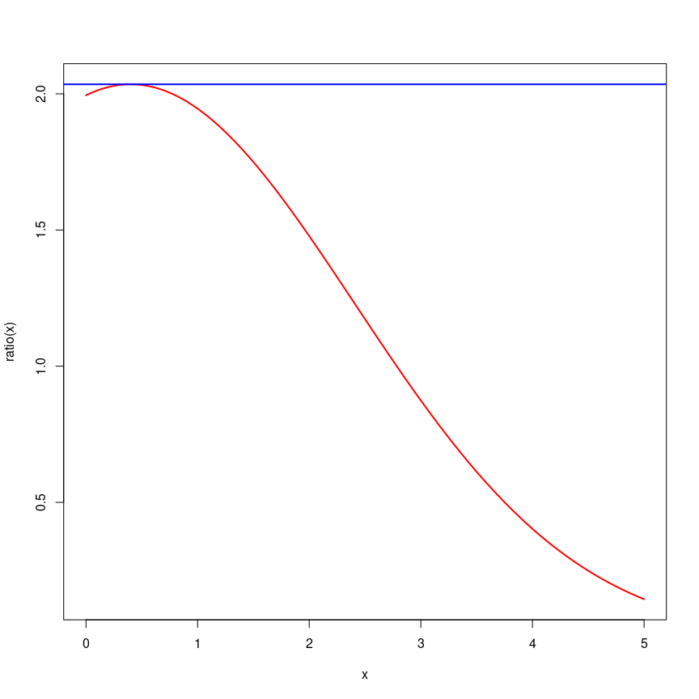
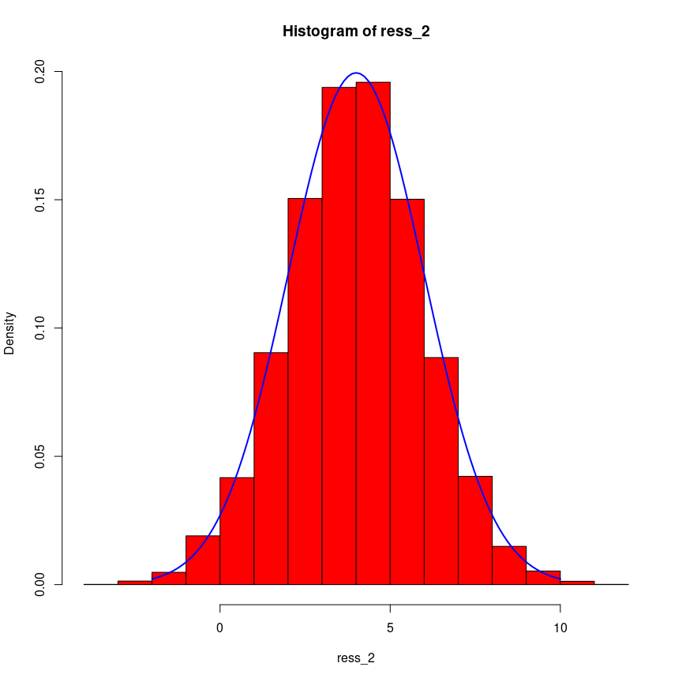
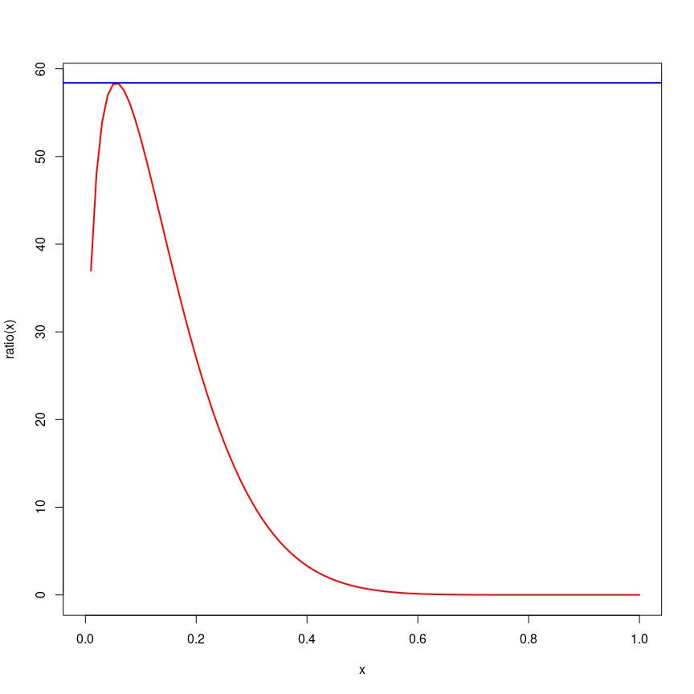

# Acceptance-Rejection Algorithm

## Problem i

From a normal distribution with mean 4 and standard deviation 2, run a
simulation of size 10,000. (Consider the candidate density, the density
of an exponential distribution with a mean of 10).

$$
\begin{aligned}
& \text{target density:}~~ Y \sim \mathcal{N}(\mu = 4, \sigma = 2), \\
& \text{Candidate density:} ~~ \sim \mathcal{E}\text{xp}\left(\text{rate} = \frac{1}{10}\right)
\end{aligned}
$$

``` r
fv <- function(x) dexp(x, rate = 1/10)
fy <- function(x) dnorm(x, mean = 0, sd = 2)
ratio <- function(x) fy(x) / fv(x)
temp1 <- optimize(ratio, interval = c(0, 25), maximum = TRUE)
M1 <- temp1$objective 
x_max1 <- temp1$maximum

# library(httpgd); hgd(); hgd_browse()

curve(ratio, 0, 5, lwd = 2, col = "red")
abline(h = M1, lwd = 2, col = "blue")
```



``` r
n <- 1e+4
ratio_2 <- function(x) ratio(x) / M1
sim_fun_1 <- function(n) {
    i <- 0
    sim_norm <- numeric(n)
    while(i < n) {
        u <- runif(3)
        v <- -10 * log(u[1])
        temp <- ratio_2(v)
        if (u[2] < temp) {
            i <- i + 1
            sim_norm[i] <- ifelse(u[3] < 0.5, -1, 1) * v 
        }
    }
    return(sim_norm + 4)
}

start_time_1 <- Sys.time()
ress_1 <- sim_fun_1(n = n)
End_time_1 <- Sys.time()
time_1 <- difftime(End_time_1, start_time_1, unit = "sec")

ress_1 |> mean()
```

    [1] 3.996448

``` r
ress_1 |> sd()
```

    [1] 2.003924

``` r
hist(ress_1, probability = TRUE, col = "red")
curve(dnorm(x, 4, 2), -2, 10, lwd = 2, col = "blue", add = TRUE)
```


------------------------------------------------------------------------

------------------------------------------------------------------------

``` r
fv <- function(x) dexp(x, rate = 1)
fy <- function(x) dnorm(x, mean = 0, sd = 2)
ratio <- function(x) fy(x) / fv(x)
temp2 <- optimize(ratio, interval = c(0, 25), maximum = TRUE)
M2 <- temp2$objective 
x_max2 <- temp2$maximum


curve(ratio, 0, 25, lwd = 2, col = "red")
abline(h = M2, lwd = 2, col = "blue")
```


``` r
n <- 1e+4
ratio_2 <- function(x) ratio(x) / M2


sim_fun_2 <- function(n) {
    i <- 0
    sim_norm <- numeric(n)
    while(i < n) {
        u <- runif(3)
        v <- -log(u[1])
        temp <- ratio_2(v)
        if (u[2] < temp) {
            i <- i + 1
            sim_norm[i] <- ifelse(u[3] < 0.5, -1, 1) * v 
        }
    }
    return(sim_norm + 4)
}


start_time_2 <- Sys.time()
ress_2 <- sim_fun_2(n = n)
End_time_2 <- Sys.time()
time_2 <- difftime(End_time_2, start_time_2, unit = "sec")

ress_2 |> mean()
```

    [1] 3.985589

``` r
ress_2 |> sd()
```

    [1] 1.994618

``` r
hist(ress_2, probability = TRUE, col = "red")
curve(dnorm(x, 4, 2), -2, 10, lwd = 2, col = "blue", add = TRUE)
```



``` r
c(M1 = M1, M2 = M2)
```

          M1       M2 
    2.035007 1.473903 

``` r
c(Time_1 = time_1, Time_2 = time_2)
```

    Time differences in secs
       Time_1    Time_2 
    0.3294094 0.2256730 

------------------------------------------------------------------------

------------------------------------------------------------------------

## Problem ii

From the beta distribution with the parameter of shape<sub>(1)</sub>
equal to 3.5 and the parameter of shape<sub>(2)</sub> equal to 9.5
simulate The candidate density is beta distribution with parameter
shape<sub>(1)</sub> equal to 3 and parameter shape<sub>(2)</sub> is
equal to one. Consider the number of data to be 100,000 and Plot the
histogram of the data and plot the target density on the histogram Fit
the data.

$$
\begin{aligned}
& \text{target variable:}~~~~Y \sim \text{Beta}(\text{shape}_1: 3.5, ~\text{shape}_2: 9.5),\\
& \text{Candidate Variable:}~~~V\sim \text{Beta}(\text{shape}_1: 3, ~\text{shape}_2: 1).\\
& F_V(v):~~\int_0^v 3x^2 dx = x^3|_0^v = v^3 \implies \\
u = v^3 \implies v = u^{\frac{1}{3}}
\end{aligned}
$$

``` r
fv <- function(x) dbeta(x, shape1 = 3, shape2 = 1)
fy <- function(x) dbeta(x, shape1 = 3.5, shape2 = 9.5)
ratio <- function(x) fy(x) / fv(x)
temp3 <- optimize(ratio, interval = c(0, 1), maximum = TRUE)
M3 <- temp3$objective 
x_max3 <- temp3$maximum


curve(ratio, 0, 1, lwd = 2, col = "red")
abline(h = M3, lwd = 2, col = "blue")
```



``` r
n <- 1e+5
ratio_3 <- function(x) ratio(x) / M3


sim_fun_3 <- function(n) {
    i <- 0
    sim_beta <- numeric(n)
    while(i < n) {
        u <- runif(3)
        v <- u[1]^(1/3)
        temp <- ratio_3(v)
        if (u[2] < temp) {
            i <- i + 1
            sim_beta[i] <- v 
        }
    }
    return(sim_beta)
}


start_time_3 <- Sys.time()
ress_3 <- sim_fun_3(n = n)
End_time_3 <- Sys.time()
time_3 <- difftime(End_time_3, start_time_3, unit = "sec")

ress_3 |> mean()
```

    [1] 0.2689237

``` r
ress_3 |> sd()
```

    [1] 0.1183504

``` r
hist(ress_3, probability = TRUE, col = "red")
curve(dbeta(x, shape1 = 3.5, shape2 = 9.5), 0, 1, lwd = 2, col = "blue", add = TRUE)
```


------------------------------------------------------------------------

------------------------------------------------------------------------

``` r
fv <- function(x) 1
fy <- function(x) dbeta(x, shape1 = 3.5, shape2 = 9.5)
ratio <- function(x) fy(x) / fv(x)
temp4 <- optimize(ratio, interval = c(0, 1), maximum = TRUE)
M4 <- temp4$objective 
x_max4 <- temp4$maximum


curve(ratio, 0, 1, lwd = 2, col = "red")
abline(h = M4, lwd = 2, col = "blue")
```


``` r
n <- 1e+5
ratio_4 <- function(x) ratio(x) / M4


sim_fun_4 <- function(n) {
    i <- 0
    sim_beta <- numeric(n)
    while(i < n) {
        u <- runif(3)
        v <- u[1]
        temp <- ratio_4(v)
        if (u[2] < temp) {
            i <- i + 1
            sim_beta[i] <- v 
        }
    }
    return(sim_beta)
}


start_time_4 <- Sys.time()
ress_4 <- sim_fun_4(n = n)
End_time_4 <- Sys.time()
time_4 <- difftime(End_time_4, start_time_4, unit = "sec")

ress_4 |> mean()
```

    [1] 0.2691341

``` r
ress_4 |> sd()
```

    [1] 0.1186765

``` r
hist(ress_4, probability = TRUE, col = "red")
curve(dbeta(x, shape1 = 3.5, shape2 = 9.5), 0, 1, lwd = 2, col = "blue", add = TRUE)
```


``` r
c(M3 = M3, M4 = M4)
```

           M3        M4 
    58.396898  3.324598 

``` r
c(Time_3 = time_3, Time_4 = time_4)
```

    Time differences in secs
       Time_3    Time_4 
    42.074507  2.007042 
