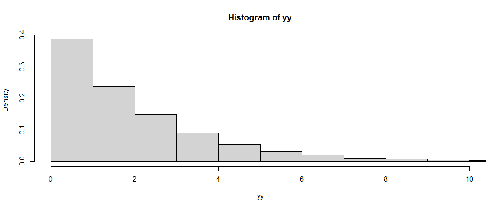
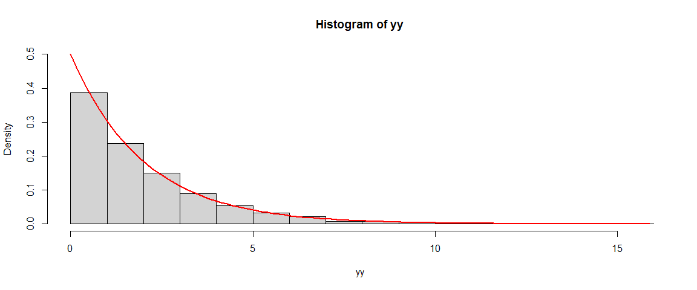
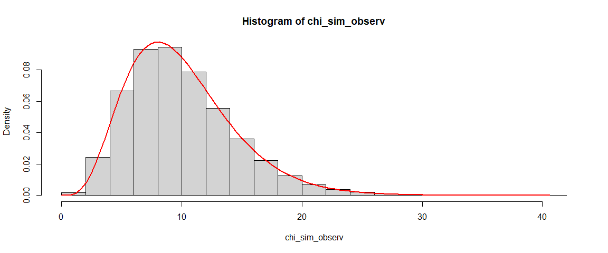
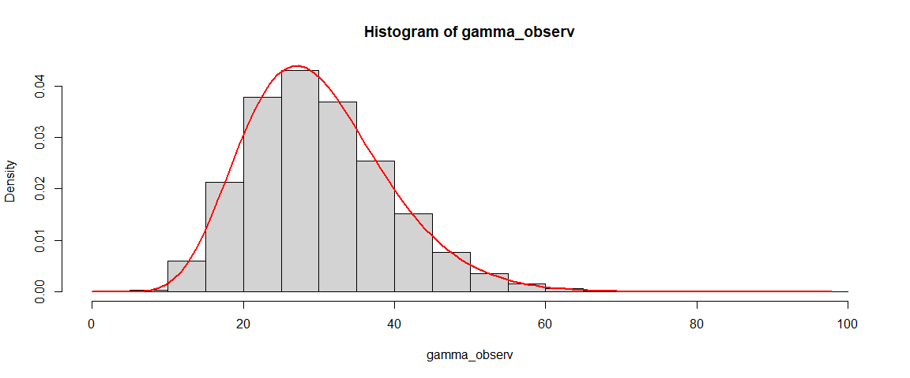
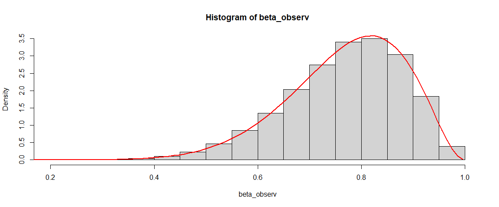
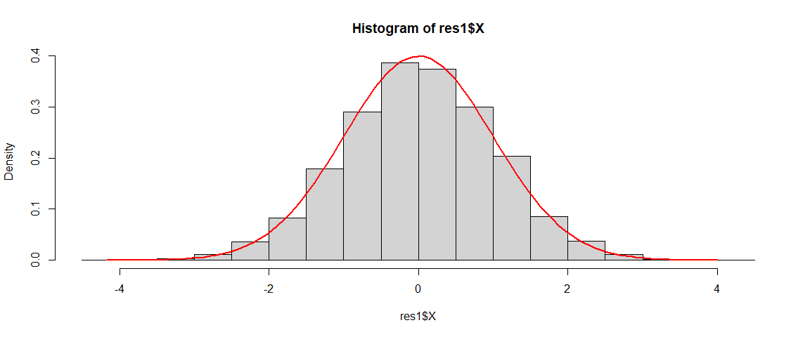
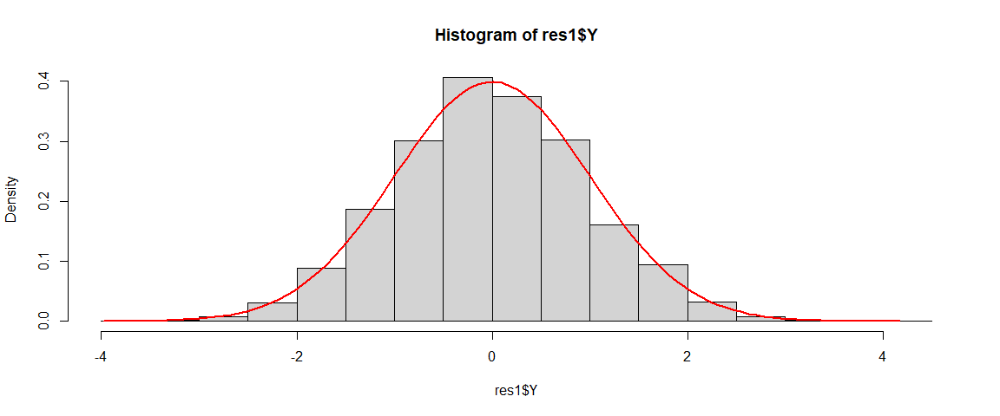
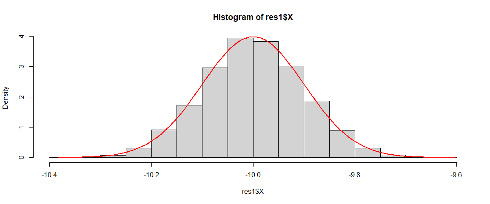
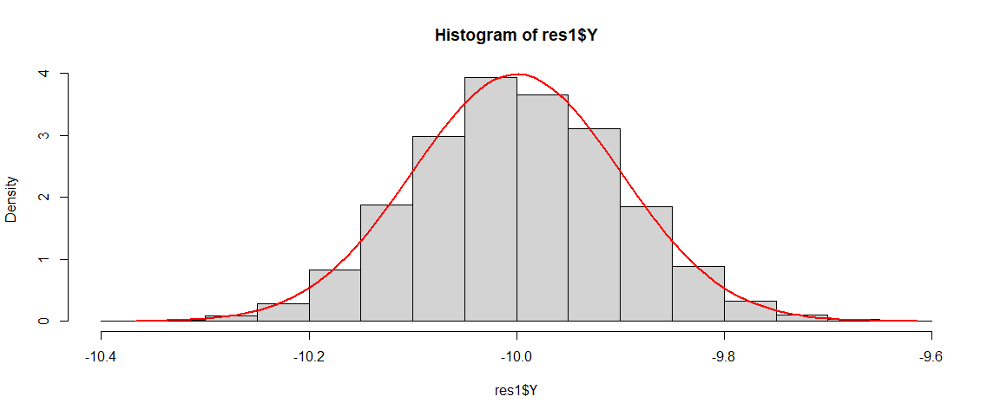
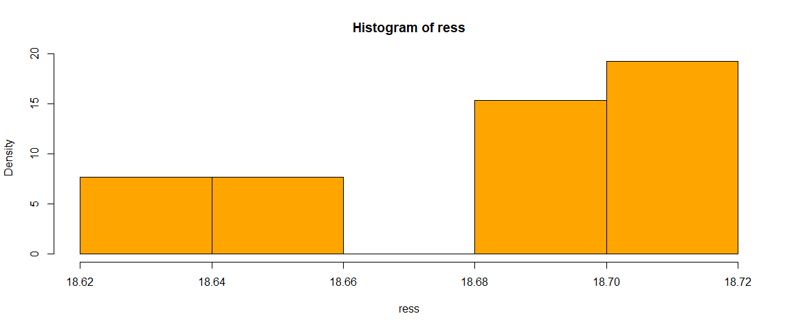

# Generating Random Numbers (Direct Method)

## $\mathcal{E}$xponential Distribution —————-

``` r
f <- function(n, lamb) {
    U <- runif(n)
    Y <- -lamb * log(U)
    return(Y)
}

n <- 1e+4
lambda = 2
yy <- f(n, lambda)

Mean <- mean(yy)
Var <- var(yy)

cat("Mean Sim data: ", Mean, "\n", "Variance Sim data: ", Var, "\n", sep = "")
```

    Mean Sim data: 2.011218
    Variance Sim data: 3.881661

``` r
n <- 1e+5
yy2 <- f(n, lambda)
Mean <- mean(yy2)
Var <- var(yy2)

cat("Mean Sim data: ", Mean, "\n", "Variance Sim data: ", Var, "\n", sep = "")
```

    Mean Sim data: 2.009592
    Variance Sim data: 4.050194

``` r
hist(yy, freq = FALSE, xlim = c(0, 10))
```



``` r
hist(yy, breaks = 16, xlim = c(0, max(yy)), ylim = c(0, 0.5), freq = FALSE)
curve(dexp(x, rate = 1/2), 0, max(yy), lwd = 2, col = "red", add = TRUE)
```



------------------------------------------------------------------------

------------------------------------------------------------------------

## $\chi^2$ Distribution

``` r
############################

chi_sim <- function(v) {
    U <- runif(v)
    return(-2 * sum(log(U)))
}

n <- 1e+5

chi_sim_observ <- replicate(n, chi_sim(5))
head(chi_sim_observ)
```

    [1] 12.291382 10.443098  2.201556  7.771405  9.736962 25.427370

``` r
cat("Mean sim: ", mean(chi_sim_observ), "\n", 
    "Var sim: ", var(chi_sim_observ), "\n", sep = "")
```

    Mean sim: 9.991938
    Var sim: 20.06844

``` r
hist(chi_sim_observ, freq = FALSE, breaks = 16)
curve(dchisq(x, df = 10), 0, max(chi_sim_observ), lwd = 2, col = "red", add = TRUE)
```



------------------------------------------------------------------------

------------------------------------------------------------------------

## $\Gamma$ Distribution

``` r
######################

gamma_sim <- function(a, b) {
    U <- runif(a)
    return(-b * sum(log(U)))
}


n <- 1e+5
a <- 10; b <- 3
gamma_observ <- replicate(n, gamma_sim(a, b))
head(gamma_observ)
```

    [1] 46.16714 38.63718 23.47161 22.56983 27.64649 34.26690

``` r
cat("Mean sim: ", mean(gamma_observ), "\n", 
    "Var sim: ", var(gamma_observ), "\n", sep = "")
```

    Mean sim: 29.99191
    Var sim: 90.30672

``` r
hist(gamma_observ, freq = FALSE, breaks = 16)
curve(dgamma(x, shape = a, scale = b), 0, max(gamma_observ), lwd = 2, col = "red", add = TRUE)
```



------------------------------------------------------------------------

------------------------------------------------------------------------

## Beta Distribution ——————–

``` r
beta_sim <- function(a, b) {
    U <- runif(a + b)
    temp <- log(U)
    temp2 <- sum(temp[1:a])
    return(temp2 / sum(temp))
}

n <- 1e+5
a <- 10; b <- 3
beta_observ <- replicate(n, beta_sim(a, b))
head(beta_observ)
```

    [1] 0.6111741 0.6539648 0.7949263 0.9563682 0.7945259 0.8157460

``` r
cat("Mean sim: ", mean(beta_observ), "\n", 
    "Var sim: ", var(beta_observ), "\n", sep = "")
```

    Mean sim: 0.7685407
    Var sim: 0.01276412

``` r
hist(beta_observ, freq = FALSE, breaks = 16)
curve(dbeta(x, shape1 = a, shape2 = b), 0, max(beta_observ), lwd = 2, col = "red", add = TRUE)
```



------------------------------------------------------------------------

------------------------------------------------------------------------

## Box-Muller Algorithm ———-

``` r
boxMuller <- function(n, mu = 0, sig = 1) {
    U <- runif(n)
    V <- runif(n)
    X <- sqrt(-2 * log(U)) * cos(2 * pi * V)
    Y <- sqrt(-2 * log(U)) * sin(2 * pi * V)
    return(list(X = sig * X + mu, Y = sig * Y + mu))
}

n <- 1e+4

res1 <- boxMuller(n = n)

cat("Mean X: ", mean(res1$X), "\n", "Variance X: ", var(res1$X), "\n", 
    "Mean Y: ", mean(res1$Y), "\n", "Variance Y: ", var(res1$Y), "\n", 
    "Corr(X, Y): ", cor(res1$X, res1$Y), "\n", sep = "")
```

    Mean X: 0.02295473
    Variance X: 1.032614
    Mean Y: -0.01279103
    Variance Y: 0.9821095
    Corr(X, Y): -0.001306039

``` r
hist(res1$X, freq = FALSE, breaks = 16)
curve(dnorm(x), min(res1$X), max(res1$X), lwd = 2, col = "red", add = TRUE)
```



``` r
hist(res1$Y, freq = FALSE, breaks = 16)
curve(dnorm(x), min(res1$Y), max(res1$Y), lwd = 2, col = "red", add = TRUE)
```



``` r
res1 <- boxMuller(n = n, mu = -10, sig = 0.1)

cat("Mean X: ", mean(res1$X), "\n", "Variance X: ", var(res1$X), "\n", 
    "Mean Y: ", mean(res1$Y), "\n", "Variance Y: ", var(res1$Y), "\n", 
    "Corr(X, Y): ", cor(res1$X, res1$Y), "\n", sep = "")
```

    Mean X: -9.999156
    Variance X: 0.009788343
    Mean Y: -9.998677
    Variance Y: 0.009817197
    Corr(X, Y): 0.006121796

``` r
hist(res1$X, freq = FALSE, breaks = 16)
curve(dnorm(x, mean = -10, sd = 0.1), min(res1$X), max(res1$X), lwd = 2, col = "red", add = TRUE)
```



``` r
hist(res1$Y, freq = FALSE, breaks = 16)
curve(dnorm(x, mean = -10, sd = 0.1), min(res1$Y), max(res1$Y), lwd = 2, col = "red", add = TRUE)
```



------------------------------------------------------------------------

------------------------------------------------------------------------

## Binomial Distribution

``` r
######################### Categorical Data

xx <- 0:4
res1 <- pbinom(xx, size = 4, prob = 5/8)
res1
```

    [1] 0.01977539 0.15161133 0.48120117 0.84741211 1.00000000

``` r
f_binom <- function(n) {
    U <- runif(n)
    fun <- function(x) {
        temp <- sum(x > res1)
        return(temp)
    }
    temp2 <- lapply(U, fun) |> unlist()
    return(temp2)
}

n <- 1e+5
ress <- f_binom(n)
head(ress)
```

    [1] 3 3 3 2 1 3

``` r
cat("Mean binom sim: ", mean(ress), "\n", 
    "variance Binom sim : ", var(ress), "\n", 
     sep = "")
```

    Mean binom sim: 2.4963
    variance Binom sim : 0.9469358

------------------------------------------------------------------------

------------------------------------------------------------------------

## GeomMetric Distribution ——————

``` r
### Geometric Distribution

geom_sim <- function(n, p) {
    q <- 1 - p
    U <- runif(n)
    res1 <- log(U) / log(q)
    return(ceiling(res1))
} 

temp <- geom_sim(1e+5, p = 1/3)
cat("Mean sim: ", mean(temp), "\n", 
    "Variance sim: ", var(temp), "\n", sep = "")
```

    Mean sim: 2.99698
    Variance sim: 6.013811

``` r
temp <- geom_sim(1e+6, p = 1/5)
cat("Mean sim: ", mean(temp), "\n", 
    "Variance sim: ", var(temp), "\n", sep = "")
```

    Mean sim: 5.002533
    Variance sim: 20.02609

------------------------------------------------------------------------

------------------------------------------------------------------------

## Find Distribution of sample Variance of poisson

``` r
## Poisson distribution


p_sim <- function(la = 18.69, n = 5e+3) {
    temp1 <- matrix(rpois(n = 13 * n, lambda = la), nrow = 13, ncol = n)
    ress1 <- apply(temp1, MARGIN = 1, FUN = function(x) return(var(x)))
    return(ress1)
}

ress <- p_sim()
ress |> head()
```

    [1] 17.99250 19.01179 18.40448 18.59641 18.80748 19.23701

``` r
a <- 44.9
prob <- mean(ress > a)
prob
```

    [1] 0

``` r
ress <- p_sim(n = 1e+6)
ress |> head()
```

    [1] 18.69310 18.65853 18.65538 18.63829 18.69623 18.70857

``` r
a <- 44.9
prob <- mean(ress > a)
prob
```

    [1] 0

``` r
hist(ress, freq = FALSE, col = "orange")
```



``` r
cat("Mean sim: ", mean(ress), "\n", 
    "Standard Deviation of sim: ", sd(ress), "\n", sep = "")
```

    Mean sim: 18.68244
    Standard Deviation of sim: 0.02603023
