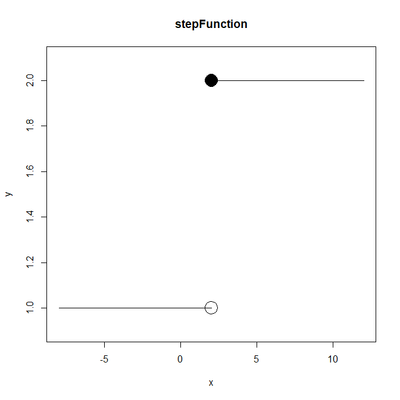

# Plot Step Function


- [Details and Implements](#details-and-implements)
  - [Implent R code](#implent-r-code)
    - [Example I](#example-i)
    - [Exmple II](#exmple-ii)
    - [Example III (Heaviside
      function)](#example-iii-heaviside-function)



# Details and Implements

We want to show how to plot a Step function

$$
f(x) = \begin{cases}
x < c_1 & \text{value}_1, \\
c_1 \leq x < c_2 & \text{value}_2, \\
\vdots & \vdots \\
c_{k-1} \leq x < c_{k} & \text{value}_{k}, \\
x \geq c_k & \text{value}_{k + 1}
\end{cases}
$$

## Implent R code

``` r
cvals = c(1, 2, 3, 4)
outvals <- c(-1, 0, 2, 4, 6)
StepPlot <- function(cvals, outvals, lenInterval = 10){
    if (length(cvals) == 1) {   
        xRange = extendrange(range(cvals - 5, cvals + 5), f = 0.5)
    } else{
        xRange <- extendrange(range(cvals), f = 0.5)
    }
    yRange <- extendrange(range(outvals), f = 0.1)
    xrangeList = list()
    outPutList = list()
    index = 0
    for (i in 1:length(cvals)){
        index = index + 1
        if (i %in% c(1, length(cvals))){
            if (i == 1){
                xrangeList[[index]] <- seq(xRange[1], cvals[i], len = lenInterval)
                outPutList[[index]] <- rep(outvals[index], lenInterval)
                if (length(cvals) == 1) {
                    index = index + 1
                    xrangeList[[index]] <- seq(cvals[i], xRange[2], len = lenInterval)
                    outPutList[[index]] <- rep(outvals[index], lenInterval)
                } else {
                index = index + 1
                xrangeList[[index]] <- seq(cvals[i], cvals[i+1], len = lenInterval)
                outPutList[[index]] <- rep(outvals[index], lenInterval)
                }
            } else{
            xrangeList[[index]] <- seq(cvals[i], xRange[2], len = lenInterval)
            outPutList[[index]] <- rep(outvals[index], lenInterval)
        } 
        } else {
            xrangeList[[index]] <- seq(cvals[i], cvals[i+1], len = lenInterval)
            outPutList[[index]] <- rep(outvals[index], lenInterval)
}       
}

    plot(x = xRange, y = yRange, type = 'n', xlab = 'x', 
            ylab = 'y', main = 'stepFunction')
    m <- length(xrangeList)
    for(j in 1:m){
    xtemp = xrangeList[[j]]
    ytemp = outPutList[[j]] 
    lines(xtemp, ytemp)
    if (j %in% c(1, m)) {
        if (j == 1) {
            points(x = xtemp[lenInterval], y = ytemp[1], pch = 1, cex = 3)
        } else {
            points(x = xtemp[1], y = ytemp[1], pch = 16, cex = 3)
        }
    } else {
        points(x = xtemp[1], y = ytemp[1], pch = 16, cex = 3)
        points(x = xtemp[lenInterval], y = ytemp[1], pch = 1, cex = 3)
    }
    }
}
```



------------------------------------------------------------------------

### Example I

$$
f(x) = \begin{cases}
0 & x < -1, \\
2 & -1 \leq x < 3, \\
4 & x \geq 3
\end{cases}
$$

``` r
cvals = c(-1, 3)
outvals = c(0, 2, 4)

StepPlot(cvals, outvals)
```


------------------------------------------------------------------------



### Exmple II

$$
f(x) = \begin{cases}
4 & x < -4, \\
10 & -4 \leq x < 0, \\
5 & 0 \leq x < 5, \\
1.5 & x \geq 5
\end{cases}
$$

``` r
cvals = c(-4, 0, 5)
outvals = c(4, 10, 5, 1.5)
StepPlot(cvals, outvals)
```


------------------------------------------------------------------------



### Example III (Heaviside function)

$$
f(x) = \begin{cases} 
1 & x - c < 0, \\
2 & x - c \geq 0 
\end{cases} \implies 
f(x) = \begin{cases} 
1 & x < c, \\
2 & x \geq c 
\end{cases} 
$$

``` r
C = 2
cvals = c(2)
outvals = c(1, 2)

StepPlot(cvals, outvals)
```


