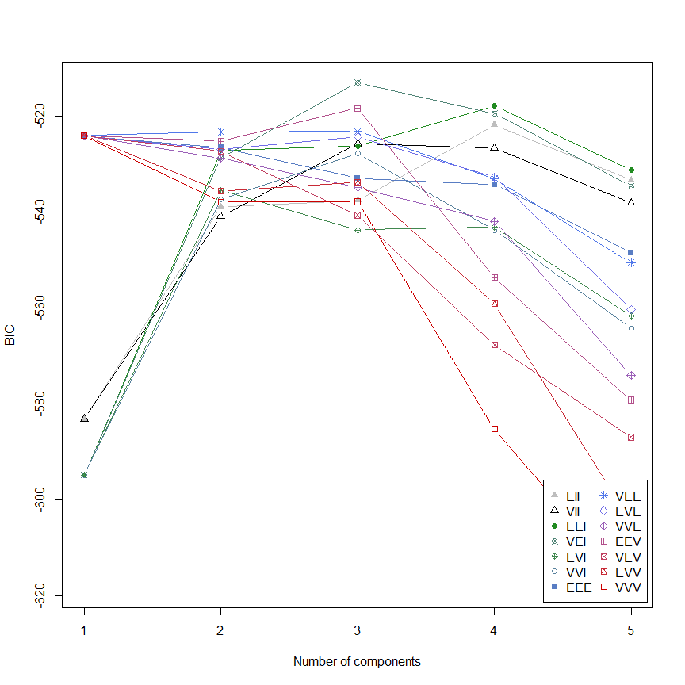
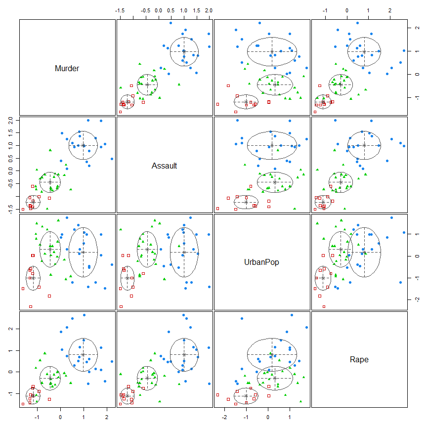
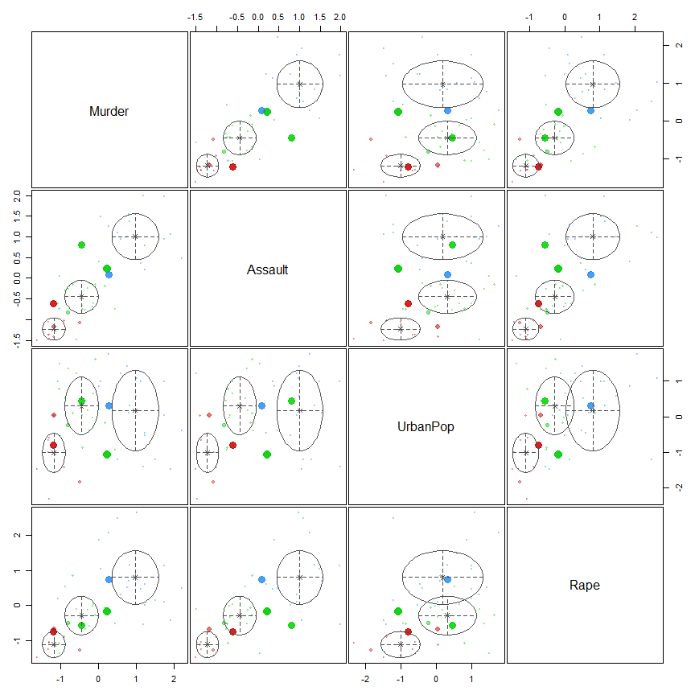
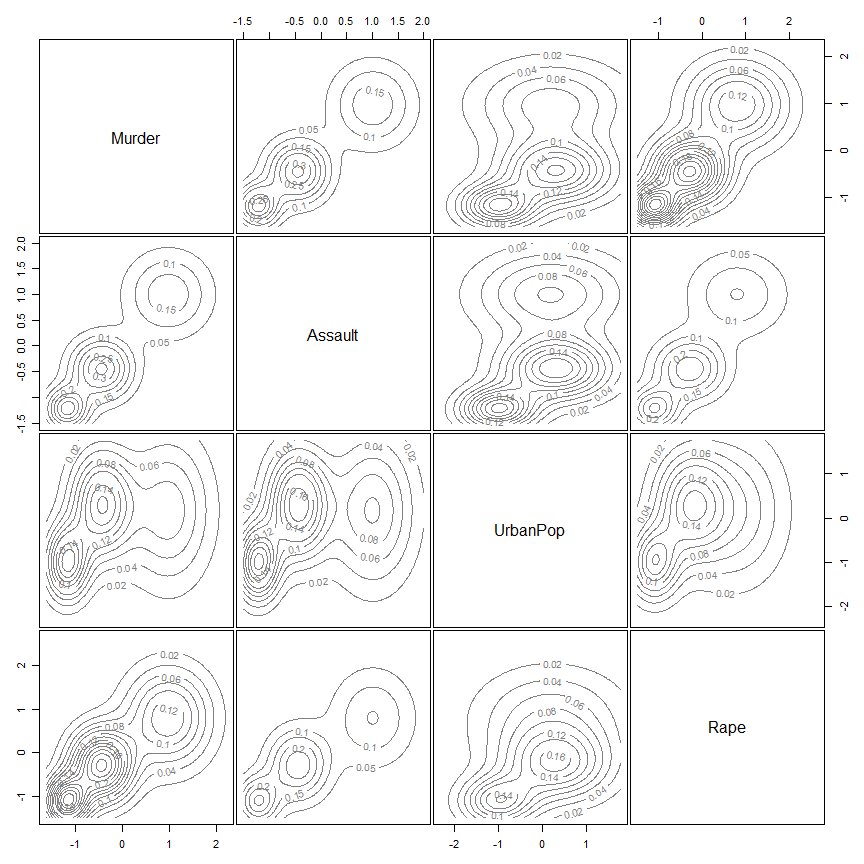

# Latent Profile Analysis


- [Using R (mclust package)](#using-r-mclust-package)
- [Using R (tidyLPA package)](#using-r-tidylpa-package)
- [Using python (scikit-learn)](#using-python-scikit-learn)
- [compare results](#compare-results)

## Using R (mclust package)

``` r
# install.packages("mclust")
library(mclust)
library(tidyverse)

dat <- USArrests
dat |> dim()
```

    [1] 50  4

``` r
dat |> head()
```

               Murder Assault UrbanPop Rape
    Alabama      13.2     236       58 21.2
    Alaska       10.0     263       48 44.5
    Arizona       8.1     294       80 31.0
    Arkansas      8.8     190       50 19.5
    California    9.0     276       91 40.6
    Colorado      7.9     204       78 38.7

``` r
dat_scale <- dat |> scale() |> as.data.frame()
lpa_Model <- dat_scale |>  
                Mclust(G = 1:5)

lpa_Model |> summary()
```

    ---------------------------------------------------- 
    Gaussian finite mixture model fitted by EM algorithm 
    ---------------------------------------------------- 

    Mclust VEI (diagonal, equal shape) model with 3 components: 

     log-likelihood  n df       BIC       ICL
          -217.3636 50 20 -512.9677 -517.5878

    Clustering table:
     1  2  3 
    20 10 20 

``` r
lpa_assignments <- lpa_Model$classification

# Summarize the latent profiles
dat |> 
    scale() |> 
        as.data.frame() |> 
            mutate(Profile = lpa_assignments) |> 
                group_by(Profile) |> 
                    summarize_all(mean)
```

    # A tibble: 3 × 5
      Profile Murder Assault UrbanPop   Rape
        <dbl>  <dbl>   <dbl>    <dbl>  <dbl>
    1       1  1.00    1.01     0.198  0.847
    2       2 -1.17   -1.21    -1.00  -1.10 
    3       3 -0.419  -0.410    0.305 -0.296

``` r
plot(lpa_Model)
```









``` r
pred_Model_1 <- lpa_Model$classification 
```

------------------------------------------------------------------------

------------------------------------------------------------------------

## Using R (tidyLPA package)

``` r
# install.packages("tidyLPA")
n_profiles <- 3 # Specify the number of profiles

# Perform the LPA
lpa_Model2 <- dat |> 
                scale() |> 
                    as.data.frame() |> 
                    dplyr :: select(Murder, Assault, UrbanPop, Rape) |> 
                        tidyLPA :: estimate_profiles(n_profiles, variances = "equal")

# Print the results
print(lpa_Model2)
```

    tidyLPA analysis using mclust: 

     Model Classes AIC    BIC    Entropy prob_min prob_max n_min n_max BLRT_p
     1     3       491.81 526.23 0.89    0.89     0.98     0.20  0.42  0.01  

------------------------------------------------------------------------

------------------------------------------------------------------------

------------------------------------------------------------------------

------------------------------------------------------------------------

## Using python (scikit-learn)

``` python
# first in terminal: 
# pip install -U scikit-learn


# Import the necessary libraries
import pandas as pd
import numpy as np
from sklearn.mixture import GaussianMixture

# Load the USArrests data
df = r.dat_scale
df.head()
```

                  Murder   Assault  UrbanPop      Rape
    Alabama     1.242564  0.782839 -0.520907 -0.003416
    Alaska      0.507862  1.106823 -1.211764  2.484203
    Arizona     0.071633  1.478803  0.998980  1.042878
    Arkansas    0.232349  0.230868 -1.073593 -0.184917
    California  0.278268  1.262814  1.758923  2.067820

``` python
# Perform the LPA using GaussianMixture
gmm = GaussianMixture(n_components=3)
gmm.fit(df)
```

    GaussianMixture(n_components=3)

``` python
# Print the results
print('Converged:',gmm.converged_) # Check if the model has converged
```

    Converged: True

``` python
print('Means of each component:', gmm.means_)
```

    Means of each component: [[ 0.74091791  1.09029287  0.88324838  1.17867533]
     [-0.63090974 -0.64882412 -0.11177974 -0.52502015]
     [ 1.43792924  0.9906128  -0.86322129  0.36089059]]

``` python
print('Covariances of each component:', gmm.covariances_)
```

    Covariances of each component: [[[ 0.27150252  0.09193423 -0.04525653 -0.04753029]
      [ 0.09193423  0.23101086 -0.00776302  0.00647574]
      [-0.04525653 -0.00776302  0.22954278  0.09530718]
      [-0.04753029  0.00647574  0.09530718  0.52797728]]

     [[ 0.30958715  0.19226303  0.10475609  0.1959609 ]
      [ 0.19226303  0.33122242  0.24295797  0.17901775]
      [ 0.10475609  0.24295797  0.94853759  0.24437661]
      [ 0.1959609   0.17901775  0.24437661  0.36605652]]

     [[ 0.24585138 -0.06644101  0.07407172 -0.27213895]
      [-0.06644101  0.26184261 -0.18289239 -0.12412389]
      [ 0.07407172 -0.18289239  0.26709043  0.02721027]
      [-0.27213895 -0.12412389  0.02721027  0.81800715]]]

``` python
# Predict the labels for the data samples in df_scaled using gmm model
python_labels = gmm.predict(df)
py_labels = np.array(python_labels) + 1
R_labels = r.pred_Model_1
pd.DataFrame({"R_Labels": list(map(lambda x: int(x), R_labels)), "Python_Labels": py_labels})
```

        R_Labels  Python_Labels
    0          1              3
    1          1              3
    2          1              1
    3          3              2
    4          1              1
    5          1              1
    6          3              2
    7          3              2
    8          1              1
    9          1              3
    10         3              2
    11         2              2
    12         1              1
    13         3              2
    14         2              2
    15         3              2
    16         3              2
    17         1              3
    18         2              2
    19         1              1
    20         3              2
    21         1              1
    22         2              2
    23         1              3
    24         1              2
    25         3              2
    26         3              2
    27         1              1
    28         2              2
    29         3              2
    30         1              1
    31         1              1
    32         1              3
    33         2              2
    34         3              2
    35         3              2
    36         3              2
    37         3              2
    38         3              2
    39         1              3
    40         2              2
    41         1              3
    42         1              1
    43         3              2
    44         2              2
    45         3              2
    46         3              2
    47         2              2
    48         2              2
    49         3              2

------------------------------------------------------------------------

------------------------------------------------------------------------

## compare results

``` r
adjustedRandIndex(py$R_labels, py$python_labels)
```

    [1] 0.4314684
