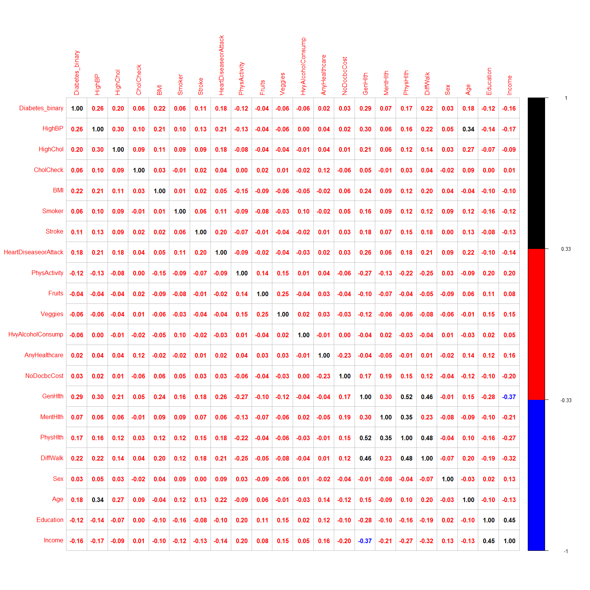
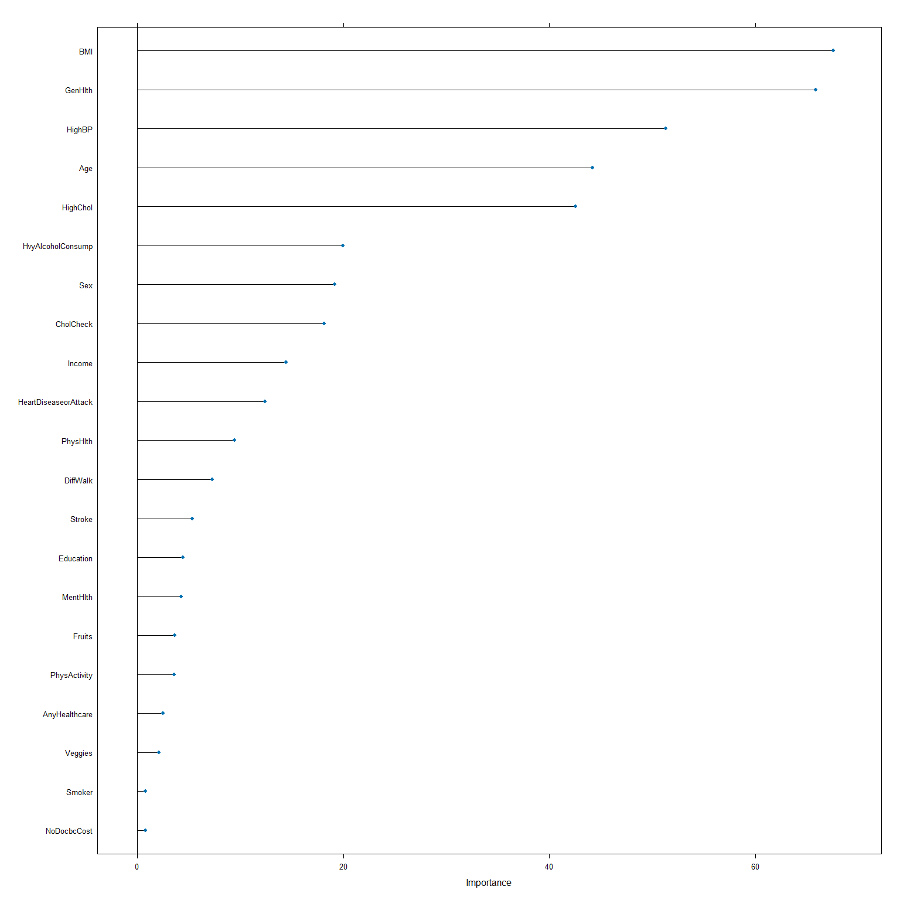
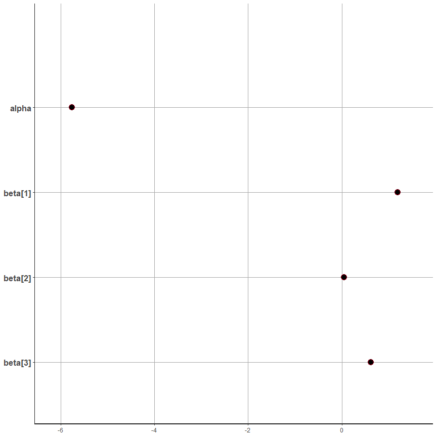
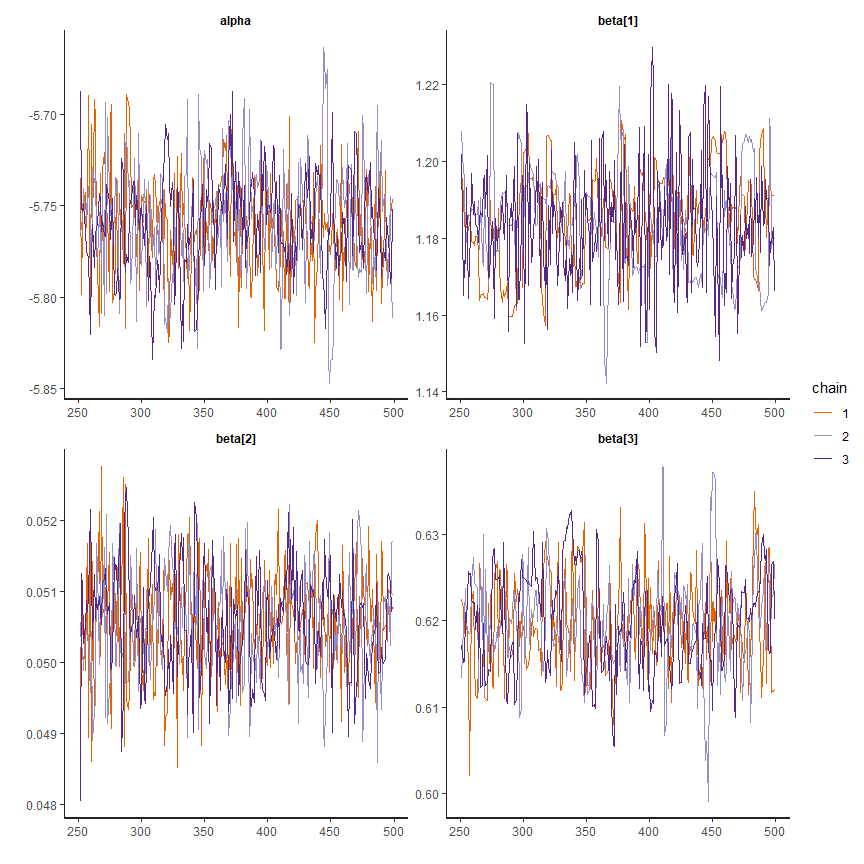
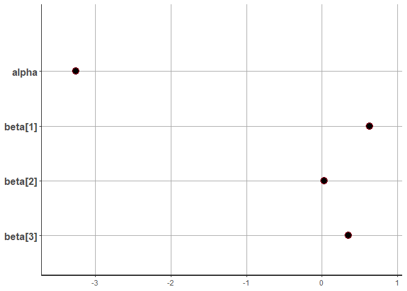
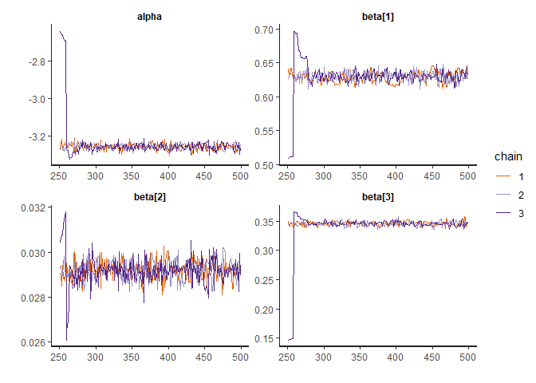

# Using stan \| bayesian Model for Logistic regression

## load libraries ————

``` r
## for load rstan package
if (!require(rstan)) {
    install.packages("rstan", repos = c("https://mc-stan.org/r-packages/", getOption("repos")))
    library(rstan)
}

## for check package that good installed or not
# example(stan_model, package = "rstan", run.dontrun = TRUE)

## for parallel calculation 
options(mc.cores = parallel :: detectCores())

## for adjust run programming
rstan_options(auto_write = TRUE)


#################

## for load tidyverse packages, (manipulate data and use ggplot objects)
if (!require(tidyverse)) {
    chooseCRANmirror(graphics = FALSE, ind = 1)
    install.packages(tidyverse)
    library(tidyverse)
}


## for feature selection 

if(!require(mlbench)) {
    chooseCRANmirror(graphics = FALSE, ind = 1)
    install.packages("mlbench")
    library(mlbench)
}

if(!require(caret)) {
    chooseCRANmirror(graphics = FALSE, ind = 1)
    install.packages("caret")
    library(caret)
}
```

------------------------------------------------------------------------

#### Load data

``` r
## load data
test_dat <- read.csv(file = "diabetes_binary_5050split_health_indicators_BRFSS2015.csv", header = TRUE)
train_dat <- read.csv("diabetes_binary_health_indicators_BRFSS2015.csv", header = TRUE)
dim(train_dat)
```

    [1] 253680     22

``` r
dim(test_dat)
```

    [1] 70692    22

``` r
names(train_dat)
```

     [1] "Diabetes_binary"      "HighBP"               "HighChol"            
     [4] "CholCheck"            "BMI"                  "Smoker"              
     [7] "Stroke"               "HeartDiseaseorAttack" "PhysActivity"        
    [10] "Fruits"               "Veggies"              "HvyAlcoholConsump"   
    [13] "AnyHealthcare"        "NoDocbcCost"          "GenHlth"             
    [16] "MentHlth"             "PhysHlth"             "DiffWalk"            
    [19] "Sex"                  "Age"                  "Education"           
    [22] "Income"              

``` r
set.seed(7) ## use seed for same result in sequance run 
```

------------------------------------------------------------------------

------------------------------------------------------------------------

## get corrlation Matrix and select important Features ———-

``` r
## Feature Selection -------------

#### Method 1: Using Correlation Matrix--


## check data
glimpse(train_dat)
```

    Rows: 253,680
    Columns: 22
    $ Diabetes_binary      <dbl> 0, 0, 0, 0, 0, 0, 0, 0, 1, 0, 1, 0, 0, 1, 0, 0, 0…
    $ HighBP               <dbl> 1, 0, 1, 1, 1, 1, 1, 1, 1, 0, 0, 1, 0, 1, 0, 1, 1…
    $ HighChol             <dbl> 1, 0, 1, 0, 1, 1, 0, 1, 1, 0, 0, 1, 0, 1, 1, 0, 1…
    $ CholCheck            <dbl> 1, 0, 1, 1, 1, 1, 1, 1, 1, 1, 1, 1, 1, 1, 1, 1, 1…
    $ BMI                  <dbl> 40, 25, 28, 27, 24, 25, 30, 25, 30, 24, 25, 34, 2…
    $ Smoker               <dbl> 1, 1, 0, 0, 0, 1, 1, 1, 1, 0, 1, 1, 1, 0, 1, 0, 0…
    $ Stroke               <dbl> 0, 0, 0, 0, 0, 0, 0, 0, 0, 0, 0, 0, 0, 0, 1, 0, 0…
    $ HeartDiseaseorAttack <dbl> 0, 0, 0, 0, 0, 0, 0, 0, 1, 0, 0, 0, 0, 0, 0, 0, 0…
    $ PhysActivity         <dbl> 0, 1, 0, 1, 1, 1, 0, 1, 0, 0, 1, 0, 0, 0, 1, 1, 1…
    $ Fruits               <dbl> 0, 0, 1, 1, 1, 1, 0, 0, 1, 0, 1, 1, 0, 0, 0, 0, 1…
    $ Veggies              <dbl> 1, 0, 0, 1, 1, 1, 0, 1, 1, 1, 1, 1, 1, 1, 1, 0, 1…
    $ HvyAlcoholConsump    <dbl> 0, 0, 0, 0, 0, 0, 0, 0, 0, 0, 0, 0, 0, 0, 0, 0, 0…
    $ AnyHealthcare        <dbl> 1, 0, 1, 1, 1, 1, 1, 1, 1, 1, 1, 1, 1, 1, 1, 1, 1…
    $ NoDocbcCost          <dbl> 0, 1, 1, 0, 0, 0, 0, 0, 0, 0, 0, 0, 0, 0, 1, 0, 0…
    $ GenHlth              <dbl> 5, 3, 5, 2, 2, 2, 3, 3, 5, 2, 3, 3, 3, 4, 4, 2, 3…
    $ MentHlth             <dbl> 18, 0, 30, 0, 3, 0, 0, 0, 30, 0, 0, 0, 0, 0, 30, …
    $ PhysHlth             <dbl> 15, 0, 30, 0, 0, 2, 14, 0, 30, 0, 0, 30, 15, 0, 2…
    $ DiffWalk             <dbl> 1, 0, 1, 0, 0, 0, 0, 1, 1, 0, 0, 1, 0, 1, 0, 0, 0…
    $ Sex                  <dbl> 0, 0, 0, 0, 0, 1, 0, 0, 0, 1, 1, 0, 0, 0, 0, 0, 0…
    $ Age                  <dbl> 9, 7, 9, 11, 11, 10, 9, 11, 9, 8, 13, 10, 7, 11, …
    $ Education            <dbl> 4, 6, 4, 3, 5, 6, 6, 4, 5, 4, 6, 5, 5, 4, 6, 6, 4…
    $ Income               <dbl> 3, 1, 8, 6, 4, 8, 7, 4, 1, 3, 8, 1, 7, 6, 2, 8, 3…

``` r
corr_mat <- cor(train_dat)
# library(httpgd); hgd(); hgd_browse()

## for make correlation plot

if (!require(corrplot)) {
    chooseCRANmirror(graphics = FALSE, ind = 1)
    install.packages("corrplot")
    library(corrplot)
}


corrplot(corr_mat, type = "full", hclust.method = "ward", method = "number", 
p.mat = corr_mat, insig = 'p-value', , sig.level = 1, col = c("blue", 
"red", "black"), cl.cex = 0.1, number.digits = 2, number.cex = 0.25)
```



``` r
high_correlated <- findCorrelation(corr_mat, cutoff = 0.5)
print(high_correlated)
```

    [1] 15

``` r
temp1 <- corr_mat %>% .[-1, 1] 
(temp1 >= 0.5) %>% sum
```

    [1] 0

``` r
(temp1 >= 0.25) %>% sum
```

    [1] 2

``` r
varNames <- dimnames(corr_mat)[[1]][-1]
varNames[temp1 >= 0.25]
```

    [1] "HighBP"  "GenHlth"

``` r
names(train_dat)
```

     [1] "Diabetes_binary"      "HighBP"               "HighChol"            
     [4] "CholCheck"            "BMI"                  "Smoker"              
     [7] "Stroke"               "HeartDiseaseorAttack" "PhysActivity"        
    [10] "Fruits"               "Veggies"              "HvyAlcoholConsump"   
    [13] "AnyHealthcare"        "NoDocbcCost"          "GenHlth"             
    [16] "MentHlth"             "PhysHlth"             "DiffWalk"            
    [19] "Sex"                  "Age"                  "Education"           
    [22] "Income"              

``` r
train_dat2 <- train_dat %>% 
mutate(Diabetes_binary = factor(Diabetes_binary))
init_model1 <- train(form = Diabetes_binary ~ ., 
data = train_dat2, trControl = trainControl(method = "cv", 
number = 5), method = "glm", family = "binomial")

importance <- varImp(init_model1, scale = FALSE)
print(importance)
```

    glm variable importance

      only 20 most important variables shown (out of 21)

                         Overall
    BMI                   67.599
    GenHlth               65.863
    HighBP                51.332
    Age                   44.200
    HighChol              42.557
    HvyAlcoholConsump     19.963
    Sex                   19.182
    CholCheck             18.140
    Income                14.423
    HeartDiseaseorAttack  12.383
    PhysHlth               9.454
    DiffWalk               7.255
    Stroke                 5.346
    Education              4.422
    MentHlth               4.253
    Fruits                 3.647
    PhysActivity           3.586
    AnyHealthcare          2.470
    Veggies                2.083
    Smoker                 0.787

``` r
plot(importance)
```



------------------------------------------------------------------------

------------------------------------------------------------------------

## Model i: Using Logit link Function ———-

``` r
############# bayesian Model 1:

dat1 <- train_dat %>%
    dplyr :: select(c("HighBP", "BMI", "GenHlth"))


X_train <- model.matrix(~., data = dat1)[, -1] 


## test data

dat2 <- test_dat %>%
    dplyr :: select(c("HighBP", "BMI", "GenHlth"))

X_test <- model.matrix(~., data = dat2)[, -1] 

y <- train_dat$Diabetes_binary
stanFit1 <- stan(file = "model_1.stan", 
data = list(N = nrow(train_dat), L = nrow(dat2), X_test = X_test,
        k = ncol(dat1), y = y,  X_train = X), iter = 500, chains = 3)

# saveRDS(stanFit1, "mod2.RDS")

# mod1 <- readRDS("m1.rds")
# mod1
# stanFit1
plot(stanFit1)
plot(mod1, pars = c("alpha", "beta"))
traceplot(stanFit1, pars = c("alpha", "beta"))
ext_fit <- rstan :: extract(stanFit1)


# Accuracy
mean(apply(ext_fit$y_test, 2, median) == test_dat$Diabetes_binary)
```

``` r
plot(stanFit1, pars = c("alpha", "beta"))
```



``` r
traceplot(stanFit1, pars = c("alpha", "beta"))
```



``` r
ext_fit <- rstan :: extract(stanFit1)


# Accuracy
mean(apply(ext_fit$y_test, 2, median) == test_dat$Diabetes_binary)
```

    [1] 0.5452102

------------------------------------------------------------------------

------------------------------------------------------------------------

------------------------------------------------------------------------

## Model ii: Using Probit link Function ———-

``` r
########### second Model -------------

stanFit2 <- stan(file = "model_2.stan", 
data = list(N = nrow(train_dat), L = nrow(dat2), X_test = X_test,
        k = ncol(dat1), y = y,  X_train = X), iter = 500, chains = 3)


# saveRDS(stanFit2, "Model_3.RDS")
```

``` r
plot(stanFit2, pars = c("alpha", "beta"))
```



``` r
traceplot(stanFit2, pars = c("alpha", "beta"))
```



``` r
ext_fit2 <- rstan :: extract(stanFit2)
# Accuracy
mean(apply(ext_fit2$y_test, 2, median) == test_dat$Diabetes_binary)
```

    [1] 0.5379392
