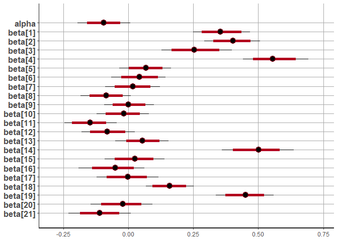
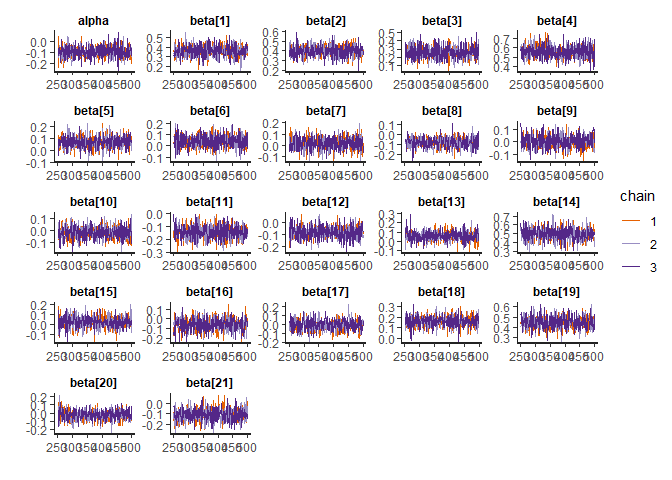
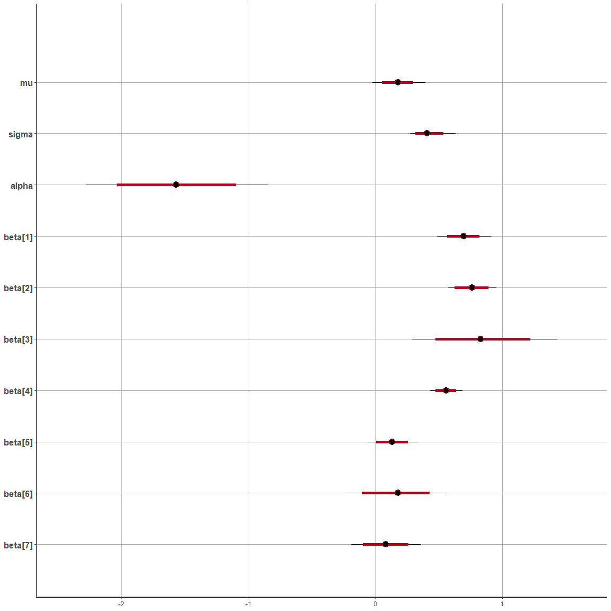

# Using stan \| bayesian Model for Logistic regression

## load libraries —————-

``` r
## for load rstan package
if (!require(rstan)) {
    install.packages("rstan", repos = c("https://mc-stan.org/r-packages/", getOption("repos")))
    library(rstan)
}

## for check package that good installed or not
# example(stan_model, package = "rstan", run.dontrun = TRUE)

## for parallel calculation 
options(mc.cores = parallel :: detectCores())

## for adjust run programming
rstan_options(auto_write = TRUE)


## for load tidyverse packages, (manipulate data and use ggplot objects)
if (!require(tidyverse)) {
    chooseCRANmirror(graphics = FALSE, ind = 1)
    install.packages("tidyverse")
    library(tidyverse)
}


## for feature selection 

if(!require(mlbench)) {
    chooseCRANmirror(graphics = FALSE, ind = 1)
    install.packages("mlbench")
    library(mlbench)
}

if(!require(caret)) {
    chooseCRANmirror(graphics = FALSE, ind = 1)
    install.packages("caret")
    library(caret)
}
```

------------------------------------------------------------------------

------------------------------------------------------------------------

#### load data ——————-

``` r
set.seed(132)

dat <- read.csv(file = "diabetes_binary_5050split_health_indicators_BRFSS2015.csv", header = TRUE)

names(dat)
```

     [1] "Diabetes_binary"      "HighBP"               "HighChol"            
     [4] "CholCheck"            "BMI"                  "Smoker"              
     [7] "Stroke"               "HeartDiseaseorAttack" "PhysActivity"        
    [10] "Fruits"               "Veggies"              "HvyAlcoholConsump"   
    [13] "AnyHealthcare"        "NoDocbcCost"          "GenHlth"             
    [16] "MentHlth"             "PhysHlth"             "DiffWalk"            
    [19] "Sex"                  "Age"                  "Education"           
    [22] "Income"              

``` r
n <- 3e+3
ind <- sample(nrow(dat), size = n, replace = FALSE)
new_dat <- dat |> 
                slice(ind)
y <- new_dat$Diabetes_binary |> unlist()
p <- 0.8
train <- createDataPartition(y, p, 
            list = FALSE, times = 1)
name_cols <- new_dat |> names()
name_cols
```

     [1] "Diabetes_binary"      "HighBP"               "HighChol"            
     [4] "CholCheck"            "BMI"                  "Smoker"              
     [7] "Stroke"               "HeartDiseaseorAttack" "PhysActivity"        
    [10] "Fruits"               "Veggies"              "HvyAlcoholConsump"   
    [13] "AnyHealthcare"        "NoDocbcCost"          "GenHlth"             
    [16] "MentHlth"             "PhysHlth"             "DiffWalk"            
    [19] "Sex"                  "Age"                  "Education"           
    [22] "Income"              

``` r
X <- new_dat |> 
       dplyr :: select(name_cols[-1])

X |> names()
```

     [1] "HighBP"               "HighChol"             "CholCheck"           
     [4] "BMI"                  "Smoker"               "Stroke"              
     [7] "HeartDiseaseorAttack" "PhysActivity"         "Fruits"              
    [10] "Veggies"              "HvyAlcoholConsump"    "AnyHealthcare"       
    [13] "NoDocbcCost"          "GenHlth"              "MentHlth"            
    [16] "PhysHlth"             "DiffWalk"             "Sex"                 
    [19] "Age"                  "Education"            "Income"              

``` r
yTrain <- y[train]
yTest <- y[-train]


xScale <- apply(X, 2, function(x) {
    temp <- (x - mean(x)) / sd(x)
    return(temp)
})
colMeans(xScale)
```

                  HighBP             HighChol            CholCheck 
           -5.218048e-18        -3.608225e-17         1.658673e-16 
                     BMI               Smoker               Stroke 
            2.076626e-16        -1.016964e-16         4.229950e-17 
    HeartDiseaseorAttack         PhysActivity               Fruits 
           -4.773959e-18        -1.328567e-17        -2.457294e-17 
                 Veggies    HvyAlcoholConsump        AnyHealthcare 
            3.293662e-17         1.520080e-17         2.183439e-17 
             NoDocbcCost              GenHlth             MentHlth 
           -2.386980e-17        -6.056267e-17         5.219436e-17 
                PhysHlth             DiffWalk                  Sex 
            4.141132e-17        -4.644433e-17        -8.422892e-17 
                     Age            Education               Income 
           -1.395828e-16        -1.420276e-16         1.521468e-16 

``` r
apply(xScale, 2, sd)
```

                  HighBP             HighChol            CholCheck 
                       1                    1                    1 
                     BMI               Smoker               Stroke 
                       1                    1                    1 
    HeartDiseaseorAttack         PhysActivity               Fruits 
                       1                    1                    1 
                 Veggies    HvyAlcoholConsump        AnyHealthcare 
                       1                    1                    1 
             NoDocbcCost              GenHlth             MentHlth 
                       1                    1                    1 
                PhysHlth             DiffWalk                  Sex 
                       1                    1                    1 
                     Age            Education               Income 
                       1                    1                    1 

``` r
xTrain <- xScale |> _[train, ]
xTest <- xScale |> _[-train, ] 


xTrain <- xTrain  |> as.data.frame()
xTest <- xTest |> as.data.frame()

xTrain_mat <- model.matrix(~ ., data = xTrain)[, -1]
xTest_mat <- model.matrix(~ ., data = xTest)[, -1]
```

------------------------------------------------------------------------

------------------------------------------------------------------------

#### fit stan models

``` r
stanFit1 <- stan(file = "model_1.stan", 
data = list(N = nrow(xTrain), L = nrow(xTest), X_test = xTest_mat,
        k = ncol(xTrain), y = yTrain,  X_train = xTrain_mat), iter = 500, chains = 3)

# saveRDS(stanFit1, "Model3.RDS")

# plot(stanFit1)
# plot(stanFit1, pars = c("alpha", "beta"))
# traceplot(stanFit1, pars = c("alpha", "beta"))
# ext_fit <- rstan :: extract(stanFit1)


# # Accuracy
# mean(apply(ext_fit$y_test, 2, median) == yTest)
```

------------------------------------------------------------------------

------------------------------------------------------------------------

``` r
# stanFit1 <- readRDS("Model3.RDS")
```

------------------------------------------------------------------------

------------------------------------------------------------------------

``` r
#| warning: false
#| message: false
#| fig-height: 9
#| fig-width: 9


plot(stanFit1, pars = c("alpha", "beta"))
```

    ci_level: 0.8 (80% intervals)

    outer_level: 0.95 (95% intervals)



``` r
traceplot(stanFit1, pars = c("alpha", "beta"))
```



``` r
ext_fit <- rstan :: extract(stanFit1)


# Accuracy
mean(apply(ext_fit$y_test, 2, median) == yTest)
```

    [1] 0.755

------------------------------------------------------------------------

------------------------------------------------------------------------

------------------------------------------------------------------------

------------------------------------------------------------------------

## Using brms

``` r
set.seed(1234)
if (!require(brms)) {
    chooseCRANmirror(graphics = FALSE, ind = 1)
    install.packages("brms")
    library(tidyverse)
}

if (!require(bayesplot)) {
    chooseCRANmirror(graphics = FALSE, ind = 1)
    install.packages("bayesplot")
    library(bayesplot)
}


new_dat2 <- cbind(yTrain, xTrain) |> 
                setNames(new_dat |> names())
names(new_dat2)
```

     [1] "Diabetes_binary"      "HighBP"               "HighChol"            
     [4] "CholCheck"            "BMI"                  "Smoker"              
     [7] "Stroke"               "HeartDiseaseorAttack" "PhysActivity"        
    [10] "Fruits"               "Veggies"              "HvyAlcoholConsump"   
    [13] "AnyHealthcare"        "NoDocbcCost"          "GenHlth"             
    [16] "MentHlth"             "PhysHlth"             "DiffWalk"            
    [19] "Sex"                  "Age"                  "Education"           
    [22] "Income"              

``` r
temp1 <- names(new_dat2)[-1]


temp2 <- paste(temp1, collapse = " + ")
form <- paste(names(new_dat2)[1], temp2, sep = " ~ ")

## define Priors 


Model4 <- brm(as.formula(form), family = bernoulli, 
            data = new_dat2)

saveRDS(Model4, "brms_Model4")
Model4 <- readRDS("brms_Model4")
prior_summary(Model4)
```

                    prior     class                 coef group resp dpar nlpar lb
                   (flat)         b                                              
                   (flat)         b                  Age                         
                   (flat)         b        AnyHealthcare                         
                   (flat)         b                  BMI                         
                   (flat)         b            CholCheck                         
                   (flat)         b             DiffWalk                         
                   (flat)         b            Education                         
                   (flat)         b               Fruits                         
                   (flat)         b              GenHlth                         
                   (flat)         b HeartDiseaseorAttack                         
                   (flat)         b               HighBP                         
                   (flat)         b             HighChol                         
                   (flat)         b    HvyAlcoholConsump                         
                   (flat)         b               Income                         
                   (flat)         b             MentHlth                         
                   (flat)         b          NoDocbcCost                         
                   (flat)         b         PhysActivity                         
                   (flat)         b             PhysHlth                         
                   (flat)         b                  Sex                         
                   (flat)         b               Smoker                         
                   (flat)         b               Stroke                         
                   (flat)         b              Veggies                         
     student_t(3, 0, 2.5) Intercept                                              
     ub       source
             default
        (vectorized)
        (vectorized)
        (vectorized)
        (vectorized)
        (vectorized)
        (vectorized)
        (vectorized)
        (vectorized)
        (vectorized)
        (vectorized)
        (vectorized)
        (vectorized)
        (vectorized)
        (vectorized)
        (vectorized)
        (vectorized)
        (vectorized)
        (vectorized)
        (vectorized)
        (vectorized)
        (vectorized)
             default

``` r
prob <- predict(Model4, xTest)[, 1]
conf_mat <- table((prob > 0.5), yTest)
conf_mat
```

           yTest
              0   1
      FALSE 228  58
      TRUE   92 222

``` r
acc <- sum(diag(conf_mat)) / sum(conf_mat)
acc
```

    [1] 0.75

``` r
pp_check(Model4)
```



------------------------------------------------------------------------

------------------------------------------------------------------------

#### Model 5

``` r
## define Priors 
# priors <- priors <- c(
#     prior_string("normal(mu, sigma)", class = "b", coef = names(new_dat)[-1]), 

#   prior_string("normal(0, 1.5)", class = "b", coef = paste("actor", 2:7, sep="")),
#   prior_string("normal(0, 0.5)", class = "b", coef = paste("treatment", 2:4, sep=""))
# )

# Model4 <- brm(as.formula(form), family = bernoulli, 
#             data = new_dat)

# prior_summary(Model4)

# prob <- predict(Model4, xTest)[, 1]
# conf_mat <- table((prob > 0.5), yTest)
# conf_mat
# acc <- sum(diag(conf_mat)) / sum(conf_mat)
# acc


# pp_check(Model4)
```
