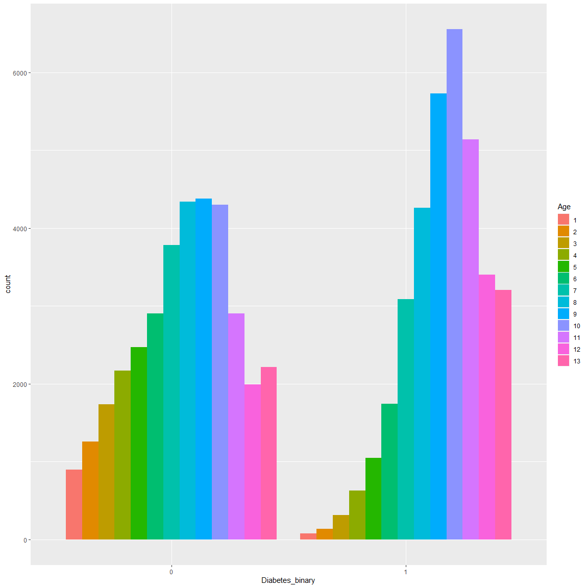
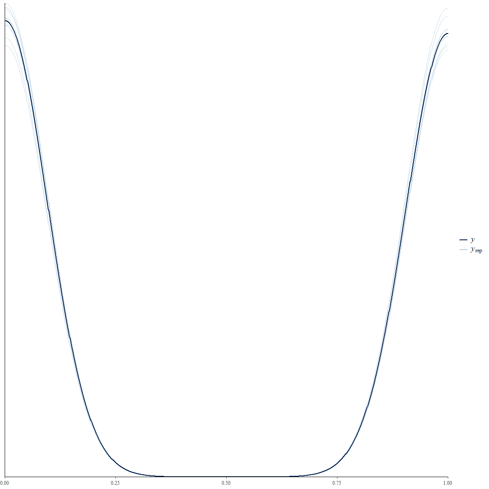
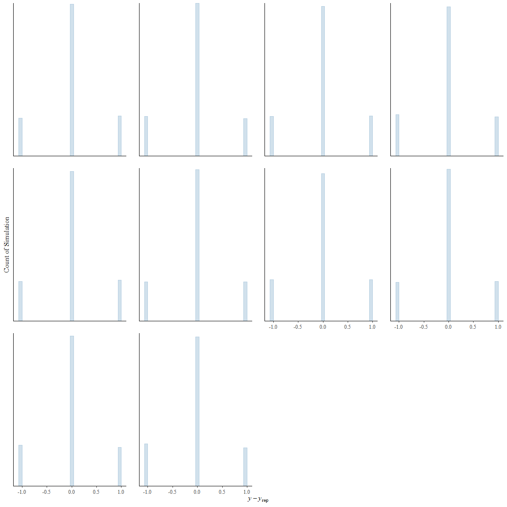
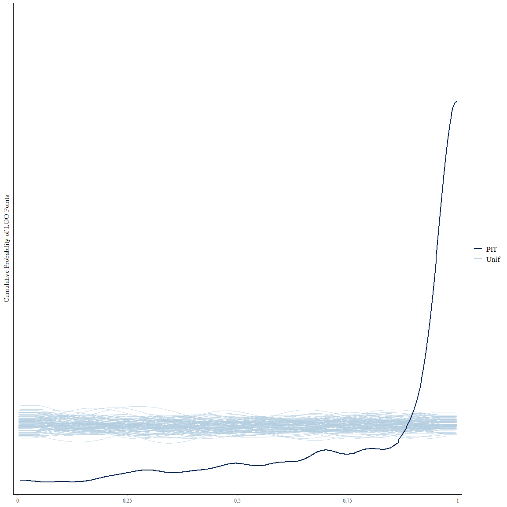
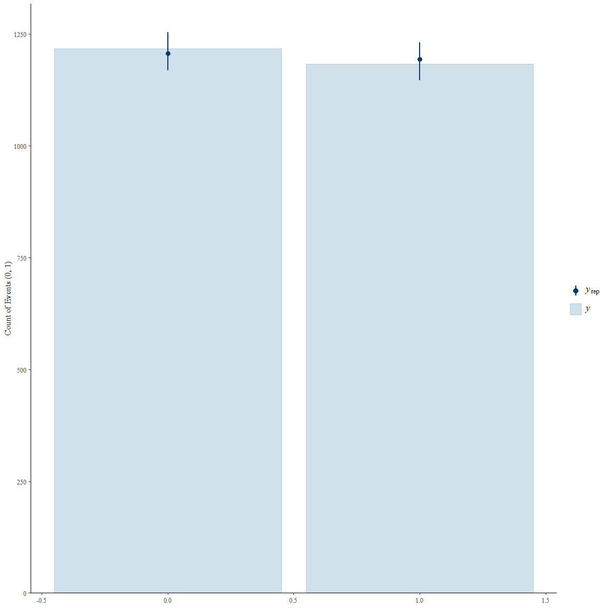
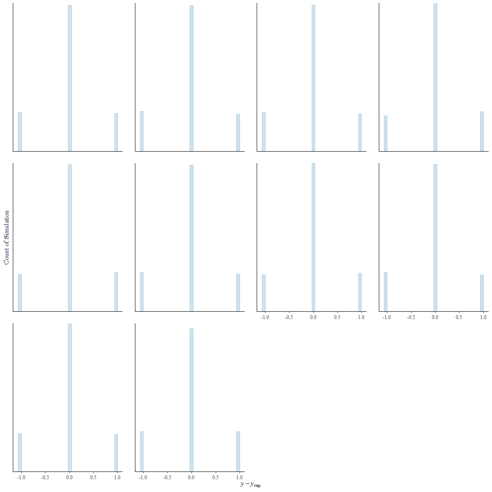

# Using stan \| bayesian Model for Logistic regression

## load libraries —————-

``` r
## for load rstan package
if (!require(rstan)) {
    install.packages("rstan", repos = c("https://mc-stan.org/r-packages/", getOption("repos")))
    library(rstan)
}


## for parallel calculation 
options(mc.cores = parallel :: detectCores())

## for adjust run programming
rstan_options(auto_write = TRUE)


## for load tidyverse packages, (manipulate data and use ggplot objects)
if (!require(tidyverse)) {
    chooseCRANmirror(graphics = FALSE, ind = 1)
    install.packages("tidyverse")
    library(tidyverse)
}


## for feature selection 

if(!require(mlbench)) {
    chooseCRANmirror(graphics = FALSE, ind = 1)
    install.packages("mlbench")
    library(mlbench)
}

if(!require(caret)) {
    chooseCRANmirror(graphics = FALSE, ind = 1)
    install.packages("caret")
    library(caret)
}
```

------------------------------------------------------------------------

------------------------------------------------------------------------

#### load data ——————-

``` r
set.seed(132)

dat <- read.csv(file = "diabetes_binary_5050split_health_indicators_BRFSS2015.csv", header = TRUE)

names(dat)
```

     [1] "Diabetes_binary"      "HighBP"               "HighChol"            
     [4] "CholCheck"            "BMI"                  "Smoker"              
     [7] "Stroke"               "HeartDiseaseorAttack" "PhysActivity"        
    [10] "Fruits"               "Veggies"              "HvyAlcoholConsump"   
    [13] "AnyHealthcare"        "NoDocbcCost"          "GenHlth"             
    [16] "MentHlth"             "PhysHlth"             "DiffWalk"            
    [19] "Sex"                  "Age"                  "Education"           
    [22] "Income"              

``` r
glimpse(dat)
```

    Rows: 70,692
    Columns: 22
    $ Diabetes_binary      <dbl> 0, 0, 0, 0, 0, 0, 0, 0, 0, 0, 0, 0, 0, 0, 0, 0, 0…
    $ HighBP               <dbl> 1, 1, 0, 1, 0, 0, 0, 0, 0, 0, 1, 0, 1, 1, 0, 0, 0…
    $ HighChol             <dbl> 0, 1, 0, 1, 0, 0, 1, 0, 0, 0, 1, 0, 1, 0, 1, 0, 0…
    $ CholCheck            <dbl> 1, 1, 1, 1, 1, 1, 1, 1, 1, 1, 1, 1, 1, 1, 1, 1, 1…
    $ BMI                  <dbl> 26, 26, 26, 28, 29, 18, 26, 31, 32, 27, 24, 21, 2…
    $ Smoker               <dbl> 0, 1, 0, 1, 1, 0, 1, 1, 0, 1, 1, 0, 0, 0, 1, 1, 0…
    $ Stroke               <dbl> 0, 1, 0, 0, 0, 0, 0, 0, 0, 0, 0, 0, 0, 0, 0, 0, 0…
    $ HeartDiseaseorAttack <dbl> 0, 0, 0, 0, 0, 0, 0, 0, 0, 0, 1, 0, 0, 0, 0, 0, 0…
    $ PhysActivity         <dbl> 1, 0, 1, 1, 1, 1, 1, 0, 1, 0, 1, 1, 1, 0, 1, 1, 1…
    $ Fruits               <dbl> 0, 1, 1, 1, 1, 1, 1, 1, 1, 1, 1, 1, 1, 1, 1, 1, 0…
    $ Veggies              <dbl> 1, 0, 1, 1, 1, 1, 1, 1, 1, 1, 1, 1, 1, 1, 0, 0, 1…
    $ HvyAlcoholConsump    <dbl> 0, 0, 0, 0, 0, 0, 1, 0, 0, 0, 0, 0, 0, 0, 0, 0, 0…
    $ AnyHealthcare        <dbl> 1, 1, 1, 1, 1, 0, 1, 1, 1, 1, 1, 1, 1, 1, 1, 1, 1…
    $ NoDocbcCost          <dbl> 0, 0, 0, 0, 0, 0, 0, 0, 0, 0, 0, 0, 0, 0, 0, 0, 0…
    $ GenHlth              <dbl> 3, 3, 1, 3, 2, 2, 1, 4, 3, 3, 3, 1, 2, 3, 1, 3, 2…
    $ MentHlth             <dbl> 5, 0, 0, 0, 0, 7, 0, 0, 0, 0, 0, 0, 0, 3, 0, 0, 0…
    $ PhysHlth             <dbl> 30, 0, 10, 3, 0, 0, 0, 0, 0, 6, 4, 0, 0, 3, 0, 0,…
    $ DiffWalk             <dbl> 0, 0, 0, 0, 0, 0, 0, 0, 0, 0, 0, 0, 0, 0, 1, 0, 0…
    $ Sex                  <dbl> 1, 1, 1, 1, 0, 0, 1, 1, 0, 1, 0, 1, 1, 1, 0, 0, 0…
    $ Age                  <dbl> 4, 12, 13, 11, 8, 1, 13, 6, 3, 6, 12, 4, 7, 10, 1…
    $ Education            <dbl> 6, 6, 6, 6, 5, 4, 5, 4, 6, 4, 4, 6, 6, 4, 5, 4, 5…
    $ Income               <dbl> 8, 8, 8, 8, 8, 7, 6, 3, 8, 4, 6, 8, 8, 6, 1, 6, 7…

``` r
# Diabetes_binary
dat |> 
    transmute(Diabetes_binary = factor(Diabetes_binary)) |> 
    ggplot(aes(y = Diabetes_binary, fill = Diabetes_binary)) + 
    geom_bar() + 
    theme_bw()
```


``` r
dat |> _$Diabetes_binary |> table()
```


        0     1 
    35346 35346 

``` r
## HighBP 
dat |> 
    transmute(HighBP = factor(HighBP)) |> 
    ggplot(aes(y = HighBP, fill = HighBP)) + 
    geom_bar() + 
    theme_bw()
```


``` r
dat |> _$HighBP |> table()
```


        0     1 
    30860 39832 

``` r
## HighChol
dat |> 
    transmute(HighChol = factor(HighChol)) |> 
    ggplot(aes(y = HighChol, fill = HighChol)) + 
    geom_bar() + 
    theme_bw()
```


``` r
dat |> _$HighChol |> table()
```


        0     1 
    33529 37163 

``` r
## CholCheck 
dat |> 
    transmute(CholCheck = factor(CholCheck)) |> 
    ggplot(aes(y = CholCheck, fill = CholCheck)) + 
    geom_bar() + 
    theme_bw()
```


``` r
dat |> _$CholCheck |> table()
```


        0     1 
     1749 68943 

``` r
## BMI 
dat |> 
    ggplot(aes(x = BMI)) + 
    geom_histogram(col = "orange", fill = "darkblue", bins = 30) + 
    theme_bw()
```


``` r
# install.packages("psych")
dat |> _$BMI |> psych :: describe()
```

       vars     n  mean   sd median trimmed  mad min max range skew kurtosis   se
    X1    1 70692 29.86 7.11     29   29.13 5.93  12  98    86 1.72     7.16 0.03

``` r
## Smoker
dat |> 
    transmute(Smoker = factor(Smoker)) |> 
    ggplot(aes(y = Smoker, fill = Smoker)) + 
    geom_bar() + 
    theme_bw()
```


``` r
dat |> _$Smoker |> table()
```


        0     1 
    37094 33598 

``` r
## Stroke 
dat |> 
    transmute(Stroke = factor(Stroke)) |> 
    ggplot(aes(y = Stroke, fill = Stroke)) + 
    geom_bar() + 
    theme_bw()
```


``` r
dat |> _$Stroke |> table()
```


        0     1 
    66297  4395 

``` r
# HeartDiseaseorAttack 
dat |> 
    transmute(HeartDiseaseorAttack = factor(HeartDiseaseorAttack)) |> 
    ggplot(aes(y = HeartDiseaseorAttack, fill = HeartDiseaseorAttack)) + 
    geom_bar() + 
    theme_bw()
```


``` r
dat |> _$HeartDiseaseorAttack |> table()
```


        0     1 
    60243 10449 

``` r
# # PhysActivity 
dat |> 
    transmute(PhysActivity = factor(PhysActivity)) |> 
    ggplot(aes(y = PhysActivity, fill = PhysActivity)) + 
    geom_bar() + 
    theme_bw()
```


``` r
dat |> _$PhysActivity |> table()
```


        0     1 
    20993 49699 

``` r
# Fruites
dat |> 
    transmute(Fruits = factor(Fruits)) |> 
    ggplot(aes(y = Fruits, fill = Fruits)) + 
    geom_bar() + 
    theme_bw()
```


``` r
dat |> _$Fruites |> table()
```

    < table of extent 0 >

``` r
# Veggies
dat |> 
    transmute(Veggies = factor(Veggies)) |> 
    ggplot(aes(y = Veggies, fill = Veggies)) + 
    geom_bar() + 
    theme_bw()
```


``` r
dat |> _$Veggies |> table()
```


        0     1 
    14932 55760 

``` r
# HvyAlcoholConsump
dat |> 
    transmute(HvyAlcoholConsump = factor(HvyAlcoholConsump)) |> 
    ggplot(aes(y = HvyAlcoholConsump, fill = HvyAlcoholConsump)) + 
    geom_bar() + 
    theme_bw()
```


``` r
dat |> _$HvyAlcoholConsump |> table()
```


        0     1 
    67672  3020 

``` r
# AnyHealthcare
dat |> 
    transmute(AnyHealthcare = factor(AnyHealthcare)) |> 
    ggplot(aes(y = AnyHealthcare, fill = AnyHealthcare)) + 
    geom_bar() + 
    theme_bw()
```


``` r
dat |> _$AnyHealthcare |> table()
```


        0     1 
     3184 67508 

``` r
# NoDocbcCost
dat |> 
    transmute(NoDocbcCost = factor(NoDocbcCost)) |> 
    ggplot(aes(y = NoDocbcCost, fill = NoDocbcCost)) + 
    geom_bar() + 
    theme_bw()
```


``` r
dat |> _$NoDocbcCost |> table()
```


        0     1 
    64053  6639 

``` r
# GenHlth
dat |> 
    transmute(GenHlth = factor(GenHlth)) |> 
    ggplot(aes(y = GenHlth, fill = GenHlth)) + 
    geom_bar() + 
    theme_bw()
```


``` r
dat |> _$GenHlth |> table()
```


        1     2     3     4     5 
     8282 19872 23427 13303  5808 

``` r
# MentHlth
dat |> 
    transmute(MentHlth = factor(MentHlth)) |>
    ggplot(aes(y = MentHlth, fill = MentHlth)) + 
    geom_bar() + 
    theme_bw()
```


``` r
dat |> _$MentHlth |> table()
```


        0     1     2     3     4     5     6     7     8     9    10    11    12 
    48091  2051  3267  1967   981  2519   288   825   198    28  1924     8   130 
       13    14    15    16    17    18    19    20    21    22    23    24    25 
       15   353  1767    28    18    42     7  1125    84    22    13    10   425 
       26    27    28    29    30 
       17    17    99    53  4320 

``` r
dat[["PhysHlth"]] |> table()
```


        0     1     2     3     4     5     6     7     8     9    10    11    12 
    39915  2853  4102  2438  1376  2332   447  1326   276    55  1980    22   205 
       13    14    15    16    17    18    19    20    21    22    23    24    25 
       26   802  1913    50    35    50    10  1292   229    31    27    24   557 
       26    27    28    29    30 
       26    34   211    95  7953 

``` r
# PhysHlth
dat |> 
    transmute(PhysHlth = factor(PhysHlth)) |> 
    ggplot(aes(y = PhysHlth, fill = PhysHlth)) + 
    geom_bar() + 
    theme_bw()
```


``` r
dat |> _$PhysHlth |> table()
```


        0     1     2     3     4     5     6     7     8     9    10    11    12 
    39915  2853  4102  2438  1376  2332   447  1326   276    55  1980    22   205 
       13    14    15    16    17    18    19    20    21    22    23    24    25 
       26   802  1913    50    35    50    10  1292   229    31    27    24   557 
       26    27    28    29    30 
       26    34   211    95  7953 

``` r
# DiffWalk
dat |> 
    transmute(DiffWalk = factor(DiffWalk)) |> 
    ggplot(aes(y = DiffWalk, fill = DiffWalk)) + 
    geom_bar() + 
    theme_bw()
```


``` r
dat |> _$DiffWalk |> table()
```


        0     1 
    52826 17866 

``` r
# Sex
dat |> 
    transmute(Sex = factor(Sex)) |> 
    ggplot(aes(y = Sex, fill = Sex)) + 
    geom_bar() + 
    theme_bw()
```


``` r
dat |> _$Sex |> table()
```


        0     1 
    38386 32306 

``` r
# Age
dat |> 
    transmute(Age = factor(Age)) |> 
    ggplot(aes(y = Age, fill = Age)) + 
    geom_bar() + 
    theme_bw()
```


``` r
dat |> _$Age |> table()
```


        1     2     3     4     5     6     7     8     9    10    11    12    13 
      979  1396  2049  2793  3520  4648  6872  8603 10112 10856  8044  5394  5426 

``` r
# Education
dat |> 
    transmute(Education = factor(Education)) |> 
    ggplot(aes(y = Education, fill = Education)) + 
    geom_bar() + 
    theme_bw()
```


``` r
dat |> _$Education |> table()
```


        1     2     3     4     5     6 
       75  1647  3447 19473 20030 26020 

``` r
# Income
dat |> 
    transmute(Income = factor(Income)) |> 
    ggplot(aes(y = Income, fill = Income)) + 
    geom_bar() + 
    theme_bw()
```


``` r
dat |> _$Income |> table()
```


        1     2     3     4     5     6     7     8 
     3611  4498  5557  6658  8010 10287 11425 20646 

``` r
##### joint relation  (Sex, Smoker)
dat |> 
    with(table(Sex, Smoker)) 
```

       Smoker
    Sex     0     1
      0 22114 16272
      1 14980 17326

``` r
dat |> 
    dplyr :: select(c("Sex", "Smoker")) |> 
    mutate(Sex = factor(Sex),  
            Smoker = factor(Smoker)) |> 
    ggplot(aes(x = Sex, fill = Smoker)) +
    geom_bar(position = "dodge")
```


``` r
##### joint relation  (Diabetes_binary, Smoker)
dat |> 
    with(table(Diabetes_binary, Smoker)) 
```

                   Smoker
    Diabetes_binary     0     1
                  0 20065 15281
                  1 17029 18317

``` r
dat |> 
    dplyr :: select(c("Diabetes_binary", "Smoker")) |> 
    mutate(Smoker = factor(Smoker), 
            Diabetes_binary = factor(Diabetes_binary)) |> 
    ggplot(aes(x = Diabetes_binary, fill = Smoker)) +
    geom_bar(position = "dodge")
```


``` r
##### joint relation  (Diabetes_binary, Sex)
dat |> 
    with(table(Diabetes_binary, Sex)) 
```

                   Sex
    Diabetes_binary     0     1
                  0 19975 15371
                  1 18411 16935

``` r
dat |> 
    dplyr :: select(c("Diabetes_binary", "Sex")) |> 
    mutate(Sex = factor(Sex), 
            Diabetes_binary = factor(Diabetes_binary)) |> 
    ggplot(aes(x = Diabetes_binary, fill = Sex)) +
    geom_bar(position = "dodge")
```


``` r
#### Joint Relation (Diabetes_binary, HeartDiseaseorAttack)
dat |> 
    with(table(Diabetes_binary, HeartDiseaseorAttack)) 
```

                   HeartDiseaseorAttack
    Diabetes_binary     0     1
                  0 32775  2571
                  1 27468  7878

``` r
dat |> 
    dplyr :: select(c("Diabetes_binary", "HeartDiseaseorAttack")) |> 
    mutate(HeartDiseaseorAttack = factor(HeartDiseaseorAttack), 
            Diabetes_binary = factor(Diabetes_binary)) |> 
    ggplot(aes(x = Diabetes_binary, fill = HeartDiseaseorAttack)) +
    geom_bar(position = "dodge")
```


``` r
#### Joint Relation (Diabetes_binary, PhysActivity)
dat |> 
    with(table(Diabetes_binary, PhysActivity)) 
```

                   PhysActivity
    Diabetes_binary     0     1
                  0  7934 27412
                  1 13059 22287

``` r
dat |> 
    dplyr :: select(c("Diabetes_binary", "PhysActivity")) |> 
    mutate(PhysActivity = factor(PhysActivity), 
            Diabetes_binary = factor(Diabetes_binary)) |> 
    ggplot(aes(x = Diabetes_binary, fill = PhysActivity)) +
    geom_bar(position = "dodge")
```


``` r
#### Joint Relation (Diabetes_binary, Fruits)
dat |> 
    with(table(Diabetes_binary, Fruits)) 
```

                   Fruits
    Diabetes_binary     0     1
                  0 12790 22556
                  1 14653 20693

``` r
dat |> 
    dplyr :: select(c("Diabetes_binary", "Fruits")) |> 
    mutate(Fruits = factor(Fruits), 
            Diabetes_binary = factor(Diabetes_binary)) |> 
    ggplot(aes(x = Diabetes_binary, fill = Fruits)) +
    geom_bar(position = "dodge")
```


``` r
#### Joint Relation (Diabetes_binary, HvyAlcoholConsump)
dat |> 
    with(table(Diabetes_binary, HvyAlcoholConsump)) 
```

                   HvyAlcoholConsump
    Diabetes_binary     0     1
                  0 33158  2188
                  1 34514   832

``` r
dat |> 
    dplyr :: select(c("Diabetes_binary", "HvyAlcoholConsump")) |> 
    mutate(HvyAlcoholConsump = factor(HvyAlcoholConsump), 
            Diabetes_binary = factor(Diabetes_binary)) |> 
    ggplot(aes(x = Diabetes_binary, fill = HvyAlcoholConsump)) +
    geom_bar(position = "dodge")
```


``` r
#### Joint Relation (Diabetes_binary, NoDocbcCost)
dat |> 
    with(table(Diabetes_binary, NoDocbcCost)) 
```

                   NoDocbcCost
    Diabetes_binary     0     1
                  0 32449  2897
                  1 31604  3742

``` r
dat |> 
    dplyr :: select(c("Diabetes_binary", "NoDocbcCost")) |> 
    mutate(NoDocbcCost = factor(NoDocbcCost), 
            Diabetes_binary = factor(Diabetes_binary)) |> 
    ggplot(aes(x = Diabetes_binary, fill = NoDocbcCost)) +
    geom_bar(position = "dodge")
```


``` r
#### Joint Relation (Diabetes_binary, MentHlth)
dat |> 
    with(table(Diabetes_binary, MentHlth)) 
```

                   MentHlth
    Diabetes_binary     0     1     2     3     4     5     6     7     8     9
                  0 24688  1239  1759  1043   492  1296   124   420    88    15
                  1 23403   812  1508   924   489  1223   164   405   110    13
                   MentHlth
    Diabetes_binary    10    11    12    13    14    15    16    17    18    19
                  0   860     5    63     7   155   744    14     7    22     3
                  1  1064     3    67     8   198  1023    14    11    20     4
                   MentHlth
    Diabetes_binary    20    21    22    23    24    25    26    27    28    29
                  0   462    36    11     5     4   152    10     5    42    23
                  1   663    48    11     8     6   273     7    12    57    30
                   MentHlth
    Diabetes_binary    30
                  0  1552
                  1  2768

``` r
dat |> 
    dplyr :: select(c("Diabetes_binary", "MentHlth")) |> 
    mutate(MentHlth = factor(MentHlth), 
            Diabetes_binary = factor(Diabetes_binary)) |> 
    ggplot(aes(x = Diabetes_binary, fill = MentHlth)) +
    geom_bar(position = "dodge")
```


``` r
#### Joint Relation (Diabetes_binary, DiffWalk)
dat |> 
    with(table(Diabetes_binary, DiffWalk)) 
```

                   DiffWalk
    Diabetes_binary     0     1
                  0 30601  4745
                  1 22225 13121

``` r
dat |> 
    dplyr :: select(c("Diabetes_binary", "DiffWalk")) |> 
    mutate(DiffWalk = factor(DiffWalk), 
            Diabetes_binary = factor(Diabetes_binary)) |> 
    ggplot(aes(x = Diabetes_binary, fill = DiffWalk)) +
    geom_bar(position = "dodge")
```


``` r
#### Joint Relation (Diabetes_binary, Education)
dat |> 
    with(table(Diabetes_binary, Education)) 
```

                   Education
    Diabetes_binary     1     2     3     4     5     6
                  0    28   464  1151  8407  9676 15620
                  1    47  1183  2296 11066 10354 10400

``` r
dat |> 
    dplyr :: select(c("Diabetes_binary", "Education")) |> 
    mutate(Education = factor(Education), 
            Diabetes_binary = factor(Diabetes_binary)) |> 
    ggplot(aes(x = Diabetes_binary, fill = Education)) +
    geom_bar(position = "dodge")
```


``` r
#### Joint Relation (Diabetes_binary, Income)
dat |> 
    with(table(Diabetes_binary, Income)) 
```

                   Income
    Diabetes_binary     1     2     3     4     5     6     7     8
                  0  1228  1412  1989  2604  3506  4996  6160 13451
                  1  2383  3086  3568  4054  4504  5291  5265  7195

``` r
dat |> 
    dplyr :: select(c("Diabetes_binary", "Income")) |> 
    mutate(Income = factor(Income), 
            Diabetes_binary = factor(Diabetes_binary)) |> 
    ggplot(aes(x = Diabetes_binary, fill = Income)) +
    geom_bar(position = "dodge")
```


``` r
#### Joint Relation (Diabetes_binary, Age)
dat |> 
    with(table(Diabetes_binary, Age)) 
```

                   Age
    Diabetes_binary    1    2    3    4    5    6    7    8    9   10   11   12
                  0  901 1256 1735 2167 2469 2906 3784 4340 4379 4298 2903 1991
                  1   78  140  314  626 1051 1742 3088 4263 5733 6558 5141 3403
                   Age
    Diabetes_binary   13
                  0 2217
                  1 3209

``` r
dat |> 
    dplyr :: select(c("Diabetes_binary", "Age")) |> 
    mutate(Age = factor(Age), 
            Diabetes_binary = factor(Diabetes_binary)) |> 
    ggplot(aes(x = Diabetes_binary, fill = Age)) +
    geom_bar(position = "dodge")
```



``` r
#### Joint Relation (Diabetes_binary, BMI)
dat |> 
    with(aggregate(BMI, list(Diabetes_binary), FUN = mean)) |> 
    setNames(c("Diabetes_binary", "BMI_Mean"))
```

      Diabetes_binary BMI_Mean
    1               0 27.76996
    2               1 31.94401

``` r
dat |> 
    dplyr :: select(c("Diabetes_binary", "BMI")) |> 
    mutate(Diabetes_binary = factor(Diabetes_binary)) |>
    ggplot(aes(y =BMI, fill = Diabetes_binary)) +
    geom_boxplot() + 
    theme_bw()
```


------------------------------------------------------------------------

------------------------------------------------------------------------

------------------------------------------------------------------------

## Get Correlation Matrix between variables

``` r
# install.packages("sjstats")
library(sjstats)

corr_mat <- matrix(NA, ncol(dat), ncol(dat))
col_count = 0
for (i in names(dat)) {
    col_count = col_count + 1
    row_count = 0
    for (j in names(dat)) {
        row_count = row_count + 1
        temp1 <- dat[[i]] 
        temp2 <- dat[[j]]
        temp3 <- any(c(i, j) %in% c("BMI", "PhysHlth", "GenHlth", "MentHlth", 
                                    "Age", "Education", "Income"))
        if (temp3) { 
            corr_mat[col_count, row_count] <- cor(temp1, 
                                    temp2, method = "spearman")
        } else corr_mat[col_count, row_count] <- cramer(table(temp1, temp2))
    }
}

corr_mat <- corr_mat |> round(4)
dimnames(corr_mat) <- list(names(dat), names(dat))

# install.packages("corrplot")
library(corrplot)
# Create a heatmap with correlation values
corrplot(corr_mat, method = "color", type = "full", 
         order = "hclust", 
         addCoef.col = "black", 
         tl.col = "black", tl.srt = 45) 
```


#### Preparation data

``` r
n <- 3e+3
ind <- sample(nrow(dat), size = n, replace = FALSE)
new_dat <- dat |> 
                slice(ind)
y <- new_dat$Diabetes_binary |> unlist()
p <- 0.8
train <- createDataPartition(y, p, 
            list = FALSE, times = 1)
name_cols <- new_dat |> names()
name_cols
```

     [1] "Diabetes_binary"      "HighBP"               "HighChol"            
     [4] "CholCheck"            "BMI"                  "Smoker"              
     [7] "Stroke"               "HeartDiseaseorAttack" "PhysActivity"        
    [10] "Fruits"               "Veggies"              "HvyAlcoholConsump"   
    [13] "AnyHealthcare"        "NoDocbcCost"          "GenHlth"             
    [16] "MentHlth"             "PhysHlth"             "DiffWalk"            
    [19] "Sex"                  "Age"                  "Education"           
    [22] "Income"              

``` r
X <- new_dat |> 
       dplyr :: select(name_cols[-1])

cat_var <- X |> names() |> setdiff(c( "BMI", "PhysHlth", 
                            "GenHlth", "MentHlth", 
                            "Age", "Education", "Income"))

num_var <- c("BMI", "PhysHlth", "GenHlth", "MentHlth", 
                                    "Age", "Education", "Income")

xScale <- X 

for (i in num_var) {
    xScale[[i]] <- scale(xScale[[i]], center = mean(xScale[[i]]), 
                    scale = sd(xScale[[i]]))
}


yTrain <- y[train]
yTest <- y[-train]

dat |> names()
```

     [1] "Diabetes_binary"      "HighBP"               "HighChol"            
     [4] "CholCheck"            "BMI"                  "Smoker"              
     [7] "Stroke"               "HeartDiseaseorAttack" "PhysActivity"        
    [10] "Fruits"               "Veggies"              "HvyAlcoholConsump"   
    [13] "AnyHealthcare"        "NoDocbcCost"          "GenHlth"             
    [16] "MentHlth"             "PhysHlth"             "DiffWalk"            
    [19] "Sex"                  "Age"                  "Education"           
    [22] "Income"              

``` r
colMeans(xScale)
```

                  HighBP             HighChol            CholCheck 
            5.496667e-01         5.250000e-01         9.710000e-01 
                     BMI               Smoker               Stroke 
            2.076626e-16         4.470000e-01         6.100000e-02 
    HeartDiseaseorAttack         PhysActivity               Fruits 
            1.393333e-01         7.136667e-01         6.086667e-01 
                 Veggies    HvyAlcoholConsump        AnyHealthcare 
            7.966667e-01         4.633333e-02         9.566667e-01 
             NoDocbcCost              GenHlth             MentHlth 
            9.366667e-02        -6.056267e-17         5.219436e-17 
                PhysHlth             DiffWalk                  Sex 
            4.141132e-17         2.383333e-01         4.753333e-01 
                     Age            Education               Income 
           -1.395828e-16        -1.420276e-16         1.521468e-16 

``` r
apply(xScale, 2, sd)
```

                  HighBP             HighChol            CholCheck 
               0.4976100            0.4994579            0.1678344 
                     BMI               Smoker               Stroke 
               1.0000000            0.4972659            0.2393702 
    HeartDiseaseorAttack         PhysActivity               Fruits 
               0.3463518            0.4521224            0.4881301 
                 Veggies    HvyAlcoholConsump        AnyHealthcare 
               0.4025455            0.2102410            0.2036403 
             NoDocbcCost              GenHlth             MentHlth 
               0.2914130            1.0000000            1.0000000 
                PhysHlth             DiffWalk                  Sex 
               1.0000000            0.4261351            0.4994744 
                     Age            Education               Income 
               1.0000000            1.0000000            1.0000000 

``` r
xTrain <- xScale |> _[train, ]
xTest <- xScale |> _[-train, ] 


xTrain <- xTrain  |> as.data.frame()
xTest <- xTest |> as.data.frame()

xTrain_mat <- model.matrix(~ ., data = xTrain)[, -1]
xTest_mat <- model.matrix(~ ., data = xTest)[, -1]


# xTrain_mat |> dim()
```

#### fit stan models

``` r
stanFit1 <- stan(file = "model_3_update.stan", 
data = list(N = nrow(xTrain), L = nrow(xTest), X_test = xTest_mat,
        k = ncol(xTrain), y = yTrain,  X_train = xTrain_mat), iter = 500, chains = 3)

# saveRDS(stanFit1, "Model3.RDS")

plot(stanFit1)
```


``` r
plot(stanFit1, pars = c("alpha", "beta"))
```


``` r
traceplot(stanFit1, pars = c("alpha", "beta"))
```


``` r
# ext_fit <- rstan :: extract(stanFit1)


# # Accuracy
# mean(apply(ext_fit$y_test, 2, median) == yTest)
```

------------------------------------------------------------------------

------------------------------------------------------------------------

``` r
# stanFit1 <- readRDS("Model3.RDS")
```

------------------------------------------------------------------------

------------------------------------------------------------------------

``` r
#| warning: false
#| message: false
#| fig-height: 12
#| fig-width: 12


plot(stanFit1, pars = c("alpha", "beta"))
```

    ci_level: 0.8 (80% intervals)

    outer_level: 0.95 (95% intervals)


``` r
traceplot(stanFit1, pars = c("alpha", "beta"))
```


``` r
ext_fit <- rstan :: extract(stanFit1)


# Accuracy
mean(apply(ext_fit$y_test, 2, median) == yTest)
```

    [1] 0.7566667

------------------------------------------------------------------------

------------------------------------------------------------------------

------------------------------------------------------------------------

------------------------------------------------------------------------

## Using brms

``` r
set.seed(1234)
if (!require(brms)) {
    chooseCRANmirror(graphics = FALSE, ind = 1)
    install.packages("brms")
    library(brms)
}

if (!require(bayesplot)) {
    chooseCRANmirror(graphics = FALSE, ind = 1)
    install.packages("bayesplot")
    library(bayesplot)
}


new_dat2 <- cbind(yTrain, xTrain) |> 
                setNames(new_dat |> names()) |> 
                mutate()
names(new_dat2)
```

     [1] "Diabetes_binary"      "HighBP"               "HighChol"            
     [4] "CholCheck"            "BMI"                  "Smoker"              
     [7] "Stroke"               "HeartDiseaseorAttack" "PhysActivity"        
    [10] "Fruits"               "Veggies"              "HvyAlcoholConsump"   
    [13] "AnyHealthcare"        "NoDocbcCost"          "GenHlth"             
    [16] "MentHlth"             "PhysHlth"             "DiffWalk"            
    [19] "Sex"                  "Age"                  "Education"           
    [22] "Income"              

``` r
temp1 <- names(new_dat2)[-1]


temp2 <- paste(temp1, collapse = " + ")
form <- paste(names(new_dat2)[1], temp2, sep = " ~ ")


## define Priors 


Model4 <- brm(as.formula(form), family = bernoulli, 
            data = new_dat2)

# Get Summary of Model 
M4 <- summary(Model4)
M4
```

     Family: bernoulli 
      Links: mu = logit 
    Formula: Diabetes_binary ~ HighBP + HighChol + CholCheck + BMI + Smoker + Stroke + HeartDiseaseorAttack + PhysActivity + Fruits + Veggies + HvyAlcoholConsump + AnyHealthcare + NoDocbcCost + GenHlth + MentHlth + PhysHlth + DiffWalk + Sex + Age + Education + Income 
       Data: new_dat2 (Number of observations: 2400) 
      Draws: 4 chains, each with iter = 2000; warmup = 1000; thin = 1;
             total post-warmup draws = 4000

    Population-Level Effects: 
                         Estimate Est.Error l-95% CI u-95% CI Rhat Bulk_ESS
    Intercept               -2.05      0.53    -3.15    -1.06 1.00     5311
    HighBP                   0.71      0.11     0.50     0.92 1.00     5675
    HighChol                 0.80      0.10     0.60     1.01 1.00     5093
    CholCheck                1.53      0.45     0.71     2.49 1.00     4962
    BMI                      0.56      0.06     0.44     0.68 1.00     5026
    Smoker                   0.14      0.10    -0.06     0.33 1.00     4914
    Stroke                   0.18      0.23    -0.28     0.65 1.00     4818
    HeartDiseaseorAttack     0.05      0.15    -0.25     0.34 1.00     5384
    PhysActivity            -0.19      0.12    -0.41     0.04 1.00     5264
    Fruits                  -0.00      0.11    -0.21     0.21 1.00     5579
    Veggies                 -0.05      0.13    -0.29     0.20 1.00     5367
    HvyAlcoholConsump       -0.72      0.24    -1.20    -0.25 1.00     6097
    AnyHealthcare           -0.40      0.26    -0.92     0.11 1.00     5357
    NoDocbcCost              0.20      0.19    -0.16     0.58 1.00     5607
    GenHlth                  0.50      0.07     0.37     0.63 1.00     5466
    MentHlth                 0.02      0.06    -0.09     0.13 1.00     4638
    PhysHlth                -0.06      0.06    -0.18     0.07 1.00     4790
    DiffWalk                -0.01      0.14    -0.28     0.27 1.00     4502
    Sex                      0.32      0.10     0.11     0.52 1.00     4847
    Age                      0.45      0.06     0.34     0.57 1.00     4563
    Education               -0.02      0.06    -0.14     0.09 1.00     5145
    Income                  -0.11      0.06    -0.23     0.01 1.00     5237
                         Tail_ESS
    Intercept                3010
    HighBP                   3523
    HighChol                 3032
    CholCheck                2673
    BMI                      3383
    Smoker                   3164
    Stroke                   2872
    HeartDiseaseorAttack     3140
    PhysActivity             2931
    Fruits                   3293
    Veggies                  3084
    HvyAlcoholConsump        3008
    AnyHealthcare            2737
    NoDocbcCost              3080
    GenHlth                  3290
    MentHlth                 3401
    PhysHlth                 3182
    DiffWalk                 3136
    Sex                      3463
    Age                      3205
    Education                3079
    Income                   3291

    Draws were sampled using sampling(NUTS). For each parameter, Bulk_ESS
    and Tail_ESS are effective sample size measures, and Rhat is the potential
    scale reduction factor on split chains (at convergence, Rhat = 1).

``` r
# Get Rhat 
M4$fixed$Rhat
```

     [1] 1.0018238 1.0005817 0.9996746 1.0006652 1.0008188 1.0012869 1.0003375
     [8] 1.0003175 1.0000157 1.0036848 1.0002775 0.9999857 1.0008425 1.0017855
    [15] 1.0020117 1.0012934 1.0017126 1.0001844 1.0005546 1.0015109 1.0005072
    [22] 1.0004901

``` r
saveRDS(Model4, "brms_Model4")
Model4 <- readRDS("brms_Model4")
prior_summary(Model4)
```

                    prior     class                 coef group resp dpar nlpar lb
                   (flat)         b                                              
                   (flat)         b                  Age                         
                   (flat)         b        AnyHealthcare                         
                   (flat)         b                  BMI                         
                   (flat)         b            CholCheck                         
                   (flat)         b             DiffWalk                         
                   (flat)         b            Education                         
                   (flat)         b               Fruits                         
                   (flat)         b              GenHlth                         
                   (flat)         b HeartDiseaseorAttack                         
                   (flat)         b               HighBP                         
                   (flat)         b             HighChol                         
                   (flat)         b    HvyAlcoholConsump                         
                   (flat)         b               Income                         
                   (flat)         b             MentHlth                         
                   (flat)         b          NoDocbcCost                         
                   (flat)         b         PhysActivity                         
                   (flat)         b             PhysHlth                         
                   (flat)         b                  Sex                         
                   (flat)         b               Smoker                         
                   (flat)         b               Stroke                         
                   (flat)         b              Veggies                         
     student_t(3, 0, 2.5) Intercept                                              
     ub       source
             default
        (vectorized)
        (vectorized)
        (vectorized)
        (vectorized)
        (vectorized)
        (vectorized)
        (vectorized)
        (vectorized)
        (vectorized)
        (vectorized)
        (vectorized)
        (vectorized)
        (vectorized)
        (vectorized)
        (vectorized)
        (vectorized)
        (vectorized)
        (vectorized)
        (vectorized)
        (vectorized)
        (vectorized)
             default

``` r
prob <- predict(Model4, xTest)[, 1]
conf_mat <- table((prob > 0.5), yTest)
conf_mat
```

           yTest
              0   1
      FALSE 231  57
      TRUE   89 223

``` r
acc <- sum(diag(conf_mat)) / sum(conf_mat)
acc
```

    [1] 0.7566667

``` r
pp_check(Model4)
```



------------------------------------------------------------------------

------------------------------------------------------------------------

------------------------------------------------------------------------

#### Model 5 With Normal Prior

``` r
## define Priors 
priors <- c(
    prior_string("normal(0, 15)", class = "b"), 
    prior_string("normal(0, 20)", class = "Intercept") 
)

# set_prior(priors)

Model5 <- brm(as.formula(form),  data = new_dat2, 
            family = bernoulli, 
            prior = priors)


# Get summary Of Model
M5 <- summary(Model5)
M5
```

     Family: bernoulli 
      Links: mu = logit 
    Formula: Diabetes_binary ~ HighBP + HighChol + CholCheck + BMI + Smoker + Stroke + HeartDiseaseorAttack + PhysActivity + Fruits + Veggies + HvyAlcoholConsump + AnyHealthcare + NoDocbcCost + GenHlth + MentHlth + PhysHlth + DiffWalk + Sex + Age + Education + Income 
       Data: new_dat2 (Number of observations: 2400) 
      Draws: 4 chains, each with iter = 2000; warmup = 1000; thin = 1;
             total post-warmup draws = 4000

    Population-Level Effects: 
                         Estimate Est.Error l-95% CI u-95% CI Rhat Bulk_ESS
    Intercept               -2.05      0.51    -3.10    -1.08 1.00     4969
    HighBP                   0.71      0.11     0.50     0.93 1.00     4854
    HighChol                 0.80      0.10     0.60     1.00 1.00     5206
    CholCheck                1.54      0.43     0.73     2.44 1.00     5156
    BMI                      0.56      0.06     0.44     0.69 1.00     5019
    Smoker                   0.13      0.10    -0.06     0.33 1.00     6761
    Stroke                   0.18      0.23    -0.27     0.65 1.00     4525
    HeartDiseaseorAttack     0.05      0.16    -0.26     0.35 1.00     5041
    PhysActivity            -0.19      0.12    -0.41     0.04 1.00     5192
    Fruits                  -0.01      0.11    -0.23     0.20 1.00     5530
    Veggies                 -0.04      0.13    -0.29     0.21 1.00     6046
    HvyAlcoholConsump       -0.72      0.24    -1.19    -0.26 1.00     5875
    AnyHealthcare           -0.40      0.26    -0.90     0.11 1.00     4902
    NoDocbcCost              0.20      0.19    -0.18     0.56 1.00     5870
    GenHlth                  0.50      0.07     0.37     0.64 1.00     4567
    MentHlth                 0.02      0.06    -0.09     0.14 1.00     4801
    PhysHlth                -0.06      0.06    -0.19     0.07 1.00     4821
    DiffWalk                -0.01      0.14    -0.29     0.27 1.00     4693
    Sex                      0.32      0.10     0.11     0.52 1.00     5631
    Age                      0.45      0.06     0.33     0.57 1.00     4113
    Education               -0.02      0.06    -0.14     0.09 1.00     4984
    Income                  -0.11      0.06    -0.23     0.01 1.00     4557
                         Tail_ESS
    Intercept                3082
    HighBP                   2858
    HighChol                 3120
    CholCheck                2940
    BMI                      3168
    Smoker                   3338
    Stroke                   3062
    HeartDiseaseorAttack     3232
    PhysActivity             3322
    Fruits                   2896
    Veggies                  3153
    HvyAlcoholConsump        3270
    AnyHealthcare            3361
    NoDocbcCost              3330
    GenHlth                  3232
    MentHlth                 3080
    PhysHlth                 3391
    DiffWalk                 3103
    Sex                      3129
    Age                      3231
    Education                3113
    Income                   3134

    Draws were sampled using sampling(NUTS). For each parameter, Bulk_ESS
    and Tail_ESS are effective sample size measures, and Rhat is the potential
    scale reduction factor on split chains (at convergence, Rhat = 1).

``` r
# Get Rhat
M5$fixed$Rhat
```

     [1] 1.0034509 0.9996351 0.9997157 1.0013161 1.0014771 0.9997496 0.9996353
     [8] 1.0004624 1.0000515 1.0005515 0.9998605 0.9994566 1.0005240 1.0003100
    [15] 0.9998388 1.0023846 1.0011908 1.0011116 1.0007181 1.0003136 1.0001245
    [22] 1.0010798

``` r
prior_summary(Model5)
```

             prior     class                 coef group resp dpar nlpar lb ub
     normal(0, 15)         b                                                 
     normal(0, 15)         b                  Age                            
     normal(0, 15)         b        AnyHealthcare                            
     normal(0, 15)         b                  BMI                            
     normal(0, 15)         b            CholCheck                            
     normal(0, 15)         b             DiffWalk                            
     normal(0, 15)         b            Education                            
     normal(0, 15)         b               Fruits                            
     normal(0, 15)         b              GenHlth                            
     normal(0, 15)         b HeartDiseaseorAttack                            
     normal(0, 15)         b               HighBP                            
     normal(0, 15)         b             HighChol                            
     normal(0, 15)         b    HvyAlcoholConsump                            
     normal(0, 15)         b               Income                            
     normal(0, 15)         b             MentHlth                            
     normal(0, 15)         b          NoDocbcCost                            
     normal(0, 15)         b         PhysActivity                            
     normal(0, 15)         b             PhysHlth                            
     normal(0, 15)         b                  Sex                            
     normal(0, 15)         b               Smoker                            
     normal(0, 15)         b               Stroke                            
     normal(0, 15)         b              Veggies                            
     normal(0, 20) Intercept                                                 
           source
             user
     (vectorized)
     (vectorized)
     (vectorized)
     (vectorized)
     (vectorized)
     (vectorized)
     (vectorized)
     (vectorized)
     (vectorized)
     (vectorized)
     (vectorized)
     (vectorized)
     (vectorized)
     (vectorized)
     (vectorized)
     (vectorized)
     (vectorized)
     (vectorized)
     (vectorized)
     (vectorized)
     (vectorized)
             user

``` r
prob2 <- predict(Model5, xTest)[, 1]
conf_mat2 <- table((prob2 > 0.5), yTest)
conf_mat2
```

           yTest
              0   1
      FALSE 232  55
      TRUE   88 225

``` r
acc2 <- sum(diag(conf_mat2)) / sum(conf_mat2)
acc2
```

    [1] 0.7616667

``` r
mcmc_plot(Model5, type = "trace")
```


``` r
mcmc_plot(Model5, type = "dens")
```


``` r
bayesplot :: pp_check(Model5, type = "error_hist") + 
                labs(y = "Count of Simulation")
```



``` r
bayesplot :: pp_check(Model5, type = "loo_pit_overlay") + 
                labs(y = "Cumulative Probability of LOO Points")
```



``` r
bayesplot :: pp_check(Model5, type = "bars") + 
                labs(y = "Count of Events (0, 1)")
```


``` r
bayesplot :: pp_check(Model5, type = "dens_overlay")
```


``` r
# Get WAIC
waic(Model4)
```


    Computed from 4000 by 2400 log-likelihood matrix

              Estimate   SE
    elpd_waic  -1263.9 24.7
    p_waic        22.6  0.8
    waic        2527.8 49.4

``` r
waic(Model5)
```


    Computed from 4000 by 2400 log-likelihood matrix

              Estimate   SE
    elpd_waic  -1264.2 24.7
    p_waic        22.9  0.8
    waic        2528.4 49.4

``` r
# Compare Models
loo(Model4, Model5)
```

    Output of model 'Model4':

    Computed from 4000 by 2400 log-likelihood matrix

             Estimate   SE
    elpd_loo  -1264.0 24.7
    p_loo        22.6  0.8
    looic      2527.9 49.4
    ------
    Monte Carlo SE of elpd_loo is 0.1.

    All Pareto k estimates are good (k < 0.5).
    See help('pareto-k-diagnostic') for details.

    Output of model 'Model5':

    Computed from 4000 by 2400 log-likelihood matrix

             Estimate   SE
    elpd_loo  -1264.2 24.7
    p_loo        22.9  0.8
    looic      2528.5 49.4
    ------
    Monte Carlo SE of elpd_loo is 0.1.

    All Pareto k estimates are good (k < 0.5).
    See help('pareto-k-diagnostic') for details.

    Model comparisons:
           elpd_diff se_diff
    Model4  0.0       0.0   
    Model5 -0.3       0.1   

------------------------------------------------------------------------

------------------------------------------------------------------------

------------------------------------------------------------------------

#### Model 6 With Cauchy Prior

``` r
## define Priors 
priors2 <- c(
    prior_string("cauchy(0, 3)", class = "b"),
    prior_string("normal(0, 5)", class = "Intercept") 
)

# set_prior(priors)

Model6 <- brm(as.formula(form),  data = new_dat2, 
            family = bernoulli, 
            prior = priors2)


# Get Summary of Model 
M6 <- summary(Model6)
M6 
```

     Family: bernoulli 
      Links: mu = logit 
    Formula: Diabetes_binary ~ HighBP + HighChol + CholCheck + BMI + Smoker + Stroke + HeartDiseaseorAttack + PhysActivity + Fruits + Veggies + HvyAlcoholConsump + AnyHealthcare + NoDocbcCost + GenHlth + MentHlth + PhysHlth + DiffWalk + Sex + Age + Education + Income 
       Data: new_dat2 (Number of observations: 2400) 
      Draws: 4 chains, each with iter = 2000; warmup = 1000; thin = 1;
             total post-warmup draws = 4000

    Population-Level Effects: 
                         Estimate Est.Error l-95% CI u-95% CI Rhat Bulk_ESS
    Intercept               -2.01      0.50    -3.00    -1.06 1.00     5267
    HighBP                   0.71      0.11     0.50     0.92 1.00     4493
    HighChol                 0.80      0.10     0.60     1.00 1.00     4600
    CholCheck                1.49      0.43     0.69     2.34 1.00     5234
    BMI                      0.56      0.06     0.44     0.69 1.00     4668
    Smoker                   0.13      0.10    -0.06     0.33 1.00     5766
    Stroke                   0.18      0.22    -0.24     0.63 1.00     5330
    HeartDiseaseorAttack     0.04      0.15    -0.25     0.34 1.00     4670
    PhysActivity            -0.19      0.12    -0.42     0.04 1.00     5328
    Fruits                  -0.01      0.11    -0.21     0.21 1.00     5365
    Veggies                 -0.04      0.13    -0.30     0.23 1.00     5251
    HvyAlcoholConsump       -0.71      0.24    -1.18    -0.22 1.00     5806
    AnyHealthcare           -0.39      0.25    -0.88     0.10 1.00     5129
    NoDocbcCost              0.20      0.19    -0.17     0.56 1.00     4856
    GenHlth                  0.50      0.07     0.37     0.63 1.00     3636
    MentHlth                 0.03      0.06    -0.09     0.14 1.00     5058
    PhysHlth                -0.06      0.06    -0.18     0.06 1.00     3980
    DiffWalk                -0.01      0.14    -0.28     0.27 1.00     4745
    Sex                      0.32      0.10     0.11     0.52 1.00     5494
    Age                      0.45      0.06     0.34     0.57 1.00     3840
    Education               -0.02      0.06    -0.14     0.10 1.00     4028
    Income                  -0.11      0.06    -0.23     0.01 1.00     4011
                         Tail_ESS
    Intercept                3165
    HighBP                   2710
    HighChol                 3097
    CholCheck                3010
    BMI                      3410
    Smoker                   3044
    Stroke                   3226
    HeartDiseaseorAttack     3304
    PhysActivity             3199
    Fruits                   3245
    Veggies                  2893
    HvyAlcoholConsump        3322
    AnyHealthcare            3361
    NoDocbcCost              3027
    GenHlth                  3153
    MentHlth                 3191
    PhysHlth                 2454
    DiffWalk                 3583
    Sex                      3682
    Age                      3329
    Education                3182
    Income                   3300

    Draws were sampled using sampling(NUTS). For each parameter, Bulk_ESS
    and Tail_ESS are effective sample size measures, and Rhat is the potential
    scale reduction factor on split chains (at convergence, Rhat = 1).

``` r
# Get Rhat
M6$fixed$Rhat
```

     [1] 0.9992954 1.0014695 1.0004990 1.0001085 1.0001709 1.0005702 1.0017226
     [8] 1.0023058 0.9999685 1.0023680 1.0001988 1.0005973 1.0003328 1.0018103
    [15] 1.0011530 1.0000410 0.9998690 1.0001571 1.0007603 1.0012912 1.0008442
    [22] 1.0003808

``` r
prior_summary(Model6)
```

            prior     class                 coef group resp dpar nlpar lb ub
     cauchy(0, 3)         b                                                 
     cauchy(0, 3)         b                  Age                            
     cauchy(0, 3)         b        AnyHealthcare                            
     cauchy(0, 3)         b                  BMI                            
     cauchy(0, 3)         b            CholCheck                            
     cauchy(0, 3)         b             DiffWalk                            
     cauchy(0, 3)         b            Education                            
     cauchy(0, 3)         b               Fruits                            
     cauchy(0, 3)         b              GenHlth                            
     cauchy(0, 3)         b HeartDiseaseorAttack                            
     cauchy(0, 3)         b               HighBP                            
     cauchy(0, 3)         b             HighChol                            
     cauchy(0, 3)         b    HvyAlcoholConsump                            
     cauchy(0, 3)         b               Income                            
     cauchy(0, 3)         b             MentHlth                            
     cauchy(0, 3)         b          NoDocbcCost                            
     cauchy(0, 3)         b         PhysActivity                            
     cauchy(0, 3)         b             PhysHlth                            
     cauchy(0, 3)         b                  Sex                            
     cauchy(0, 3)         b               Smoker                            
     cauchy(0, 3)         b               Stroke                            
     cauchy(0, 3)         b              Veggies                            
     normal(0, 5) Intercept                                                 
           source
             user
     (vectorized)
     (vectorized)
     (vectorized)
     (vectorized)
     (vectorized)
     (vectorized)
     (vectorized)
     (vectorized)
     (vectorized)
     (vectorized)
     (vectorized)
     (vectorized)
     (vectorized)
     (vectorized)
     (vectorized)
     (vectorized)
     (vectorized)
     (vectorized)
     (vectorized)
     (vectorized)
     (vectorized)
             user

``` r
prob3 <- predict(Model6, xTest)[, 1]
conf_mat3 <- table((prob3 > 0.5), yTest)
conf_mat3
```

           yTest
              0   1
      FALSE 230  56
      TRUE   90 224

``` r
acc3 <- sum(diag(conf_mat3)) / sum(conf_mat3)
acc3
```

    [1] 0.7566667

``` r
mcmc_plot(Model6, type = "trace")
```


``` r
mcmc_plot(Model6, type = "dens")
```


``` r
bayesplot :: pp_check(Model6, type = "error_hist") + 
                labs(y = "Count of Simulation")
```


``` r
bayesplot :: pp_check(Model6, type = "loo_pit_overlay") + 
                labs(y = "Cumulative Probability of LOO Points")
```


``` r
bayesplot :: pp_check(Model6, type = "bars") + 
                labs(y = "Count of Events (0, 1)")
```



``` r
bayesplot :: pp_check(Model6, type = "dens_overlay")
```


``` r
# Get WAIC
waic(Model6)
```


    Computed from 4000 by 2400 log-likelihood matrix

              Estimate   SE
    elpd_waic  -1263.9 24.7
    p_waic        22.6  0.8
    waic        2527.8 49.3

``` r
# Compare Models
loo(Model5, Model6)
```

    Output of model 'Model5':

    Computed from 4000 by 2400 log-likelihood matrix

             Estimate   SE
    elpd_loo  -1264.2 24.7
    p_loo        22.9  0.8
    looic      2528.5 49.4
    ------
    Monte Carlo SE of elpd_loo is 0.1.

    All Pareto k estimates are good (k < 0.5).
    See help('pareto-k-diagnostic') for details.

    Output of model 'Model6':

    Computed from 4000 by 2400 log-likelihood matrix

             Estimate   SE
    elpd_loo  -1263.9 24.7
    p_loo        22.6  0.8
    looic      2527.8 49.3
    ------
    Monte Carlo SE of elpd_loo is 0.1.

    All Pareto k estimates are good (k < 0.5).
    See help('pareto-k-diagnostic') for details.

    Model comparisons:
           elpd_diff se_diff
    Model6  0.0       0.0   
    Model5 -0.3       0.2   

------------------------------------------------------------------------

------------------------------------------------------------------------

------------------------------------------------------------------------

#### Model 7 With t studnet Prior

``` r
## define Priors 
priors3 <- c(
    prior_string("student_t(10, 0, 4)", class = "b"),
    prior_string("cauchy(0, 5)", class = "Intercept") 
)

# set_prior(priors)

Model7 <- brm(as.formula(form),  data = new_dat2, 
            family = bernoulli, 
            prior = priors3)


# Get summary of model 
M7 <- summary(Model7)
M7 
```

     Family: bernoulli 
      Links: mu = logit 
    Formula: Diabetes_binary ~ HighBP + HighChol + CholCheck + BMI + Smoker + Stroke + HeartDiseaseorAttack + PhysActivity + Fruits + Veggies + HvyAlcoholConsump + AnyHealthcare + NoDocbcCost + GenHlth + MentHlth + PhysHlth + DiffWalk + Sex + Age + Education + Income 
       Data: new_dat2 (Number of observations: 2400) 
      Draws: 4 chains, each with iter = 2000; warmup = 1000; thin = 1;
             total post-warmup draws = 4000

    Population-Level Effects: 
                         Estimate Est.Error l-95% CI u-95% CI Rhat Bulk_ESS
    Intercept               -2.03      0.52    -3.04    -1.05 1.00     5352
    HighBP                   0.71      0.11     0.50     0.92 1.00     4640
    HighChol                 0.80      0.10     0.59     1.00 1.00     5324
    CholCheck                1.51      0.44     0.70     2.41 1.00     5680
    BMI                      0.56      0.06     0.44     0.69 1.00     4546
    Smoker                   0.14      0.10    -0.06     0.33 1.00     4853
    Stroke                   0.18      0.23    -0.28     0.64 1.00     5917
    HeartDiseaseorAttack     0.05      0.16    -0.25     0.36 1.00     5345
    PhysActivity            -0.19      0.12    -0.42     0.05 1.00     4591
    Fruits                  -0.01      0.11    -0.22     0.21 1.00     5681
    Veggies                 -0.04      0.13    -0.30     0.21 1.00     4650
    HvyAlcoholConsump       -0.71      0.25    -1.22    -0.25 1.00     5219
    AnyHealthcare           -0.40      0.27    -0.92     0.12 1.00     4581
    NoDocbcCost              0.20      0.20    -0.19     0.58 1.00     4711
    GenHlth                  0.50      0.07     0.36     0.63 1.00     3887
    MentHlth                 0.02      0.06    -0.09     0.14 1.00     4844
    PhysHlth                -0.06      0.06    -0.18     0.07 1.00     3948
    DiffWalk                -0.01      0.14    -0.29     0.26 1.00     3690
    Sex                      0.31      0.11     0.11     0.52 1.00     4779
    Age                      0.45      0.06     0.34     0.57 1.00     4657
    Education               -0.02      0.06    -0.14     0.09 1.00     4135
    Income                  -0.11      0.06    -0.23     0.01 1.00     3681
                         Tail_ESS
    Intercept                3241
    HighBP                   3185
    HighChol                 3219
    CholCheck                3211
    BMI                      3072
    Smoker                   3067
    Stroke                   2949
    HeartDiseaseorAttack     3244
    PhysActivity             3064
    Fruits                   3421
    Veggies                  2913
    HvyAlcoholConsump        2776
    AnyHealthcare            2965
    NoDocbcCost              3079
    GenHlth                  3192
    MentHlth                 3266
    PhysHlth                 3389
    DiffWalk                 2907
    Sex                      3122
    Age                      3419
    Education                2911
    Income                   3247

    Draws were sampled using sampling(NUTS). For each parameter, Bulk_ESS
    and Tail_ESS are effective sample size measures, and Rhat is the potential
    scale reduction factor on split chains (at convergence, Rhat = 1).

``` r
# Get Rhat
M7$fixed$Rhat
```

     [1] 1.0002546 0.9999506 0.9997552 0.9998845 0.9998912 1.0010615 1.0008662
     [8] 1.0004776 1.0009824 1.0003903 1.0018878 1.0011548 1.0013988 1.0007526
    [15] 0.9998679 1.0011909 1.0000735 1.0009357 1.0024021 1.0011051 1.0016067
    [22] 1.0023504

``` r
prior_summary(Model7)
```

                   prior     class                 coef group resp dpar nlpar lb ub
     student_t(10, 0, 4)         b                                                 
     student_t(10, 0, 4)         b                  Age                            
     student_t(10, 0, 4)         b        AnyHealthcare                            
     student_t(10, 0, 4)         b                  BMI                            
     student_t(10, 0, 4)         b            CholCheck                            
     student_t(10, 0, 4)         b             DiffWalk                            
     student_t(10, 0, 4)         b            Education                            
     student_t(10, 0, 4)         b               Fruits                            
     student_t(10, 0, 4)         b              GenHlth                            
     student_t(10, 0, 4)         b HeartDiseaseorAttack                            
     student_t(10, 0, 4)         b               HighBP                            
     student_t(10, 0, 4)         b             HighChol                            
     student_t(10, 0, 4)         b    HvyAlcoholConsump                            
     student_t(10, 0, 4)         b               Income                            
     student_t(10, 0, 4)         b             MentHlth                            
     student_t(10, 0, 4)         b          NoDocbcCost                            
     student_t(10, 0, 4)         b         PhysActivity                            
     student_t(10, 0, 4)         b             PhysHlth                            
     student_t(10, 0, 4)         b                  Sex                            
     student_t(10, 0, 4)         b               Smoker                            
     student_t(10, 0, 4)         b               Stroke                            
     student_t(10, 0, 4)         b              Veggies                            
            cauchy(0, 5) Intercept                                                 
           source
             user
     (vectorized)
     (vectorized)
     (vectorized)
     (vectorized)
     (vectorized)
     (vectorized)
     (vectorized)
     (vectorized)
     (vectorized)
     (vectorized)
     (vectorized)
     (vectorized)
     (vectorized)
     (vectorized)
     (vectorized)
     (vectorized)
     (vectorized)
     (vectorized)
     (vectorized)
     (vectorized)
     (vectorized)
             user

``` r
prob4 <- predict(Model7, xTest)[, 1]
conf_mat4 <- table((prob4 > 0.5), yTest)
conf_mat4
```

           yTest
              0   1
      FALSE 231  56
      TRUE   89 224

``` r
acc4 <- sum(diag(conf_mat4)) / sum(conf_mat4)
acc4
```

    [1] 0.7583333

``` r
mcmc_plot(Model7, type = "trace")
```


``` r
mcmc_plot(Model7, type = "dens")
```


``` r
bayesplot :: pp_check(Model7, type = "error_hist") + 
                labs(y = "Count of Simulation")
```


``` r
bayesplot :: pp_check(Model7, type = "loo_pit_overlay") + 
                labs(y = "Cumulative Probability of LOO Points")
```


``` r
bayesplot :: pp_check(Model7, type = "bars") + 
                labs(y = "Count of Events (0, 1)")
```


``` r
bayesplot :: pp_check(Model7, type = "dens_overlay")
```


``` r
# Get WAIC 
waic(Model7)
```


    Computed from 4000 by 2400 log-likelihood matrix

              Estimate   SE
    elpd_waic  -1264.2 24.7
    p_waic        22.9  0.8
    waic        2528.4 49.3

``` r
# Compare Models
loo(Model6, Model7)
```

    Output of model 'Model6':

    Computed from 4000 by 2400 log-likelihood matrix

             Estimate   SE
    elpd_loo  -1263.9 24.7
    p_loo        22.6  0.8
    looic      2527.8 49.3
    ------
    Monte Carlo SE of elpd_loo is 0.1.

    All Pareto k estimates are good (k < 0.5).
    See help('pareto-k-diagnostic') for details.

    Output of model 'Model7':

    Computed from 4000 by 2400 log-likelihood matrix

             Estimate   SE
    elpd_loo  -1264.2 24.7
    p_loo        22.9  0.8
    looic      2528.4 49.3
    ------
    Monte Carlo SE of elpd_loo is 0.1.

    All Pareto k estimates are good (k < 0.5).
    See help('pareto-k-diagnostic') for details.

    Model comparisons:
           elpd_diff se_diff
    Model6  0.0       0.0   
    Model7 -0.3       0.1   

------------------------------------------------------------------------

------------------------------------------------------------------------

------------------------------------------------------------------------

#### Model 8 Using Logistic For Prior

``` r
## define Priors 
priors4 <- c(
    prior_string("logistic(0, 3)", class = "b"),
    prior_string("normal(0, 5)", class = "Intercept") 
)

# set_prior(priors)

Model8 <- brm(as.formula(form),  data = new_dat2, 
            family = bernoulli, 
            prior = priors4)


# Get summary of Model 
M8 <- summary(Model8)
M8
```

     Family: bernoulli 
      Links: mu = logit 
    Formula: Diabetes_binary ~ HighBP + HighChol + CholCheck + BMI + Smoker + Stroke + HeartDiseaseorAttack + PhysActivity + Fruits + Veggies + HvyAlcoholConsump + AnyHealthcare + NoDocbcCost + GenHlth + MentHlth + PhysHlth + DiffWalk + Sex + Age + Education + Income 
       Data: new_dat2 (Number of observations: 2400) 
      Draws: 4 chains, each with iter = 2000; warmup = 1000; thin = 1;
             total post-warmup draws = 4000

    Population-Level Effects: 
                         Estimate Est.Error l-95% CI u-95% CI Rhat Bulk_ESS
    Intercept               -2.03      0.51    -3.03    -1.05 1.00     5749
    HighBP                   0.71      0.11     0.50     0.93 1.00     5475
    HighChol                 0.80      0.10     0.60     1.00 1.00     5371
    CholCheck                1.51      0.45     0.69     2.44 1.00     5810
    BMI                      0.56      0.06     0.44     0.68 1.00     5412
    Smoker                   0.13      0.10    -0.07     0.33 1.00     6186
    Stroke                   0.18      0.23    -0.27     0.64 1.00     5526
    HeartDiseaseorAttack     0.05      0.16    -0.26     0.37 1.00     5463
    PhysActivity            -0.19      0.12    -0.42     0.04 1.00     5781
    Fruits                  -0.01      0.11    -0.22     0.20 1.00     5571
    Veggies                 -0.04      0.13    -0.30     0.21 1.00     5593
    HvyAlcoholConsump       -0.72      0.25    -1.21    -0.24 1.00     5643
    AnyHealthcare           -0.40      0.26    -0.90     0.10 1.00     6449
    NoDocbcCost              0.20      0.19    -0.17     0.57 1.00     5858
    GenHlth                  0.50      0.07     0.37     0.64 1.00     4487
    MentHlth                 0.02      0.06    -0.09     0.14 1.00     6013
    PhysHlth                -0.06      0.06    -0.18     0.07 1.00     4457
    DiffWalk                -0.02      0.14    -0.30     0.26 1.00     5367
    Sex                      0.31      0.10     0.11     0.52 1.00     4924
    Age                      0.45      0.06     0.33     0.57 1.00     5059
    Education               -0.02      0.06    -0.14     0.09 1.00     4334
    Income                  -0.11      0.06    -0.23     0.02 1.00     4292
                         Tail_ESS
    Intercept                3140
    HighBP                   3477
    HighChol                 3266
    CholCheck                2636
    BMI                      3212
    Smoker                   3302
    Stroke                   3191
    HeartDiseaseorAttack     3148
    PhysActivity             3090
    Fruits                   3295
    Veggies                  2984
    HvyAlcoholConsump        3043
    AnyHealthcare            3417
    NoDocbcCost              3551
    GenHlth                  3230
    MentHlth                 3018
    PhysHlth                 3248
    DiffWalk                 3319
    Sex                      3112
    Age                      3101
    Education                3309
    Income                   3354

    Draws were sampled using sampling(NUTS). For each parameter, Bulk_ESS
    and Tail_ESS are effective sample size measures, and Rhat is the potential
    scale reduction factor on split chains (at convergence, Rhat = 1).

``` r
# get Rhat
M8$fixed$Rhat
```

     [1] 1.0018117 1.0003799 1.0014314 1.0009027 1.0001806 1.0004016 1.0001439
     [8] 1.0001811 1.0005100 1.0001805 1.0015297 1.0020088 1.0016305 1.0004957
    [15] 0.9998685 1.0011585 1.0000308 1.0006917 1.0028007 0.9996207 1.0028116
    [22] 1.0005149

``` r
prior_summary(Model8)
```

              prior     class                 coef group resp dpar nlpar lb ub
     logistic(0, 3)         b                                                 
     logistic(0, 3)         b                  Age                            
     logistic(0, 3)         b        AnyHealthcare                            
     logistic(0, 3)         b                  BMI                            
     logistic(0, 3)         b            CholCheck                            
     logistic(0, 3)         b             DiffWalk                            
     logistic(0, 3)         b            Education                            
     logistic(0, 3)         b               Fruits                            
     logistic(0, 3)         b              GenHlth                            
     logistic(0, 3)         b HeartDiseaseorAttack                            
     logistic(0, 3)         b               HighBP                            
     logistic(0, 3)         b             HighChol                            
     logistic(0, 3)         b    HvyAlcoholConsump                            
     logistic(0, 3)         b               Income                            
     logistic(0, 3)         b             MentHlth                            
     logistic(0, 3)         b          NoDocbcCost                            
     logistic(0, 3)         b         PhysActivity                            
     logistic(0, 3)         b             PhysHlth                            
     logistic(0, 3)         b                  Sex                            
     logistic(0, 3)         b               Smoker                            
     logistic(0, 3)         b               Stroke                            
     logistic(0, 3)         b              Veggies                            
       normal(0, 5) Intercept                                                 
           source
             user
     (vectorized)
     (vectorized)
     (vectorized)
     (vectorized)
     (vectorized)
     (vectorized)
     (vectorized)
     (vectorized)
     (vectorized)
     (vectorized)
     (vectorized)
     (vectorized)
     (vectorized)
     (vectorized)
     (vectorized)
     (vectorized)
     (vectorized)
     (vectorized)
     (vectorized)
     (vectorized)
     (vectorized)
             user

``` r
prob5 <- predict(Model8, xTest)[, 1]
conf_mat5 <- table((prob5 > 0.5), yTest)
conf_mat5
```

           yTest
              0   1
      FALSE 230  57
      TRUE   90 223

``` r
acc5 <- sum(diag(conf_mat5)) / sum(conf_mat5)
acc5
```

    [1] 0.755

``` r
mcmc_plot(Model8, type = "trace")
```


``` r
mcmc_plot(Model8, type = "dens")
```


``` r
bayesplot :: pp_check(Model8, type = "error_hist") + 
                labs(y = "Count of Simulation")
```



``` r
bayesplot :: pp_check(Model8, type = "loo_pit_overlay") + 
                labs(y = "Cumulative Probability of LOO Points")
```


``` r
bayesplot :: pp_check(Model8, type = "bars") + 
                labs(y = "Count of Events (0, 1)")
```


``` r
bayesplot :: pp_check(Model8, type = "dens_overlay")
```


``` r
# Get WAIC
waic(Model8)
```


    Computed from 4000 by 2400 log-likelihood matrix

              Estimate   SE
    elpd_waic  -1264.2 24.7
    p_waic        22.9  0.8
    waic        2528.4 49.4

``` r
# Compare Models
loo(Model7, Model8)
```

    Output of model 'Model7':

    Computed from 4000 by 2400 log-likelihood matrix

             Estimate   SE
    elpd_loo  -1264.2 24.7
    p_loo        22.9  0.8
    looic      2528.4 49.3
    ------
    Monte Carlo SE of elpd_loo is 0.1.

    All Pareto k estimates are good (k < 0.5).
    See help('pareto-k-diagnostic') for details.

    Output of model 'Model8':

    Computed from 4000 by 2400 log-likelihood matrix

             Estimate   SE
    elpd_loo  -1264.2 24.7
    p_loo        22.9  0.8
    looic      2528.4 49.4
    ------
    Monte Carlo SE of elpd_loo is 0.1.

    All Pareto k estimates are good (k < 0.5).
    See help('pareto-k-diagnostic') for details.

    Model comparisons:
           elpd_diff se_diff
    Model8 0.0       0.0    
    Model7 0.0       0.1    

------------------------------------------------------------------------

------------------------------------------------------------------------

------------------------------------------------------------------------

#### Model

``` r
## define Priors 
priors5 <- c( 
    prior_string("normal(0, 0.5)", class = "b"),
    prior_string("normal(0, 5)", class = "Intercept") 
)

# set_prior(priors)

Model9 <- brm(as.formula(form),  data = new_dat2, 
            family = bernoulli, 
            prior = priors5)


# Get summary of Model 
M9 <- summary(Model9)
M9 
```

     Family: bernoulli 
      Links: mu = logit 
    Formula: Diabetes_binary ~ HighBP + HighChol + CholCheck + BMI + Smoker + Stroke + HeartDiseaseorAttack + PhysActivity + Fruits + Veggies + HvyAlcoholConsump + AnyHealthcare + NoDocbcCost + GenHlth + MentHlth + PhysHlth + DiffWalk + Sex + Age + Education + Income 
       Data: new_dat2 (Number of observations: 2400) 
      Draws: 4 chains, each with iter = 2000; warmup = 1000; thin = 1;
             total post-warmup draws = 4000

    Population-Level Effects: 
                         Estimate Est.Error l-95% CI u-95% CI Rhat Bulk_ESS
    Intercept               -1.52      0.39    -2.31    -0.78 1.00     5493
    HighBP                   0.70      0.10     0.50     0.90 1.00     5957
    HighChol                 0.78      0.10     0.58     0.98 1.00     5390
    CholCheck                0.91      0.30     0.35     1.52 1.00     4939
    BMI                      0.55      0.06     0.44     0.68 1.00     5224
    Smoker                   0.13      0.10    -0.07     0.33 1.00     5062
    Stroke                   0.15      0.20    -0.24     0.54 1.00     5610
    HeartDiseaseorAttack     0.06      0.14    -0.23     0.34 1.00     4737
    PhysActivity            -0.18      0.11    -0.39     0.04 1.00     5502
    Fruits                  -0.00      0.10    -0.20     0.19 1.00     4599
    Veggies                 -0.05      0.12    -0.30     0.19 1.00     5467
    HvyAlcoholConsump       -0.57      0.21    -0.99    -0.16 1.00     5859
    AnyHealthcare           -0.29      0.22    -0.72     0.14 1.00     5570
    NoDocbcCost              0.18      0.17    -0.16     0.52 1.00     4637
    GenHlth                  0.50      0.07     0.37     0.63 1.00     4357
    MentHlth                 0.02      0.06    -0.09     0.13 1.00     5762
    PhysHlth                -0.05      0.06    -0.17     0.07 1.00     4094
    DiffWalk                -0.00      0.14    -0.27     0.26 1.00     4351
    Sex                      0.30      0.10     0.10     0.50 1.00     5049
    Age                      0.45      0.06     0.34     0.56 1.00     4949
    Education               -0.03      0.06    -0.14     0.09 1.00     4758
    Income                  -0.11      0.06    -0.23     0.01 1.00     4614
                         Tail_ESS
    Intercept                3492
    HighBP                   3347
    HighChol                 3192
    CholCheck                2961
    BMI                      3358
    Smoker                   3346
    Stroke                   2925
    HeartDiseaseorAttack     3139
    PhysActivity             2834
    Fruits                   2379
    Veggies                  2995
    HvyAlcoholConsump        2930
    AnyHealthcare            3331
    NoDocbcCost              3157
    GenHlth                  3394
    MentHlth                 3394
    PhysHlth                 3346
    DiffWalk                 3268
    Sex                      3372
    Age                      3506
    Education                3284
    Income                   3242

    Draws were sampled using sampling(NUTS). For each parameter, Bulk_ESS
    and Tail_ESS are effective sample size measures, and Rhat is the potential
    scale reduction factor on split chains (at convergence, Rhat = 1).

``` r
# get Rhat
M9$fixed$Rhat
```

     [1] 1.0002719 1.0010878 1.0009015 1.0008709 1.0007390 1.0006192 0.9995672
     [8] 0.9999966 1.0020352 1.0016873 1.0005540 1.0028623 0.9995164 1.0011049
    [15] 1.0002237 1.0009515 0.9998139 0.9995642 0.9998848 1.0009866 1.0002913
    [22] 1.0008370

``` r
prior_summary(Model9)
```

              prior     class                 coef group resp dpar nlpar lb ub
     normal(0, 0.5)         b                                                 
     normal(0, 0.5)         b                  Age                            
     normal(0, 0.5)         b        AnyHealthcare                            
     normal(0, 0.5)         b                  BMI                            
     normal(0, 0.5)         b            CholCheck                            
     normal(0, 0.5)         b             DiffWalk                            
     normal(0, 0.5)         b            Education                            
     normal(0, 0.5)         b               Fruits                            
     normal(0, 0.5)         b              GenHlth                            
     normal(0, 0.5)         b HeartDiseaseorAttack                            
     normal(0, 0.5)         b               HighBP                            
     normal(0, 0.5)         b             HighChol                            
     normal(0, 0.5)         b    HvyAlcoholConsump                            
     normal(0, 0.5)         b               Income                            
     normal(0, 0.5)         b             MentHlth                            
     normal(0, 0.5)         b          NoDocbcCost                            
     normal(0, 0.5)         b         PhysActivity                            
     normal(0, 0.5)         b             PhysHlth                            
     normal(0, 0.5)         b                  Sex                            
     normal(0, 0.5)         b               Smoker                            
     normal(0, 0.5)         b               Stroke                            
     normal(0, 0.5)         b              Veggies                            
       normal(0, 5) Intercept                                                 
           source
             user
     (vectorized)
     (vectorized)
     (vectorized)
     (vectorized)
     (vectorized)
     (vectorized)
     (vectorized)
     (vectorized)
     (vectorized)
     (vectorized)
     (vectorized)
     (vectorized)
     (vectorized)
     (vectorized)
     (vectorized)
     (vectorized)
     (vectorized)
     (vectorized)
     (vectorized)
     (vectorized)
     (vectorized)
             user

``` r
prob6 <- predict(Model9, xTest)[, 1]
conf_mat6 <- table((prob6 > 0.5), yTest)
conf_mat6
```

           yTest
              0   1
      FALSE 231  60
      TRUE   89 220

``` r
acc6 <- sum(diag(conf_mat6)) / sum(conf_mat6)
acc6
```

    [1] 0.7516667

``` r
mcmc_plot(Model9, type = "trace")
```


``` r
mcmc_plot(Model9, type = "dens")
```


``` r
bayesplot :: pp_check(Model9, type = "error_hist") + 
                labs(y = "Count of Simulation")
```


``` r
bayesplot :: pp_check(Model9, type = "loo_pit_overlay") + 
                labs(y = "Cumulative Probability of LOO Points")
```


``` r
bayesplot :: pp_check(Model9, type = "bars") + 
                labs(y = "Count of Events (0, 1)")
```


``` r
bayesplot :: pp_check(Model9, type = "dens_overlay")
```


``` r
# Get WAIC
waic(Model9)
```


    Computed from 4000 by 2400 log-likelihood matrix

              Estimate   SE
    elpd_waic  -1262.9 24.1
    p_waic        20.3  0.6
    waic        2525.9 48.3

``` r
# Compare Models
loo(Model8, Model9)
```

    Output of model 'Model8':

    Computed from 4000 by 2400 log-likelihood matrix

             Estimate   SE
    elpd_loo  -1264.2 24.7
    p_loo        22.9  0.8
    looic      2528.4 49.4
    ------
    Monte Carlo SE of elpd_loo is 0.1.

    All Pareto k estimates are good (k < 0.5).
    See help('pareto-k-diagnostic') for details.

    Output of model 'Model9':

    Computed from 4000 by 2400 log-likelihood matrix

             Estimate   SE
    elpd_loo  -1263.0 24.1
    p_loo        20.3  0.6
    looic      2525.9 48.3
    ------
    Monte Carlo SE of elpd_loo is 0.1.

    All Pareto k estimates are good (k < 0.5).
    See help('pareto-k-diagnostic') for details.

    Model comparisons:
           elpd_diff se_diff
    Model9  0.0       0.0   
    Model8 -1.2       1.6   

#### Simple Model

``` r
library(MASS)

Model10 <- glm(as.formula(form), data = new_dat2, 
                family = binomial(link = "logit"))
summary(Model10)
```


    Call:
    glm(formula = as.formula(form), family = binomial(link = "logit"), 
        data = new_dat2)

    Coefficients:
                          Estimate Std. Error z value Pr(>|z|)    
    (Intercept)          -1.982311   0.505259  -3.923 8.73e-05 ***
    HighBP                0.704540   0.107123   6.577 4.80e-11 ***
    HighChol              0.793997   0.103990   7.635 2.25e-14 ***
    CholCheck             1.466747   0.430581   3.406 0.000658 ***
    BMI                   0.555215   0.063199   8.785  < 2e-16 ***
    Smoker                0.134572   0.101237   1.329 0.183757    
    Stroke                0.170455   0.225126   0.757 0.448957    
    HeartDiseaseorAttack  0.044875   0.153031   0.293 0.769338    
    PhysActivity         -0.185990   0.115867  -1.605 0.108450    
    Fruits               -0.008249   0.105539  -0.078 0.937698    
    Veggies              -0.041531   0.128623  -0.323 0.746780    
    HvyAlcoholConsump    -0.701356   0.243801  -2.877 0.004018 ** 
    AnyHealthcare        -0.391387   0.256523  -1.526 0.127076    
    NoDocbcCost           0.198571   0.188455   1.054 0.292028    
    GenHlth               0.495335   0.068030   7.281 3.31e-13 ***
    MentHlth              0.022383   0.057098   0.392 0.695049    
    PhysHlth             -0.057475   0.062969  -0.913 0.361375    
    DiffWalk             -0.012692   0.140792  -0.090 0.928172    
    Sex                   0.311976   0.103704   3.008 0.002627 ** 
    Age                   0.447667   0.060386   7.413 1.23e-13 ***
    Education            -0.024015   0.058056  -0.414 0.679126    
    Income               -0.107201   0.061271  -1.750 0.080184 .  
    ---
    Signif. codes:  0 '***' 0.001 '**' 0.01 '*' 0.05 '.' 0.1 ' ' 1

    (Dispersion parameter for binomial family taken to be 1)

        Null deviance: 3326.6  on 2399  degrees of freedom
    Residual deviance: 2482.9  on 2378  degrees of freedom
    AIC: 2526.9

    Number of Fisher Scoring iterations: 5

``` r
prob7 <- predict(Model10, xTest, type = "response") 
conf_mat7 <- table((prob7 > 0.5), yTest)
conf_mat7
```

           yTest
              0   1
      FALSE 231  55
      TRUE   89 225

``` r
acc7 <- sum(diag(conf_mat7)) / sum(conf_mat7)
acc7
```

    [1] 0.76

``` r
# install.packages("car")
AIC(Model10)
```

    [1] 2526.888

``` r
car :: vif(Model10)
```

                  HighBP             HighChol            CholCheck 
                1.150299             1.104845             1.019568 
                     BMI               Smoker               Stroke 
                1.129176             1.048307             1.073928 
    HeartDiseaseorAttack         PhysActivity               Fruits 
                1.149534             1.136907             1.099631 
                 Veggies    HvyAlcoholConsump        AnyHealthcare 
                1.125148             1.029073             1.108423 
             NoDocbcCost              GenHlth             MentHlth 
                1.164205             1.560757             1.244828 
                PhysHlth             DiffWalk                  Sex 
                1.593076             1.434319             1.112627 
                     Age            Education               Income 
                1.284108             1.359214             1.520516 
