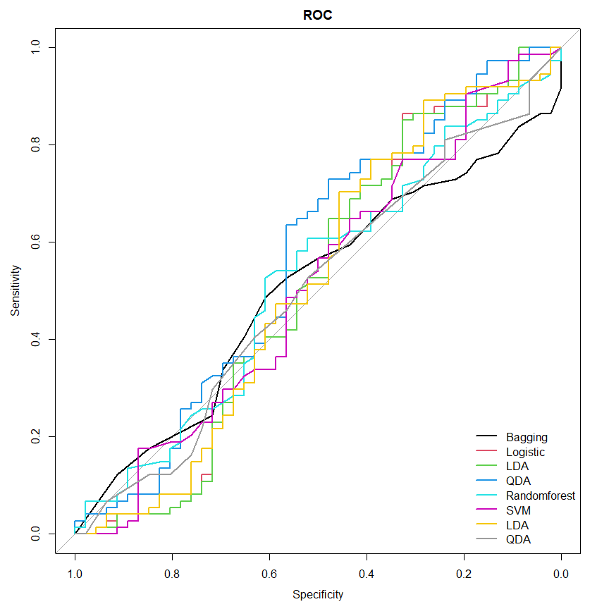

------------------------------------------------------------------------

------------------------------------------------------------------------

## Read data

``` r
Data <- read.csv(file = file.choose(), header = TRUE)
head(Data)
```

    ##   Sales CompPrice Income Advertising Population Price Age Education US Urban
    ## 1  9.50       138     73          11        276   120  42        17  1     1
    ## 2 11.22       111     48          16        260    83  65        10  1     1
    ## 3 10.06       113     35          10        269    80  59        12  1     1
    ## 4  7.40       117    100           4        466    97  55        14  1     1
    ## 5  4.15       141     64           3        340   128  38        13  0     1
    ## 6 10.81       124    113          13        501    72  78        16  1     0
    ##   ShelveLoc
    ## 1         1
    ## 2         3
    ## 3         2
    ## 4         2
    ## 5         1
    ## 6         1

``` r
FMdat <- Data[, c(9, 6, 7)]
head(FMdat)
```

    ##   US Price Age
    ## 1  1   120  42
    ## 2  1    83  65
    ## 3  1    80  59
    ## 4  1    97  55
    ## 5  0   128  38
    ## 6  1    72  78

``` r
nn <- dim(FMdat)[1]
nn
```

    ## [1] 400

``` r
test_ind <- sample(1:nn, size = 400 * 30 / 100, replace = FALSE)
dtrain <- FMdat[-test_ind, ]
dtest <- FMdat[test_ind, ]
dim(dtrain)
```

    ## [1] 280   3

``` r
dim(dtest)
```

    ## [1] 120   3

``` r
ytest <- dtest$US

acc_error <- function(tab) {
    b <- sum(tab)
    DIM <- dim(tab)
    if (DIM[1] == 2 && DIM[2] == 2) {
    a = tab[1, 1] + tab[2, 2]
    acc = a/b; error = 1 - acc
    result <- c("Acc" = acc, "Error" = error)
    } else {
        a = sum(diag(tab))
        result = c("Acc" = a / b, "Error" = 1 - a/b)
    }
    result
}
```

------------------------------------------------------------------------

------------------------------------------------------------------------

# Classification ————-

------------------------------------------------------------------------

------------------------------------------------------------------------

## 1- SVM Model —————

``` r
library(e1071)

## define Model ------------------
set.seed(444)
Model_Svm <- svm(factor(US) ~ Price + Age, data = dtrain, 
kernel = "radial", gamma = 1.5, 
cost = 1, decision.values = TRUE)
summary(Model_Svm)
```

    ## 
    ## Call:
    ## svm(formula = factor(US) ~ Price + Age, data = dtrain, kernel = "radial", 
    ##     gamma = 1.5, cost = 1, decision.values = TRUE)
    ## 
    ## 
    ## Parameters:
    ##    SVM-Type:  C-classification 
    ##  SVM-Kernel:  radial 
    ##        cost:  1 
    ## 
    ## Number of Support Vectors:  216
    ## 
    ##  ( 120 96 )
    ## 
    ## 
    ## Number of Classes:  2 
    ## 
    ## Levels: 
    ##  0 1

``` r
pred_LABEL_svm <- predict(Model_Svm, newdata = dtest)

cfMat <- table(real = ytest, preds = pred_LABEL_svm)
cfMat
```

    ##     preds
    ## real  0  1
    ##    0  1 45
    ##    1  1 73

``` r
res_svm <- acc_error(cfMat)
res_svm
```

    ##       Acc     Error 
    ## 0.6166667 0.3833333

``` r
pred_SCORE_svm <- attributes(
    predict(Model_Svm, dtest, 
    decision.values = TRUE) )$decision.values
```

------------------------------------------------------------------------

------------------------------------------------------------------------

## 2- Tree Model ——————-

``` r
library(rpart)
library(rpart.plot)
Model_Tree <- rpart(factor(US) ~ Price + Age, 
data = dtrain, parms = list(split = "information"), 
method = "class")

# summary(Model_Tree)
##########################

pred_LABEL_tree <- predict(Model_Tree, dtest, type = "class")
pred_SCORE_tree <- predict(Model_Tree, dtest, type = "prob")[, 2]
cfMat <- table(real = ytest, pred = pred_LABEL_tree)
cfMat
```

    ##     pred
    ## real  0  1
    ##    0 12 34
    ##    1 16 58

``` r
res_tree <- acc_error(cfMat)
res_tree
```

    ##       Acc     Error 
    ## 0.5833333 0.4166667

``` r
rpart.plot(Model_Tree)
```

<!-- -->
*** ***

## 3- Boosting Model —————

``` r
set.seed(123)
library(gbm)
Model_boost <- gbm(US ~ Price + Age, data = dtrain, 
distribution = "bernoulli", 
shrinkage = 0.0001)
pred_SCORE_boost <- predict(Model_boost, 
newdata = dtest, type = "response")
pred_LABEL_boost <- (pred_SCORE_boost > 0.5) / 1
cfMat <- table(real = ytest, 
preds = pred_LABEL_boost)
cfMat
```

    ##     preds
    ## real  1
    ##    0 46
    ##    1 74

``` r
res_boost1 <- acc_error(cfMat)
res_boost1
```

    ##       Acc     Error 
    ## 0.3833333 0.6166667

``` r
## better cutof

library(ROCR)

train_pred <- predict(Model_boost, type = "response")
yt <- dtrain$US
temp1 <- predict(Model_boost, type = "response")
temp2 <- prediction(temp1, yt) 
cost_perf = performance(temp2, "cost")
Cut_p <- cost_perf@x.values[[1]][which.min(cost_perf@y.values[[1]])] 
Cut_p
```

    ## [1] 0.6566555

``` r
pred_LABEL_boost2 <- (pred_SCORE_boost >  Cut_p) / 1 
tab <- table(real = ytest, pred = pred_LABEL_boost2)
tab
```

    ##     pred
    ## real  0  1
    ##    0  3 43
    ##    1  1 73

``` r
res_boost_2 <- acc_error(tab)
res_boost_2
```

    ##       Acc     Error 
    ## 0.6333333 0.3666667

------------------------------------------------------------------------

------------------------------------------------------------------------

## 4- Logistic Model —————–

``` r
set.seed(123)
Model_log <- glm(US ~ Price + Age, data = dtrain,
family = binomial)
pred_SCORE_log <- predict(Model_log, dtest, 
type = "response")
pred_LABEL_log <- (pred_SCORE_log > 0.5) / 1

tab <- table(real = ytest, pred = pred_LABEL_log) 
tab
```

    ##     pred
    ## real  1
    ##    0 46
    ##    1 74

``` r
res_log <- acc_error(tab)
res_log
```

    ##       Acc     Error 
    ## 0.3833333 0.6166667

``` r
## change cutpoint 


temp1 <- predict(Model_log, type = "response")
temp2 <- prediction(temp1, dtrain$US) 
cost_perf = performance(temp2, "cost")
Cut_p <- cost_perf@x.values[[1]][which.min(cost_perf@y.values[[1]])] 
Cut_p
```

    ##        47 
    ## 0.5956299

``` r
pred_LABEL_log2 <- (pred_SCORE_log >  Cut_p) / 1 
tab <- table(real = ytest, pred = pred_LABEL_log2)
tab
```

    ##     pred
    ## real  0  1
    ##    0  4 42
    ##    1  0 74

``` r
res_log_2 <- acc_error(tab)
res_log_2
```

    ##   Acc Error 
    ##  0.65  0.35

------------------------------------------------------------------------

------------------------------------------------------------------------

## 5- QDA Model ————————

``` r
library(MASS)
Model_qda <- qda(US ~ Price + Age, data = dtrain)
pred <- predict(Model_qda, newdata = dtest, 
type = "class")

pred_LABEL_qda <- pred$class
pred_SCORE_qda <- pred$posterior[, 2]
tab <- table(real = ytest, pred = pred_LABEL_qda)
tab
```

    ##     pred
    ## real  0  1
    ##    0  3 43
    ##    1  0 74

``` r
res_qda <- acc_error(tab)
res_qda
```

    ##       Acc     Error 
    ## 0.6416667 0.3583333

    ***
    ***


    ## 6-  RandomForest Model -----------


    ```r
    set.seed(111)
    library(randomForest)

    Model_rf <- randomForest(factor(US) ~ Price + Age, 
    data = dtrain, 
    ntree = 300)
    pred_LABEL_rf <- predict(Model_rf, 
    dtest, type = "response")
    pred_SCORE_rf <- predict(Model_rf, 
    dtest, type = "prob")[, 2]

    tab <- table(real = ytest, 
    preds = pred_LABEL_rf)
    tab

    ##     preds
    ## real  0  1
    ##    0 12 34
    ##    1 15 59

``` r
res_rf <- acc_error(tab)
res_rf
```

    ##       Acc     Error 
    ## 0.5916667 0.4083333

------------------------------------------------------------------------

------------------------------------------------------------------------

## 7- LDA Model ——————-

``` r
library(MASS)
Model_lda <- lda(US ~ Price + Age, data = dtrain)
pred <- predict(Model_lda, newdata = dtest, type = "class")
pred_LABEL_lda <- pred$class
pred_SCORE_lda <- pred$posterior[, 2]
tab <- table(pred_LABEL_lda, ytest)
tab
```

    ##               ytest
    ## pred_LABEL_lda  0  1
    ##              0  0  0
    ##              1 46 74

``` r
res_lda <- acc_error(tab)

res_lda
```

    ##       Acc     Error 
    ## 0.6166667 0.3833333

------------------------------------------------------------------------

------------------------------------------------------------------------

## 8- bagging ——————-

``` r
library(caret)
cvcontrol <- trainControl(method="repeatedcv", number = 5,
                          allowParallel=TRUE)
Model_bag <- train(factor(US) ~ Price + Age, data = dtrain, 
method = "treebag", 
trControl = cvcontrol, 
importance = TRUE) 

Model_bag
```

    ## Bagged CART 
    ## 
    ## 280 samples
    ##   2 predictor
    ##   2 classes: '0', '1' 
    ## 
    ## No pre-processing
    ## Resampling: Cross-Validated (5 fold, repeated 1 times) 
    ## Summary of sample sizes: 224, 225, 224, 223, 224 
    ## Resampling results:
    ## 
    ##   Accuracy   Kappa      
    ##   0.5606038  -0.01540645

``` r
pred_SCORE_bag <- predict(Model_bag, dtest, 
type = "prob")[, '1']

pred_LABEL_bag <- predict(Model_bag, dtest, type = "raw")
tab <- table(real = ytest, pred = pred_LABEL_bag)
tab
```

    ##     pred
    ## real  0  1
    ##    0 10 36
    ##    1 20 54

``` r
res_bag <- acc_error(tab)
res_bag
```

    ##       Acc     Error 
    ## 0.5333333 0.4666667

------------------------------------------------------------------------

------------------------------------------------------------------------

## Results —————

``` r
library(pROC)
roc_bag <- roc(ytest, pred_SCORE_bag)
roc_log <- roc(ytest, pred_SCORE_log)
roc_lda <- roc(ytest, pred_SCORE_lda)
roc_qda <- roc(ytest, pred_SCORE_qda)
roc_rf <- roc(ytest, pred_SCORE_rf)
roc_boost <- roc(ytest, pred_SCORE_boost)
roc_svm <- roc(ytest, pred_SCORE_svm)
roc_tree <- roc(ytest, pred_SCORE_tree)
plot(roc_bag, main = "ROC", col = 1)
plot(roc_log, col = 2, add = T)
plot(roc_lda, col = 3, add = T)
plot(roc_qda, col = 4, add = T)
plot(roc_rf, col = 5, add = T)
plot(roc_boost, col = 6, add = T)
plot(roc_svm, col = 7, add = T)
plot(roc_tree, col = 8, add = T)
legend("bottomright", 
legend = c("Bagging", "Logistic", "LDA", 
"QDA", "Randomforest", "SVM", "LDA", "QDA"), 
col = 1:8, lwd = 2, lty = 1, bty = "n")
```

<!-- -->

``` r
Models <- c("bagging", "logistic", "LDA", "QDA", 
"Randomforest", "Boosting", "SVM", "TREE")

AUC <- c(auc(roc_bag), auc(roc_log), auc(roc_lda), 
auc(roc_qda), auc(roc_rf), auc(roc_boost), auc(roc_svm), 
auc(roc_tree))

ERROR = c(res_bag[2], res_log_2[2], res_lda[2], 
res_qda[2], res_rf[2], res_boost_2[2], res_svm[2], res_tree[2])

data_result <- data.frame(Model = Models, 
AUC = AUC, Error = ERROR)

knitr :: kable(data_result, caption = "RESULTS", align = "c")
```

|    Model     |    AUC    |   Error   |
|:------------:|:---------:|:---------:|
|   bagging    | 0.5051410 | 0.4666667 |
|   logistic   | 0.5133666 | 0.3500000 |
|     LDA      | 0.5127791 | 0.3833333 |
|     QDA      | 0.5653643 | 0.3583333 |
| Randomforest | 0.5242362 | 0.4083333 |
|   Boosting   | 0.5132197 | 0.3666667 |
|     SVM      | 0.5160106 | 0.3833333 |
|     TREE     | 0.5030846 | 0.4166667 |

RESULTS

------------------------------------------------------------------------

------------------------------------------------------------------------

# clustering —————

``` r
library(ISLR)
names(USArrests)
```

    ## [1] "Murder"   "Assault"  "UrbanPop" "Rape"

``` r
dd <- USArrests[c('Assault', "UrbanPop")]
dd2 <- scale(dd)
tail(dd2, 4)
```

    ##                  Assault    UrbanPop
    ## Washington    -0.3091039  0.51537975
    ## West Virginia -1.0770641 -1.83353601
    ## Wisconsin     -1.4130466  0.03177945
    ## Wyoming       -0.1171139 -0.38273510

``` r
distt <- dist(dd2, method = "euclidean")

average_model <- hclust(distt, method = "average")

plot(average_model, hang = -1, 
main = "Dendogram Average Linkage")
```

<!-- -->
