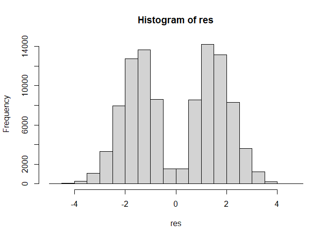
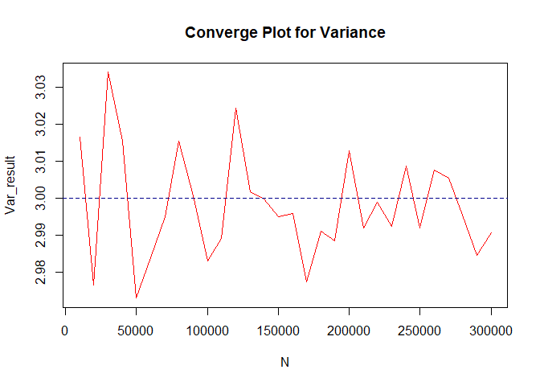

Metropolis-Hastings algorithm
================

> Define a function for generate x from f density function that
> $f(x) \propto x^2 \exp(-x^2/2)$ $$
> \def\innt{\int_{-\infty}^{+\infty}}
> \begin{aligned}
> \mathcal{E}(X) = \innt xf(x)dx &=\\ 
> & \int_{-\infty}^{+\infty}x \times x^2 \times c\times\exp(-x^2/2)dx = \\
> & c\times \sqrt{2\pi}\times \innt x^3 \times \frac{1}{\sqrt{2\pi}}\exp(-x^2/2)dx \\
> & = 0, 
> \end{aligned}
> $$

$$
  \def\innt{\int_{-\infty}^{+\infty}}
  \begin{aligned}
  \text{Var}(X) = \innt c \times x^4\exp(-x^2/2)dx &=\\
  & \sqrt{2\pi} \times c \innt x^4 \times \frac{1}{\sqrt{2\pi}}\exp(-x^2/2)dx= \\
  & \sqrt{2\pi}\times c\times \mathcal{E}(Y^4) ~~s.t~ Y \sim N(0, 1) \\
  & \mathcal{E}(Y^4) = \mathcal{E}((Y^2)^2), ~~\text{if} ~~~ V = Y^2 \implies \\
  & V \sim \chi^2_{(1)} \implies \mathcal{E}((Y^2)^2) = \mathcal{E}(V^2) = \\ 
  & \text{Var}(V) + \mathcal{E}(V)^2 = 2 + 1 = 3 \implies \\
  & \text{Var}(X) = 3 + c \times \sqrt{2\pi} \\
  & c = ?, ~~\innt f(x) dx = 1 \implies \\
  & \innt c\times  x^2 \exp(-x^2)dx=1 \implies
  c = \frac{1}{\sqrt{2\pi}}
  \end{aligned}
  $$

$$
  \implies \text{Var}(X) = 3, ~~\mathcal{E}(X) = 0.
  $$

``` r
## define a function that 
## generate random sample with mcmc method
mcmc_generate <- function(n, tau = 2, x_init = 1){
  den_x <- function(x) x^2 * exp(-x^2/2)
  i = 1
  gen_mcmc <- c()
  gen_mcmc[1] <- x_init
  while(i < n){
    temp <- rnorm(1, x_init, sqrt(tau))
    ratio <- den_x(temp)/den_x(x_init)
    x_init <- ifelse(ratio >= 1, temp, sample(
    c(x_init, temp), size = 1, 
    prob = c(1-ratio, ratio)))
    i = i + 1
    gen_mcmc[i] <- x_init
  }
  return(gen_mcmc)
}

## generate a random sample 
n <- 1e+5
res <- mcmc_generate(n = n)
var(res)
```

    ## [1] 3.032806

``` r
mean(res)
```

    ## [1] -0.02009365

``` r
hist(res)
```

<!-- -->

``` r
n2 <- 1e+6
tau2 <- 1.5
x_init2 = 0
res2 <- mcmc_generate(n2, tau2, x_init2)

var(res2)
```

    ## [1] 3.000335

``` r
mean(res2)
```

    ## [1] -0.006530159

``` r
hist(res2)
```

<!-- -->

``` r
tau3 <- 1
res3 <- mcmc_generate(n2, tau3, x_init2)

var(res3)
```

    ## [1] 2.994389

``` r
mean(res3)
```

    ## [1] 0.02791776

``` r
hist(res3)
```

<!-- -->

``` r
tau4 <- .75
res4 <- mcmc_generate(n2, tau3, x_init2)

var(res4)
```

    ## [1] 3.001354

``` r
mean(res4)
```

    ## [1] 0.004070809

``` r
hist(res4)
```

<!-- -->

``` r
N <- seq(1e+4, 3e+5, 1e+4)

dfun <- function(x) mean(mcmc_generate(x, tau = 1, x_init = 0))
dfun2 <- function(x) var(mcmc_generate(x, tau = 1, x_init = 0))
Mean_result <- unlist(lapply(N, dfun))
Var_result <- unlist(lapply(N, dfun2))
plot(x = N, y = Mean_result, type = "l", col = "red", main = "Converge Plot for Mean")
abline(h = 0, type = 2, col = "darkblue", lwd = 1.5)
```

<!-- -->

``` r
plot(x = N, y = Var_result, type = "l", col = "red", main = "Converge Plot for Variance")
abline(h = 3, type = 2, col = "darkblue", lwd = 1.5)
```

<!-- -->
