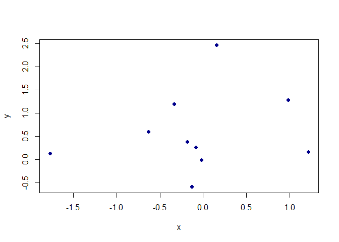

<div dir = "rtl", style = "font-size = 50px; 
font-family: B Nazanin;"> 
&#10;<b>
<address> 
<p style = "color: green;"> عنوان:‌ آموزش فارسی آرمارکداون</p> 
<br>
<p style = "color: red;"> مدرس:‌ حبیب عزت‌آبادی‌پور </p> 
</address>
<br><br> 
<hr><hr>
<br>
&#10;
</div>
<div dir = "rtl", style = "color: red; font-size: 20px"> 
<b>
سلام این متن برای شروع هست. 
</b>
</div>

<br><br>

<div dir = "rtl", style = "color: blue; font-family: B Nazanin; font-size = 40px">
<ol>
<li> گزینه ۱ </li>
<li> گزینه ۲ </li> 
</ol>
</div>
<div dir = "rtl", style = "font-family: B Nazanin; font-size: 25px;">
این سایت من هست:‌ 
<a href = "https://stats9.github.io/"> mywebsite </a> 
</div>
<div dir = "rtl", style = "font-size: 25px; font-family: B Nazanin;">
برای ارتباط با من می‌توانید به این آدرس ایمیل بزنید:‌ <a href = "mailto: habibezati99@gmail.com"> send email </a>
</div>

``` r
x <- rnorm(10); y <- rnorm(10)
plot(x, y, pch = 16, size = 3, col = "darkblue")
```

    ## Warning in plot.window(...): "size" is not a graphical parameter

    ## Warning in plot.xy(xy, type, ...): "size" is not a graphical parameter

    ## Warning in axis(side = side, at = at, labels = labels, ...): "size" is not a
    ## graphical parameter

    ## Warning in axis(side = side, at = at, labels = labels, ...): "size" is not a
    ## graphical parameter

    ## Warning in box(...): "size" is not a graphical parameter

    ## Warning in title(...): "size" is not a graphical parameter

<!-- -->
