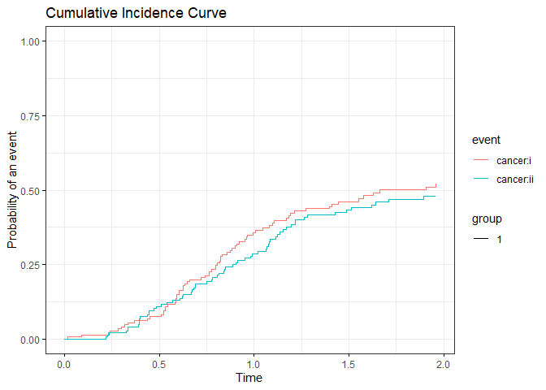
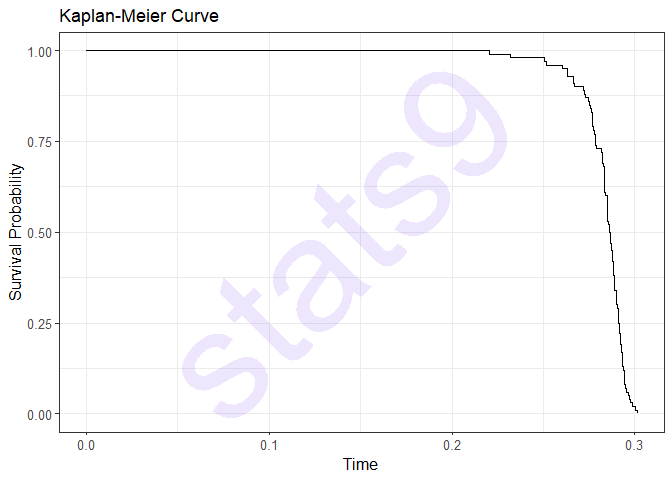
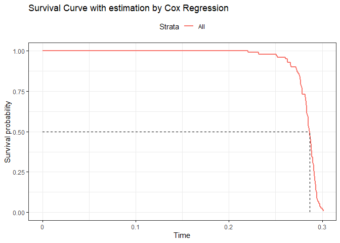
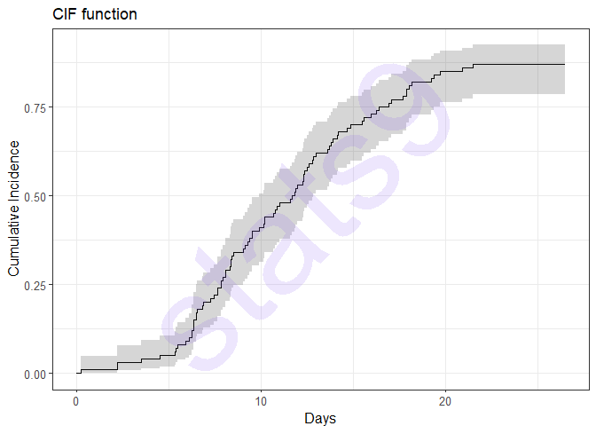
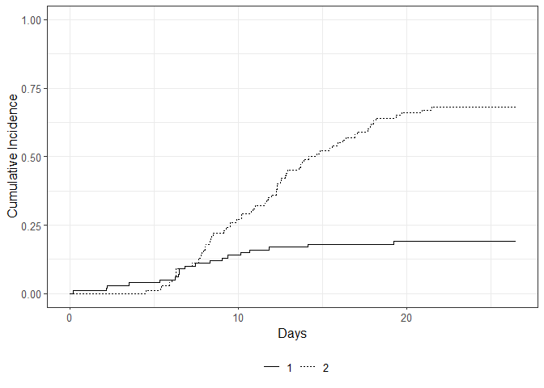
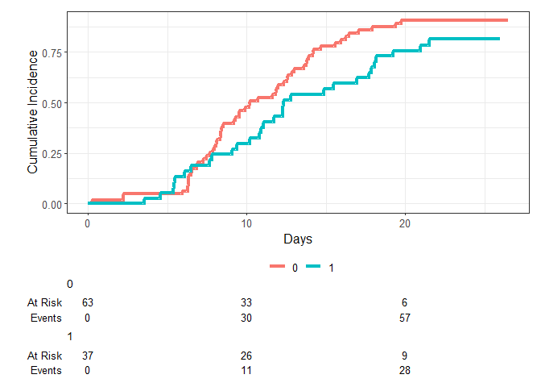
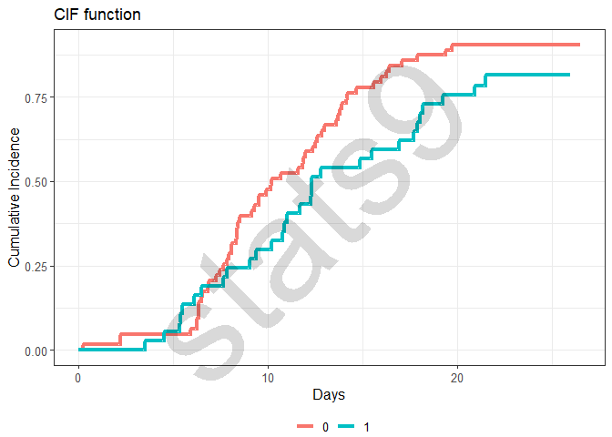

# Competing Risks
Habib Ezzatabadi

## First, we simulate a data set

``` r
if(!require(data.table)) {
    chooseCRANmirror(graphics = F, ind = 1)
    install.packages("data.table")
    library(data.table)
}

if(!require(simstudy)) {
    chooseCRANmirror(graphics = F, ind = 1)
    install.packages("simstudy")
    library(simstudy)
}


d1 <- defData(varname = "x1", formula = 0.4, variance = 2, 
                dist = "gamma", id = "id") ## add covariate i
d1 <- d1 |> defData(varname = "x2", formula = 2, variance = 2, 
                        dist = "gamma") ## add covariate ii
ds <- defSurv(varname = "cancer:i", formula = "-0.5 - 0.1 * x1", shape = 0.5) ## add event i
ds <- ds |> defSurv(varname = "cancer:ii", formula = "-0.3 - 0.1 * x2", shape = 0.5) ## add event ii
ds <- ds |> defSurv(varname = "censor", formula = "-2 + 0.2 * x1 - 0.3 * x2", shape = 0.5) ## add event iii
set.seed(99)
n <- 150
dtCov <- genData(n, d1)
dtSurv <- genSurv(dtCov, ds)

cmpData <- addCompRisk(dtSurv, c("cancer:ii", "cancer:i", "censor"), 
                        timeName = "time", censorName = "censor", 
                        keepEvents = FALSE) ## Generate Data
cmpData |> head(10)
```

        id           x1           x2  time event      type
     1:  1 3.833831e-01 7.059194e-06 1.486     1 cancer:ii
     2:  2 1.440109e-01 2.868624e-01 0.230     2  cancer:i
     3:  3 4.213278e-02 3.203157e-01 0.993     2  cancer:i
     4:  4 1.436273e-01 1.670786e-01 1.065     1 cancer:ii
     5:  5 1.072374e-02 8.261382e-01 1.214     2  cancer:i
     6:  6 5.824398e-02 3.172700e+00 0.904     1 cancer:ii
     7:  7 6.707260e-01 1.552241e+00 0.227     1 cancer:ii
     8:  8 4.119875e-05 4.124914e+00 1.263     1 cancer:ii
     9:  9 1.559356e-06 3.420855e+00 0.964     2  cancer:i
    10: 10 2.804616e-01 2.864431e+00 0.317     2  cancer:i

``` r
cmpData |> _$type |> table() ## table of Events
```


     cancer:i cancer:ii    censor 
           70        64        16 

``` r
## Generate CIF curve 
if(!require(survminer)) {
    chooseCRANmirror(graphics = F, ind = 1)
    install.packages("survminer")
    library(survminer)
}

if(!require(cmprsk)) {
    chooseCRANmirror(graphics = F, ind = 1)
    install.packages("cmprsk")
    library(cmprsk)
}

CIF_Model <- cuminc(ftime = cmpData$time, 
                    fstatus = cmpData$type, 
                    cencode = "censor")
ggcompetingrisks(fit = CIF_Model, 
                multiple_panels = FALSE, 
                xlab = "Time", 
                title = "Cumulative Incidence Curve", 
                ylim = c(0, 1), 
                ggtheme = theme_bw())
```



------------------------------------------------------------------------

------------------------------------------------------------------------

``` r
if (! require(simsurv))  {
    chooseCRANmirror(graphics = F, ind = 1)
    install.packages("simsurv")
    library(simsurv)
}
```

    Loading required package: simsurv

``` r
if (! require(survsim))  {
    chooseCRANmirror(graphics = F, ind = 1)
    install.packages("survsim")
    library(survsim)
}
```

    Loading required package: survsim

    Warning in library(package, lib.loc = lib.loc, character.only = TRUE,
    logical.return = TRUE, : there is no package called 'survsim'

    Installing package into 'C:/Users/habib/AppData/Local/R/win-library/4.3'
    (as 'lib' is unspecified)

    also installing the dependency 'eha'

    package 'eha' successfully unpacked and MD5 sums checked
    package 'survsim' successfully unpacked and MD5 sums checked

    The downloaded binary packages are in
        C:\Users\habib\AppData\Local\Temp\RtmpUVJH8T\downloaded_packages

    Warning: package 'survsim' was built under R version 4.3.2

    Loading required package: eha

    Warning: package 'eha' was built under R version 4.3.2

    Loading required package: statmod

``` r
if (! require(tidyverse))  {
    chooseCRANmirror(graphics = F, ind = 1)
    install.packages("tidyverse")
    library(tidyverse)
}
```

    Loading required package: tidyverse

    ── Attaching core tidyverse packages ──────────────────────── tidyverse 2.0.0 ──
    ✔ dplyr     1.1.2     ✔ readr     2.1.4
    ✔ forcats   1.0.0     ✔ stringr   1.5.0
    ✔ lubridate 1.9.2     ✔ tibble    3.2.1
    ✔ purrr     1.0.1     ✔ tidyr     1.3.0
    ── Conflicts ────────────────────────────────────────── tidyverse_conflicts() ──
    ✖ dplyr::between()     masks data.table::between()
    ✖ dplyr::filter()      masks stats::filter()
    ✖ dplyr::first()       masks data.table::first()
    ✖ lubridate::hour()    masks data.table::hour()
    ✖ lubridate::isoweek() masks data.table::isoweek()
    ✖ dplyr::lag()         masks stats::lag()
    ✖ dplyr::last()        masks data.table::last()
    ✖ lubridate::mday()    masks data.table::mday()
    ✖ lubridate::minute()  masks data.table::minute()
    ✖ lubridate::month()   masks data.table::month()
    ✖ lubridate::quarter() masks data.table::quarter()
    ✖ lubridate::second()  masks data.table::second()
    ✖ purrr::transpose()   masks data.table::transpose()
    ✖ lubridate::wday()    masks data.table::wday()
    ✖ lubridate::week()    masks data.table::week()
    ✖ lubridate::yday()    masks data.table::yday()
    ✖ lubridate::year()    masks data.table::year()
    ℹ Use the conflicted package (<http://conflicted.r-lib.org/>) to force all conflicts to become errors

``` r
if(! require(ggsurvfit)) {
    chooseCRANmirror(graphics = F, ind = 1)
    install.packages("ggsurvfit")
    library(ggsurvfit)
}
```

    Loading required package: ggsurvfit

``` r
if (! require (gtsummary)) {
    chooseCRANmirror(graphics = F, ind = 1)
    install.packages("gtsummary")
    library(gtsummary)
}
```

    Loading required package: gtsummary

``` r
if (! require (tidycmprsk)) {
    chooseCRANmirror(graphics = F, ind = 1)
    install.packages("tidycmprsk")
    library(tidycmprsk)
}
```

    Loading required package: tidycmprsk

    Attaching package: 'tidycmprsk'

    The following object is masked from 'package:gtsummary':

        trial

    The following objects are masked from 'package:cmprsk':

        crr, cuminc

``` r
if (! require (condSURV)) {
    chooseCRANmirror(graphics = F, ind = 1)
    install.packages("condSURV")
    library(condSURV)
}
```

    Loading required package: condSURV

``` r
library(survival)
if (! require(survminer)) {
    chooseCRANmirror(graphics = F, ind = 1)
    install.packages("survminer")
    library(survminer)
}

if (! require(magick)) {
    chooseCRANmirror(graphics = F, ind = 1)
    install.packages("magick")
    library(magick)
}
```

    Loading required package: magick
    Linking to ImageMagick 6.9.12.3
    Enabled features: cairo, freetype, fftw, ghostscript, heic, lcms, pango, raw, rsvg, webp
    Disabled features: fontconfig, x11

``` r
if (! require(cowplot)) {
    chooseCRANmirror(graphics = F, ind = 1)
    install.packages("cowplot")
    library(cowplot)
}
```

    Loading required package: cowplot

    Attaching package: 'cowplot'

    The following object is masked from 'package:lubridate':

        stamp

    The following object is masked from 'package:ggpubr':

        get_legend

``` r
if (! require(finalfit)) {
    chooseCRANmirror(graphics = F, ind = 1)
    install.packages("finalfit")
    library(finalfit)
}
```

    Loading required package: finalfit

    Warning in library(package, lib.loc = lib.loc, character.only = TRUE,
    logical.return = TRUE, : there is no package called 'finalfit'

    Installing package into 'C:/Users/habib/AppData/Local/R/win-library/4.3'
    (as 'lib' is unspecified)
    also installing the dependencies 'ucminf', 'ordinal', 'pan', 'jomo', 'mitml', 'bdsmatrix', 'mice'

    package 'ucminf' successfully unpacked and MD5 sums checked
    package 'ordinal' successfully unpacked and MD5 sums checked
    package 'pan' successfully unpacked and MD5 sums checked
    package 'jomo' successfully unpacked and MD5 sums checked
    package 'mitml' successfully unpacked and MD5 sums checked
    package 'bdsmatrix' successfully unpacked and MD5 sums checked
    package 'mice' successfully unpacked and MD5 sums checked
    package 'finalfit' successfully unpacked and MD5 sums checked

    The downloaded binary packages are in
        C:\Users\habib\AppData\Local\Temp\RtmpUVJH8T\downloaded_packages

    Warning: package 'finalfit' was built under R version 4.3.2

``` r
if (! require(ggpubr)) {
    chooseCRANmirror(graphics = F, ind = 1)
    install.packages("ggpubr")
    library(ggpubr)
}

if (! require(png)) {
    chooseCRANmirror(graphics = F, ind = 1)
    install.packages("png")
    library(png)
}
```

    Loading required package: png

``` r
if (! require(ggimage)) {
    chooseCRANmirror(graphics = F, ind = 1)
    install.packages("ggimage")
    library(ggimage)
}
```

    Loading required package: ggimage

    Warning in library(package, lib.loc = lib.loc, character.only = TRUE,
    logical.return = TRUE, : there is no package called 'ggimage'

    Installing package into 'C:/Users/habib/AppData/Local/R/win-library/4.3'
    (as 'lib' is unspecified)
    also installing the dependencies 'gridGraphics', 'yulab.utils', 'ggfun', 'ggplotify'


      There is a binary version available but the source version is later:
                binary source needs_compilation
    yulab.utils  0.1.0  0.1.1             FALSE

    package 'gridGraphics' successfully unpacked and MD5 sums checked
    package 'ggfun' successfully unpacked and MD5 sums checked
    package 'ggplotify' successfully unpacked and MD5 sums checked
    package 'ggimage' successfully unpacked and MD5 sums checked

    The downloaded binary packages are in
        C:\Users\habib\AppData\Local\Temp\RtmpUVJH8T\downloaded_packages

    installing the source package 'yulab.utils'

    Warning: package 'ggimage' was built under R version 4.3.2


    Attaching package: 'ggimage'

    The following object is masked from 'package:cowplot':

        theme_nothing

    The following object is masked from 'package:ggpubr':

        theme_transparent

## Simulate Data

``` r
## use simsurv package
set.seed(215)
nsim = 100
Treat <- rbinom(n = nsim, size = 1, prob = 0.55)
bp <- rnorm(n = nsim, mean = 120, sd = 2)
dat <- data.frame(treat = Treat, bp = bp)
betas = data.frame(lambda = rep(4, nsim), beta1 = rep(2, nsim), beta2 = rep(-3, nsim))
hAzard <- function(t, x, betas) t ** betas[['lambda']] * exp(-betas['lambda'] * t ** betas[['lambda']] * (betas[['beta1']] * x[['treat']] + betas[['beta2']]*x[['bp']]))

Time <- simsurv(hazard = hAzard, x = dat, betas = betas, maxt = 2, seed = 215)

Data <- data.frame(id = Time$id, Event_time = Time$eventtime, Status = Time$status, 
                    Group = dat$treat, bp = dat$bp)
# save(Data, file = "Data.RData")
# load("Data.RData")
knitr :: kable(Data, caption = "Simulated Data", align = "c")
```

| id  | Event_time | Status | Group |    bp    |
|:---:|:----------:|:------:|:-----:|:--------:|
|  1  | 0.2831470  |   1    |   0   | 118.7824 |
|  2  | 0.2870629  |   1    |   1   | 123.5056 |
|  3  | 0.2915740  |   1    |   1   | 122.6091 |
|  4  | 0.2720246  |   1    |   0   | 120.1885 |
|  5  | 0.2661488  |   1    |   0   | 123.5121 |
|  6  | 0.2787193  |   1    |   0   | 117.6145 |
|  7  | 0.2666844  |   1    |   0   | 120.8736 |
|  8  | 0.2762620  |   1    |   0   | 119.6373 |
|  9  | 0.2908718  |   1    |   1   | 121.1187 |
| 10  | 0.2917171  |   1    |   1   | 121.6618 |
| 11  | 0.2847885  |   1    |   0   | 114.5974 |
| 12  | 0.2831202  |   1    |   0   | 118.1978 |
| 13  | 0.2780252  |   1    |   0   | 117.2078 |
| 14  | 0.2836996  |   1    |   0   | 119.8045 |
| 15  | 0.2962747  |   1    |   1   | 120.1198 |
| 16  | 0.2847364  |   1    |   0   | 118.5901 |
| 17  | 0.2899293  |   1    |   1   | 121.2846 |
| 18  | 0.2923437  |   1    |   1   | 119.0993 |
| 19  | 0.2901060  |   1    |   1   | 122.2343 |
| 20  | 0.2925414  |   1    |   1   | 120.6156 |
| 21  | 0.2945615  |   1    |   1   | 115.4500 |
| 22  | 0.2870913  |   1    |   1   | 121.6601 |
| 23  | 0.2928195  |   1    |   1   | 121.1790 |
| 24  | 0.2769504  |   1    |   0   | 115.8367 |
| 25  | 0.2730274  |   1    |   0   | 123.0457 |
| 26  | 0.2783625  |   1    |   0   | 122.2174 |
| 27  | 0.2864162  |   1    |   1   | 117.4068 |
| 28  | 0.2723059  |   1    |   0   | 120.0025 |
| 29  | 0.2318162  |   1    |   0   | 119.0873 |
| 30  | 0.2850301  |   1    |   1   | 120.4517 |
| 31  | 0.2912149  |   1    |   1   | 119.0293 |
| 32  | 0.2889599  |   1    |   1   | 120.4829 |
| 33  | 0.2661675  |   1    |   0   | 121.4678 |
| 34  | 0.2907613  |   1    |   1   | 119.8860 |
| 35  | 0.2930568  |   1    |   1   | 119.0227 |
| 36  | 0.2829282  |   1    |   0   | 120.5321 |
| 37  | 0.2753554  |   1    |   0   | 119.0989 |
| 38  | 0.2851077  |   1    |   0   | 118.7805 |
| 39  | 0.2766302  |   1    |   0   | 119.1626 |
| 40  | 0.2886716  |   1    |   1   | 117.3817 |
| 41  | 0.2767017  |   1    |   0   | 122.9102 |
| 42  | 0.2887925  |   1    |   1   | 120.1439 |
| 43  | 0.2886678  |   1    |   1   | 116.4764 |
| 44  | 0.2518405  |   1    |   0   | 120.8922 |
| 45  | 0.2783647  |   1    |   0   | 116.4071 |
| 46  | 0.2832483  |   1    |   0   | 120.6314 |
| 47  | 0.2629432  |   1    |   0   | 121.5432 |
| 48  | 0.2929610  |   1    |   1   | 118.3225 |
| 49  | 0.2904551  |   1    |   1   | 123.3313 |
| 50  | 0.2506636  |   1    |   0   | 120.7030 |
| 51  | 0.2944712  |   1    |   1   | 119.1777 |
| 52  | 0.2882800  |   1    |   1   | 121.5652 |
| 53  | 0.2937087  |   1    |   1   | 120.3608 |
| 54  | 0.2972915  |   1    |   1   | 117.2548 |
| 55  | 0.2921645  |   1    |   1   | 117.6119 |
| 56  | 0.2605294  |   1    |   0   | 118.8852 |
| 57  | 0.2835906  |   1    |   0   | 120.8053 |
| 58  | 0.2911239  |   1    |   1   | 124.2336 |
| 59  | 0.2940637  |   1    |   1   | 123.5864 |
| 60  | 0.2943027  |   1    |   1   | 121.0739 |
| 61  | 0.2975985  |   1    |   1   | 119.3134 |
| 62  | 0.2930153  |   1    |   1   | 117.4388 |
| 63  | 0.2867399  |   1    |   1   | 122.5835 |
| 64  | 0.3000913  |   1    |   1   | 120.5661 |
| 65  | 0.2766958  |   1    |   0   | 119.3487 |
| 66  | 0.2860499  |   1    |   1   | 119.9845 |
| 67  | 0.2865516  |   1    |   1   | 124.4966 |
| 68  | 0.2933163  |   1    |   1   | 121.6182 |
| 69  | 0.2630550  |   1    |   0   | 117.4809 |
| 70  | 0.2884590  |   1    |   1   | 118.1928 |
| 71  | 0.2881249  |   1    |   1   | 122.0036 |
| 72  | 0.2757619  |   1    |   0   | 121.2712 |
| 73  | 0.2881855  |   1    |   1   | 119.9429 |
| 74  | 0.3012147  |   1    |   1   | 120.8100 |
| 75  | 0.2820208  |   1    |   0   | 119.8107 |
| 76  | 0.2824233  |   1    |   0   | 119.9392 |
| 77  | 0.2835017  |   1    |   0   | 120.6774 |
| 78  | 0.2951467  |   1    |   1   | 118.3332 |
| 79  | 0.2901709  |   1    |   1   | 120.4405 |
| 80  | 0.2835298  |   1    |   0   | 120.4463 |
| 81  | 0.2851609  |   1    |   1   | 120.4970 |
| 82  | 0.2984053  |   1    |   1   | 119.6058 |
| 83  | 0.2877594  |   1    |   1   | 118.4483 |
| 84  | 0.2919797  |   1    |   1   | 117.1736 |
| 85  | 0.2203936  |   1    |   0   | 117.7169 |
| 86  | 0.2878335  |   1    |   1   | 119.6105 |
| 87  | 0.2897571  |   1    |   1   | 119.1562 |
| 88  | 0.2848880  |   1    |   1   | 120.8048 |
| 89  | 0.2858681  |   1    |   1   | 121.5320 |
| 90  | 0.2815487  |   1    |   0   | 122.3064 |
| 91  | 0.2784988  |   1    |   0   | 119.7317 |
| 92  | 0.2916191  |   1    |   1   | 120.5927 |
| 93  | 0.2835070  |   1    |   0   | 118.6690 |
| 94  | 0.2945079  |   1    |   1   | 119.4637 |
| 95  | 0.2822320  |   1    |   0   | 121.7699 |
| 96  | 0.2775012  |   1    |   0   | 117.8080 |
| 97  | 0.2744275  |   1    |   0   | 120.5413 |
| 98  | 0.2851963  |   1    |   1   | 119.6668 |
| 99  | 0.2877685  |   1    |   1   | 119.3109 |
| 100 | 0.2855907  |   1    |   1   | 120.7537 |

Simulated Data

## estimate survival function with Kaplan Meier

``` r
y <- with(Data, {Surv(Event_time, Status)})
Model1 <- survfit(y ~ 1, data = Data)
Model2 <- coxph(y ~ 1, Data)


P1 <- ggsurvplot(Model1, 
conf.int = FALSE, 
conf.int.style = "step",
ggtheme = theme_bw(), 
surv.median.line = "hv", 
log.rank.weights = "1", 
data = Data,
colour = "darkblue") + 
labs(title = "Kaplan-Meier Curve")


P11 = ggsurvfit(Model1) + labs(title = "Kaplan-Meier Curve")


P2 <- ggsurvplot(survfit(Model2), 
conf.int = FALSE, 
conf.int.style = "step",
ggtheme = theme_bw(), 
surv.median.line = "hv", 
log.rank.weights = "1", 
data = Data) 
ggdraw(P11) + draw_label("stats9", colour = "#8557f180", size = 120, angle = 45, alpha = 0.3)
```



``` r
print(P2 + labs(title = "Survival Curve with estimation by Cox Regression"))
```



``` r
sim.data <- crisk.sim(n=50, foltime=100, dist.ev=c("lnorm","lnorm"),
anc.ev=c(1.479687, 0.5268302),beta0.ev=c(3.80342, 2.535374),dist.cens="lnorm",
anc.cens=1.242733,beta0.cens=5.421748,z=list(c("unif", 0.8,1.2), c("unif", 0.9, 1.5)), 
beta=list(c(0.1698695,0.0007010932),c(0.3735146,0.5591244)), 
x=list(c("bern", 0.381), c("bern", 0.564)), nsit=2)
sim.data
```

       nid cause      time status start stop         z x x
    1    1     2 17.566916      1    NA   NA 1.2996806 0 1
    2    2     1  9.144114      1    NA   NA 1.4406752 1 0
    3    3     1  6.053499      1    NA   NA 1.4216204 1 0
    4    4     2 11.880328      1    NA   NA 1.1250254 0 1
    5    5     2 12.187503      1    NA   NA 1.2612487 1 0
    6    6     1  1.914634      1    NA   NA 1.2983101 0 0
    7    7     1 18.344503      1    NA   NA 1.0820495 1 1
    8    8     1 18.844140      1    NA   NA 1.3979852 0 1
    9    9     2 21.031556      1    NA   NA 1.1589581 1 1
    10  10     2  8.041459      1    NA   NA 0.9155355 0 1
    11  11     2 23.169129      1    NA   NA 1.1456129 1 1
    12  12     2  6.310398      1    NA   NA 1.2366507 0 0
    13  13     2 14.190296      1    NA   NA 1.4805237 1 0
    14  14     1 14.141090      1    NA   NA 0.9203721 0 1
    15  15     2 12.700982      1    NA   NA 1.4266629 1 0
    16  16     2 12.928231      1    NA   NA 1.0374441 0 0
    17  17     1 24.881794      1    NA   NA 1.4215218 0 1
    18  18     2 25.327040      1    NA   NA 1.1616307 0 1
    19  19     2  9.888768      1    NA   NA 1.2680990 0 0
    20  20     2 20.602132      1    NA   NA 1.1910824 1 1
    21  21     2  6.872147      1    NA   NA 1.3194465 0 1
    22  22     2 23.283217      1    NA   NA 1.0266451 0 1
    23  23     2 11.549036      1    NA   NA 1.3589483 1 0
    24  24     2  9.089599      1    NA   NA 1.1631727 0 1
    25  25     2 12.581819      1    NA   NA 1.2049696 0 0
    26  26     2 16.883626      1    NA   NA 1.3831870 1 1
    27  27     2  9.399110      1    NA   NA 1.1155031 1 0
    28  28     2 14.304240      1    NA   NA 1.4475093 1 1
    29  29     2 13.207417      1    NA   NA 1.1485627 0 0
    30  30     2 17.907312      1    NA   NA 1.1887933 0 1
    31  31    NA 33.900826      0    NA   NA 1.2226458 0 1
    32  32     1  4.718489      1    NA   NA 1.3625043 0 1
    33  33     2 29.142591      1    NA   NA 1.1730198 1 1
    34  34     2 35.106371      1    NA   NA 1.4570375 0 1
    35  35     1  8.512981      1    NA   NA 1.0205416 0 0
    36  36     1 11.680270      1    NA   NA 1.1636737 0 0
    37  37     2 12.664493      1    NA   NA 1.2104265 0 1
    38  38     1  1.841885      1    NA   NA 0.9036153 0 1
    39  39     2 16.612602      1    NA   NA 1.0950169 1 1
    40  40     2 11.157349      1    NA   NA 1.2851827 1 1
    41  41     2 15.086842      1    NA   NA 1.1670670 1 1
    42  42     2 21.343998      1    NA   NA 1.2875512 0 1
    43  43     2 24.511143      1    NA   NA 1.3150898 0 1
    44  44     2  9.932074      1    NA   NA 1.1803035 0 0
    45  45     2  9.142281      1    NA   NA 1.4490501 0 0
    46  46     2 14.045759      1    NA   NA 1.0305762 1 0
    47  47     2 18.852254      1    NA   NA 1.1675988 1 1
    48  48     2 16.341113      1    NA   NA 1.0174923 0 1
    49  49     2 12.546048      1    NA   NA 1.4403418 0 0
    50  50     1  9.571717      1    NA   NA 1.1108137 1 0

``` r
set.seed(125)
dat_sim <- crisk.sim(n = 100, foltime=50, dist.ev=c("lnorm","lnorm"),
anc.ev=c(1.479687, 0.5268302), beta0.ev=c(3.80342, 2.535374), dist.cens = "lnorm",
anc.cens = 0.1, beta0.cens = 3.2,  
beta = list(c(0.1698695, 0.0007010932), c(0.02, 0.03)), 
x=list(c("bern", 0.381), c("normal", 2, .5)), nsit = 2)
Nc <- ncol(dat_sim)

dat1 <- dat_sim %>% data.frame %>% .[, 1:9] %>%
mutate(cause = case_when(is.na(cause) ~ 0, 
.default = cause), start = NULL, stop = NULL, z = NULL) %>% 
rename(x2 = x.1, x1 = x) %>%
mutate(cause = as.factor(cause), status = as.factor(status)) 

dat1
```

        nid cause       time status x1        x2
    1     1     0 23.6469298      0  1 1.4045617
    2     2     2  9.5188516      1  0 2.1978594
    3     3     2 17.0677212      1  0 1.9044434
    4     4     2 17.6949227      1  1 2.2392401
    5     5     1 10.6768853      1  0 0.7554941
    6     6     2 15.5850330      1  0 1.2192442
    7     7     2 12.7918543      1  1 1.6973328
    8     8     2 15.9483636      1  0 2.1812150
    9     9     1 19.2508430      1  1 0.9178099
    10   10     0 26.4848351      0  0 1.5528831
    11   11     2 16.9374451      1  1 2.7098905
    12   12     2  7.6674046      1  0 1.1361626
    13   13     2 21.5090013      1  1 2.4941006
    14   14     0 23.3803343      0  0 1.5946054
    15   15     2  9.5346432      1  0 1.5994946
    16   16     1  0.2273843      1  0 2.5300140
    17   17     1  3.5107461      1  1 1.8812839
    18   18     1  9.3738355      1  1 2.0901154
    19   19     2  8.3753034      1  0 1.7501146
    20   20     2 15.4619429      1  1 2.7132329
    21   21     0 25.9759448      0  1 1.5870719
    22   22     0 24.2581294      0  1 1.3952082
    23   23     2 13.8207573      1  0 2.0124488
    24   24     2 16.4132361      1  0 1.9153908
    25   25     2 18.1821372      1  1 1.7533894
    26   26     2 11.8154080      1  0 2.7552138
    27   27     1  6.2633691      1  0 1.8919283
    28   28     1  6.8365338      1  0 2.4263684
    29   29     1  8.3262496      1  0 1.2119145
    30   30     2 12.5831181      1  0 1.9963317
    31   31     2 13.9074061      1  0 1.6862089
    32   32     2 14.8595099      1  1 1.6529990
    33   33     2 11.0330278      1  1 2.1347120
    34   34     2 11.5893792      1  0 1.9520190
    35   35     2 13.7270003      1  0 1.8368999
    36   36     2 11.6882357      1  1 2.8321618
    37   37     2 14.1930555      1  0 2.5009081
    38   38     2  7.6673497      1  1 1.7619049
    39   39     2 19.3960853      1  0 2.2474423
    40   40     2 12.8420018      1  0 1.8688988
    41   41     0 25.3301001      0  1 2.4995549
    42   42     2  6.3261724      1  0 1.6575466
    43   43     2  8.5276641      1  0 2.2800609
    44   44     1  5.3424457      1  1 1.2684571
    45   45     0 25.9687237      0  1 1.4952922
    46   46     2  9.1479794      1  0 2.2429420
    47   47     2 19.7394204      1  0 2.0106020
    48   48     2 10.8888521      1  1 2.0048022
    49   49     2 12.2871655      1  1 2.6245723
    50   50     2  8.3507087      1  0 1.8817518
    51   51     2 17.8898797      1  0 1.6427453
    52   52     2  4.5331704      1  1 1.9719627
    53   53     2  9.2827279      1  0 1.7207520
    54   54     1  6.5177739      1  0 1.5738812
    55   55     0 25.1265989      0  0 2.0248979
    56   56     2  5.3962839      1  1 1.4819843
    57   57     1 14.1454111      1  0 1.4816892
    58   58     2  7.2669252      1  0 2.3033506
    59   59     0 24.7309442      0  0 2.3788324
    60   60     1  2.2018585      1  0 2.4980259
    61   61     0 21.4833194      0  1 1.8390542
    62   62     2  8.4074004      1  0 2.4293479
    63   63     2  9.9066796      1  0 1.8936505
    64   64     1 11.8540010      1  0 1.5763626
    65   65     2  8.0586964      1  0 1.6132198
    66   66     2 12.5092988      1  0 2.2819258
    67   67     1  9.0535913      1  1 2.0224232
    68   68     2  6.2662166      1  0 1.9083266
    69   69     1  6.4683785      1  0 2.8789738
    70   70     1  2.2132601      1  0 2.6889658
    71   71     2 10.2069822      1  1 1.8605354
    72   72     0 21.9845274      0  0 0.7981443
    73   73     2 18.0575791      1  1 1.9644526
    74   74     0 25.2017834      0  1 2.5438691
    75   75     2 12.3406198      1  0 2.6241877
    76   76     2  5.4562401      1  1 3.1436308
    77   77     2  8.0983182      1  0 2.4334877
    78   78     2 14.6579257      1  0 2.2920064
    79   79     2  6.8933469      1  0 2.4445015
    80   80     0 24.9596350      0  0 2.0401346
    81   81     2  6.3231848      1  0 2.9178405
    82   82     2 10.7905963      1  1 2.2443809
    83   83     2 12.9643552      1  0 1.6976369
    84   84     2  7.8559305      1  0 2.1198791
    85   85     2 11.9693553      1  0 1.2855324
    86   86     2 12.2613540      1  1 2.6762396
    87   87     2  7.9442094      1  0 2.3703012
    88   88     2 16.2327319      1  0 1.0969830
    89   89     2  5.9301180      1  0 0.5308951
    90   90     2 20.9383826      1  1 1.5380383
    91   91     2 13.6131421      1  0 1.3306331
    92   92     2 17.8675472      1  1 1.9099749
    93   93     2  7.8167352      1  1 1.8734656
    94   94     1  6.4888722      1  1 1.3777783
    95   95     2  6.0988269      1  1 2.2587147
    96   96     2 10.2058807      1  0 1.7595521
    97   97     1  7.4499051      1  0 1.4985335
    98   98     2  6.3277295      1  0 3.2555294
    99   99     2 12.3030154      1  1 1.7617634
    100 100     1 10.1453242      1  0 1.9595124

## competing risk

``` r
dat1 %>%
cuminc(Surv(time, cause) ~ 1, data = .)  ## tidycmprsk
```

    ── cuminc() ────────────────────────────────────────────────────────────────────

    • Failure type "1"

    time   n.risk   estimate   std.error   95% CI          
    5.00   95       0.040      0.020       0.013, 0.092    
    10.0   59       0.140      0.035       0.080, 0.216    
    15.0   30       0.180      0.039       0.112, 0.262    
    20.0   15       0.190      0.040       0.120, 0.273    
    25.0   6        0.190      0.040       0.120, 0.273    

    • Failure type "2"

    time   n.risk   estimate   std.error   95% CI          
    5.00   95       0.010      0.010       0.001, 0.049    
    10.0   59       0.270      0.045       0.187, 0.360    
    15.0   30       0.520      0.050       0.417, 0.613    
    20.0   15       0.660      0.048       0.557, 0.745    
    25.0   6        0.681      0.047       0.578, 0.764    

``` r
Pcmp <- dat1 %>% 
cuminc(Surv(time, status) ~ 1, data = .) %>% 
  ggcuminc() + 
  labs(
    x = "Days"
  ) + 
  add_confidence_interval() +
  add_risktable()
```

    Plotting outcome "1".

``` r
ggdraw(Pcmp + labs(title = "CIF function")) + draw_label("stats9", colour = "#8557f180", size = 120, angle = 45, alpha = 0.3) 
```



## draw cif seperately for individual groups

``` r
cuminc(Surv(time, cause) ~ 1, data = dat1) %>% 
  ggcuminc(outcome = c("1", "2")) +
  ylim(c(0, 1)) + 
  labs(
    x = "Days"
  )
```



``` r
cuminc(Surv(time, status) ~  x1, data = dat1) %>% 
  tbl_cuminc(
    times = 10.25, 
    label_header = "**{time/365.25}-year cuminc**") %>% 
  add_p()
```

<div id="gspvqslgvb" style="padding-left:0px;padding-right:0px;padding-top:10px;padding-bottom:10px;overflow-x:auto;overflow-y:auto;width:auto;height:auto;">
<style>#gspvqslgvb table {
  font-family: system-ui, 'Segoe UI', Roboto, Helvetica, Arial, sans-serif, 'Apple Color Emoji', 'Segoe UI Emoji', 'Segoe UI Symbol', 'Noto Color Emoji';
  -webkit-font-smoothing: antialiased;
  -moz-osx-font-smoothing: grayscale;
}
&#10;#gspvqslgvb thead, #gspvqslgvb tbody, #gspvqslgvb tfoot, #gspvqslgvb tr, #gspvqslgvb td, #gspvqslgvb th {
  border-style: none;
}
&#10;#gspvqslgvb p {
  margin: 0;
  padding: 0;
}
&#10;#gspvqslgvb .gt_table {
  display: table;
  border-collapse: collapse;
  line-height: normal;
  margin-left: auto;
  margin-right: auto;
  color: #333333;
  font-size: 16px;
  font-weight: normal;
  font-style: normal;
  background-color: #FFFFFF;
  width: auto;
  border-top-style: solid;
  border-top-width: 2px;
  border-top-color: #A8A8A8;
  border-right-style: none;
  border-right-width: 2px;
  border-right-color: #D3D3D3;
  border-bottom-style: solid;
  border-bottom-width: 2px;
  border-bottom-color: #A8A8A8;
  border-left-style: none;
  border-left-width: 2px;
  border-left-color: #D3D3D3;
}
&#10;#gspvqslgvb .gt_caption {
  padding-top: 4px;
  padding-bottom: 4px;
}
&#10;#gspvqslgvb .gt_title {
  color: #333333;
  font-size: 125%;
  font-weight: initial;
  padding-top: 4px;
  padding-bottom: 4px;
  padding-left: 5px;
  padding-right: 5px;
  border-bottom-color: #FFFFFF;
  border-bottom-width: 0;
}
&#10;#gspvqslgvb .gt_subtitle {
  color: #333333;
  font-size: 85%;
  font-weight: initial;
  padding-top: 3px;
  padding-bottom: 5px;
  padding-left: 5px;
  padding-right: 5px;
  border-top-color: #FFFFFF;
  border-top-width: 0;
}
&#10;#gspvqslgvb .gt_heading {
  background-color: #FFFFFF;
  text-align: center;
  border-bottom-color: #FFFFFF;
  border-left-style: none;
  border-left-width: 1px;
  border-left-color: #D3D3D3;
  border-right-style: none;
  border-right-width: 1px;
  border-right-color: #D3D3D3;
}
&#10;#gspvqslgvb .gt_bottom_border {
  border-bottom-style: solid;
  border-bottom-width: 2px;
  border-bottom-color: #D3D3D3;
}
&#10;#gspvqslgvb .gt_col_headings {
  border-top-style: solid;
  border-top-width: 2px;
  border-top-color: #D3D3D3;
  border-bottom-style: solid;
  border-bottom-width: 2px;
  border-bottom-color: #D3D3D3;
  border-left-style: none;
  border-left-width: 1px;
  border-left-color: #D3D3D3;
  border-right-style: none;
  border-right-width: 1px;
  border-right-color: #D3D3D3;
}
&#10;#gspvqslgvb .gt_col_heading {
  color: #333333;
  background-color: #FFFFFF;
  font-size: 100%;
  font-weight: normal;
  text-transform: inherit;
  border-left-style: none;
  border-left-width: 1px;
  border-left-color: #D3D3D3;
  border-right-style: none;
  border-right-width: 1px;
  border-right-color: #D3D3D3;
  vertical-align: bottom;
  padding-top: 5px;
  padding-bottom: 6px;
  padding-left: 5px;
  padding-right: 5px;
  overflow-x: hidden;
}
&#10;#gspvqslgvb .gt_column_spanner_outer {
  color: #333333;
  background-color: #FFFFFF;
  font-size: 100%;
  font-weight: normal;
  text-transform: inherit;
  padding-top: 0;
  padding-bottom: 0;
  padding-left: 4px;
  padding-right: 4px;
}
&#10;#gspvqslgvb .gt_column_spanner_outer:first-child {
  padding-left: 0;
}
&#10;#gspvqslgvb .gt_column_spanner_outer:last-child {
  padding-right: 0;
}
&#10;#gspvqslgvb .gt_column_spanner {
  border-bottom-style: solid;
  border-bottom-width: 2px;
  border-bottom-color: #D3D3D3;
  vertical-align: bottom;
  padding-top: 5px;
  padding-bottom: 5px;
  overflow-x: hidden;
  display: inline-block;
  width: 100%;
}
&#10;#gspvqslgvb .gt_spanner_row {
  border-bottom-style: hidden;
}
&#10;#gspvqslgvb .gt_group_heading {
  padding-top: 8px;
  padding-bottom: 8px;
  padding-left: 5px;
  padding-right: 5px;
  color: #333333;
  background-color: #FFFFFF;
  font-size: 100%;
  font-weight: initial;
  text-transform: inherit;
  border-top-style: solid;
  border-top-width: 2px;
  border-top-color: #D3D3D3;
  border-bottom-style: solid;
  border-bottom-width: 2px;
  border-bottom-color: #D3D3D3;
  border-left-style: none;
  border-left-width: 1px;
  border-left-color: #D3D3D3;
  border-right-style: none;
  border-right-width: 1px;
  border-right-color: #D3D3D3;
  vertical-align: middle;
  text-align: left;
}
&#10;#gspvqslgvb .gt_empty_group_heading {
  padding: 0.5px;
  color: #333333;
  background-color: #FFFFFF;
  font-size: 100%;
  font-weight: initial;
  border-top-style: solid;
  border-top-width: 2px;
  border-top-color: #D3D3D3;
  border-bottom-style: solid;
  border-bottom-width: 2px;
  border-bottom-color: #D3D3D3;
  vertical-align: middle;
}
&#10;#gspvqslgvb .gt_from_md > :first-child {
  margin-top: 0;
}
&#10;#gspvqslgvb .gt_from_md > :last-child {
  margin-bottom: 0;
}
&#10;#gspvqslgvb .gt_row {
  padding-top: 8px;
  padding-bottom: 8px;
  padding-left: 5px;
  padding-right: 5px;
  margin: 10px;
  border-top-style: solid;
  border-top-width: 1px;
  border-top-color: #D3D3D3;
  border-left-style: none;
  border-left-width: 1px;
  border-left-color: #D3D3D3;
  border-right-style: none;
  border-right-width: 1px;
  border-right-color: #D3D3D3;
  vertical-align: middle;
  overflow-x: hidden;
}
&#10;#gspvqslgvb .gt_stub {
  color: #333333;
  background-color: #FFFFFF;
  font-size: 100%;
  font-weight: initial;
  text-transform: inherit;
  border-right-style: solid;
  border-right-width: 2px;
  border-right-color: #D3D3D3;
  padding-left: 5px;
  padding-right: 5px;
}
&#10;#gspvqslgvb .gt_stub_row_group {
  color: #333333;
  background-color: #FFFFFF;
  font-size: 100%;
  font-weight: initial;
  text-transform: inherit;
  border-right-style: solid;
  border-right-width: 2px;
  border-right-color: #D3D3D3;
  padding-left: 5px;
  padding-right: 5px;
  vertical-align: top;
}
&#10;#gspvqslgvb .gt_row_group_first td {
  border-top-width: 2px;
}
&#10;#gspvqslgvb .gt_row_group_first th {
  border-top-width: 2px;
}
&#10;#gspvqslgvb .gt_summary_row {
  color: #333333;
  background-color: #FFFFFF;
  text-transform: inherit;
  padding-top: 8px;
  padding-bottom: 8px;
  padding-left: 5px;
  padding-right: 5px;
}
&#10;#gspvqslgvb .gt_first_summary_row {
  border-top-style: solid;
  border-top-color: #D3D3D3;
}
&#10;#gspvqslgvb .gt_first_summary_row.thick {
  border-top-width: 2px;
}
&#10;#gspvqslgvb .gt_last_summary_row {
  padding-top: 8px;
  padding-bottom: 8px;
  padding-left: 5px;
  padding-right: 5px;
  border-bottom-style: solid;
  border-bottom-width: 2px;
  border-bottom-color: #D3D3D3;
}
&#10;#gspvqslgvb .gt_grand_summary_row {
  color: #333333;
  background-color: #FFFFFF;
  text-transform: inherit;
  padding-top: 8px;
  padding-bottom: 8px;
  padding-left: 5px;
  padding-right: 5px;
}
&#10;#gspvqslgvb .gt_first_grand_summary_row {
  padding-top: 8px;
  padding-bottom: 8px;
  padding-left: 5px;
  padding-right: 5px;
  border-top-style: double;
  border-top-width: 6px;
  border-top-color: #D3D3D3;
}
&#10;#gspvqslgvb .gt_last_grand_summary_row_top {
  padding-top: 8px;
  padding-bottom: 8px;
  padding-left: 5px;
  padding-right: 5px;
  border-bottom-style: double;
  border-bottom-width: 6px;
  border-bottom-color: #D3D3D3;
}
&#10;#gspvqslgvb .gt_striped {
  background-color: rgba(128, 128, 128, 0.05);
}
&#10;#gspvqslgvb .gt_table_body {
  border-top-style: solid;
  border-top-width: 2px;
  border-top-color: #D3D3D3;
  border-bottom-style: solid;
  border-bottom-width: 2px;
  border-bottom-color: #D3D3D3;
}
&#10;#gspvqslgvb .gt_footnotes {
  color: #333333;
  background-color: #FFFFFF;
  border-bottom-style: none;
  border-bottom-width: 2px;
  border-bottom-color: #D3D3D3;
  border-left-style: none;
  border-left-width: 2px;
  border-left-color: #D3D3D3;
  border-right-style: none;
  border-right-width: 2px;
  border-right-color: #D3D3D3;
}
&#10;#gspvqslgvb .gt_footnote {
  margin: 0px;
  font-size: 90%;
  padding-top: 4px;
  padding-bottom: 4px;
  padding-left: 5px;
  padding-right: 5px;
}
&#10;#gspvqslgvb .gt_sourcenotes {
  color: #333333;
  background-color: #FFFFFF;
  border-bottom-style: none;
  border-bottom-width: 2px;
  border-bottom-color: #D3D3D3;
  border-left-style: none;
  border-left-width: 2px;
  border-left-color: #D3D3D3;
  border-right-style: none;
  border-right-width: 2px;
  border-right-color: #D3D3D3;
}
&#10;#gspvqslgvb .gt_sourcenote {
  font-size: 90%;
  padding-top: 4px;
  padding-bottom: 4px;
  padding-left: 5px;
  padding-right: 5px;
}
&#10;#gspvqslgvb .gt_left {
  text-align: left;
}
&#10;#gspvqslgvb .gt_center {
  text-align: center;
}
&#10;#gspvqslgvb .gt_right {
  text-align: right;
  font-variant-numeric: tabular-nums;
}
&#10;#gspvqslgvb .gt_font_normal {
  font-weight: normal;
}
&#10;#gspvqslgvb .gt_font_bold {
  font-weight: bold;
}
&#10;#gspvqslgvb .gt_font_italic {
  font-style: italic;
}
&#10;#gspvqslgvb .gt_super {
  font-size: 65%;
}
&#10;#gspvqslgvb .gt_footnote_marks {
  font-size: 75%;
  vertical-align: 0.4em;
  position: initial;
}
&#10;#gspvqslgvb .gt_asterisk {
  font-size: 100%;
  vertical-align: 0;
}
&#10;#gspvqslgvb .gt_indent_1 {
  text-indent: 5px;
}
&#10;#gspvqslgvb .gt_indent_2 {
  text-indent: 10px;
}
&#10;#gspvqslgvb .gt_indent_3 {
  text-indent: 15px;
}
&#10;#gspvqslgvb .gt_indent_4 {
  text-indent: 20px;
}
&#10;#gspvqslgvb .gt_indent_5 {
  text-indent: 25px;
}
</style>
<table class="gt_table" data-quarto-disable-processing="false" data-quarto-bootstrap="false">
  <thead>
    &#10;    <tr class="gt_col_headings">
      <th class="gt_col_heading gt_columns_bottom_border gt_left" rowspan="1" colspan="1" scope="col" id="&lt;strong&gt;Characteristic&lt;/strong&gt;"><strong>Characteristic</strong></th>
      <th class="gt_col_heading gt_columns_bottom_border gt_center" rowspan="1" colspan="1" scope="col" id="&lt;strong&gt;0.028062970568104-year cuminc&lt;/strong&gt;"><strong>0.028062970568104-year cuminc</strong></th>
      <th class="gt_col_heading gt_columns_bottom_border gt_center" rowspan="1" colspan="1" scope="col" id="&lt;strong&gt;p-value&lt;/strong&gt;&lt;span class=&quot;gt_footnote_marks&quot; style=&quot;white-space:nowrap;font-style:italic;font-weight:normal;&quot;&gt;&lt;sup&gt;1&lt;/sup&gt;&lt;/span&gt;"><strong>p-value</strong><span class="gt_footnote_marks" style="white-space:nowrap;font-style:italic;font-weight:normal;"><sup>1</sup></span></th>
    </tr>
  </thead>
  <tbody class="gt_table_body">
    <tr><td headers="label" class="gt_row gt_left">x1</td>
<td headers="stat_1" class="gt_row gt_center"></td>
<td headers="p.value" class="gt_row gt_center">0.074</td></tr>
    <tr><td headers="label" class="gt_row gt_left">    0</td>
<td headers="stat_1" class="gt_row gt_center">51% (38%, 62%)</td>
<td headers="p.value" class="gt_row gt_center"></td></tr>
    <tr><td headers="label" class="gt_row gt_left">    1</td>
<td headers="stat_1" class="gt_row gt_center">32% (18%, 48%)</td>
<td headers="p.value" class="gt_row gt_center"></td></tr>
  </tbody>
  &#10;  <tfoot class="gt_footnotes">
    <tr>
      <td class="gt_footnote" colspan="3"><span class="gt_footnote_marks" style="white-space:nowrap;font-style:italic;font-weight:normal;"><sup>1</sup></span> Gray’s Test</td>
    </tr>
  </tfoot>
</table>
</div>

``` r
## draw cif based level of x1

Pcmp2 <- cuminc(Surv(time, status) ~ x1, data = dat1) %>% 
  ggcuminc(size = 1.5) + 
  labs(
    x = "Days")  +
  add_risktable() 
```

    Plotting outcome "1".

``` r
Pcmp2
```



``` r
ggdraw(Pcmp2 + labs(title = "CIF function")) + draw_label("stats9", colour = "black", size = 120, angle = 45, alpha = 0.15) 
```



``` r
## cause-specific regression 

crr(Surv(time, cause) ~ x1 + x2, data = dat1, failcode = 1)
```


    ── crr() ───────────────────────────────────────────────────────────────────────
    • Call Surv(time, cause) ~ x1 + x2
    • Failure type of interest "1"


    Variable   Coef     SE      HR     95% CI       p-value    
    x1         -0.217   0.503   0.80   0.30, 2.16   0.67       
    x2         -0.476   0.491   0.62   0.24, 1.63   0.33       

``` r
crr(Surv(time, cause) ~ x1 + x2, data = dat1, failcode = 2)
```


    ── crr() ───────────────────────────────────────────────────────────────────────
    • Call Surv(time, cause) ~ x1 + x2
    • Failure type of interest "2"


    Variable   Coef     SE      HR     95% CI       p-value    
    x1         -0.212   0.246   0.81   0.50, 1.31   0.39       
    x2         0.533    0.271   1.70   1.00, 2.90   0.049      

``` r
## coxph regression

coxph(
  Surv(time, as.numeric(status)) ~ x1 + x2, 
  data = dat1
  ) %>% 
  tbl_regression(exp = TRUE)
```

<div id="xaatpufqbt" style="padding-left:0px;padding-right:0px;padding-top:10px;padding-bottom:10px;overflow-x:auto;overflow-y:auto;width:auto;height:auto;">
<style>#xaatpufqbt table {
  font-family: system-ui, 'Segoe UI', Roboto, Helvetica, Arial, sans-serif, 'Apple Color Emoji', 'Segoe UI Emoji', 'Segoe UI Symbol', 'Noto Color Emoji';
  -webkit-font-smoothing: antialiased;
  -moz-osx-font-smoothing: grayscale;
}
&#10;#xaatpufqbt thead, #xaatpufqbt tbody, #xaatpufqbt tfoot, #xaatpufqbt tr, #xaatpufqbt td, #xaatpufqbt th {
  border-style: none;
}
&#10;#xaatpufqbt p {
  margin: 0;
  padding: 0;
}
&#10;#xaatpufqbt .gt_table {
  display: table;
  border-collapse: collapse;
  line-height: normal;
  margin-left: auto;
  margin-right: auto;
  color: #333333;
  font-size: 16px;
  font-weight: normal;
  font-style: normal;
  background-color: #FFFFFF;
  width: auto;
  border-top-style: solid;
  border-top-width: 2px;
  border-top-color: #A8A8A8;
  border-right-style: none;
  border-right-width: 2px;
  border-right-color: #D3D3D3;
  border-bottom-style: solid;
  border-bottom-width: 2px;
  border-bottom-color: #A8A8A8;
  border-left-style: none;
  border-left-width: 2px;
  border-left-color: #D3D3D3;
}
&#10;#xaatpufqbt .gt_caption {
  padding-top: 4px;
  padding-bottom: 4px;
}
&#10;#xaatpufqbt .gt_title {
  color: #333333;
  font-size: 125%;
  font-weight: initial;
  padding-top: 4px;
  padding-bottom: 4px;
  padding-left: 5px;
  padding-right: 5px;
  border-bottom-color: #FFFFFF;
  border-bottom-width: 0;
}
&#10;#xaatpufqbt .gt_subtitle {
  color: #333333;
  font-size: 85%;
  font-weight: initial;
  padding-top: 3px;
  padding-bottom: 5px;
  padding-left: 5px;
  padding-right: 5px;
  border-top-color: #FFFFFF;
  border-top-width: 0;
}
&#10;#xaatpufqbt .gt_heading {
  background-color: #FFFFFF;
  text-align: center;
  border-bottom-color: #FFFFFF;
  border-left-style: none;
  border-left-width: 1px;
  border-left-color: #D3D3D3;
  border-right-style: none;
  border-right-width: 1px;
  border-right-color: #D3D3D3;
}
&#10;#xaatpufqbt .gt_bottom_border {
  border-bottom-style: solid;
  border-bottom-width: 2px;
  border-bottom-color: #D3D3D3;
}
&#10;#xaatpufqbt .gt_col_headings {
  border-top-style: solid;
  border-top-width: 2px;
  border-top-color: #D3D3D3;
  border-bottom-style: solid;
  border-bottom-width: 2px;
  border-bottom-color: #D3D3D3;
  border-left-style: none;
  border-left-width: 1px;
  border-left-color: #D3D3D3;
  border-right-style: none;
  border-right-width: 1px;
  border-right-color: #D3D3D3;
}
&#10;#xaatpufqbt .gt_col_heading {
  color: #333333;
  background-color: #FFFFFF;
  font-size: 100%;
  font-weight: normal;
  text-transform: inherit;
  border-left-style: none;
  border-left-width: 1px;
  border-left-color: #D3D3D3;
  border-right-style: none;
  border-right-width: 1px;
  border-right-color: #D3D3D3;
  vertical-align: bottom;
  padding-top: 5px;
  padding-bottom: 6px;
  padding-left: 5px;
  padding-right: 5px;
  overflow-x: hidden;
}
&#10;#xaatpufqbt .gt_column_spanner_outer {
  color: #333333;
  background-color: #FFFFFF;
  font-size: 100%;
  font-weight: normal;
  text-transform: inherit;
  padding-top: 0;
  padding-bottom: 0;
  padding-left: 4px;
  padding-right: 4px;
}
&#10;#xaatpufqbt .gt_column_spanner_outer:first-child {
  padding-left: 0;
}
&#10;#xaatpufqbt .gt_column_spanner_outer:last-child {
  padding-right: 0;
}
&#10;#xaatpufqbt .gt_column_spanner {
  border-bottom-style: solid;
  border-bottom-width: 2px;
  border-bottom-color: #D3D3D3;
  vertical-align: bottom;
  padding-top: 5px;
  padding-bottom: 5px;
  overflow-x: hidden;
  display: inline-block;
  width: 100%;
}
&#10;#xaatpufqbt .gt_spanner_row {
  border-bottom-style: hidden;
}
&#10;#xaatpufqbt .gt_group_heading {
  padding-top: 8px;
  padding-bottom: 8px;
  padding-left: 5px;
  padding-right: 5px;
  color: #333333;
  background-color: #FFFFFF;
  font-size: 100%;
  font-weight: initial;
  text-transform: inherit;
  border-top-style: solid;
  border-top-width: 2px;
  border-top-color: #D3D3D3;
  border-bottom-style: solid;
  border-bottom-width: 2px;
  border-bottom-color: #D3D3D3;
  border-left-style: none;
  border-left-width: 1px;
  border-left-color: #D3D3D3;
  border-right-style: none;
  border-right-width: 1px;
  border-right-color: #D3D3D3;
  vertical-align: middle;
  text-align: left;
}
&#10;#xaatpufqbt .gt_empty_group_heading {
  padding: 0.5px;
  color: #333333;
  background-color: #FFFFFF;
  font-size: 100%;
  font-weight: initial;
  border-top-style: solid;
  border-top-width: 2px;
  border-top-color: #D3D3D3;
  border-bottom-style: solid;
  border-bottom-width: 2px;
  border-bottom-color: #D3D3D3;
  vertical-align: middle;
}
&#10;#xaatpufqbt .gt_from_md > :first-child {
  margin-top: 0;
}
&#10;#xaatpufqbt .gt_from_md > :last-child {
  margin-bottom: 0;
}
&#10;#xaatpufqbt .gt_row {
  padding-top: 8px;
  padding-bottom: 8px;
  padding-left: 5px;
  padding-right: 5px;
  margin: 10px;
  border-top-style: solid;
  border-top-width: 1px;
  border-top-color: #D3D3D3;
  border-left-style: none;
  border-left-width: 1px;
  border-left-color: #D3D3D3;
  border-right-style: none;
  border-right-width: 1px;
  border-right-color: #D3D3D3;
  vertical-align: middle;
  overflow-x: hidden;
}
&#10;#xaatpufqbt .gt_stub {
  color: #333333;
  background-color: #FFFFFF;
  font-size: 100%;
  font-weight: initial;
  text-transform: inherit;
  border-right-style: solid;
  border-right-width: 2px;
  border-right-color: #D3D3D3;
  padding-left: 5px;
  padding-right: 5px;
}
&#10;#xaatpufqbt .gt_stub_row_group {
  color: #333333;
  background-color: #FFFFFF;
  font-size: 100%;
  font-weight: initial;
  text-transform: inherit;
  border-right-style: solid;
  border-right-width: 2px;
  border-right-color: #D3D3D3;
  padding-left: 5px;
  padding-right: 5px;
  vertical-align: top;
}
&#10;#xaatpufqbt .gt_row_group_first td {
  border-top-width: 2px;
}
&#10;#xaatpufqbt .gt_row_group_first th {
  border-top-width: 2px;
}
&#10;#xaatpufqbt .gt_summary_row {
  color: #333333;
  background-color: #FFFFFF;
  text-transform: inherit;
  padding-top: 8px;
  padding-bottom: 8px;
  padding-left: 5px;
  padding-right: 5px;
}
&#10;#xaatpufqbt .gt_first_summary_row {
  border-top-style: solid;
  border-top-color: #D3D3D3;
}
&#10;#xaatpufqbt .gt_first_summary_row.thick {
  border-top-width: 2px;
}
&#10;#xaatpufqbt .gt_last_summary_row {
  padding-top: 8px;
  padding-bottom: 8px;
  padding-left: 5px;
  padding-right: 5px;
  border-bottom-style: solid;
  border-bottom-width: 2px;
  border-bottom-color: #D3D3D3;
}
&#10;#xaatpufqbt .gt_grand_summary_row {
  color: #333333;
  background-color: #FFFFFF;
  text-transform: inherit;
  padding-top: 8px;
  padding-bottom: 8px;
  padding-left: 5px;
  padding-right: 5px;
}
&#10;#xaatpufqbt .gt_first_grand_summary_row {
  padding-top: 8px;
  padding-bottom: 8px;
  padding-left: 5px;
  padding-right: 5px;
  border-top-style: double;
  border-top-width: 6px;
  border-top-color: #D3D3D3;
}
&#10;#xaatpufqbt .gt_last_grand_summary_row_top {
  padding-top: 8px;
  padding-bottom: 8px;
  padding-left: 5px;
  padding-right: 5px;
  border-bottom-style: double;
  border-bottom-width: 6px;
  border-bottom-color: #D3D3D3;
}
&#10;#xaatpufqbt .gt_striped {
  background-color: rgba(128, 128, 128, 0.05);
}
&#10;#xaatpufqbt .gt_table_body {
  border-top-style: solid;
  border-top-width: 2px;
  border-top-color: #D3D3D3;
  border-bottom-style: solid;
  border-bottom-width: 2px;
  border-bottom-color: #D3D3D3;
}
&#10;#xaatpufqbt .gt_footnotes {
  color: #333333;
  background-color: #FFFFFF;
  border-bottom-style: none;
  border-bottom-width: 2px;
  border-bottom-color: #D3D3D3;
  border-left-style: none;
  border-left-width: 2px;
  border-left-color: #D3D3D3;
  border-right-style: none;
  border-right-width: 2px;
  border-right-color: #D3D3D3;
}
&#10;#xaatpufqbt .gt_footnote {
  margin: 0px;
  font-size: 90%;
  padding-top: 4px;
  padding-bottom: 4px;
  padding-left: 5px;
  padding-right: 5px;
}
&#10;#xaatpufqbt .gt_sourcenotes {
  color: #333333;
  background-color: #FFFFFF;
  border-bottom-style: none;
  border-bottom-width: 2px;
  border-bottom-color: #D3D3D3;
  border-left-style: none;
  border-left-width: 2px;
  border-left-color: #D3D3D3;
  border-right-style: none;
  border-right-width: 2px;
  border-right-color: #D3D3D3;
}
&#10;#xaatpufqbt .gt_sourcenote {
  font-size: 90%;
  padding-top: 4px;
  padding-bottom: 4px;
  padding-left: 5px;
  padding-right: 5px;
}
&#10;#xaatpufqbt .gt_left {
  text-align: left;
}
&#10;#xaatpufqbt .gt_center {
  text-align: center;
}
&#10;#xaatpufqbt .gt_right {
  text-align: right;
  font-variant-numeric: tabular-nums;
}
&#10;#xaatpufqbt .gt_font_normal {
  font-weight: normal;
}
&#10;#xaatpufqbt .gt_font_bold {
  font-weight: bold;
}
&#10;#xaatpufqbt .gt_font_italic {
  font-style: italic;
}
&#10;#xaatpufqbt .gt_super {
  font-size: 65%;
}
&#10;#xaatpufqbt .gt_footnote_marks {
  font-size: 75%;
  vertical-align: 0.4em;
  position: initial;
}
&#10;#xaatpufqbt .gt_asterisk {
  font-size: 100%;
  vertical-align: 0;
}
&#10;#xaatpufqbt .gt_indent_1 {
  text-indent: 5px;
}
&#10;#xaatpufqbt .gt_indent_2 {
  text-indent: 10px;
}
&#10;#xaatpufqbt .gt_indent_3 {
  text-indent: 15px;
}
&#10;#xaatpufqbt .gt_indent_4 {
  text-indent: 20px;
}
&#10;#xaatpufqbt .gt_indent_5 {
  text-indent: 25px;
}
</style>
<table class="gt_table" data-quarto-disable-processing="false" data-quarto-bootstrap="false">
  <thead>
    &#10;    <tr class="gt_col_headings">
      <th class="gt_col_heading gt_columns_bottom_border gt_left" rowspan="1" colspan="1" scope="col" id="&lt;strong&gt;Characteristic&lt;/strong&gt;"><strong>Characteristic</strong></th>
      <th class="gt_col_heading gt_columns_bottom_border gt_center" rowspan="1" colspan="1" scope="col" id="&lt;strong&gt;HR&lt;/strong&gt;&lt;span class=&quot;gt_footnote_marks&quot; style=&quot;white-space:nowrap;font-style:italic;font-weight:normal;&quot;&gt;&lt;sup&gt;1&lt;/sup&gt;&lt;/span&gt;"><strong>HR</strong><span class="gt_footnote_marks" style="white-space:nowrap;font-style:italic;font-weight:normal;"><sup>1</sup></span></th>
      <th class="gt_col_heading gt_columns_bottom_border gt_center" rowspan="1" colspan="1" scope="col" id="&lt;strong&gt;95% CI&lt;/strong&gt;&lt;span class=&quot;gt_footnote_marks&quot; style=&quot;white-space:nowrap;font-style:italic;font-weight:normal;&quot;&gt;&lt;sup&gt;1&lt;/sup&gt;&lt;/span&gt;"><strong>95% CI</strong><span class="gt_footnote_marks" style="white-space:nowrap;font-style:italic;font-weight:normal;"><sup>1</sup></span></th>
      <th class="gt_col_heading gt_columns_bottom_border gt_center" rowspan="1" colspan="1" scope="col" id="&lt;strong&gt;p-value&lt;/strong&gt;"><strong>p-value</strong></th>
    </tr>
  </thead>
  <tbody class="gt_table_body">
    <tr><td headers="label" class="gt_row gt_left">x1</td>
<td headers="estimate" class="gt_row gt_center">0.62</td>
<td headers="ci" class="gt_row gt_center">0.40, 0.98</td>
<td headers="p.value" class="gt_row gt_center">0.040</td></tr>
    <tr><td headers="label" class="gt_row gt_left">x2</td>
<td headers="estimate" class="gt_row gt_center">1.58</td>
<td headers="ci" class="gt_row gt_center">1.00, 2.49</td>
<td headers="p.value" class="gt_row gt_center">0.049</td></tr>
  </tbody>
  &#10;  <tfoot class="gt_footnotes">
    <tr>
      <td class="gt_footnote" colspan="4"><span class="gt_footnote_marks" style="white-space:nowrap;font-style:italic;font-weight:normal;"><sup>1</sup></span> HR = Hazard Ratio, CI = Confidence Interval</td>
    </tr>
  </tfoot>
</table>
</div>
