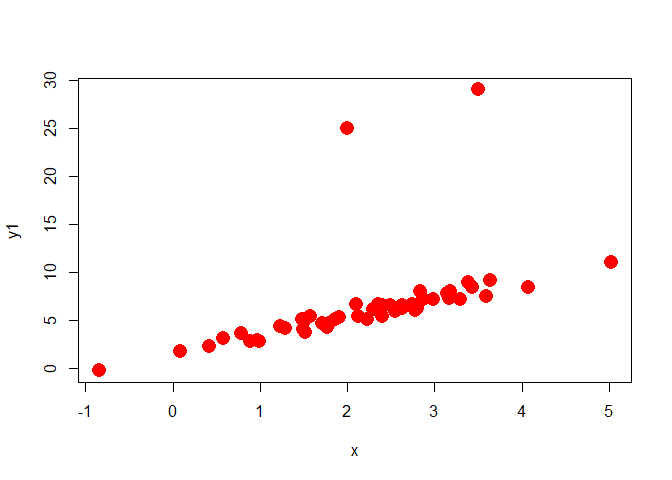
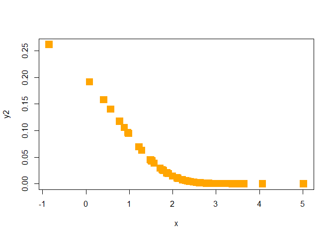
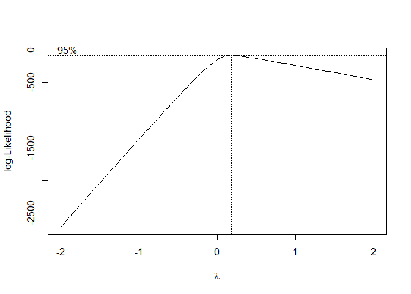
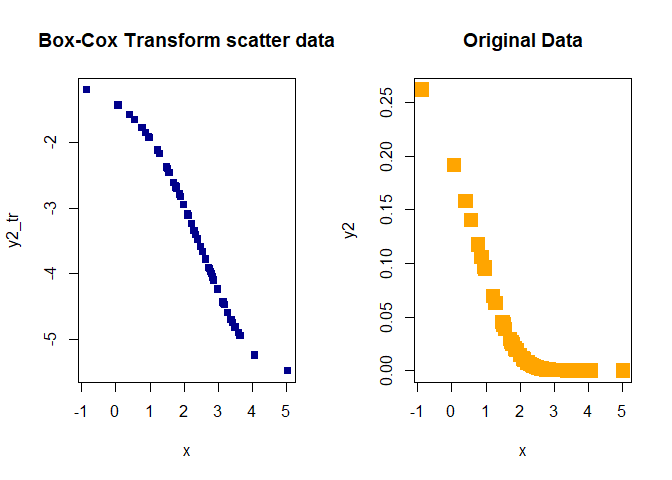
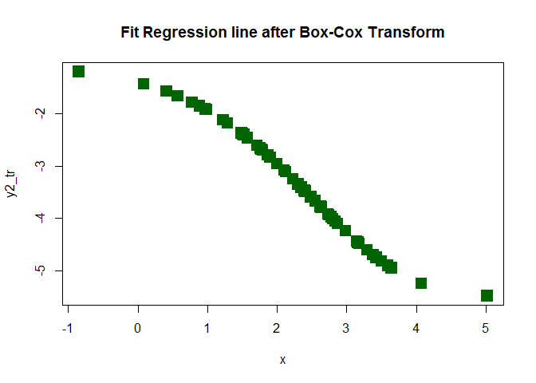
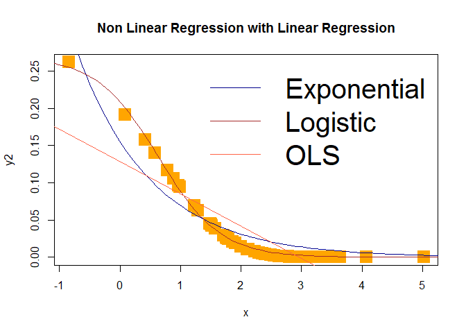

Quantile Regression and Non Linear Regression in R
================
Habib Ezzatabadi (Stats9)

## import data

``` r
xx <- read.csv(file = file.choose(), header = T)[, -1]
dim(xx)
```

    ## [1] 52  3

``` r
names(xx)
```

    ## [1] "x"  "y1" "y2"

``` r
attach(xx)
```

------------------------------------------------------------------------

------------------------------------------------------------------------

## fig1: y1 ~ x

``` r
plot(y1 ~ x, pch = 16, col = "red", cex = 2)
```

<!-- -->

------------------------------------------------------------------------

------------------------------------------------------------------------

## LSE Model

``` r
Model1 <- lm(y1 ~ x)
sm1 <- summary(Model1)
sm1
```

    ## 
    ## Call:
    ## lm(formula = y1 ~ x)
    ## 
    ## Residuals:
    ##     Min      1Q  Median      3Q     Max 
    ## -2.2963 -1.2160 -0.7705 -0.1687 19.5215 
    ## 
    ## Coefficients:
    ##             Estimate Std. Error t value Pr(>|t|)    
    ## (Intercept)   1.5248     1.2567   1.213    0.231    
    ## x             2.2725     0.5166   4.399 5.69e-05 ***
    ## ---
    ## Signif. codes:  0 '***' 0.001 '**' 0.01 '*' 0.05 '.' 0.1 ' ' 1
    ## 
    ## Residual standard error: 3.981 on 50 degrees of freedom
    ## Multiple R-squared:  0.2791, Adjusted R-squared:  0.2646 
    ## F-statistic: 19.35 on 1 and 50 DF,  p-value: 5.694e-05

------------------------------------------------------------------------

------------------------------------------------------------------------

## Model LTS

``` r
library(robustbase)
Model2 <- ltsReg(y1 ~ x, alpha = 0.9)
sm2 <- summary(Model2)
sm2
```

    ## 
    ## Call:
    ## ltsReg.formula(formula = y1 ~ x, alpha = 0.9)
    ## 
    ## Residuals (from reweighted LS):
    ##       Min        1Q    Median        3Q       Max 
    ## -0.818464 -0.444420 -0.006101  0.407019  1.104439 
    ## 
    ## Coefficients:
    ##           Estimate Std. Error t value Pr(>|t|)    
    ## Intercept  1.61984    0.17340   9.341 2.24e-12 ***
    ## x          1.87300    0.07181  26.082  < 2e-16 ***
    ## ---
    ## Signif. codes:  0 '***' 0.001 '**' 0.01 '*' 0.05 '.' 0.1 ' ' 1
    ## 
    ## Residual standard error: 0.5451 on 48 degrees of freedom
    ## Multiple R-Squared: 0.9341,  Adjusted R-squared: 0.9327 
    ## F-statistic: 680.3 on 1 and 48 DF,  p-value: < 2.2e-16

------------------------------------------------------------------------

------------------------------------------------------------------------

## LAD (q = 0.1) Model

``` r
library(quantreg)
```

    ## Loading required package: SparseM

    ## 
    ## Attaching package: 'SparseM'

    ## The following object is masked from 'package:base':
    ## 
    ##     backsolve

``` r
Model3 <- rq(y1 ~ x, tau = 0.1)
sm3 <- summary(Model3)
sm3
```

    ## 
    ## Call: rq(formula = y1 ~ x, tau = 0.1)
    ## 
    ## tau: [1] 0.1
    ## 
    ## Coefficients:
    ##             coefficients lower bd upper bd
    ## (Intercept) 1.05209      0.94220  1.23804 
    ## x           1.82462      1.74576  1.93940

------------------------------------------------------------------------

------------------------------------------------------------------------

## LAD (q = 0.5) Model

``` r
Model4 <- rq(y1 ~ x, tau = 0.5)
sm4 <- summary(Model4)
```

    ## Warning in rq.fit.br(x, y, tau = tau, ci = TRUE, ...): Solution may be
    ## nonunique

``` r
sm4
```

    ## 
    ## Call: rq(formula = y1 ~ x, tau = 0.5)
    ## 
    ## tau: [1] 0.5
    ## 
    ## Coefficients:
    ##             coefficients lower bd upper bd
    ## (Intercept) 1.61060      1.25415  2.02027 
    ## x           1.87391      1.68524  2.04754

------------------------------------------------------------------------

------------------------------------------------------------------------

## LAD (q = 0.9) Model

``` r
Model5 <- rq(y1 ~ x, tau = 0.9)
sm5 <- summary(Model5)
sm5
```

    ## 
    ## Call: rq(formula = y1 ~ x, tau = 0.9)
    ## 
    ## tau: [1] 0.9
    ## 
    ## Coefficients:
    ##             coefficients lower bd upper bd
    ## (Intercept) 2.10375      1.85103  3.94087 
    ## x           2.06507      1.70515  2.34398

## LMS Model

``` r
require(MASS)
```

    ## Loading required package: MASS

``` r
Model6 <- lmsreg(y1 ~ x)
coef_Model6 <- Model6$coefficients
coef_Model6
```

    ## (Intercept)           x 
    ##    1.353550    1.818419

------------------------------------------------------------------------

------------------------------------------------------------------------

## gain Results

``` r
ymean <- mean(y1)
R2Model1 <- round(sm1$r.squared, 4)
SST <- sum((y1 - ymean) ^ 2) 
yhat_LSE <- Model1$fitted.values
yhat_LTS <- Model2$fitted.values
yhat_LMS <- Model6$fitted.values
yhat_LAD_q1 <- Model3$fitted.values
yhat_LAD_q5 <- Model4$fitted.values
yhat_LAD_q9 <- Model5$fitted.values

resid_LSE <- Model1$residuals
resid_LTS <- Model2$residuals
resid_LMS <- Model6$residuals
resid_LAD_q1 <- Model3$residuals
resid_LAD_q5 <- Model4$residuals
resid_LAD_q9 <- Model5$residuals


ssR_LSE <- sum((yhat_LSE - ymean) ^ 2)
ssR_LMS <- sum((yhat_LMS - ymean) ^ 2)
ssR_LAD_q1 <- sum((yhat_LAD_q1 - ymean) ^ 2)
ssR_LAD_q5 <- sum((yhat_LAD_q5 - ymean) ^ 2)
ssR_LAD_q9 <- sum((yhat_LAD_q9 - ymean) ^ 2)

R2_LSE <- round(ssR_LSE / SST, 4)
R2_LTS <- round(sm2$r.squared, 4)
R2_LMS <- round(ssR_LMS / SST, 4)
R2_LAD_q1 <- round(ssR_LAD_q1 / SST, 4)
R2_LAD_q5 <- round(ssR_LAD_q5 / SST, 4)
R2_LAD_q9 <- round(ssR_LAD_q9 / SST, 4)


## MSE --

MSE_LSE <- round(sm1$sigma ^ 2, 3)
MSE_LAD_q1 <- round(mean((yhat_LAD_q1 - y1) ^ 2), 3)
MSE_LAD_q5 <- round(mean((yhat_LAD_q5 - y1) ^ 2), 3)
MSE_LAD_q9 <- round(mean((yhat_LAD_q5 - y1) ^ 2), 3)
MSE_LTS <- round(mean((yhat_LTS - y1) ^ 2), 3)
MSE_LMS <- round(mean((yhat_LMS - y1) ^ 2), 3)

# MAE --

MAE_LTS <- round(mean(abs(resid_LTS)), 3)
MAE_LSE <- round(mean(abs(resid_LSE)), 3)
MAE_LMS <- round(mean(abs(resid_LMS)), 3)
MAE_LAD_q1 <- round(mean(abs(resid_LAD_q1)), 3)
MAE_LAD_q5 <- round(mean(abs(resid_LAD_q5)), 3)
MAE_LAD_q9 <- round(mean(abs(resid_LAD_q9)), 3)


# coef --

b0_LSE <- sm1$coefficients[1]
b0_LAD_q1 <- sm3$coefficients[1, 1]
b0_LAD_q9 <- sm5$coefficients[1, 1]
b0_LAD_q5 <- sm4$coefficients[1, 1]
b0_LMS <- coef_Model6[1]
b0_LTS <- sm2$coefficients[1]

## beta1

b1_LSE <- sm1$coefficients[2]
b1_LAD_q1 <- sm3$coefficients[2, 1]
b1_LAD_q9 <- sm5$coefficients[2, 1]
b1_LAD_q5 <- sm4$coefficients[2, 1]
b1_LMS <- coef_Model6[2]
b1_LTS <- sm2$coefficients[2]

# gain results
temp1 <- paste0("LAD_q", c(1, 5, 9))
Final_Results <- data.frame(
    Model = c(temp1, "LMS", "LSE", "LTS"),
    InTerCept = c(b0_LAD_q1, b0_LAD_q5, b0_LAD_q9, b0_LMS,
                    b0_LSE, b0_LTS),  
    Beta1 = c(b1_LAD_q1, b1_LAD_q5, b1_LAD_q9, 
            b1_LMS, b1_LSE, b1_LTS), 
    MSE = c(MSE_LAD_q1, MSE_LAD_q5, MSE_LAD_q9, MSE_LMS, 
            MSE_LSE, MSE_LTS),
    MAE = c(MAE_LAD_q1, MAE_LAD_q5, MAE_LAD_q9, 
            MAE_LMS, MAE_LSE, MAE_LTS),
    R2 = c(R2_LAD_q1, R2_LAD_q5, R2_LAD_q9, 
            R2_LMS, R2_LSE, R2_LTS)
)

# show Concludes
knitr :: kable(Final_Results, caption = "Final Results for First Season", 
            align = "c")
```

| Model  | InTerCept |  Beta1   |  MSE   |  MAE  |   R2   |
|:------:|:---------:|:--------:|:------:|:-----:|:------:|
| LAD_q1 | 1.052089  | 1.824620 | 17.576 | 1.463 | 0.2796 |
| LAD_q5 | 1.610603  | 1.873909 | 16.038 | 1.212 | 0.2189 |
| LAD_q9 | 2.103748  | 2.065066 | 16.038 | 1.615 | 0.2312 |
|  LMS   | 1.353550  | 1.818419 | 16.829 | 1.296 | 0.2427 |
|  LSE   | 1.524768  | 2.272496 | 15.849 | 1.560 | 0.2791 |
|  LTS   | 1.619836  | 1.873000 | 16.027 | 1.213 | 0.9341 |

Final Results for First Season

------------------------------------------------------------------------

------------------------------------------------------------------------

## show Figure for 6 Models

``` r
tiff("Plot_1.tiff", width = 16, height = 9, family = "courier new", res = 300, 
unit = "in", bg = "wheat")
plot(y1 ~ x, cex = 2,
col = adjustcolor("black", .4), pch = 15, main = "Robust Models")
```

    ## Warning in axis(side = side, at = at, labels = labels, ...): font family not
    ## found in Windows font database

    ## Warning in axis(side = side, at = at, labels = labels, ...): font family not
    ## found in Windows font database

    ## Warning in axis(side = side, at = at, labels = labels, ...): font family not
    ## found in Windows font database

    ## Warning in axis(side = side, at = at, labels = labels, ...): font family not
    ## found in Windows font database

    ## Warning in axis(side = side, at = at, labels = labels, ...): font family not
    ## found in Windows font database

    ## Warning in axis(side = side, at = at, labels = labels, ...): font family not
    ## found in Windows font database

    ## Warning in axis(side = side, at = at, labels = labels, ...): font family not
    ## found in Windows font database

    ## Warning in axis(side = side, at = at, labels = labels, ...): font family not
    ## found in Windows font database

    ## Warning in axis(side = side, at = at, labels = labels, ...): font family not
    ## found in Windows font database

    ## Warning in axis(side = side, at = at, labels = labels, ...): font family not
    ## found in Windows font database

    ## Warning in axis(side = side, at = at, labels = labels, ...): font family not
    ## found in Windows font database

    ## Warning in axis(side = side, at = at, labels = labels, ...): font family not
    ## found in Windows font database

    ## Warning in axis(side = side, at = at, labels = labels, ...): font family not
    ## found in Windows font database

    ## Warning in axis(side = side, at = at, labels = labels, ...): font family not
    ## found in Windows font database

    ## Warning in title(...): font family not found in Windows font database

    ## Warning in title(...): font family not found in Windows font database

    ## Warning in title(...): font family not found in Windows font database

``` r
abline(a = Final_Results[['InTerCept']][1], 
b = Final_Results[['Beta1']][1], 
col = 1, lty = 6, lwd = 3)

## Model m2
abline(a = Final_Results[['InTerCept']][2], 
b = Final_Results[['Beta1']][2], 
col = adjustcolor("red", 0.5), lty = 5, lwd = 3)
## Model m3
abline(a = Final_Results[['InTerCept']][3], 
b = Final_Results[['Beta1']][3], 
col = 3, lty = 4, lwd = 3)
## LAD Model: q = 0.5
abline(a = Final_Results[['InTerCept']][4], 
b = Final_Results[['Beta1']][4], 
col = 4, lty = 3, lwd = 3)

## LAD Model: q = 0.9
abline(a = Final_Results[['InTerCept']][5], 
b = Final_Results[['Beta1']][5], 
col = "darkgreen", lty = 1, lwd = 3)

## LAD Model: q = 0.1
abline(a = Final_Results[['InTerCept']][6], 
b = Final_Results[['Beta1']][6], 
col = adjustcolor("blue", alpha = 0.5), lty = 9, lwd = 5)
## add legend 
legend("topleft", legend = c("LAD: q = 0.1", "LAD: q = 0.5", 
"LAD: q = 0.9", "LMS", "LSE", "LTS"), 
col = c(1, "red", 3, 4, "darkgreen", "blue"), lty= c(6:3, 1, 9), 
lwd = rep(c(3, 5), c(5, 1)), bty = "n", cex = 2.5)
```

    ## Warning in (function (s, units = "user", cex = NULL, font = NULL, vfont = NULL,
    ## : font family not found in Windows font database

``` r
dev.off()
```

    ## png 
    ##   2

------------------------------------------------------------------------

------------------------------------------------------------------------

------------------------------------------------------------------------

------------------------------------------------------------------------

## Season II

#### Plot2

``` r
plot(y2 ~ x, cex = 2, col = "orange", 
pch = 15)
```

<!-- -->

------------------------------------------------------------------------

------------------------------------------------------------------------

## Model I

``` r
Mod_1 <- lm(y2 ~ x)
summary(Mod_1)
```

    ## 
    ## Call:
    ## lm(formula = y2 ~ x)
    ## 
    ## Residuals:
    ##       Min        1Q    Median        3Q       Max 
    ## -0.027695 -0.021968 -0.009112  0.014201  0.096077 
    ## 
    ## Coefficients:
    ##              Estimate Std. Error t value Pr(>|t|)    
    ## (Intercept)  0.128980   0.009393   13.73  < 2e-16 ***
    ## x           -0.043425   0.003861  -11.25 2.66e-15 ***
    ## ---
    ## Signif. codes:  0 '***' 0.001 '**' 0.01 '*' 0.05 '.' 0.1 ' ' 1
    ## 
    ## Residual standard error: 0.02976 on 50 degrees of freedom
    ## Multiple R-squared:  0.7167, Adjusted R-squared:  0.7111 
    ## F-statistic: 126.5 on 1 and 50 DF,  p-value: 2.658e-15

------------------------------------------------------------------------

------------------------------------------------------------------------

## Box-Cox

``` r
bx <- boxcox(y2 ~ x)
```

<!-- -->

------------------------------------------------------------------------

------------------------------------------------------------------------

## Transform

``` r
lam <- bx$x[which.max(bx$y)]
y2_tr <- (y2 ** lam - 1) / lam
opar <- par(no.readonly = TRUE)
par(mfrow = c(1, 2))

plot(y2_tr ~ x, col = "darkblue", pch = 15, 
main = "Box-Cox Transform scatter data")
plot(y2 ~ x, cex = 2, col = "orange", 
pch = 15, main = "Original Data")
```

<!-- -->

------------------------------------------------------------------------

------------------------------------------------------------------------

## Ols Box cox model

``` r
Mod_2 <- lm(y2_tr ~ x)
summary(Mod_2)
```

    ## 
    ## Call:
    ## lm(formula = y2_tr ~ x)
    ## 
    ## Residuals:
    ##      Min       1Q   Median       3Q      Max 
    ## -0.95839 -0.13080  0.01516  0.16917  0.63553 
    ## 
    ## Coefficients:
    ##             Estimate Std. Error t value Pr(>|t|)    
    ## (Intercept) -1.08209    0.07190  -15.05   <2e-16 ***
    ## x           -1.00337    0.02956  -33.95   <2e-16 ***
    ## ---
    ## Signif. codes:  0 '***' 0.001 '**' 0.01 '*' 0.05 '.' 0.1 ' ' 1
    ## 
    ## Residual standard error: 0.2278 on 50 degrees of freedom
    ## Multiple R-squared:  0.9584, Adjusted R-squared:  0.9576 
    ## F-statistic:  1153 on 1 and 50 DF,  p-value: < 2.2e-16

------------------------------------------------------------------------

------------------------------------------------------------------------

## Model III

``` r
ff <- function(x, b2, b3) b2 * exp(-b3 * x)
b2 <- y2[which.min(abs(x))] 
b3 <- -log((y2[3] ) / b2) / x[3]
Mod_3 <- nls(y2 ~ ff(x, b2, b3),
start = list( b2 = b2, b3 = b3))
s_mod3 <- summary(Mod_3)
s_mod3
```

    ## 
    ## Formula: y2 ~ ff(x, b2, b3)
    ## 
    ## Parameters:
    ##    Estimate Std. Error t value Pr(>|t|)    
    ## b2 0.155502   0.006858   22.68   <2e-16 ***
    ## b3 0.806670   0.041899   19.25   <2e-16 ***
    ## ---
    ## Signif. codes:  0 '***' 0.001 '**' 0.01 '*' 0.05 '.' 0.1 ' ' 1
    ## 
    ## Residual standard error: 0.01953 on 50 degrees of freedom
    ## 
    ## Number of iterations to convergence: 9 
    ## Achieved convergence tolerance: 3.527e-06

------------------------------------------------------------------------

------------------------------------------------------------------------

## Model IV

``` r
b0 <- max(y2)
Mod_4 <- nls(y2 ~ SSlogis(x, beta1, beta2, beta3),
start = list(beta1 = b0, 
beta2 = b0, beta3 = -b0))
s_mod4 <- summary(Mod_4)
s_mod4
```

    ## 
    ## Formula: y2 ~ SSlogis(x, beta1, beta2, beta3)
    ## 
    ## Parameters:
    ##        Estimate Std. Error t value Pr(>|t|)    
    ## beta1  0.269306   0.004318   62.38   <2e-16 ***
    ## beta2  0.634677   0.022272   28.50   <2e-16 ***
    ## beta3 -0.511812   0.010632  -48.14   <2e-16 ***
    ## ---
    ## Signif. codes:  0 '***' 0.001 '**' 0.01 '*' 0.05 '.' 0.1 ' ' 1
    ## 
    ## Residual standard error: 0.003381 on 49 degrees of freedom
    ## 
    ## Number of iterations to convergence: 7 
    ## Achieved convergence tolerance: 5.714e-06

------------------------------------------------------------------------

------------------------------------------------------------------------

``` r
s_mod1 <- summary(Mod_1)
s_mod2 <- summary(Mod_2)
ymean <- mean(y2)
yhat_ols <- fitted(Mod_1)
yhat_box_cox <- fitted(Mod_2)
yhat_mod_3 <- fitted(Mod_3)
yhat_mod_4 <- fitted(Mod_4)
sst <- sum((y2 - ymean) ^ 2)
ssr_3 <- sum((yhat_mod_3 - ymean) ^ 2)
ssr_4 <- sum((yhat_mod_4 - ymean) ^ 2)
R2_mod1 <- s_mod1$r.squared
R2_mod2 <- s_mod2$r.squared
R2_mod3 <- ssr_3 / sst
R2_mod4 <- ssr_4 / sst

mse_mod1 <- mean((yhat_ols - y2) ^ 2)
mse_mod2 <- mean((yhat_box_cox - y2) ^ 2)
mse_mod3 <- mean((yhat_mod_3 - y2) ^ 2)
mse_mod4 <- mean((yhat_mod_4 - y2) ^ 2)

Temp<- data.frame(
    Model = c("bx-olx", "ols", "exponential", "logistic"), 
    R2 = round(c(R2_mod2, R2_mod1, R2_mod3, R2_mod4), 3), 
    MSE = round(c(mse_mod1, mse_mod2, mse_mod3, mse_mod4), 5)
)
knitr :: kable(Temp, caption = "Table of Results", align = "c")
```

|    Model    |  R2   |   MSE    |
|:-----------:|:-----:|:--------:|
|   bx-olx    | 0.958 | 0.00085  |
|     ols     | 0.717 | 12.00357 |
| exponential | 0.749 | 0.00037  |
|  logistic   | 0.968 | 0.00001  |

Table of Results

------------------------------------------------------------------------

------------------------------------------------------------------------

## Plot3

``` r
par(mfrow = c(1, 1))
plot(x = x, y = y2_tr, pch = 15, col = "darkgreen", cex = 2, 
main = "Fit Regression line after Box-Cox Transform")
abline(a = Mod_1$coefficients[1], b = Mod_1$coefficients[2], 
col = "cyan", lwd = 2)
```

<!-- -->

``` r
plot(x, y2, pch = 15, col = "orange", cex = 2.5, 
main = "Non Linear Regression with Linear Regression")

cf1 <- s_mod3$coefficients[, 1]

f <- function(x) ff(x, b2 = cf1[1], b3 = cf1[2])
f2 <- function(x) SSlogis(x, Asym = s_mod4$coefficients[, 1][1], 
xmid = s_mod4$coefficients[, 1][2], scal = s_mod4$coefficients[, 1][3])
curve(f, extendrange(x)[1], extendrange(x)[2], 
col = "darkblue", add = TRUE)
curve(f2, extendrange(x)[1], extendrange(x)[2], col = "brown", 
add = TRUE)
abline(a = Mod_1$coefficients[1], b = Mod_1$coefficients[2], 
col ="tomato")

legend("topright", legend = c("Exponential", "Logistic", "OLS"), 
col = c("darkblue", "brown", "tomato"), lty = 1, bty = "n", 
cex = 2.5)
```

<!-- -->
