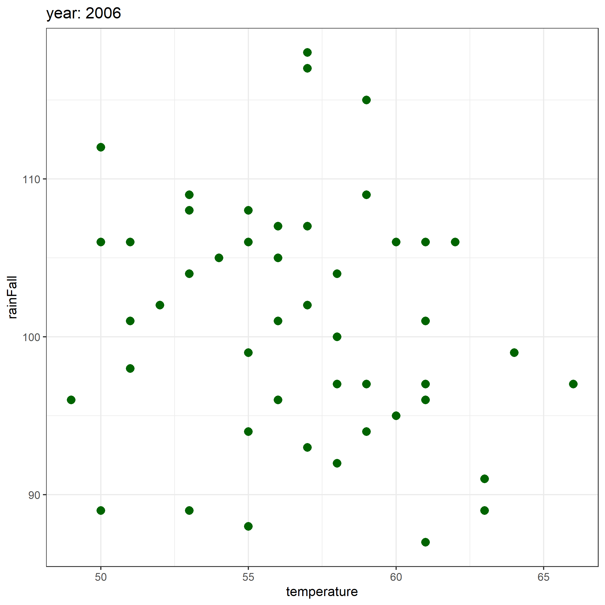

# How to create parameterized report


- [read data](#read-data)
- [extract year from datatime
  column](#extract-year-from-datatime-column)
- [filter data by year in params](#filter-data-by-year-in-params)
- [visualize data by color in
  params](#visualize-data-by-color-in-params)
- [save figures](#save-figures)

# read data

``` r
library(tidyverse)
dat <- readxl :: read_xlsx("sim_dat.xlsx")

dat |> head()
```

    # A tibble: 6 × 3
      year                temperature rainFall
      <dttm>                    <dbl>    <dbl>
    1 1990-01-01 00:00:00          52      105
    2 1990-01-08 00:00:00          58       99
    3 1990-01-15 00:00:00          61      107
    4 1990-01-22 00:00:00          48       96
    5 1990-01-29 00:00:00          59      102
    6 1990-02-05 00:00:00          59       96

# extract year from datatime column

``` r
dat_update <- dat |> 
        mutate(col_year = lubridate :: year(year)) |> 
        relocate('col_year', .before = 'year') 
dat_update |> head()
```

    # A tibble: 6 × 4
      col_year year                temperature rainFall
         <dbl> <dttm>                    <dbl>    <dbl>
    1     1990 1990-01-01 00:00:00          52      105
    2     1990 1990-01-08 00:00:00          58       99
    3     1990 1990-01-15 00:00:00          61      107
    4     1990 1990-01-22 00:00:00          48       96
    5     1990 1990-01-29 00:00:00          59      102
    6     1990 1990-02-05 00:00:00          59       96

# filter data by year in params

``` r
filtered_data <- dat_update |> 
                dplyr :: filter (col_year == params$year) 

filtered_data |> head()
```

    # A tibble: 6 × 4
      col_year year                temperature rainFall
         <dbl> <dttm>                    <dbl>    <dbl>
    1     2006 2006-01-02 00:00:00          61      106
    2     2006 2006-01-09 00:00:00          66       97
    3     2006 2006-01-16 00:00:00          58      104
    4     2006 2006-01-23 00:00:00          55       88
    5     2006 2006-01-30 00:00:00          57      102
    6     2006 2006-02-06 00:00:00          50      106

# visualize data by color in params

``` r
P <- filtered_data |> 
        ggplot(aes(x = temperature, y = rainFall)) + 
        geom_point(color = params$color, size = 3, shape = 16) + 
        ggtitle(paste0("year: ", params$year)) + 
        theme_bw() 
```

# save figures

``` r
temp1 <- paste(paste(params$year, params$color, sep = "-"), "png", sep = ".")
temp2 <- paste("Figures", temp1, sep = "//")
png(filename = temp2, 
    width = 7, height = 7, units = "in", , res = 300)
    P 
dev.off()
```

    png 
      2 

------------------------------------------------------------------------

------------------------------------------------------------------------

------------------------------------------------------------------------

 scatter of Temperature Vs RainFall in
year: 2006 with color: darkgreen
