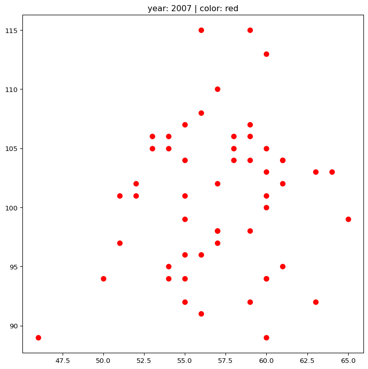

# parameterized for python file


- [Add cell Parameters](#add-cell-parameters)
- [load require libraries](#load-require-libraries)
- [call data](#call-data)
- [filter data using parameters](#filter-data-using-parameters)
- [filter data](#filter-data)
- [visualize filter data](#visualize-filter-data)

# Add cell Parameters

``` python
color = "darkblue"
year = 2020
```

``` python
# Injected Parameters
color = "red"
year = 2007
```

------------------------------------------------------------------------

# load require libraries

``` python
import matplotlib.pyplot as plt
import pandas as pd 
```

------------------------------------------------------------------------

# call data

``` python
dat = pd.read_excel("sim_dat.xlsx")
dat.head()
```

<div>
<style scoped>
    .dataframe tbody tr th:only-of-type {
        vertical-align: middle;
    }
&#10;    .dataframe tbody tr th {
        vertical-align: top;
    }
&#10;    .dataframe thead th {
        text-align: right;
    }
</style>

|     | year       | temperature | rainFall |
|-----|------------|-------------|----------|
| 0   | 1990-01-01 | 52          | 105      |
| 1   | 1990-01-08 | 58          | 99       |
| 2   | 1990-01-15 | 61          | 107      |
| 3   | 1990-01-22 | 48          | 96       |
| 4   | 1990-01-29 | 59          | 102      |

</div>

# filter data using parameters

``` python
dat['year2'] = pd.to_datetime(dat['year']).dt.year
dat2 = dat.reindex(columns = ['year', 'year2', 'temperature', 'rainFall'])
dat2.head()
```

<div>
<style scoped>
    .dataframe tbody tr th:only-of-type {
        vertical-align: middle;
    }
&#10;    .dataframe tbody tr th {
        vertical-align: top;
    }
&#10;    .dataframe thead th {
        text-align: right;
    }
</style>

|     | year       | year2 | temperature | rainFall |
|-----|------------|-------|-------------|----------|
| 0   | 1990-01-01 | 1990  | 52          | 105      |
| 1   | 1990-01-08 | 1990  | 58          | 99       |
| 2   | 1990-01-15 | 1990  | 61          | 107      |
| 3   | 1990-01-22 | 1990  | 48          | 96       |
| 4   | 1990-01-29 | 1990  | 59          | 102      |

</div>

# filter data

``` python
filter_data = dat2[dat2['year2'] == year]
filter_data.shape
```

    (53, 4)

# visualize filter data

``` python
fig, ax = plt.subplots(1, 1, figsize = (9, 9))
ax.scatter(filter_data['temperature'], filter_data['rainFall'], color = color, s = 50)
ax.set_title("year: " + str(year) + " | color: " + color)
plt.show()
```


