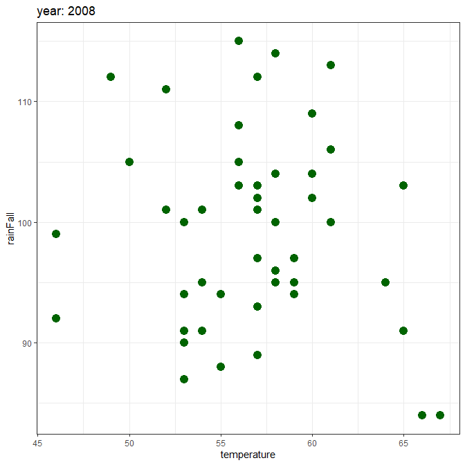

# template code


- [read data](#read-data)
- [extract year from datatime
  column](#extract-year-from-datatime-column)
- [filter data](#filter-data)
- [visualize](#visualize)

# read data

``` r
library(tidyverse)
dat <- readxl :: read_xlsx("sim_dat.xlsx")

dat |> head()
```

    # A tibble: 6 × 3
      year                temperature rainFall
      <dttm>                    <dbl>    <dbl>
    1 1990-01-01 00:00:00          52      105
    2 1990-01-08 00:00:00          58       99
    3 1990-01-15 00:00:00          61      107
    4 1990-01-22 00:00:00          48       96
    5 1990-01-29 00:00:00          59      102
    6 1990-02-05 00:00:00          59       96

# extract year from datatime column

``` r
dat_update <- dat |> 
        mutate(col_year = lubridate :: year(year)) |> 
        relocate('col_year', .before = 'year') 
dat_update |> head()
```

    # A tibble: 6 × 4
      col_year year                temperature rainFall
         <dbl> <dttm>                    <dbl>    <dbl>
    1     1990 1990-01-01 00:00:00          52      105
    2     1990 1990-01-08 00:00:00          58       99
    3     1990 1990-01-15 00:00:00          61      107
    4     1990 1990-01-22 00:00:00          48       96
    5     1990 1990-01-29 00:00:00          59      102
    6     1990 1990-02-05 00:00:00          59       96

# filter data

``` r
filter_data <- dat_update |> 
    dplyr :: filter (col_year == params$year)

filter_data |> head() 
```

    # A tibble: 6 × 4
      col_year year                temperature rainFall
         <dbl> <dttm>                    <dbl>    <dbl>
    1     2014 2014-01-06 00:00:00          57       94
    2     2014 2014-01-13 00:00:00          60       95
    3     2014 2014-01-20 00:00:00          54      108
    4     2014 2014-01-27 00:00:00          58      103
    5     2014 2014-02-03 00:00:00          59       96
    6     2014 2014-02-10 00:00:00          52      102

year: 2014

# visualize

``` r
filter_data |> 
ggplot(aes(x = temperature, y = rainFall)) + 
    geom_point(color = params$color, size = 4, shape = 19) + 
    ggtitle(paste0("year: ", params$year)) + 
    theme_bw() 
```


