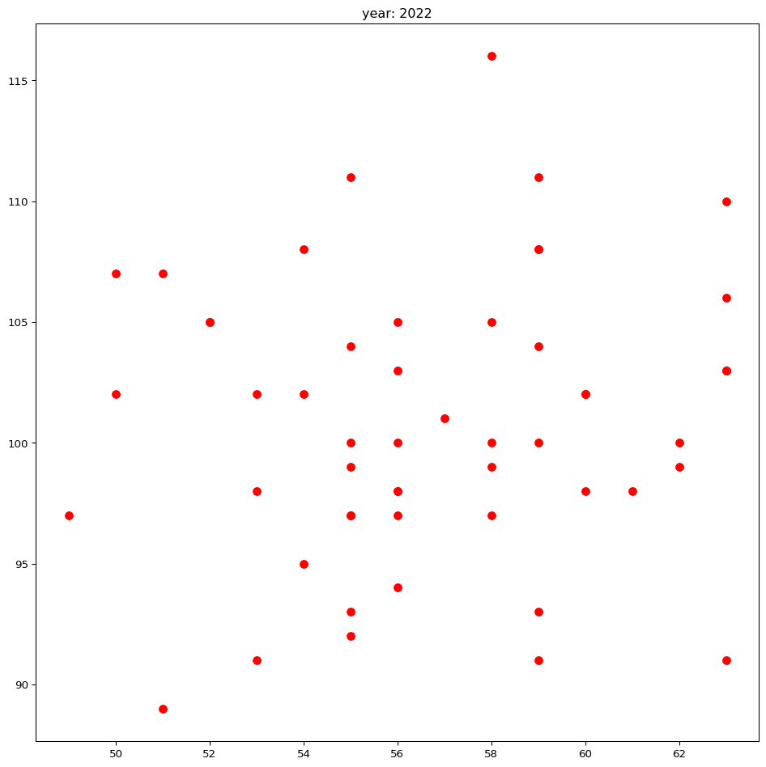

# Parameterized Quarto in python language


- [add cell parameter](#add-cell-parameter)
- [load requiare libraries](#load-requiare-libraries)
- [call data](#call-data)
- [filter data using parameters](#filter-data-using-parameters)
- [visualize](#visualize)

# add cell parameter

``` python
year = 2000
color = 'darkblue'
```

``` python
# Injected Parameters
year = 2022
color = "red"
```

------------------------------------------------------------------------

# load requiare libraries

``` python
import pandas as pd 
import matplotlib.pyplot as plt 
```

# call data

``` python
dat = pd.read_excel("sim_dat.xlsx")
dat.head()
```

<div>
<style scoped>
    .dataframe tbody tr th:only-of-type {
        vertical-align: middle;
    }
&#10;    .dataframe tbody tr th {
        vertical-align: top;
    }
&#10;    .dataframe thead th {
        text-align: right;
    }
</style>

|     | year       | temperature | rainFall |
|-----|------------|-------------|----------|
| 0   | 1990-01-01 | 52          | 105      |
| 1   | 1990-01-08 | 58          | 99       |
| 2   | 1990-01-15 | 61          | 107      |
| 3   | 1990-01-22 | 48          | 96       |
| 4   | 1990-01-29 | 59          | 102      |

</div>

# filter data using parameters

``` python
dat['year2'] = pd.to_datetime(dat['year']).dt.year

dat2 = dat.reindex(columns = ['year', 'year2', 'temperature', 'rainFall'])
dat2.head()
```

<div>
<style scoped>
    .dataframe tbody tr th:only-of-type {
        vertical-align: middle;
    }
&#10;    .dataframe tbody tr th {
        vertical-align: top;
    }
&#10;    .dataframe thead th {
        text-align: right;
    }
</style>

|     | year       | year2 | temperature | rainFall |
|-----|------------|-------|-------------|----------|
| 0   | 1990-01-01 | 1990  | 52          | 105      |
| 1   | 1990-01-08 | 1990  | 58          | 99       |
| 2   | 1990-01-15 | 1990  | 61          | 107      |
| 3   | 1990-01-22 | 1990  | 48          | 96       |
| 4   | 1990-01-29 | 1990  | 59          | 102      |

</div>

``` python
filter_dat = dat2[dat2['year2'] == year]
```

# visualize

``` python
fig, ax = plt.subplots(1, 1, figsize = (12, 12))
ax.scatter(filter_dat['temperature'], 
    filter_dat['rainFall'], color = color, s = 50)
ax.set_title("year: " + str(year))
plt.show() 
```


