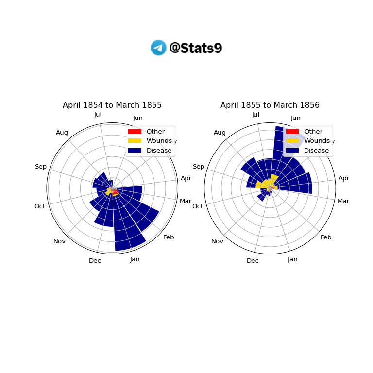

# Rose Chart


- [Make connection between R and
  python](#make-connection-between-r-and-python)
  - [Using R programming](#using-r-programming)
  - [load data and require libraries](#load-data-and-require-libraries)
  - [edit data and convert to long
    data](#edit-data-and-convert-to-long-data)
  - [create a Rose Plot](#create-a-rose-plot)
- [Using Python](#using-python)
  - [load require libraries](#load-require-libraries)
  - [create plot](#create-plot)



# Make connection between R and python

``` r
library(reticulate)
path <- Sys.which("python")
path <- gsub("\\", "//", path, fixed = TRUE)
use_python(path)
```



## Using R programming

## load data and require libraries

``` r
if(! require(HistData)) {
    chooseCRANmirror(ind = 1, graphics = FALSE)
    install.packages("HistData")
    library(HistData)
}

if(! require(tidyverse)) {
    chooseCRANmirror(ind = 1, graphics = FALSE)
    install.packages("tidyverse")
    library(tidyverse)
}

data(Nightingale)
```



## edit data and convert to long data

``` r
Nightingale |> head()
```

            Date Month Year  Army Disease Wounds Other Disease.rate Wounds.rate
    1 1854-04-01   Apr 1854  8571       1      0     5          1.4         0.0
    2 1854-05-01   May 1854 23333      12      0     9          6.2         0.0
    3 1854-06-01   Jun 1854 28333      11      0     6          4.7         0.0
    4 1854-07-01   Jul 1854 28722     359      0    23        150.0         0.0
    5 1854-08-01   Aug 1854 30246     828      1    30        328.5         0.4
    6 1854-09-01   Sep 1854 30290     788     81    70        312.2        32.1
      Other.rate
    1        7.0
    2        4.6
    3        2.5
    4        9.6
    5       11.9
    6       27.7

``` r
Nightingale |> _$Year |> table()
```


    1854 1855 1856 
       9   12    3 

``` r
Nightingale |>
  select(Date, Month, Year, contains("rate")) |>
  pivot_longer(cols = 4:6, names_to = "Cause", values_to = "Rate") |>
  mutate(Cause = gsub(".rate", "", Cause),
         period = ifelse(Date <= as.Date("1855-03-01"), 
            "April 1854 to March 1855", "April 1855 to March 1856"),
         Month = fct_relevel(Month, "Jul", "Aug", "Sep", 
         "Oct", "Nov", "Dec", "Jan", "Feb", "Mar", "Apr", "May", "Jun")) -> dat
dat |> head()
```

    # A tibble: 6 × 6
      Date       Month  Year Cause    Rate period                  
      <date>     <ord> <int> <chr>   <dbl> <chr>                   
    1 1854-04-01 Apr    1854 Disease   1.4 April 1854 to March 1855
    2 1854-04-01 Apr    1854 Wounds    0   April 1854 to March 1855
    3 1854-04-01 Apr    1854 Other     7   April 1854 to March 1855
    4 1854-05-01 May    1854 Disease   6.2 April 1854 to March 1855
    5 1854-05-01 May    1854 Wounds    0   April 1854 to March 1855
    6 1854-05-01 May    1854 Other     4.6 April 1854 to March 1855



## create a Rose Plot

``` r
dat |> 
    ggplot(aes(Month, Rate)) +
    geom_col(aes(fill = Cause), width = 1, position = "identity") +
    coord_polar() +
    facet_wrap(~period) +
    scale_fill_manual(values = c("skyblue3", "grey30", "firebrick")) +  
    scale_y_sqrt() +
    theme_void() +
    theme(axis.text.x = element_text(size = 9),
        strip.text = element_text(size = 11),
        legend.position = "bottom",
        plot.background = element_rect(fill = alpha("cornsilk", 0.5)),
        plot.margin = unit(c(30, 30, 30, 30), "pt"),
        plot.title = element_text(vjust = 10)
        ) +
    labs(title = "Diagram of the Causes of Mortality in the Army in the East", 
        caption = "Tel: @Stats9") + 
    theme(plot.caption = element_text(size = 10, 
        color = alpha('darkblue', 0.5), 
            face = 'bold')) 
```




# Using Python

## load require libraries

``` python
import numpy as np 
import pandas as pd 
import matplotlib.pyplot as plt
import matplotlib.image as mpimg
dat = r.dat
dat.head()
```

             Date Month  Year    Cause  Rate                    period
    0  1854-04-01   Apr  1854  Disease   1.4  April 1854 to March 1855
    1  1854-04-01   Apr  1854   Wounds   0.0  April 1854 to March 1855
    2  1854-04-01   Apr  1854    Other   7.0  April 1854 to March 1855
    3  1854-05-01   May  1854  Disease   6.2  April 1854 to March 1855
    4  1854-05-01   May  1854   Wounds   0.0  April 1854 to March 1855



## create plot

``` python
dat['period'].value_counts()
```

    period
    April 1854 to March 1855    36
    April 1855 to March 1856    36
    Name: count, dtype: int64

``` python
dat1 = dat[dat['period'] == 'April 1854 to March 1855']
dat2 = dat[dat['period'] == 'April 1855 to March 1856']
dat1.head()
```

             Date Month  Year    Cause  Rate                    period
    0  1854-04-01   Apr  1854  Disease   1.4  April 1854 to March 1855
    1  1854-04-01   Apr  1854   Wounds   0.0  April 1854 to March 1855
    2  1854-04-01   Apr  1854    Other   7.0  April 1854 to March 1855
    3  1854-05-01   May  1854  Disease   6.2  April 1854 to March 1855
    4  1854-05-01   May  1854   Wounds   0.0  April 1854 to March 1855

``` python
dat2.head()
```

              Date Month  Year    Cause   Rate                    period
    36  1855-04-01   Apr  1855  Disease  177.5  April 1855 to March 1856
    37  1855-04-01   Apr  1855   Wounds   17.9  April 1855 to March 1856
    38  1855-04-01   Apr  1855    Other   21.2  April 1855 to March 1856
    39  1855-05-01   May  1855  Disease  171.8  April 1855 to March 1856
    40  1855-05-01   May  1855   Wounds   16.6  April 1855 to March 1856

``` python
Levels = ['Disease', 'Wounds', 'Other']
Time = ['April 1854 to March 1855', 'April 1855 to March 1856']
widths = np.radians(360/12)
directions = np.linspace(7.5, 350, num = 12)
Labels = list(dat['Month'].unique())
Labels
```

    ['Apr', 'May', 'Jun', 'Jul', 'Aug', 'Sep', 'Oct', 'Nov', 'Dec', 'Jan', 'Feb', 'Mar']

``` python
colors = ['darkblue', 'gold', 'red']


fig, ax = plt.subplots(1, 2, figsize = (8, 8), subplot_kw = dict(polar = True))
count = -1
for k in Time: 
    # k = Time[0]
    count += 1
    temp1 = dat[dat['period'] == k]
    Disease = temp1[temp1['Cause'] == Levels[0]]['Rate'].values
    Wounds = temp1[temp1['Cause'] == Levels[1]]['Rate'].values
    Other = temp1[temp1['Cause'] == Levels[2]]['Rate'].values
    ax[count].set_yticklabels([])
    ax[count].bar(np.radians(directions), Other, 
                color = colors[2], width = widths, 
                label = 'Other')
    ax[count].bar(np.radians(directions), Wounds, 
                color = colors[1], width = widths, 
                bottom = Other, label = 'Wounds')
    ax[count].bar(np.radians(directions), Disease, 
               color = colors[0], width = widths, 
                bottom = Wounds + Other,
                label = 'Disease')
    ax[count].set_xticks(np.radians(directions))
    ax[count].set_xticklabels(Labels)
    ax[count].set_rlabel_position(0) 
    ax[count].set_title(k)
    ax[count].legend() 

img = mpimg.imread('my_arm.png')
ax_img = fig.add_axes([0.2, 0.85, 0.6, 0.05], zorder = 10) 
ax_img.imshow(img)
ax_img.axis('off')
```

    (-0.5, 122.5, 31.5, -0.5)

``` python
plt.show()
```


