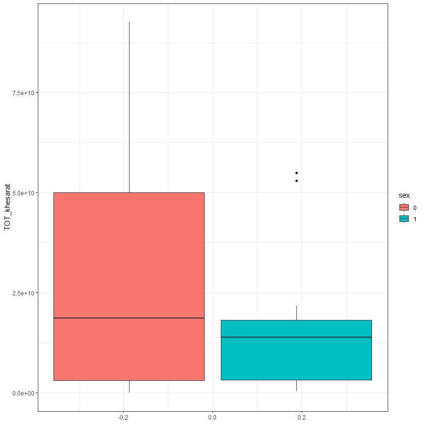
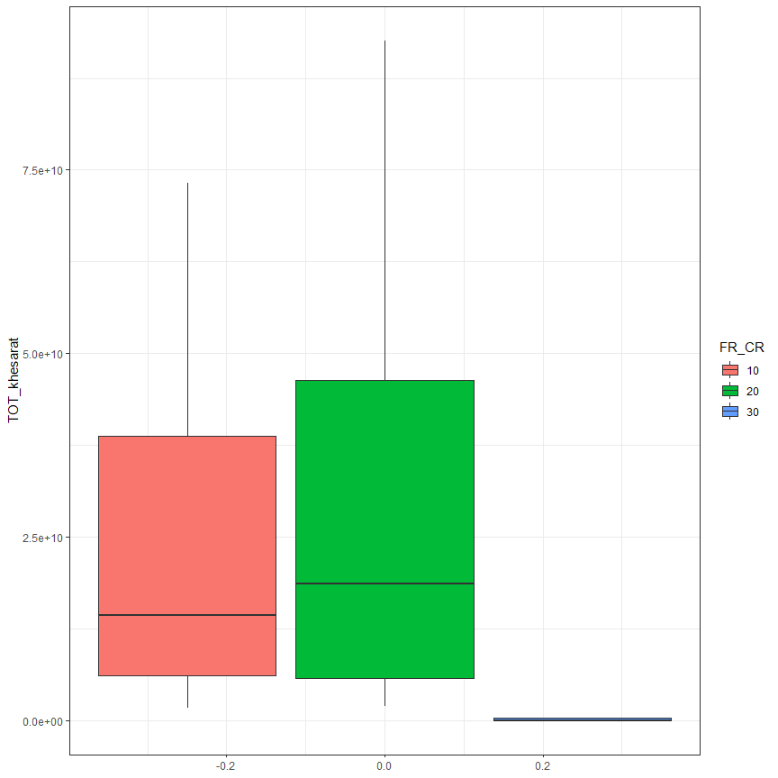

Habib Ezatabadi Sample Code
================

## sample code

#### (a) Get khesarat ——————–

``` r
set.seed(1)
library(tidyverse)

n <- 1000
National_number <- sample(1:20, size = n, replace = TRUE)
khedmat <- sample(1:6, size = n, replace = TRUE)
sex <- sample(c("female", "male"), size = n, replace = TRUE, 
prob = c(.4, .6))
FR_CR <- sample(c("Ten", "Twenty"), size = n, replace = TRUE)

dat <- tibble(National_number, khedmat, sex, FR_CR) %>%
                mutate(khesarat = case_when(
                    khedmat == 1 ~ 1000, 
                    khedmat == 2 ~ 2000, 
                    khedmat == 3 ~ 3000, 
                    khedmat == 4 ~ 4000,
                    khedmat == 5 ~ 5000, 
                    TRUE ~ 6000 
                )) %>% mutate(across(c(2, 3, 4), as.factor))


head(dat)
```

    # A tibble: 6 × 5
      National_number khedmat sex    FR_CR  khesarat
                <int> <fct>   <fct>  <fct>     <dbl>
    1               4 4       male   Twenty     4000
    2               7 5       male   Twenty     5000
    3               1 4       female Twenty     4000
    4               2 2       male   Ten        2000
    5              11 1       female Ten        1000
    6              14 3       male   Twenty     3000

``` r
get_khesarat <- function(x) {    # x is National_number
    if (! (x %in% dat$National_number)) {
        stop ("this value is not in data set")
    }
    result <- dat %>%
    filter (National_number == x) %>%
    group_by (khedmat) %>%
    summarise(Khesarat_kol = sum(khesarat))
    return (result)
}

get_khesarat(2)
```

    # A tibble: 6 × 2
      khedmat Khesarat_kol
      <fct>          <dbl>
    1 1               6000
    2 2              22000
    3 3              21000
    4 4              32000
    5 5              45000
    6 6              48000

## quantile regression

``` r
dat2 <- dat %>% 
        group_by(khedmat, FR_CR, sex) %>%
            summarise(TOT_khesarat = sum(khesarat))
library(quantreg)

## q = 0.5 

Median_Model  <- rq(TOT_khesarat ~ ., data = dat2, tau = 0.5)

summary(Median_Model)
```


    Call: rq(formula = TOT_khesarat ~ ., tau = 0.5, data = dat2)

    tau: [1] 0.5

    Coefficients:
                coefficients lower bd   upper bd  
    (Intercept)   2000.000   -64527.103  20431.266
    khedmat2     42000.000   -28566.733 132823.990
    khedmat3     72000.000    25557.057 134283.367
    khedmat4    102000.000    82605.898 193097.681
    khedmat5    153000.000    93915.374 256478.728
    khedmat6    192000.000   163557.057 255986.945
    FR_CRTwenty  36000.000    -4553.048  61414.786
    sexmale      64000.000    41170.428  88244.359

``` r
## q = 0.75

Model2  <- rq(TOT_khesarat ~ ., data = dat2, tau = 0.75)

summary(Model2)
```


    Call: rq(formula = TOT_khesarat ~ ., tau = 0.75, data = dat2)

    tau: [1] 0.75

    Coefficients:
                coefficients   lower bd       upper bd      
    (Intercept)   3.800000e+04  -4.130941e+04  1.797693e+308
    khedmat2      4.200000e+04 -1.797693e+308  1.797693e+308
    khedmat3      4.900000e+04 -1.797693e+308  1.797693e+308
    khedmat4      1.020000e+05 -1.797693e+308  1.797693e+308
    khedmat5      1.170000e+05 -1.797693e+308  1.797693e+308
    khedmat6      1.780000e+05 -1.797693e+308  1.797693e+308
    FR_CRTwenty   0.000000e+00  -1.703579e+03   8.785179e+04
    sexmale       8.700000e+04   1.511243e+04   1.130358e+05

------------------------------------------------------------------------

------------------------------------------------------------------------

## Update code for new data set ———————

## import data and get summary

``` r
library(tidyverse)
library(readxl)
dat <- read_xlsx(file.choose(), col_names = TRUE)
head(dat)
```

    # A tibble: 6 × 6
      National_number   sex   age Khesarat khedmat FR_CR
                <dbl> <dbl> <dbl>    <dbl> <chr>   <dbl>
    1        10023429     0    34  6165000 8          10
    2        10023429     0    34  1500000 1          10
    3        10023429     0    34  1500000 1          10
    4        10023429     0    34  2000000 1          10
    5        10026185     0    35   934000 2          20
    6        10026185     0    35   660000 1          20

``` r
tail(dat)
```

    # A tibble: 6 × 6
      National_number   sex   age Khesarat khedmat FR_CR
                <dbl> <dbl> <dbl>    <dbl> <chr>   <dbl>
    1      7750096744     1     4   457800 1          10
    2      7750096744     1     4   837000 1          10
    3      7750181555     1     1 12327120 8          10
    4      7900028625     0     3  4308680 8          10
    5      7900028625     0     3  1746300 8          10
    6      7990008963     1     1  3270000 6          10

``` r
dim(dat)
```

    [1] 173951      6

``` r
names(dat)
```

    [1] "National_number" "sex"             "age"             "Khesarat"       
    [5] "khedmat"         "FR_CR"          

``` r
glimpse(dat)
```

    Rows: 173,951
    Columns: 6
    $ National_number <dbl> 10023429, 10023429, 10023429, 10023429, 10026185, 1002…
    $ sex             <dbl> 0, 0, 0, 0, 0, 0, 0, 0, 0, 0, 0, 0, 0, 0, 0, 0, 0, 0, …
    $ age             <dbl> 34, 34, 34, 34, 35, 35, 35, 35, 35, 35, 35, 35, 35, 35…
    $ Khesarat        <dbl> 6165000, 1500000, 1500000, 2000000, 934000, 660000, 17…
    $ khedmat         <chr> "8", "1", "1", "1", "2", "1", "8", "1", "1", "8", "1",…
    $ FR_CR           <dbl> 10, 10, 10, 10, 20, 20, 20, 20, 20, 20, 20, 20, 20, 20…

``` r
if (! require(summarytools)) {
    install.packages ("summarytools")
    library (summarytools)
}

dfSummary(dat)
```

    Data Frame Summary  
    dat  
    Dimensions: 173951 x 6  
    Duplicates: 35483  

    -----------------------------------------------------------------------------------------------------------------------------
    No   Variable          Stats / Values                        Freqs (% of Valid)      Graph               Valid      Missing  
    ---- ----------------- ------------------------------------- ----------------------- ------------------- ---------- ---------
    1    National_number   Mean (sd) : 2159230922 (1759160466)   13743 distinct values   :                   173951     0        
         [numeric]         min < med < max:                                              : : .               (100.0%)   (0.0%)   
                           10023429 < 1881839982 < 7990008963                            : : :     .                             
                           IQR (CV) : 2880548452 (0.8)                                   : : : :   :                             
                                                                                         : : : : : : : .                         

    2    sex               Min  : 0                              0 : 132056 (75.9%)      IIIIIIIIIIIIIII     173951     0        
         [numeric]         Mean : 0.2                            1 :  41895 (24.1%)      IIII                (100.0%)   (0.0%)   
                           Max  : 1                                                                                              

    3    age               Mean (sd) : 35.7 (11.3)               73 distinct values              :           173951     0        
         [numeric]         min < med < max:                                                      :           (100.0%)   (0.0%)   
                           0 < 35 < 72                                                           : :                             
                           IQR (CV) : 11 (0.3)                                                 : : :                             
                                                                                         .   . : : : : . .                       

    4    Khesarat          Mean (sd) : 5238283 (31938428)        51414 distinct values   :                   173951     0        
         [numeric]         min < med < max:                                              :                   (100.0%)   (0.0%)   
                           100 < 1285930 < 2555466255                                    :                                       
                           IQR (CV) : 2170000 (6.1)                                      :                                       
                                                                                         :                                       

    5    khedmat           1. 1                                  106174 (61.0%)          IIIIIIIIIIII        173951     0        
         [character]       2. 8                                   29882 (17.2%)          III                 (100.0%)   (0.0%)   
                           3. 2                                   24811 (14.3%)          II                                      
                           4. 7                                    4864 ( 2.8%)                                                  
                           5. 6                                    2752 ( 1.6%)                                                  
                           6. 3                                    2285 ( 1.3%)                                                  
                           7. 5                                    2241 ( 1.3%)                                                  
                           8. زايمان                                566 ( 0.3%)                                                  
                           9. هزينه هاي درمان                       224 ( 0.1%)                                                  
                           نازایي و                                  87 ( 0.1%)                                                  
                           10. 4                                     65 ( 0.0%)                                                  
                           [ 5 others ]                                                                                          

    6    FR_CR             Mean (sd) : 15.4 (5)                  10 : 80019 (46.0%)      IIIIIIIII           173951     0        
         [numeric]         min < med < max:                      20 : 93869 (54.0%)      IIIIIIIIII          (100.0%)   (0.0%)   
                           10 < 20 < 30                          30 :    63 ( 0.0%)                                              
                           IQR (CV) : 10 (0.3)                                                                                   
    -----------------------------------------------------------------------------------------------------------------------------

``` r
dat$khedmat %>% table
```

    .
                                    1                                 2 
                               106174                             24811 
                                    3                                 4 
                                 2285                                87 
                                    5                                 6 
                                 2241                              2752 
                                    7                                 8 
                                 4864                             29882 
                             آمبولانس                    خدمات توانبخشي 
                                   12                                 3 
                               زايمان                              سمعک 
                                  566                                 9 
                            لنز ،عينک   هزينه رفع عيوب انکساري ديددوچشم 
                                    2                                39 
    هزينه هاي درمان نازایي و ناباروري 
                                  224 

``` r
dat2 <- dat %>% mutate(
    khedmat = case_when(
        khedmat == "آمبولانس" ~ "Ambulance", 
        khedmat == "خدمات توانبخشي" ~ "khedmat Tavanbakhshi", 
        khedmat == "زايمان" ~ "zayeman", 
        khedmat == "سمعک" ~ "samAk", 
        khedmat == "لنز ،عينک" ~ "Lenz, Eynak", 
        khedmat == "هزينه رفع عيوب انکساري ديددوچشم" ~ "hazineh enkesari ...",
        khedmat == "هزينه هاي درمان نازایي و ناباروري" ~ "hazineh nazayi , ...", 
        .default = khedmat 
    )
)
dat2 %>% .$khedmat %>% table
```

    .
                       1                    2                    3 
                  106174                24811                 2285 
                       4                    5                    6 
                      87                 2241                 2752 
                       7                    8            Ambulance 
                    4864                29882                   12 
    hazineh enkesari ... hazineh nazayi , ... khedmat Tavanbakhshi 
                      39                  224                    3 
             Lenz, Eynak                samAk              zayeman 
                       2                    9                  566 

``` r
dat2 <- dat2 %>%
mutate(across(c(2, 5, 6), factor)) 
```

------------------------------------------------------------------------

``` r
get_khesarat <- function(x) {# x is National_number or vector of national number
    if (length(x) == 1) {
        if (! (x %in% dat2$National_number)) {
            stop ("this value is not in data set")
        } else {
            result <- dat2 %>%
            filter (National_number == x) %>%
            group_by (khedmat) %>%
            summarise(Khesarat_kol = sum(Khesarat))
        }
    } else {
        result <- list()
        for (i in x) {
            if (! (i %in% dat2$National_number)) {
            result[[as.character(i)]] = "this value is not in data set"
        } else {
            result[[as.character(i)]] <- dat2 %>%
            filter (National_number == i) %>%
            group_by (khedmat) %>%
            summarise(Khesarat_kol = sum(Khesarat))
            }
        }
    }
    return (result)
}

id_sample <- sample(unique(dat2$National_number), 10)
get_khesarat(id_sample)
```

    $`45782131`
    # A tibble: 6 × 2
      khedmat Khesarat_kol
      <fct>          <dbl>
    1 1            6420000
    2 2           12619120
    3 3            8204000
    4 4          880101784
    5 5          725219216
    6 8            3630233

    $`520217446`
    # A tibble: 5 × 2
      khedmat Khesarat_kol
      <fct>          <dbl>
    1 1           10601764
    2 2            3215000
    3 6             460000
    4 7           12040000
    5 8            9663080

    $`70803765`
    # A tibble: 2 × 2
      khedmat Khesarat_kol
      <fct>          <dbl>
    1 2           42383008
    2 5           94732188

    $`941523977`
    # A tibble: 3 × 2
      khedmat Khesarat_kol
      <fct>          <dbl>
    1 1           16689300
    2 2           21979600
    3 8            2783010

    $`521136611`
    # A tibble: 3 × 2
      khedmat Khesarat_kol
      <fct>          <dbl>
    1 1           30664144
    2 2           13191750
    3 8           58942950

    $`33861595`
    # A tibble: 1 × 2
      khedmat Khesarat_kol
      <fct>          <dbl>
    1 2           11568500

    $`77981162`
    # A tibble: 1 × 2
      khedmat Khesarat_kol
      <fct>          <dbl>
    1 8            6946254

    $`1229363351`
    # A tibble: 2 × 2
      khedmat Khesarat_kol
      <fct>          <dbl>
    1 1            1476980
    2 8            5662600

    $`6190082491`
    # A tibble: 2 × 2
      khedmat Khesarat_kol
      <fct>          <dbl>
    1 1            2253628
    2 8             935950

    $`2700092945`
    # A tibble: 2 × 2
      khedmat Khesarat_kol
      <fct>          <dbl>
    1 1           12800000
    2 8           14248810

------------------------------------------------------------------------

------------------------------------------------------------------------

## Quantile Regression —————————-

``` r
dat3 <- dat2 %>% 
        group_by(khedmat, FR_CR, sex) %>%
            summarise(TOT_khesarat = sum(Khesarat))
library(quantreg)

## q = 0.5 

Median_Model  <- rq(TOT_khesarat ~ ., data = dat3, tau = 0.5)

summary(Median_Model)
```


    Call: rq(formula = TOT_khesarat ~ ., tau = 0.5, data = dat3)

    tau: [1] 0.5

    Coefficients:
                                coefficients   lower bd       upper bd      
    (Intercept)                   2.132091e+10   1.865686e+10  1.797693e+308
    khedmat2                      4.277328e+06  -3.607033e+10   1.496294e+10
    khedmat3                     -1.815905e+10  -5.284482e+10  -1.705335e+10
    khedmat4                     -1.471187e+10  -4.323682e+10  -9.852005e+09
    khedmat5                      3.507144e+10  -6.958138e+08   6.234190e+10
    khedmat6                     -1.671983e+10  -5.136526e+10  -1.514319e+10
    khedmat7                      1.812409e+09  -3.250619e+10   9.461485e+09
    khedmat8                      8.052000e+06  -3.749028e+10   3.424149e+10
    khedmatAmbulance             -1.988427e+10  -5.541091e+10  -1.866299e+10
    khedmathazineh enkesari ...  -1.941154e+10  -5.466224e+10  -1.789755e+10
    khedmathazineh nazayi , ...  -1.785870e+10  -5.339850e+10  -1.520638e+10
    khedmatkhedmat Tavanbakhshi  -1.985927e+10  -5.590219e+10  1.797693e+308
    khedmatLenz, Eynak           -1.985927e+10  -5.594259e+10  1.797693e+308
    khedmatsamAk                 -2.117490e+10  -5.563394e+10  -1.957243e+10
    khedmatzayeman                7.071234e+09 -1.797693e+308   1.466159e+10
    FR_CR20                       5.192716e+07  -2.623071e+09   2.638431e+09
    FR_CR30                      -2.131621e+10  -3.682282e+10  -1.956489e+10
    sex1                         -1.463563e+09  -1.237091e+10  -1.024258e+08

``` r
## q = 0.75

Model2  <- rq(TOT_khesarat ~ ., data = dat3, tau = 0.75)

summary(Model2)
```


    Call: rq(formula = TOT_khesarat ~ ., tau = 0.75, data = dat3)

    tau: [1] 0.75

    Coefficients:
                                coefficients   lower bd       upper bd      
    (Intercept)                   5.543332e+10   3.303589e+10  1.797693e+308
    khedmat2                     -1.987207e+10  -2.905745e+10   7.871823e+09
    khedmat3                     -5.253090e+10  -6.119924e+10  1.797693e+308
    khedmat4                     -4.659802e+10  -5.593623e+10  1.797693e+308
    khedmat5                      1.784049e+10  -8.087196e+09  1.797693e+308
    khedmat6                     -5.083224e+10  -5.957544e+10  1.797693e+308
    khedmat7                     -1.945844e+10  -3.224466e+10   1.321856e+09
    khedmat8                     -7.032829e+09  -2.905368e+10   1.882759e+10
    khedmatAmbulance             -5.420920e+10  -6.360487e+10  1.797693e+308
    khedmathazineh enkesari ...  -5.344375e+10  -6.317616e+10  1.797693e+308
    khedmathazineh nazayi , ...  -4.976095e+10  -5.900632e+10  1.797693e+308
    khedmatkhedmat Tavanbakhshi  -5.527332e+10  -6.407278e+10  1.797693e+308
    khedmatLenz, Eynak           -5.527332e+10  -6.409179e+10  1.797693e+308
    khedmatsamAk                 -5.528732e+10  -6.190587e+10  1.797693e+308
    khedmatzayeman               -2.020394e+10  -3.195289e+10  1.797693e+308
    FR_CR20                       1.094118e+09  -1.431365e+08   6.461668e+09
    FR_CR30                      -3.555228e+10  -4.521226e+10  1.797693e+308
    sex1                         -1.204124e+09  -1.594227e+10  -4.633103e+07

------------------------------------------------------------------------

------------------------------------------------------------------------

## for get more details —————-

``` r
dat3 %>%
ggplot(aes(y = TOT_khesarat, group = sex, fill = sex)) + 
geom_boxplot() + 
theme_bw()
```


------------------------------------------------------------------------

``` r
dat3 %>%
ggplot(aes(y = TOT_khesarat, group = FR_CR, fill = FR_CR)) + 
geom_boxplot() + 
theme_bw()
```



------------------------------------------------------------------------

``` r
dat3 %>%
ggplot(aes(y = TOT_khesarat, group = khedmat, fill = khedmat)) + 
geom_boxplot() + 
theme_bw()
```


