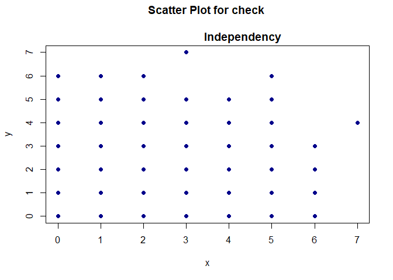
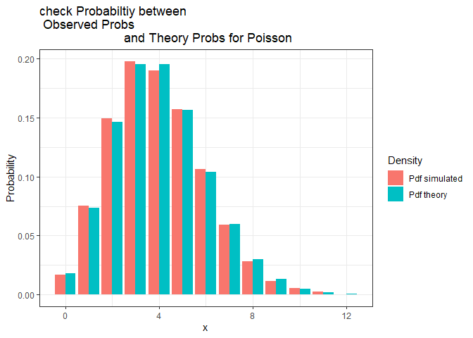
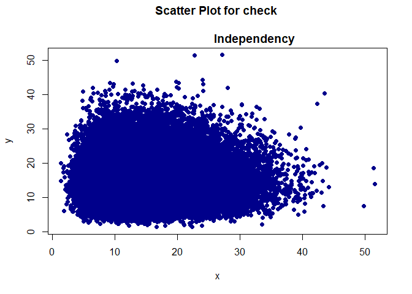
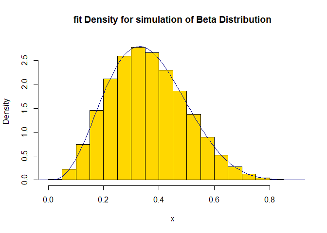

Simulation of Random Variables, Monte Carlo Method With VIsualization
================
Habib Ezzatabadi (Stats9)

## Import Libraries

``` r
if (! require(discretefit)) {
    install.packages("discretefit")
    library(discretefit) # for gof_test for discrete variables
}
```

    ## Loading required package: discretefit

``` r
if (! require(ggplot2)) {
    install.packages("ggplot2")
    library(ggplot2)  # for visualize probabiltiy Plot for 
    # theroy and simulation for discrete variables
}
```

    ## Loading required package: ggplot2

------------------------------------------------------------------------

------------------------------------------------------------------------

## Binomial distribution —- Use Transform Method

$$
\begin{aligned}
& \text{Use This Formula:} \\
& Y = \sum_{i = 1}^n X_i, \quad X_1, X_2, \dots, X_n \overset{iid}{\sim} \text{Bernulli}(p) \implies \\
& Y \sim \text{Binomial} (n, p), \\
& \text{if}\quad U \sim \text{Uniform}(0, 1) \implies\\
& I_{\{U \leq p\}} \sim \text{Bernulli}(p), \\
& \text{I is Indicator Function} = \begin{cases} 
1 & \text{if}\quad U \leq p, \\
0 & \text{if} \quad U > p.
\end{cases}
\end{aligned}
$$

``` r
set.seed(132)
Nsim <- 10**3 # Number of Simulation
nsize <- 10 # Number of Experiment
Prob <- 0.2 # Probabiltiy of Success
U <- matrix(runif(Nsim * nsize), Nsim, nsize) ## Simulate Uniform Distribution
```

``` r
U2 <- 1 * (U < 0.2) ## create A Bernulli variables with Prob = 0.2 
Binom_sim <- rowSums(U2) ## with sum bernulli variables (in row method) 
# we get binomial variables with nsize = 10

dfun1 <- function(x) dbinom(x, size = 10, prob = 0.2)
pfun1 <- function(x) pbinom(x, size = 10, prob = 0.2)
qfun1 <- function(x) qbinom(x, size = 10, prob = 0.2)
Mean_theory <- nsize * Prob
Var_theroy <- nsize * Prob * (1- Prob)
GoF_Graph <- function(x, dfun = dfun1, pfun = pfun1, 
                qfun = qfun1, Graph = TRUE, Nsim = 10**3, dist, 
                legend_position = "topleft") {
                   # x <- sim_geom
                    res1 <- aggregate(x, by = list(x), 
                    function(z) length(z) / Nsim)
                    xx <-sort(unique(x))
                    xd1 <- res1$Group.1
                    yd1 <- res1$x
                    y1 <- cumsum(yd1)
                    zz <- seq(min(x), max(x), len = 10000)
                    y2 <- unlist(lapply(zz, function(x) pfun(floor(x))))
                    yd2 <- dfun1(xd1)
                    dat <- data.frame(x = c(xd1, xd1), y = c(yd1, yd2), 
                    Density = rep(c("Pdf simulated", "Pdf theory"), each = length(xd1)))
                    if(Graph) {
                        plot(x = xx, y = y1, type = "s", col = "red", lty = 2, 
                        xlab = "x", ylab = "Cumulative Density Function", 
                        main = paste0("Observed Cdf vs Theory Cdf for ", dist))
                        lines(x = zz, y = y2, col = "darkblue", lty = 4)
                        legend(legend_position, legend = c("cdf Theory", "cdf simulated"), 
                        col = c("red", "darkblue"), lty = c(2, 4), 
                        bty = "n")
                        plot(x = res1$Group.1, y = res1$x, 
                        type = "h", col = "red", lwd = "10", ylab = "Probabity", 
                        xlab = "x", main = "prob-histogram for Discrete function")

                        P <- ggplot(data = dat, aes(x = x, y = y, fill = Density)) + 
                        geom_col(position = "dodge") + 
                        labs(x = "x", y = "Probability", 
                        title = paste0("check Probabiltiy between \n Observed Probs
                        and Theory Probs for ", dist)) + 
                        theme_bw()
                        print(P)
                        x11 <- x[-1]
                        x22 <- x[-length(x)]
                        plot(x = x11, y = x22, pch = 16, 
                        col = "darkblue", 
                        xlab = "x", ylab = "y", 
                        main = "Scatter Plot for check \n
                        Independency")
                        acf(x, main = "AutoCorrelation Plot")
                    }

                    ## GoodNess Of fit 

                        quant1 <- c(0.25, 0.5, 0.75)
                        quant <- qfun(quant1)
                        check <- function(x) {
                            if (x <= quant[1]) a = 1 else{
                                if (x <= quant[2]) a = 2 else {
                                    if( x <= quant[3]) a = 3 else a = 4 
                                        }
                                    }
                            return (a)
                        }
                        temp1 <- unlist(lapply(x, check))
                        no1 <- sum(temp1 == 1)
                        no2 <- sum(temp1 == 2)
                        no3 <- sum(temp1 == 3)
                        no4 <- sum(temp1 == 4)
                        prr <- c(0.25, diff(quant1), 0.25)
                        nExpect <- Nsim * prr
                        nobserv <- c(no1, no2, no3, no4)
                        return(list(GoodNess_of_Fit = chisq_gof(nobserv, prr), 
                        Moment_result = c(Meen_simulated = mean(x), 
                        Var_simulated = var(x), 
                        Mean_theory = Mean_theory, 
                        Variance_theory = Var_theroy)))
                }


GoF_Graph(x = Binom_sim, dist = "Binomial")
```

<!-- --><!-- --><!-- --><!-- --><!-- -->

    ## $GoodNess_of_Fit
    ## 
    ##  Simulated Chi-squared goodness-of-fit test
    ## 
    ## data:  nobserv
    ## Chi-squared = 144.08, p-value = 9.999e-05
    ## 
    ## 
    ## $Moment_result
    ##  Meen_simulated   Var_simulated     Mean_theory Variance_theory 
    ##        2.030000        1.580681        2.000000        1.600000

------------------------------------------------------------------------

------------------------------------------------------------------------

## Geometric Distribution —

$$
\begin{aligned}
& \text{Use This Formula:} \\
& \text{if} \quad U \sim \text{Uniform}(0, 1) \implies \\ 
& \left \lfloor \frac{\ln(U)}{\ln(1-p)}  \right\rfloor \sim \text{Geometric}(p), \\
& 0 < p < 1.
\end{aligned}
$$

``` r
Prob = 0.35
set.seed(132)
nsim <- 10**4
sim_geom <- floor(log(runif(nsim)) / log(1-Prob))

dfun1 <- function(x) dgeom(x, prob = 0.35)
pfun1 <- function(x) pgeom(x, prob = 0.35)
qfun1 <- function(x) qgeom(x, prob = 0.35)
Mean_theory <- (1-Prob) / Prob
Var_theroy <- (1-Prob)  / Prob ** 2

GoF_Graph(sim_geom, Nsim = nsim, dist = "Geometric", 
            legend_position = "bottomright")
```

<!-- --><!-- --><!-- --><!-- --><!-- -->

    ## $GoodNess_of_Fit
    ## 
    ##  Simulated Chi-squared goodness-of-fit test
    ## 
    ## data:  nobserv
    ## Chi-squared = 583.39, p-value = 9.999e-05
    ## 
    ## 
    ## $Moment_result
    ##  Meen_simulated   Var_simulated     Mean_theory Variance_theory 
    ##        1.877900        5.282920        1.857143        5.306122

------------------------------------------------------------------------

------------------------------------------------------------------------

## Hyper Geometric Distribution ——————

``` r
set.seed(132)
nsim = 10**4
k <- 9 # sample size
m <- 15 #  Number of Desirable states
n <- 25 # Number of Undesirable States 
N <- m + n # Total Number of states
hyper_sim <- rhyper(nsim, m = m, n = n, k = k)
dfun1 <- function(x) dhyper(x, m = m, n = n, k = k)
pfun1 <- function(x) phyper(x, m = m, n = n, k = k)
qfun1 <- function(x) qhyper(x, m = m, n = n, k = k)
pp <- m / N
Mean_theory <- k * pp
Var_theroy <- k * pp * (1 - pp) * ((N - k) / (N - 1))


GoF_Graph(hyper_sim, Nsim = nsim, dist = "HyperGeometric")
```

<!-- --><!-- --><!-- --><!-- --><!-- -->

    ## $GoodNess_of_Fit
    ## 
    ##  Simulated Chi-squared goodness-of-fit test
    ## 
    ## data:  nobserv
    ## Chi-squared = 254.99, p-value = 9.999e-05
    ## 
    ## 
    ## $Moment_result
    ##  Meen_simulated   Var_simulated     Mean_theory Variance_theory 
    ##        3.361000        1.707650        3.375000        1.676683

------------------------------------------------------------------------

------------------------------------------------------------------------

## Negative Binomial

$$
\begin{aligned}
& \text{We Use this Formula:} \\
& \text{if} \quad X_1, X_2, \dots, X_r \overset{iid}{\sim} \text{Geom}(p) \implies \\
& Y = \sum_{i = 1}^n  X_i  \sim \text{Negative Binomial}(r, p).
\end{aligned}
$$

``` r
Prob = 0.44

r = 12

set.seed(132)
nsim <- 10**4
sim_1 <- matrix(floor(log(runif(nsim * r)) / log(1-Prob)), 
nsim, r)

neg_sim <- rowSums(sim_1)

dfun1 <- function(x) dnbinom(x, size = r, prob = Prob)
pfun1 <- function(x) pnbinom(x, size = r, prob = Prob)
qfun1 <- function(x) qnbinom(x, size = r, prob = Prob)
Mean_theory <- r * (1-Prob) / Prob
Var_theroy <- r * (1-Prob)  / Prob ** 2

GoF_Graph(neg_sim, Nsim = nsim, dist = "NegativeBinomial")
```

<!-- --><!-- --><!-- --><!-- --><!-- -->

    ## $GoodNess_of_Fit
    ## 
    ##  Simulated Chi-squared goodness-of-fit test
    ## 
    ## data:  nobserv
    ## Chi-squared = 107.83, p-value = 9.999e-05
    ## 
    ## 
    ## $Moment_result
    ##  Meen_simulated   Var_simulated     Mean_theory Variance_theory 
    ##        15.35380        35.35236        15.27273        34.71074

------------------------------------------------------------------------

------------------------------------------------------------------------

## Poisson Distribution ——————————

$$
\begin{aligned}
& \text{We Use This Formula:}\\
& \text{if} \quad U_1, U_2, \dots , U_r \overset{iid}{\sim} \text{Uniform}(0, 1),\\
& \text{Such That}\quad \prod_{i = 1}^r U_i \leq \exp(-\lambda) ~~\text{and}~~\text{Such That}\quad \prod_{i = 1}^{r - 1} U_i > \exp(-\lambda) \implies \\
& \text{r-1 is a simulate from Poisson ditribuion with parameter} ~\lambda.  
\end{aligned}
$$

``` r
set.seed(132)
lambda <- 4

nsim <- 10**4

pois_sim <- c()
i <- 0
temp <- exp(-lambda)
while (i < nsim) {
    u <- runif(1)
    if (u < temp) {
        i = i + 1
        pois_sim[i] <- 0
        } else{
            temp2 <- c(u)
            while(prod(temp2) > temp) temp2 <- c(temp2, runif(1))
            i = i + 1
            k <- length(temp2)
            pois_sim[i] <- k - 1
        } 
    
}

dfun1 <- function(x) dpois(x, lambda = lambda)
pfun1 <- function(x) ppois(x, lambda = lambda)
qfun1 <- function(x) qpois(x, lambda = lambda)
Mean_theory <- lambda
Var_theroy <- lambda

GoF_Graph(pois_sim, Nsim = nsim, dist = "Poisson")
```

<!-- --><!-- --><!-- --><!-- --><!-- -->

    ## $GoodNess_of_Fit
    ## 
    ##  Simulated Chi-squared goodness-of-fit test
    ## 
    ## data:  nobserv
    ## Chi-squared = 1967, p-value = 9.999e-05
    ## 
    ## 
    ## $Moment_result
    ##  Meen_simulated   Var_simulated     Mean_theory Variance_theory 
    ##        3.988500        3.968365        4.000000        4.000000

------------------------------------------------------------------------

------------------------------------------------------------------------

## Normal Distribution —————-

$$
\begin{aligned}
& \text{We Use Box-Muller Formula for Simulation Normal Distribution:} \\
& Z_1 = \sqrt{-2\times \ln(U_1)} \cos(2\pi U_2), \\
& Z_2 = \sqrt{-2\times \ln(U_2)}\sin(2\pi U_1), \\
& U_1, U_2 \overset{iid}{\sim} \text{Uniform}(0, 1) \implies \\
& Z_1, Z_2 \overset{iid}{\sim} \mathcal{N}(0, 1), \\
& \text{We Now That if}~ Z \sim \mathcal{N}(0, 1) \implies\\
& Y = \sigma \times Z + \mu \implies Y \sim \mathcal{N}(\mu, \sigma^2).
\end{aligned}
$$

``` r
set.seed(132)
## define a function for continuous distribution ---------------


GoF_Graph2 <- function(x, dfun = dfun1, pfun = pfun1, 
                qfun = qfun1, Graph = TRUE, Nsim = 10**3, 
                Params, dist = "Normal", dist_fun = "pnorm", Bounds = c(-15, 15), 
                ylim = c(0, 0.14)) {
                    if(Graph) {
                        hist(x, prob = TRUE, main = 
                        paste0("fit Density for simulation of ", dist, " Distribution"), 
                        col = "gold", ylim = ylim)
                        curve(dfun, extendrange(x)[1], extendrange(x)[2], 
                        col = "darkblue", add = TRUE, lwd = 1.5)

                        ## Define quantiles for get qqplot
                        qq1 <- seq(0.01, 0.99, by = 0.02)
                        get_quant_fun <- function(q) {
                            temp11 <- function(x) abs(integrate(dfun, lower = 
                            Bounds[1], upper = x)$value - q)
                            xq <- optim(fn = temp11, par = 1, method = "Brent", 
                            lower = Bounds[1], upper = Bounds[2])$par
                            return(xq)
                        }
                        Get_Quant <- Vectorize(get_quant_fun)
                        theory_q <- Get_Quant(qq1)
                        sim_q <- quantile(x, p = qq1)

                        ## QQ Plot
                        plot(x = theory_q, y = sim_q, xlab = "Expected Values", 
                        ylab = "Observation Values", main = paste0("QQ Plot for ", 
                        dist, " Distribuion"),
                        pch = 16, col = "tomato", cex = 2)
                        abline(a = 0, b = 1, col = "darkblue", lwd = 1.5)

                        ## for check independency
                        x11 <- x[-1]
                        x22 <- x[-length(x)]
                        plot(x = x11, y = x22, pch = 16, 
                        col = "darkblue", 
                        xlab = "x", ylab = "y", 
                        main = "Scatter Plot for check \n
                        Independency")
                        acf(x, main = "AutoCorrelation Plot")
                    }

                    ## GoodNess Of fit 

                        quant1 <- c(0.25, 0.5, 0.75)
                        quant <- qfun(quant1)
                        check <- function(x) {
                            if (x <= quant[1]) a = 1 else{
                                if (x <= quant[2]) a = 2 else {
                                    if( x <= quant[3]) a = 3 else a = 4 
                                        }
                                    }
                            return (a)
                        }
                        temp1 <- unlist(lapply(x, check))
                        no1 <- sum(temp1 == 1)
                        no2 <- sum(temp1 == 2)
                        no3 <- sum(temp1 == 3)
                        no4 <- sum(temp1 == 4)
                        prr <- c(0.25, diff(quant1), 0.25)
                        nExpect <- Nsim * prr
                        nobserv <- c(no1, no2, no3, no4)
                        Res = if (length(Params) > 1) ks.test(x, dist_fun, 
                        Params[1], Params[2]) else {
                                ks.test(x, dist_fun, Params[1])
                        }
                        return(list(GoodNess_of_Fit = chisq_gof(nobserv, prr), 
                        KS_test = Res, 
                        Moment_result = c(Meen_simulated = mean(x), 
                        Var_simulated = var(x), 
                        Mean_theory = Mean_theory, 
                        Variance_theory = Var_theroy)))
                }
Nsim <- 10**5 # number of simulation
U1 <- runif(Nsim); U2 <- runif(Nsim) # define U1, U2
Z <- sqrt(-2*log(U1)) * cos(2 * pi * U2) # simulate Standard Normal
mu <- 5 # define Mean 
sigma2 <- 10 # define Variance
norm_sim <- sqrt(sigma2) * Z + mu # Define Y as normal Rv with
Mean_theory <- mu; Var_theroy <- sigma2
# with Mean = mu, Variance = sigma2
dfun1 = function(x) dnorm(x, mean = mu, sd = sqrt(sigma2))
pfun1 = function(x) pnorm(x, mean = mu, sd = sqrt(sigma2))
qfun1 = function(x) qnorm(x, mean = mu, sd = sqrt(sigma2))
GoF_Graph2(norm_sim, Params = c(mu, sqrt(sigma2)), qfun = qfun1, 
dfun = dfun1)
```

<!-- --><!-- --><!-- --><!-- -->

    ## $GoodNess_of_Fit
    ## 
    ##  Simulated Chi-squared goodness-of-fit test
    ## 
    ## data:  nobserv
    ## Chi-squared = 2.1417, p-value = 0.5399
    ## 
    ## 
    ## $KS_test
    ## 
    ##  Asymptotic one-sample Kolmogorov-Smirnov test
    ## 
    ## data:  x
    ## D = 0.0024242, p-value = 0.5993
    ## alternative hypothesis: two-sided
    ## 
    ## 
    ## $Moment_result
    ##  Meen_simulated   Var_simulated     Mean_theory Variance_theory 
    ##        4.998017       10.045137        5.000000       10.000000

------------------------------------------------------------------------

------------------------------------------------------------------------

## Uniform Distribution

$$
\begin{aligned}
& \text{We Use This Formula:} \\
& \text{if} \quad U \sim \text{Uniform}(0, 1) \implies \\
& a, ~b \in \mathbb{R}, ~~ a < b~~ \to \quad X = (b - a) \times U + a \implies \\
& X \sim \text{Uniform}(a, b)
\end{aligned}
$$

``` r
set.seed(132)
Nsim <- 10**3 # number of simulation
a <- -2 # Lower bond for uniform distrbution
b <- 5 # Upper Bond for Uniform Distribution

# Define Y with Uniform Distribution between a, b
sim_unif <- (b - a) * runif(Nsim) + a
Mean_theory <- (b + a) / 2; Var_theroy <- (b - a)^2 / 12

dfun1 = function(x) dunif(x, min = a, max = b)
pfun1 = function(x) punif(x, min = a, max = b)
qfun1 = function(x) qunif(x, min = a, max = b)
GoF_Graph2(sim_unif, Params = c(a, b), qfun = qfun1, 
dfun = dfun1, dist = "Uniform", dist_fun = "punif", 
Bounds = c(-2, 5), ylim = c(0, 0.16))
```

<!-- --><!-- --><!-- --><!-- -->

    ## $GoodNess_of_Fit
    ## 
    ##  Simulated Chi-squared goodness-of-fit test
    ## 
    ## data:  nobserv
    ## Chi-squared = 1.64, p-value = 0.6507
    ## 
    ## 
    ## $KS_test
    ## 
    ##  Asymptotic one-sample Kolmogorov-Smirnov test
    ## 
    ## data:  x
    ## D = 0.017096, p-value = 0.9319
    ## alternative hypothesis: two-sided
    ## 
    ## 
    ## $Moment_result
    ##  Meen_simulated   Var_simulated     Mean_theory Variance_theory 
    ##        1.516837        4.240493        1.500000        4.083333

------------------------------------------------------------------------

------------------------------------------------------------------------

## $\chi^2$ Distribution ———————–

$$
\begin{aligned}
& \text{For Simulate}~ \chi^2~~ \text{Random Variables We Use This Formula:} \\
& \text{if} \quad Z_1, Z_2, \dots, Z_n \overset{iid}{\sim} \mathcal{N}(0, 1) \implies \\
& Y = \sum_{i = 1}^n Z_i^2 \implies Y \sim \chi^2_{(\text{df} = n)}, \\
& \text{For simulate}~ Z_i ~\text{We Use Box-Muller Algorithm, which is given above. }
\end{aligned}
$$

``` r
set.seed(132)
DF = 15
Nsim = 10**5

U1 <- runif(Nsim * DF); U2 <- runif(Nsim * DF) # define U1, U2
Z <- sqrt(-2*log(U1)) * cos(2 * pi * U2) # simulate Standard Normal

mat_sim <- matrix(Z, Nsim, DF) ** 2
sim_chi <- rowSums(mat_sim)

Mean_theory <- DF; Var_theroy <- 2 * DF
# with Mean = mu, Variance = sigma2
dfun1 = function(x) dchisq(x, df = DF)
pfun1 = function(x) pchisq(x, df = DF)
qfun1 = function(x) qchisq(x, df = DF)
GoF_Graph2(sim_chi, Params = DF, qfun = qfun1, 
dfun = dfun1, dist = "Chisquare", dist_fun = "pchisq", 
Bounds = c(2, 46), ylim = c(0, 0.09))
```

<!-- --><!-- --><!-- --><!-- -->

    ## $GoodNess_of_Fit
    ## 
    ##  Simulated Chi-squared goodness-of-fit test
    ## 
    ## data:  nobserv
    ## Chi-squared = 0.366, p-value = 0.9495
    ## 
    ## 
    ## $KS_test
    ## 
    ##  Asymptotic one-sample Kolmogorov-Smirnov test
    ## 
    ## data:  x
    ## D = 0.0015342, p-value = 0.9727
    ## alternative hypothesis: two-sided
    ## 
    ## 
    ## $Moment_result
    ##  Meen_simulated   Var_simulated     Mean_theory Variance_theory 
    ##        14.99048        29.77255        15.00000        30.00000

------------------------------------------------------------------------

------------------------------------------------------------------------

## $\Gamma$ Distribution ——————

``` r
set.seed(132)
Nsim = 10 ** 5
Shape <- 2.2
Rate <- 3.2
Gamma_sim <- rgamma(n = Nsim, shape = Shape, rate= Rate)

Mean_theory <- Shape / Rate; Var_theroy <- Shape / Rate **2

dfun1 = function(x) dgamma(x, shape = Shape, rate = Rate)
pfun1 = function(x) pgamma(x, shape = Shape, rate = Rate)
qfun1 = function(x) qgamma(x, shape = Shape, rate = Rate)

GoF_Graph2(Gamma_sim, Params = c(Shape, Rate), qfun = qfun1, 
dfun = dfun1, dist = "Gamma", dist_fun = "pgamma", 
Bounds = c(0.001, 5), ylim = c(0, 1.15))
```

<!-- --><!-- --><!-- --><!-- -->

    ## $GoodNess_of_Fit
    ## 
    ##  Simulated Chi-squared goodness-of-fit test
    ## 
    ## data:  nobserv
    ## Chi-squared = 3.9953, p-value = 0.2544
    ## 
    ## 
    ## $KS_test
    ## 
    ##  Asymptotic one-sample Kolmogorov-Smirnov test
    ## 
    ## data:  x
    ## D = 0.0026742, p-value = 0.4719
    ## alternative hypothesis: two-sided
    ## 
    ## 
    ## $Moment_result
    ##  Meen_simulated   Var_simulated     Mean_theory Variance_theory 
    ##       0.6892005       0.2179463       0.6875000       0.2148437

------------------------------------------------------------------------

------------------------------------------------------------------------

## $\mathbb{\beta}$ Distribution ———-

$$
\begin{aligned}
& \text{for Simulate Beta Distribution, We Use This Formula:} \\
& \text{if} \quad X_1 \sim \Gamma(\alpha_1, \beta), \quad X_2 \sim \Gamma(\alpha_2, \beta), \quad X_1 \perp\!\!\!\!\perp X_2 \implies  \\
& \text{if} \quad Y = \frac{X_1}{X_1 + X_2} \implies Y \sim \mathbb{\beta}(\alpha_1, \alpha_2)
\end{aligned}
$$

``` r
set.seed(132)
Nsim = 10**5
Shape1 <- 4.1 ## shape of beta distribution
Shape2 <- 7.3 ## shape of beta distribution
Rate <- 3.2 ## rate of gamma distribution
X1 <- rgamma(n = Nsim, shape = Shape1, rate= Rate)
X2 <- rgamma(n = Nsim, shape = Shape2, rate = Rate)
beta_sim <- X1 / (X1 + X2)

Mean_theory <- Shape1 / (Shape1 + Shape2); 
Var_theroy <- (Shape1 * Shape2) /
                ((Shape1 + Shape2) ** 2 * (Shape1 + Shape2 + 1))

dfun1 = function(x) dbeta(x, shape1 = Shape1, shape2 = Shape2)
pfun1 = function(x) pbeta(x, shape1 = Shape1, shape2 = Shape2)
qfun1 = function(x) qbeta(x, shape1 = Shape1, shape2 = Shape2)

GoF_Graph2(beta_sim, Params = c(Shape1, Shape2), qfun = qfun1, 
dfun = dfun1, dist = "Beta", dist_fun = "pbeta", 
                    Bounds = c(0.01, 0.95), ylim = c(0, 2.85))
```

<!-- --><!-- --><!-- --><!-- -->

    ## $GoodNess_of_Fit
    ## 
    ##  Simulated Chi-squared goodness-of-fit test
    ## 
    ## data:  nobserv
    ## Chi-squared = 3.0642, p-value = 0.3785
    ## 
    ## 
    ## $KS_test
    ## 
    ##  Asymptotic one-sample Kolmogorov-Smirnov test
    ## 
    ## data:  x
    ## D = 0.0023225, p-value = 0.6534
    ## alternative hypothesis: two-sided
    ## 
    ## 
    ## $Moment_result
    ##  Meen_simulated   Var_simulated     Mean_theory Variance_theory 
    ##      0.36006599      0.01864818      0.35964912      0.01857271

------------------------------------------------------------------------

------------------------------------------------------------------------

## Fisher Distribution ————-

$$
\begin{aligned}
& \text{for Simulate Fisher Random Variables, We Use This Formula:} \\
& \text{if}\quad X_1 \sim \chi^2(\text{df} = n_1), \quad X_2 \sim \chi^2(\text{df} = n_2), \quad X_1 \perp\!\!\!\!\perp X_2 \implies \\
& \text{if}\quad Y = \frac{\frac{X_1}{n_1}}{\frac{X_2}{n_2}} \implies \quad Y \sim F(\text{df}_1 = n_1, ~\text{df}_2 = n_2), \\
& \text{for simulate}~~X_1, X_2, \\
& \text{We Use Relation between Normal Standard Distribution and Chisquare Distribution, which given above lines.}
\end{aligned}
$$

``` r
set.seed(132)
DF1 = 8; DF2 = 12
Nsim = 10**5

U1 <- runif(Nsim * DF1); U2 <- runif(Nsim * DF1) # define U1, U2
Z <- sqrt(-2*log(U1)) * cos(2 * pi * U2) # simulate Standard Normal

mat_sim <- matrix(Z, Nsim, DF1) ** 2
X1 <- rowSums(mat_sim)


U12 <- runif(Nsim * DF2); U22 <- runif(Nsim * DF2)
Z2 <- sqrt(-2*log(U12)) * cos(2 * pi * U22) 

mat_sim2 <- matrix(Z2, Nsim, DF2) ** 2
X2 <- rowSums(mat_sim2)

F_sim <- (X1 / DF1) / (X2 / DF2)
Mean_theory <- DF2 / (DF2 - 2); 
Var_theroy <- (2 * DF2 ** 2 * (DF2 + DF1 - 2)) / 
                (DF1 * (DF2 - 2) ** 2 * (DF2 - 4))
# with Mean = mu, Variance = sigma2
dfun1 = function(x) df(x, df1 = DF1, df2 = DF2)
pfun1 = function(x) pf(x, df1 = DF1, df2 = DF2)
qfun1 = function(x) qf(x, df1 = DF1, df2 = DF2)
GoF_Graph2(F_sim, Params = c(DF1, DF2), qfun = qfun1, 
dfun = dfun1, dist = "F", dist_fun = "pf", 
        Bounds = c(0.01, 14), ylim = c(0, 0.77))
```

<!-- --><!-- --><!-- --><!-- -->

    ## $GoodNess_of_Fit
    ## 
    ##  Simulated Chi-squared goodness-of-fit test
    ## 
    ## data:  nobserv
    ## Chi-squared = 1.8894, p-value = 0.5923
    ## 
    ## 
    ## $KS_test
    ## 
    ##  Asymptotic one-sample Kolmogorov-Smirnov test
    ## 
    ## data:  x
    ## D = 0.0024498, p-value = 0.5858
    ## alternative hypothesis: two-sided
    ## 
    ## 
    ## $Moment_result
    ##  Meen_simulated   Var_simulated     Mean_theory Variance_theory 
    ##       1.2019195       0.8142588       1.2000000       0.8100000
