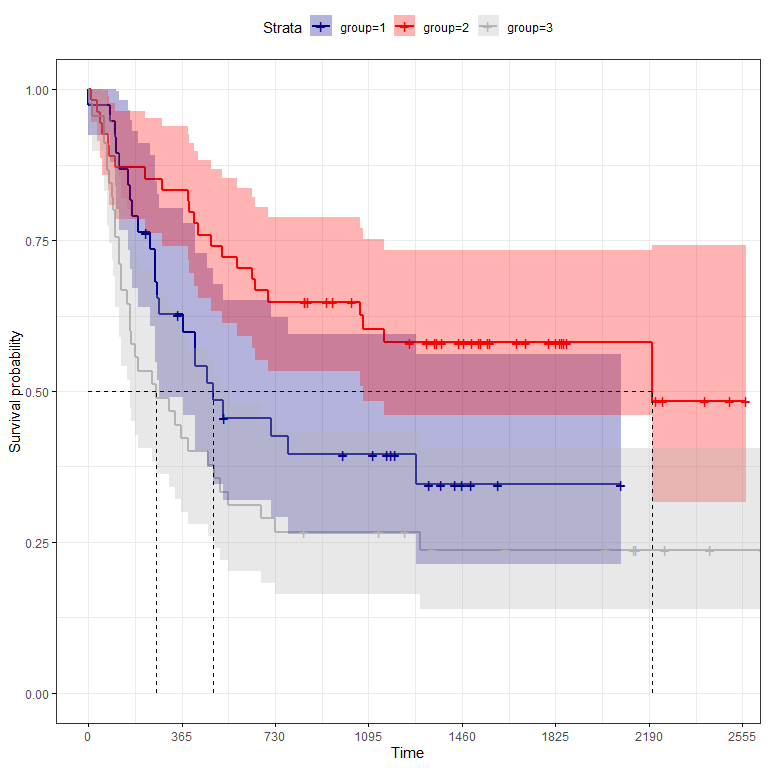
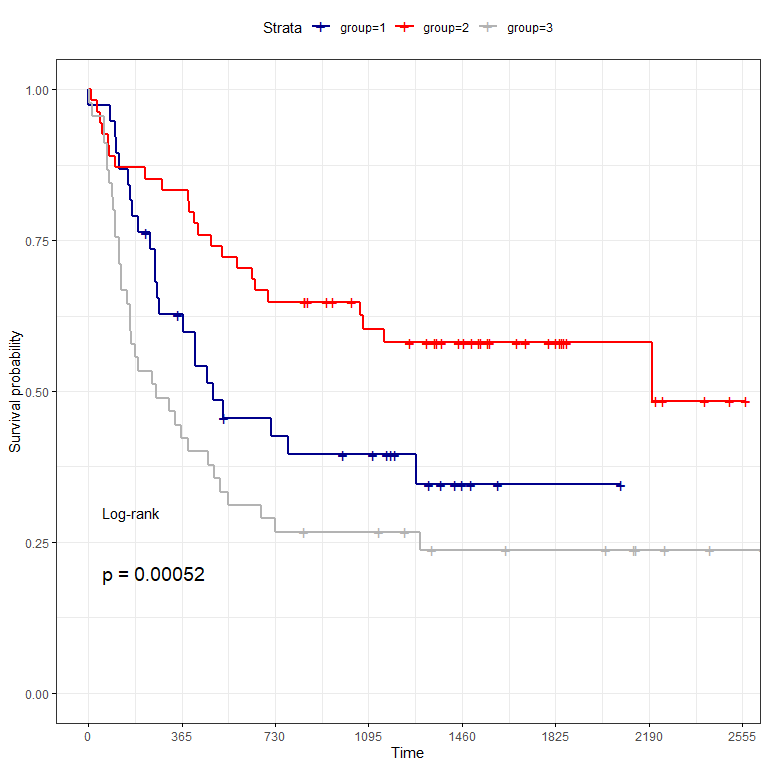
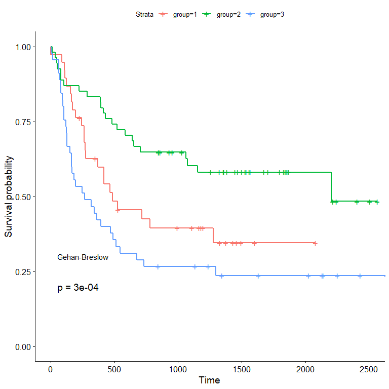
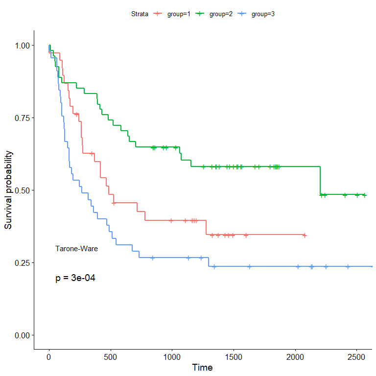
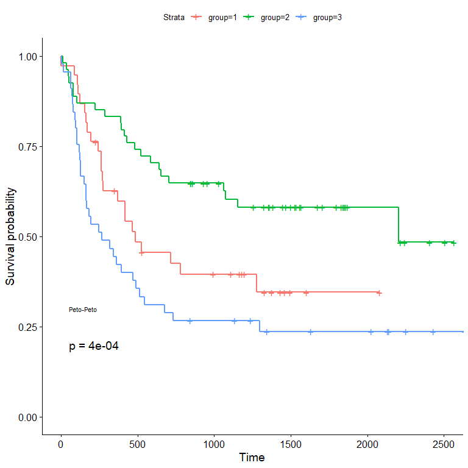
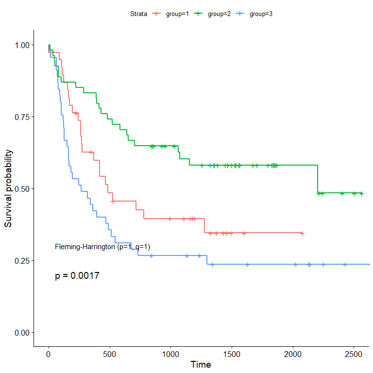

# sample code for survival analysis


``` r
library(tidyverse) # for manipulate data 
library(survival) # for survival analysis
library(survminer) # for survival analysis and plot survival function
library(survMisc) # for suvival analysis
library(rstatix) # for manipulate dataframe
library(readstata13) # for read stata data
library(summarytools) # for get summary for more details
library(gtsummary)
```

``` r
## define data
censor1 <- rep(FALSE, 25)
censor2 <- rep(FALSE, 25)
censor1[c(1, 4, 12)] <- TRUE
group1 <- c(12.3, 5.4, 8.2, 12.2, 11.7, 10.0, 5.7, 
9.8, 2.6, 11.0, 9.2, 12.1, 6.6, 2.2, 1.8, 
10.2, 10.7, 11.1, 5.3, 3.5, 9.2, 2.5, 8.7, 3.8, 3.0)

group2 <- c(5.8, 2.9, 8.4, 8.3, 9.1, 4.2, 4.1, 
1.8, 3.1, 11.4, 2.4, 1.4, 5.9, 
1.6, 2.8, 4.9, 3.5, 6.5, 9.9, 3.6, 5.2, 
8.8, 7.8, 4.7, 3.9)

get_table_suvival <- function(group_time = group1, censor = censor1, 
nsubject = 25){
    tbar <- mean(group_time)
    hbar <- sum(!censor)/sum(group_time)
    dat <- cbind(group_time, censor) %>% as.data.frame %>%
    mutate(tf = group_time, group_time = NULL, 
    mf = 1*(!censor), qf = censor) %>%
    add_row(tf = 0, mf = 0, qf = 0) %>%
    arrange(tf) %>%
    mutate(Rtf = nsubject - cumsum(mf)-cumsum(qf), censor = NULL) 
    get_fun_col_var <- function(x = dat, var = 'tf'){
        new_dat = data.frame(tf = NA, 
        mf = NA, qf = NA, Rtf = NA)
        n <- nrow(x)
        col_subject = x[var]
        unique_col = unique(col_subject) %>% unlist
        for(ind in unique_col){
            #ind = unique_col[1]
            temp = x %>%
                # dplyr :: filter(x[var] == ind)
                base :: subset(x[var] == ind)
            temp2 <- temp %>%
                mutate(tf = tf, mf = sum(mf), qf = sum(qf), 
                Rtf = Rtf) %>%
                .[nrow(.), ]
            new_dat = rbind(new_dat, temp2)
        }
        new_dat <- na.omit(new_dat)
        return(new_dat)
    }
    dat2 <- get_fun_col_var(dat, 'tf')
    fun_tidy_censor <- function(x = dat2){
        x <- x %>% mutate(ind_censor = (qf == 0 | mf > 0))
        n <- nrow(x)
        for(i in 1:(n-1)){
            if(x[(i+1), 'mf'] == 0){
                temp1 = 0
                for(j in (i + 1):n){
                    if(x[j, 'mf'] == 0){
                        x[i, 'qf'] = x[i, 'qf'] + x[j, 'qf']
                        }else{
                            break
                    }
                }
            }
        }
        Rtf <- x[, 'Rtf']
        newRtf = c(Rtf[1], Rtf[1:n-1])
        x = x %>% mutate(Rtf = newRtf)
        x <- x[x$ind_censor, ] %>% mutate(ind_censor = NULL)
        row.names(x) <- NULL
        return(x)
    }
    dat3 <- fun_tidy_censor(dat2)
    return(list(Table_Survival_time = dat3, Tbar = tbar, hbar = hbar))
}

get_table_suvival(group_time = group1, censor = censor1, nsubject = 25)
```

    $Table_Survival_time
         tf mf qf Rtf
    1   0.0  0  0  25
    2   1.8  1  0  25
    3   2.2  1  0  24
    4   2.5  1  0  23
    5   2.6  1  0  22
    6   3.0  1  0  21
    7   3.5  1  0  20
    8   3.8  1  0  19
    9   5.3  1  0  18
    10  5.4  1  0  17
    11  5.7  1  0  16
    12  6.6  1  0  15
    13  8.2  1  0  14
    14  8.7  1  0  13
    15  9.2  2  0  12
    16  9.8  1  0  10
    17 10.0  1  0   9
    18 10.2  1  0   8
    19 10.7  1  0   7
    20 11.0  1  0   6
    21 11.1  1  0   5
    22 11.7  1  3   4

    $Tbar
    [1] 7.552

    $hbar
    [1] 0.1165254

``` r
get_table_suvival(group_time = group2, censor = censor2, nsubject = 25)
```

    $Table_Survival_time
         tf mf qf Rtf
    1   0.0  0  0  25
    2   1.4  1  0  25
    3   1.6  1  0  24
    4   1.8  1  0  23
    5   2.4  1  0  22
    6   2.8  1  0  21
    7   2.9  1  0  20
    8   3.1  1  0  19
    9   3.5  1  0  18
    10  3.6  1  0  17
    11  3.9  1  0  16
    12  4.1  1  0  15
    13  4.2  1  0  14
    14  4.7  1  0  13
    15  4.9  1  0  12
    16  5.2  1  0  11
    17  5.8  1  0  10
    18  5.9  1  0   9
    19  6.5  1  0   8
    20  7.8  1  0   7
    21  8.3  1  0   6
    22  8.4  1  0   5
    23  8.8  1  0   4
    24  9.1  1  0   3
    25  9.9  1  0   2
    26 11.4  1  0   1

    $Tbar
    [1] 5.28

    $hbar
    [1] 0.1893939

``` r
###################################
# load data:
mydata <- read.dta13(file = './data/data_transplant.dta')
mydata %>%
convert_as_factor(sex, FAB, CMV, group) -> dat
dfSummary(dat)
```

    Data Frame Summary  
    dat  
    Dimensions: 137 x 8  
    Duplicates: 0  

    -------------------------------------------------------------------------------------------------------------
    No   Variable    Stats / Values              Freqs (% of Valid)    Graph                 Valid      Missing  
    ---- ----------- --------------------------- --------------------- --------------------- ---------- ---------
    1    id          Mean (sd) : 69 (39.7)       137 distinct values   : : : : : :           137        0        
         [numeric]   min < med < max:                                  : : : : : : :         (100.0%)   (0.0%)   
                     1 < 69 < 137                                      : : : : : : :                             
                     IQR (CV) : 68 (0.6)                               : : : : : : :                             
                                                                       : : : : : : :                             

    2    group       1. 1                        38 (27.7%)            IIIII                 137        0        
         [factor]    2. 2                        54 (39.4%)            IIIIIII               (100.0%)   (0.0%)   
                     3. 3                        45 (32.8%)            IIIIII                                    

    3    time        Mean (sd) : 839.2 (727.4)   131 distinct values   :                     137        0        
         [numeric]   min < med < max:                                  :                     (100.0%)   (0.0%)   
                     1 < 547 < 2640                                    :                                         
                     IQR (CV) : 1194 (0.9)                             : . :                                     
                                                                       : : : : :                                 

    4    event       Min  : 0                    0 : 57 (41.6%)        IIIIIIII              137        0        
         [numeric]   Mean : 0.6                  1 : 80 (58.4%)        IIIIIIIIIII           (100.0%)   (0.0%)   
                     Max  : 1                                                                                    

    5    age         Mean (sd) : 28.4 (9.6)      40 distinct values        . : : .           137        0        
         [numeric]   min < med < max:                                      : : : : :         (100.0%)   (0.0%)   
                     7 < 28 < 52                                           : : : : :                             
                     IQR (CV) : 14 (0.3)                                 : : : : : : : .                         
                                                                       . : : : : : : : : :                       

    6    sex         1. 0                        57 (41.6%)            IIIIIIII              137        0        
         [factor]    2. 1                        80 (58.4%)            IIIIIIIIIII           (100.0%)   (0.0%)   

    7    CMV         1. 0                        69 (50.4%)            IIIIIIIIII            137        0        
         [factor]    2. 1                        68 (49.6%)            IIIIIIIII             (100.0%)   (0.0%)   

    8    FAB         1. 0                        92 (67.2%)            IIIIIIIIIIIII         137        0        
         [factor]    2. 1                        45 (32.8%)            IIIIII                (100.0%)   (0.0%)   
    -------------------------------------------------------------------------------------------------------------

``` r
mymodel <- survfit(Surv(time, event) ~ group, data = dat)
summary(mymodel) -> M
print(M)
```

    Call: survfit(formula = Surv(time, event) ~ group, data = dat)

                    group=1 
     time n.risk n.event survival std.err lower 95% CI upper 95% CI
        1     38       1    0.974  0.0260        0.924        1.000
       86     37       1    0.947  0.0362        0.879        1.000
      107     36       1    0.921  0.0437        0.839        1.000
      110     35       1    0.895  0.0498        0.802        0.998
      122     34       1    0.868  0.0548        0.767        0.983
      156     33       1    0.842  0.0592        0.734        0.966
      162     32       1    0.816  0.0629        0.701        0.949
      172     31       1    0.789  0.0661        0.670        0.930
      194     30       1    0.763  0.0690        0.639        0.911
      243     28       1    0.736  0.0717        0.608        0.891
      262     27       2    0.681  0.0760        0.548        0.848
      269     25       1    0.654  0.0777        0.518        0.826
      276     24       1    0.627  0.0791        0.489        0.803
      371     22       1    0.598  0.0805        0.460        0.779
      417     21       1    0.570  0.0815        0.431        0.754
      418     20       1    0.541  0.0823        0.402        0.729
      466     19       1    0.513  0.0828        0.374        0.704
      487     18       1    0.484  0.0829        0.346        0.678
      526     17       1    0.456  0.0828        0.319        0.651
      716     15       1    0.426  0.0827        0.291        0.623
      781     14       1    0.395  0.0822        0.263        0.594
     1279      8       1    0.346  0.0855        0.213        0.561

                    group=2 
     time n.risk n.event survival std.err lower 95% CI upper 95% CI
       10     54       1    0.981  0.0183        0.946        1.000
       35     53       1    0.963  0.0257        0.914        1.000
       48     52       1    0.944  0.0312        0.885        1.000
       53     51       1    0.926  0.0356        0.859        0.998
       79     50       1    0.907  0.0394        0.833        0.988
       80     49       1    0.889  0.0428        0.809        0.977
      105     48       1    0.870  0.0457        0.785        0.965
      222     47       1    0.852  0.0483        0.762        0.952
      288     46       1    0.833  0.0507        0.740        0.939
      390     45       1    0.815  0.0529        0.718        0.925
      393     44       1    0.796  0.0548        0.696        0.911
      414     43       1    0.778  0.0566        0.674        0.897
      431     42       1    0.759  0.0582        0.653        0.882
      481     41       1    0.741  0.0596        0.633        0.867
      522     40       1    0.722  0.0610        0.612        0.852
      583     39       1    0.704  0.0621        0.592        0.837
      641     38       1    0.685  0.0632        0.572        0.821
      653     37       1    0.667  0.0642        0.552        0.805
      704     36       1    0.648  0.0650        0.533        0.789
     1063     29       1    0.626  0.0665        0.508        0.771
     1074     28       1    0.603  0.0678        0.484        0.752
     1156     27       1    0.581  0.0688        0.461        0.733
     2204      6       1    0.484  0.1054        0.316        0.742

                    group=3 
     time n.risk n.event survival std.err lower 95% CI upper 95% CI
        2     45       1    0.978  0.0220        0.936        1.000
       16     44       1    0.956  0.0307        0.897        1.000
       62     43       1    0.933  0.0372        0.863        1.000
       63     42       1    0.911  0.0424        0.832        0.998
       73     41       1    0.889  0.0468        0.802        0.986
       74     40       1    0.867  0.0507        0.773        0.972
       80     39       1    0.844  0.0540        0.745        0.957
       93     38       1    0.822  0.0570        0.718        0.942
       97     37       1    0.800  0.0596        0.691        0.926
      105     36       2    0.756  0.0641        0.640        0.892
      121     34       1    0.733  0.0659        0.615        0.875
      122     33       1    0.711  0.0676        0.590        0.857
      128     32       1    0.689  0.0690        0.566        0.838
      129     31       1    0.667  0.0703        0.542        0.820
      153     30       1    0.644  0.0714        0.519        0.801
      162     29       1    0.622  0.0723        0.496        0.781
      164     28       1    0.600  0.0730        0.473        0.762
      168     27       1    0.578  0.0736        0.450        0.742
      183     26       1    0.556  0.0741        0.428        0.721
      195     25       1    0.533  0.0744        0.406        0.701
      248     24       1    0.511  0.0745        0.384        0.680
      265     23       1    0.489  0.0745        0.363        0.659
      318     22       1    0.467  0.0744        0.341        0.638
      341     21       1    0.444  0.0741        0.321        0.616
      363     20       1    0.422  0.0736        0.300        0.594
      392     19       1    0.400  0.0730        0.280        0.572
      469     18       1    0.378  0.0723        0.260        0.550
      491     17       1    0.356  0.0714        0.240        0.527
      515     16       1    0.333  0.0703        0.221        0.504
      547     15       1    0.311  0.0690        0.201        0.481
      677     14       1    0.289  0.0676        0.183        0.457
      732     13       1    0.267  0.0659        0.164        0.433
     1298      9       1    0.237  0.0649        0.139        0.405

``` r
ggsurvplot(mymodel,
conf.int = TRUE,
ggtheme = theme_bw(), # Change ggplot2 theme
palette = c("darkblue", "red", "gray70"),
surv.median.line = "hv", # add the median survival pointer.
break.time.by = 365 # break X axis in time intervals by 365.
)
```



``` r
ggsurvplot(mymodel,
risk.table.col = "strata",
ggtheme = theme_bw(),
palette = c("darkblue", "red", "gray70"),      
break.time.by = 365, pval = TRUE, pval.method = TRUE,
log.rank.weights = "1",
pval.method.size = 4)
```



``` r
surv_diff <- survdiff(Surv(time, event) ~ group, data = dat)
surv_diff
```

    Call:
    survdiff(formula = Surv(time, event) ~ group, data = dat)

             N Observed Expected (O-E)^2/E (O-E)^2/V
    group=1 38       23     21.1     0.179     0.246
    group=2 54       23     38.3     6.084    11.910
    group=3 45       34     20.7     8.570    11.687

     Chisq= 15.1  on 2 degrees of freedom, p= 5e-04 

``` r
ggsurvplot(mymodel, data = dat, pval = TRUE, pval.method = TRUE,
log.rank.weights = "n",
pval.method.size = 4)
```



``` r
ggsurvplot(mymodel, data = dat, pval = TRUE, pval.method = TRUE,
log.rank.weights = "sqrtN",
pval.method.size = 4)
```



``` r
ggsurvplot(mymodel, data = dat, pval = TRUE, pval.method = TRUE,
log.rank.weights = "S1", pval.method.size = 3)
```



``` r
ggsurvplot(mymodel, data = dat, pval = TRUE, pval.method = TRUE,
log.rank.weights = "FH_p=1_q=1", pval.method.size = 4)
```



``` r
Model <- ten(Surv(time, event) ~ group, data = dat)
comp(Model)
```

                chiSq df pChisq
    1          15.105  2      5
    n          16.263  2      2
    sqrtN      16.302  2      1
    S1         15.841  2      4
    S2         15.881  2      3
    FH_p=1_q=1 12.705  2      6
    $tft
                        Q        Var      Z pNorm
    1          1.7197e+01 5.4608e+01 2.3272     2
    n          1.5620e+03 5.3838e+05 2.1288     4
    sqrtN      1.6401e+02 5.2409e+03 2.2655     3
    S1         1.1376e+01 2.8745e+01 2.1218     5
    S2         1.1259e+01 2.8182e+01 2.1210     6
    FH_p=1_q=1 3.7555e+00 2.0100e+00 2.6489     1

    $scores
    [1] 1 2 3

``` r
chi2_statistics <- attributes(Model)$lrt
 

test_scores <- chi2_statistics$chiSq[-5]
test_df <- chi2_statistics$df[-5]
test_name <- c("Log-rank", "Wilcoxon", "Tarone-Ware",
"Peto", "Flemington-Harington")

P_val <- pchisq(test_scores, df = test_df, lower.tail = FALSE)

Final_result <- tibble(Test = test_name,
Test_Statistic = test_scores,
Degree_freedom = test_df,
P_value = P_val)
print(Final_result)
```

    # A tibble: 5 × 4
      Test                 Test_Statistic Degree_freedom  P_value
      <chr>                         <dbl>          <dbl>    <dbl>
    1 Log-rank                       15.1              2 0.000525
    2 Wilcoxon                       16.3              2 0.000294
    3 Tarone-Ware                    16.3              2 0.000288
    4 Peto                           15.8              2 0.000363
    5 Flemington-Harington           12.7              2 0.00174 

``` r
summary(mymodel, times=seq(365, 3*365, by = 365))
```

    Call: survfit(formula = Surv(time, event) ~ group, data = dat)

                    group=1 
     time n.risk n.event survival std.err lower 95% CI upper 95% CI
      365     22      14    0.627  0.0791        0.489        0.803
      730     14       7    0.426  0.0827        0.291        0.623
     1095     12       1    0.395  0.0822        0.263        0.594

                    group=2 
     time n.risk n.event survival std.err lower 95% CI upper 95% CI
      365     45       9    0.833  0.0507        0.740        0.939
      730     35      10    0.648  0.0650        0.533        0.789
     1095     27       2    0.603  0.0678        0.484        0.752

                    group=3 
     time n.risk n.event survival std.err lower 95% CI upper 95% CI
      365     19      26    0.422  0.0736        0.300        0.594
      730     13       6    0.289  0.0676        0.183        0.457
     1095     11       1    0.267  0.0659        0.164        0.433

``` r
##########################################################################


# load data:
mydata <- read.dta13(file = './data/data_transplant.dta')
mydata %>%
convert_as_factor(sex, FAB, CMV, group) -> dat

## problem I

y <- with(dat, Surv(time, event))
Model1 <- coxph(y ~ group + CMV + FAB, data = dat) 
tbl_regression(Model1)
```

<div id="rxswbpiwyw" style="padding-left:0px;padding-right:0px;padding-top:10px;padding-bottom:10px;overflow-x:auto;overflow-y:auto;width:auto;height:auto;">
<style>#rxswbpiwyw table {
  font-family: system-ui, 'Segoe UI', Roboto, Helvetica, Arial, sans-serif, 'Apple Color Emoji', 'Segoe UI Emoji', 'Segoe UI Symbol', 'Noto Color Emoji';
  -webkit-font-smoothing: antialiased;
  -moz-osx-font-smoothing: grayscale;
}
&#10;#rxswbpiwyw thead, #rxswbpiwyw tbody, #rxswbpiwyw tfoot, #rxswbpiwyw tr, #rxswbpiwyw td, #rxswbpiwyw th {
  border-style: none;
}
&#10;#rxswbpiwyw p {
  margin: 0;
  padding: 0;
}
&#10;#rxswbpiwyw .gt_table {
  display: table;
  border-collapse: collapse;
  line-height: normal;
  margin-left: auto;
  margin-right: auto;
  color: #333333;
  font-size: 16px;
  font-weight: normal;
  font-style: normal;
  background-color: #FFFFFF;
  width: auto;
  border-top-style: solid;
  border-top-width: 2px;
  border-top-color: #A8A8A8;
  border-right-style: none;
  border-right-width: 2px;
  border-right-color: #D3D3D3;
  border-bottom-style: solid;
  border-bottom-width: 2px;
  border-bottom-color: #A8A8A8;
  border-left-style: none;
  border-left-width: 2px;
  border-left-color: #D3D3D3;
}
&#10;#rxswbpiwyw .gt_caption {
  padding-top: 4px;
  padding-bottom: 4px;
}
&#10;#rxswbpiwyw .gt_title {
  color: #333333;
  font-size: 125%;
  font-weight: initial;
  padding-top: 4px;
  padding-bottom: 4px;
  padding-left: 5px;
  padding-right: 5px;
  border-bottom-color: #FFFFFF;
  border-bottom-width: 0;
}
&#10;#rxswbpiwyw .gt_subtitle {
  color: #333333;
  font-size: 85%;
  font-weight: initial;
  padding-top: 3px;
  padding-bottom: 5px;
  padding-left: 5px;
  padding-right: 5px;
  border-top-color: #FFFFFF;
  border-top-width: 0;
}
&#10;#rxswbpiwyw .gt_heading {
  background-color: #FFFFFF;
  text-align: center;
  border-bottom-color: #FFFFFF;
  border-left-style: none;
  border-left-width: 1px;
  border-left-color: #D3D3D3;
  border-right-style: none;
  border-right-width: 1px;
  border-right-color: #D3D3D3;
}
&#10;#rxswbpiwyw .gt_bottom_border {
  border-bottom-style: solid;
  border-bottom-width: 2px;
  border-bottom-color: #D3D3D3;
}
&#10;#rxswbpiwyw .gt_col_headings {
  border-top-style: solid;
  border-top-width: 2px;
  border-top-color: #D3D3D3;
  border-bottom-style: solid;
  border-bottom-width: 2px;
  border-bottom-color: #D3D3D3;
  border-left-style: none;
  border-left-width: 1px;
  border-left-color: #D3D3D3;
  border-right-style: none;
  border-right-width: 1px;
  border-right-color: #D3D3D3;
}
&#10;#rxswbpiwyw .gt_col_heading {
  color: #333333;
  background-color: #FFFFFF;
  font-size: 100%;
  font-weight: normal;
  text-transform: inherit;
  border-left-style: none;
  border-left-width: 1px;
  border-left-color: #D3D3D3;
  border-right-style: none;
  border-right-width: 1px;
  border-right-color: #D3D3D3;
  vertical-align: bottom;
  padding-top: 5px;
  padding-bottom: 6px;
  padding-left: 5px;
  padding-right: 5px;
  overflow-x: hidden;
}
&#10;#rxswbpiwyw .gt_column_spanner_outer {
  color: #333333;
  background-color: #FFFFFF;
  font-size: 100%;
  font-weight: normal;
  text-transform: inherit;
  padding-top: 0;
  padding-bottom: 0;
  padding-left: 4px;
  padding-right: 4px;
}
&#10;#rxswbpiwyw .gt_column_spanner_outer:first-child {
  padding-left: 0;
}
&#10;#rxswbpiwyw .gt_column_spanner_outer:last-child {
  padding-right: 0;
}
&#10;#rxswbpiwyw .gt_column_spanner {
  border-bottom-style: solid;
  border-bottom-width: 2px;
  border-bottom-color: #D3D3D3;
  vertical-align: bottom;
  padding-top: 5px;
  padding-bottom: 5px;
  overflow-x: hidden;
  display: inline-block;
  width: 100%;
}
&#10;#rxswbpiwyw .gt_spanner_row {
  border-bottom-style: hidden;
}
&#10;#rxswbpiwyw .gt_group_heading {
  padding-top: 8px;
  padding-bottom: 8px;
  padding-left: 5px;
  padding-right: 5px;
  color: #333333;
  background-color: #FFFFFF;
  font-size: 100%;
  font-weight: initial;
  text-transform: inherit;
  border-top-style: solid;
  border-top-width: 2px;
  border-top-color: #D3D3D3;
  border-bottom-style: solid;
  border-bottom-width: 2px;
  border-bottom-color: #D3D3D3;
  border-left-style: none;
  border-left-width: 1px;
  border-left-color: #D3D3D3;
  border-right-style: none;
  border-right-width: 1px;
  border-right-color: #D3D3D3;
  vertical-align: middle;
  text-align: left;
}
&#10;#rxswbpiwyw .gt_empty_group_heading {
  padding: 0.5px;
  color: #333333;
  background-color: #FFFFFF;
  font-size: 100%;
  font-weight: initial;
  border-top-style: solid;
  border-top-width: 2px;
  border-top-color: #D3D3D3;
  border-bottom-style: solid;
  border-bottom-width: 2px;
  border-bottom-color: #D3D3D3;
  vertical-align: middle;
}
&#10;#rxswbpiwyw .gt_from_md > :first-child {
  margin-top: 0;
}
&#10;#rxswbpiwyw .gt_from_md > :last-child {
  margin-bottom: 0;
}
&#10;#rxswbpiwyw .gt_row {
  padding-top: 8px;
  padding-bottom: 8px;
  padding-left: 5px;
  padding-right: 5px;
  margin: 10px;
  border-top-style: solid;
  border-top-width: 1px;
  border-top-color: #D3D3D3;
  border-left-style: none;
  border-left-width: 1px;
  border-left-color: #D3D3D3;
  border-right-style: none;
  border-right-width: 1px;
  border-right-color: #D3D3D3;
  vertical-align: middle;
  overflow-x: hidden;
}
&#10;#rxswbpiwyw .gt_stub {
  color: #333333;
  background-color: #FFFFFF;
  font-size: 100%;
  font-weight: initial;
  text-transform: inherit;
  border-right-style: solid;
  border-right-width: 2px;
  border-right-color: #D3D3D3;
  padding-left: 5px;
  padding-right: 5px;
}
&#10;#rxswbpiwyw .gt_stub_row_group {
  color: #333333;
  background-color: #FFFFFF;
  font-size: 100%;
  font-weight: initial;
  text-transform: inherit;
  border-right-style: solid;
  border-right-width: 2px;
  border-right-color: #D3D3D3;
  padding-left: 5px;
  padding-right: 5px;
  vertical-align: top;
}
&#10;#rxswbpiwyw .gt_row_group_first td {
  border-top-width: 2px;
}
&#10;#rxswbpiwyw .gt_row_group_first th {
  border-top-width: 2px;
}
&#10;#rxswbpiwyw .gt_summary_row {
  color: #333333;
  background-color: #FFFFFF;
  text-transform: inherit;
  padding-top: 8px;
  padding-bottom: 8px;
  padding-left: 5px;
  padding-right: 5px;
}
&#10;#rxswbpiwyw .gt_first_summary_row {
  border-top-style: solid;
  border-top-color: #D3D3D3;
}
&#10;#rxswbpiwyw .gt_first_summary_row.thick {
  border-top-width: 2px;
}
&#10;#rxswbpiwyw .gt_last_summary_row {
  padding-top: 8px;
  padding-bottom: 8px;
  padding-left: 5px;
  padding-right: 5px;
  border-bottom-style: solid;
  border-bottom-width: 2px;
  border-bottom-color: #D3D3D3;
}
&#10;#rxswbpiwyw .gt_grand_summary_row {
  color: #333333;
  background-color: #FFFFFF;
  text-transform: inherit;
  padding-top: 8px;
  padding-bottom: 8px;
  padding-left: 5px;
  padding-right: 5px;
}
&#10;#rxswbpiwyw .gt_first_grand_summary_row {
  padding-top: 8px;
  padding-bottom: 8px;
  padding-left: 5px;
  padding-right: 5px;
  border-top-style: double;
  border-top-width: 6px;
  border-top-color: #D3D3D3;
}
&#10;#rxswbpiwyw .gt_last_grand_summary_row_top {
  padding-top: 8px;
  padding-bottom: 8px;
  padding-left: 5px;
  padding-right: 5px;
  border-bottom-style: double;
  border-bottom-width: 6px;
  border-bottom-color: #D3D3D3;
}
&#10;#rxswbpiwyw .gt_striped {
  background-color: rgba(128, 128, 128, 0.05);
}
&#10;#rxswbpiwyw .gt_table_body {
  border-top-style: solid;
  border-top-width: 2px;
  border-top-color: #D3D3D3;
  border-bottom-style: solid;
  border-bottom-width: 2px;
  border-bottom-color: #D3D3D3;
}
&#10;#rxswbpiwyw .gt_footnotes {
  color: #333333;
  background-color: #FFFFFF;
  border-bottom-style: none;
  border-bottom-width: 2px;
  border-bottom-color: #D3D3D3;
  border-left-style: none;
  border-left-width: 2px;
  border-left-color: #D3D3D3;
  border-right-style: none;
  border-right-width: 2px;
  border-right-color: #D3D3D3;
}
&#10;#rxswbpiwyw .gt_footnote {
  margin: 0px;
  font-size: 90%;
  padding-top: 4px;
  padding-bottom: 4px;
  padding-left: 5px;
  padding-right: 5px;
}
&#10;#rxswbpiwyw .gt_sourcenotes {
  color: #333333;
  background-color: #FFFFFF;
  border-bottom-style: none;
  border-bottom-width: 2px;
  border-bottom-color: #D3D3D3;
  border-left-style: none;
  border-left-width: 2px;
  border-left-color: #D3D3D3;
  border-right-style: none;
  border-right-width: 2px;
  border-right-color: #D3D3D3;
}
&#10;#rxswbpiwyw .gt_sourcenote {
  font-size: 90%;
  padding-top: 4px;
  padding-bottom: 4px;
  padding-left: 5px;
  padding-right: 5px;
}
&#10;#rxswbpiwyw .gt_left {
  text-align: left;
}
&#10;#rxswbpiwyw .gt_center {
  text-align: center;
}
&#10;#rxswbpiwyw .gt_right {
  text-align: right;
  font-variant-numeric: tabular-nums;
}
&#10;#rxswbpiwyw .gt_font_normal {
  font-weight: normal;
}
&#10;#rxswbpiwyw .gt_font_bold {
  font-weight: bold;
}
&#10;#rxswbpiwyw .gt_font_italic {
  font-style: italic;
}
&#10;#rxswbpiwyw .gt_super {
  font-size: 65%;
}
&#10;#rxswbpiwyw .gt_footnote_marks {
  font-size: 75%;
  vertical-align: 0.4em;
  position: initial;
}
&#10;#rxswbpiwyw .gt_asterisk {
  font-size: 100%;
  vertical-align: 0;
}
&#10;#rxswbpiwyw .gt_indent_1 {
  text-indent: 5px;
}
&#10;#rxswbpiwyw .gt_indent_2 {
  text-indent: 10px;
}
&#10;#rxswbpiwyw .gt_indent_3 {
  text-indent: 15px;
}
&#10;#rxswbpiwyw .gt_indent_4 {
  text-indent: 20px;
}
&#10;#rxswbpiwyw .gt_indent_5 {
  text-indent: 25px;
}
</style>

<table class="gt_table" data-quarto-postprocess="true"
data-quarto-disable-processing="false" data-quarto-bootstrap="false">
<colgroup>
<col style="width: 25%" />
<col style="width: 25%" />
<col style="width: 25%" />
<col style="width: 25%" />
</colgroup>
<thead>
<tr class="header gt_col_headings">
<th id="&lt;strong&gt;Characteristic&lt;/strong&gt;"
class="gt_col_heading gt_columns_bottom_border gt_left"
data-quarto-table-cell-role="th"
scope="col"><strong>Characteristic</strong></th>
<th
id="&lt;strong&gt;log(HR)&lt;/strong&gt;&lt;span class=&quot;gt_footnote_marks&quot; style=&quot;white-space:nowrap;font-style:italic;font-weight:normal;&quot;&gt;&lt;sup&gt;1&lt;/sup&gt;&lt;/span&gt;"
class="gt_col_heading gt_columns_bottom_border gt_center"
data-quarto-table-cell-role="th"
scope="col"><strong>log(HR)</strong><span class="gt_footnote_marks"
style="white-space:nowrap;font-style:italic;font-weight:normal;"><sup>1</sup></span></th>
<th
id="&lt;strong&gt;95% CI&lt;/strong&gt;&lt;span class=&quot;gt_footnote_marks&quot; style=&quot;white-space:nowrap;font-style:italic;font-weight:normal;&quot;&gt;&lt;sup&gt;1&lt;/sup&gt;&lt;/span&gt;"
class="gt_col_heading gt_columns_bottom_border gt_center"
data-quarto-table-cell-role="th" scope="col"><strong>95%
CI</strong><span class="gt_footnote_marks"
style="white-space:nowrap;font-style:italic;font-weight:normal;"><sup>1</sup></span></th>
<th id="&lt;strong&gt;p-value&lt;/strong&gt;"
class="gt_col_heading gt_columns_bottom_border gt_center"
data-quarto-table-cell-role="th"
scope="col"><strong>p-value</strong></th>
</tr>
</thead>
<tbody class="gt_table_body">
<tr class="odd">
<td class="gt_row gt_left" headers="label">group</td>
<td class="gt_row gt_center" headers="estimate"><br />
</td>
<td class="gt_row gt_center" headers="ci"><br />
</td>
<td class="gt_row gt_center" headers="p.value"><br />
</td>
</tr>
<tr class="even">
<td class="gt_row gt_left" headers="label">    1</td>
<td class="gt_row gt_center" headers="estimate">—</td>
<td class="gt_row gt_center" headers="ci">—</td>
<td class="gt_row gt_center" headers="p.value"><br />
</td>
</tr>
<tr class="odd">
<td class="gt_row gt_left" headers="label">    2</td>
<td class="gt_row gt_center" headers="estimate">-0.91</td>
<td class="gt_row gt_center" headers="ci">-1.6, -0.26</td>
<td class="gt_row gt_center" headers="p.value">0.006</td>
</tr>
<tr class="even">
<td class="gt_row gt_left" headers="label">    3</td>
<td class="gt_row gt_center" headers="estimate">0.01</td>
<td class="gt_row gt_center" headers="ci">-0.64, 0.65</td>
<td class="gt_row gt_center" headers="p.value">&gt;0.9</td>
</tr>
<tr class="odd">
<td class="gt_row gt_left" headers="label">CMV</td>
<td class="gt_row gt_center" headers="estimate"><br />
</td>
<td class="gt_row gt_center" headers="ci"><br />
</td>
<td class="gt_row gt_center" headers="p.value"><br />
</td>
</tr>
<tr class="even">
<td class="gt_row gt_left" headers="label">    0</td>
<td class="gt_row gt_center" headers="estimate">—</td>
<td class="gt_row gt_center" headers="ci">—</td>
<td class="gt_row gt_center" headers="p.value"><br />
</td>
</tr>
<tr class="odd">
<td class="gt_row gt_left" headers="label">    1</td>
<td class="gt_row gt_center" headers="estimate">0.00</td>
<td class="gt_row gt_center" headers="ci">-0.45, 0.45</td>
<td class="gt_row gt_center" headers="p.value">&gt;0.9</td>
</tr>
<tr class="even">
<td class="gt_row gt_left" headers="label">FAB</td>
<td class="gt_row gt_center" headers="estimate"><br />
</td>
<td class="gt_row gt_center" headers="ci"><br />
</td>
<td class="gt_row gt_center" headers="p.value"><br />
</td>
</tr>
<tr class="odd">
<td class="gt_row gt_left" headers="label">    0</td>
<td class="gt_row gt_center" headers="estimate">—</td>
<td class="gt_row gt_center" headers="ci">—</td>
<td class="gt_row gt_center" headers="p.value"><br />
</td>
</tr>
<tr class="even">
<td class="gt_row gt_left" headers="label">    1</td>
<td class="gt_row gt_center" headers="estimate">0.69</td>
<td class="gt_row gt_center" headers="ci">0.15, 1.2</td>
<td class="gt_row gt_center" headers="p.value">0.013</td>
</tr>
</tbody><tfoot class="gt_footnotes">
<tr class="odd">
<td colspan="4" class="gt_footnote"><span class="gt_footnote_marks"
style="white-space:nowrap;font-style:italic;font-weight:normal;"><sup>1</sup></span>
HR = Hazard Ratio, CI = Confidence Interval</td>
</tr>
</tfoot>
&#10;</table>

</div>

``` r
summary(Model1)
```

    Call:
    coxph(formula = y ~ group + CMV + FAB, data = dat)

      n= 137, number of events= 80 

                 coef  exp(coef)   se(coef)      z Pr(>|z|)   
    group2 -0.9061629  0.4040717  0.3288005 -2.756  0.00585 **
    group3  0.0055678  1.0055834  0.3300017  0.017  0.98654   
    CMV1   -0.0001113  0.9998887  0.2311699  0.000  0.99962   
    FAB1    0.6909352  1.9955808  0.2775814  2.489  0.01281 * 
    ---
    Signif. codes:  0 '***' 0.001 '**' 0.01 '*' 0.05 '.' 0.1 ' ' 1

           exp(coef) exp(-coef) lower .95 upper .95
    group2    0.4041     2.4748    0.2121    0.7697
    group3    1.0056     0.9944    0.5266    1.9201
    CMV1      0.9999     1.0001    0.6356    1.5730
    FAB1      1.9956     0.5011    1.1582    3.4383

    Concordance= 0.642  (se = 0.035 )
    Likelihood ratio test= 21.12  on 4 df,   p=3e-04
    Wald test            = 20.28  on 4 df,   p=4e-04
    Score (logrank) test = 21.45  on 4 df,   p=3e-04

``` r
Model2 <- coxph(y ~ group + CMV + FAB + age + sex, data = dat)
tbl_regression(Model2)
```

<div id="ikeuffzvds" style="padding-left:0px;padding-right:0px;padding-top:10px;padding-bottom:10px;overflow-x:auto;overflow-y:auto;width:auto;height:auto;">
<style>#ikeuffzvds table {
  font-family: system-ui, 'Segoe UI', Roboto, Helvetica, Arial, sans-serif, 'Apple Color Emoji', 'Segoe UI Emoji', 'Segoe UI Symbol', 'Noto Color Emoji';
  -webkit-font-smoothing: antialiased;
  -moz-osx-font-smoothing: grayscale;
}
&#10;#ikeuffzvds thead, #ikeuffzvds tbody, #ikeuffzvds tfoot, #ikeuffzvds tr, #ikeuffzvds td, #ikeuffzvds th {
  border-style: none;
}
&#10;#ikeuffzvds p {
  margin: 0;
  padding: 0;
}
&#10;#ikeuffzvds .gt_table {
  display: table;
  border-collapse: collapse;
  line-height: normal;
  margin-left: auto;
  margin-right: auto;
  color: #333333;
  font-size: 16px;
  font-weight: normal;
  font-style: normal;
  background-color: #FFFFFF;
  width: auto;
  border-top-style: solid;
  border-top-width: 2px;
  border-top-color: #A8A8A8;
  border-right-style: none;
  border-right-width: 2px;
  border-right-color: #D3D3D3;
  border-bottom-style: solid;
  border-bottom-width: 2px;
  border-bottom-color: #A8A8A8;
  border-left-style: none;
  border-left-width: 2px;
  border-left-color: #D3D3D3;
}
&#10;#ikeuffzvds .gt_caption {
  padding-top: 4px;
  padding-bottom: 4px;
}
&#10;#ikeuffzvds .gt_title {
  color: #333333;
  font-size: 125%;
  font-weight: initial;
  padding-top: 4px;
  padding-bottom: 4px;
  padding-left: 5px;
  padding-right: 5px;
  border-bottom-color: #FFFFFF;
  border-bottom-width: 0;
}
&#10;#ikeuffzvds .gt_subtitle {
  color: #333333;
  font-size: 85%;
  font-weight: initial;
  padding-top: 3px;
  padding-bottom: 5px;
  padding-left: 5px;
  padding-right: 5px;
  border-top-color: #FFFFFF;
  border-top-width: 0;
}
&#10;#ikeuffzvds .gt_heading {
  background-color: #FFFFFF;
  text-align: center;
  border-bottom-color: #FFFFFF;
  border-left-style: none;
  border-left-width: 1px;
  border-left-color: #D3D3D3;
  border-right-style: none;
  border-right-width: 1px;
  border-right-color: #D3D3D3;
}
&#10;#ikeuffzvds .gt_bottom_border {
  border-bottom-style: solid;
  border-bottom-width: 2px;
  border-bottom-color: #D3D3D3;
}
&#10;#ikeuffzvds .gt_col_headings {
  border-top-style: solid;
  border-top-width: 2px;
  border-top-color: #D3D3D3;
  border-bottom-style: solid;
  border-bottom-width: 2px;
  border-bottom-color: #D3D3D3;
  border-left-style: none;
  border-left-width: 1px;
  border-left-color: #D3D3D3;
  border-right-style: none;
  border-right-width: 1px;
  border-right-color: #D3D3D3;
}
&#10;#ikeuffzvds .gt_col_heading {
  color: #333333;
  background-color: #FFFFFF;
  font-size: 100%;
  font-weight: normal;
  text-transform: inherit;
  border-left-style: none;
  border-left-width: 1px;
  border-left-color: #D3D3D3;
  border-right-style: none;
  border-right-width: 1px;
  border-right-color: #D3D3D3;
  vertical-align: bottom;
  padding-top: 5px;
  padding-bottom: 6px;
  padding-left: 5px;
  padding-right: 5px;
  overflow-x: hidden;
}
&#10;#ikeuffzvds .gt_column_spanner_outer {
  color: #333333;
  background-color: #FFFFFF;
  font-size: 100%;
  font-weight: normal;
  text-transform: inherit;
  padding-top: 0;
  padding-bottom: 0;
  padding-left: 4px;
  padding-right: 4px;
}
&#10;#ikeuffzvds .gt_column_spanner_outer:first-child {
  padding-left: 0;
}
&#10;#ikeuffzvds .gt_column_spanner_outer:last-child {
  padding-right: 0;
}
&#10;#ikeuffzvds .gt_column_spanner {
  border-bottom-style: solid;
  border-bottom-width: 2px;
  border-bottom-color: #D3D3D3;
  vertical-align: bottom;
  padding-top: 5px;
  padding-bottom: 5px;
  overflow-x: hidden;
  display: inline-block;
  width: 100%;
}
&#10;#ikeuffzvds .gt_spanner_row {
  border-bottom-style: hidden;
}
&#10;#ikeuffzvds .gt_group_heading {
  padding-top: 8px;
  padding-bottom: 8px;
  padding-left: 5px;
  padding-right: 5px;
  color: #333333;
  background-color: #FFFFFF;
  font-size: 100%;
  font-weight: initial;
  text-transform: inherit;
  border-top-style: solid;
  border-top-width: 2px;
  border-top-color: #D3D3D3;
  border-bottom-style: solid;
  border-bottom-width: 2px;
  border-bottom-color: #D3D3D3;
  border-left-style: none;
  border-left-width: 1px;
  border-left-color: #D3D3D3;
  border-right-style: none;
  border-right-width: 1px;
  border-right-color: #D3D3D3;
  vertical-align: middle;
  text-align: left;
}
&#10;#ikeuffzvds .gt_empty_group_heading {
  padding: 0.5px;
  color: #333333;
  background-color: #FFFFFF;
  font-size: 100%;
  font-weight: initial;
  border-top-style: solid;
  border-top-width: 2px;
  border-top-color: #D3D3D3;
  border-bottom-style: solid;
  border-bottom-width: 2px;
  border-bottom-color: #D3D3D3;
  vertical-align: middle;
}
&#10;#ikeuffzvds .gt_from_md > :first-child {
  margin-top: 0;
}
&#10;#ikeuffzvds .gt_from_md > :last-child {
  margin-bottom: 0;
}
&#10;#ikeuffzvds .gt_row {
  padding-top: 8px;
  padding-bottom: 8px;
  padding-left: 5px;
  padding-right: 5px;
  margin: 10px;
  border-top-style: solid;
  border-top-width: 1px;
  border-top-color: #D3D3D3;
  border-left-style: none;
  border-left-width: 1px;
  border-left-color: #D3D3D3;
  border-right-style: none;
  border-right-width: 1px;
  border-right-color: #D3D3D3;
  vertical-align: middle;
  overflow-x: hidden;
}
&#10;#ikeuffzvds .gt_stub {
  color: #333333;
  background-color: #FFFFFF;
  font-size: 100%;
  font-weight: initial;
  text-transform: inherit;
  border-right-style: solid;
  border-right-width: 2px;
  border-right-color: #D3D3D3;
  padding-left: 5px;
  padding-right: 5px;
}
&#10;#ikeuffzvds .gt_stub_row_group {
  color: #333333;
  background-color: #FFFFFF;
  font-size: 100%;
  font-weight: initial;
  text-transform: inherit;
  border-right-style: solid;
  border-right-width: 2px;
  border-right-color: #D3D3D3;
  padding-left: 5px;
  padding-right: 5px;
  vertical-align: top;
}
&#10;#ikeuffzvds .gt_row_group_first td {
  border-top-width: 2px;
}
&#10;#ikeuffzvds .gt_row_group_first th {
  border-top-width: 2px;
}
&#10;#ikeuffzvds .gt_summary_row {
  color: #333333;
  background-color: #FFFFFF;
  text-transform: inherit;
  padding-top: 8px;
  padding-bottom: 8px;
  padding-left: 5px;
  padding-right: 5px;
}
&#10;#ikeuffzvds .gt_first_summary_row {
  border-top-style: solid;
  border-top-color: #D3D3D3;
}
&#10;#ikeuffzvds .gt_first_summary_row.thick {
  border-top-width: 2px;
}
&#10;#ikeuffzvds .gt_last_summary_row {
  padding-top: 8px;
  padding-bottom: 8px;
  padding-left: 5px;
  padding-right: 5px;
  border-bottom-style: solid;
  border-bottom-width: 2px;
  border-bottom-color: #D3D3D3;
}
&#10;#ikeuffzvds .gt_grand_summary_row {
  color: #333333;
  background-color: #FFFFFF;
  text-transform: inherit;
  padding-top: 8px;
  padding-bottom: 8px;
  padding-left: 5px;
  padding-right: 5px;
}
&#10;#ikeuffzvds .gt_first_grand_summary_row {
  padding-top: 8px;
  padding-bottom: 8px;
  padding-left: 5px;
  padding-right: 5px;
  border-top-style: double;
  border-top-width: 6px;
  border-top-color: #D3D3D3;
}
&#10;#ikeuffzvds .gt_last_grand_summary_row_top {
  padding-top: 8px;
  padding-bottom: 8px;
  padding-left: 5px;
  padding-right: 5px;
  border-bottom-style: double;
  border-bottom-width: 6px;
  border-bottom-color: #D3D3D3;
}
&#10;#ikeuffzvds .gt_striped {
  background-color: rgba(128, 128, 128, 0.05);
}
&#10;#ikeuffzvds .gt_table_body {
  border-top-style: solid;
  border-top-width: 2px;
  border-top-color: #D3D3D3;
  border-bottom-style: solid;
  border-bottom-width: 2px;
  border-bottom-color: #D3D3D3;
}
&#10;#ikeuffzvds .gt_footnotes {
  color: #333333;
  background-color: #FFFFFF;
  border-bottom-style: none;
  border-bottom-width: 2px;
  border-bottom-color: #D3D3D3;
  border-left-style: none;
  border-left-width: 2px;
  border-left-color: #D3D3D3;
  border-right-style: none;
  border-right-width: 2px;
  border-right-color: #D3D3D3;
}
&#10;#ikeuffzvds .gt_footnote {
  margin: 0px;
  font-size: 90%;
  padding-top: 4px;
  padding-bottom: 4px;
  padding-left: 5px;
  padding-right: 5px;
}
&#10;#ikeuffzvds .gt_sourcenotes {
  color: #333333;
  background-color: #FFFFFF;
  border-bottom-style: none;
  border-bottom-width: 2px;
  border-bottom-color: #D3D3D3;
  border-left-style: none;
  border-left-width: 2px;
  border-left-color: #D3D3D3;
  border-right-style: none;
  border-right-width: 2px;
  border-right-color: #D3D3D3;
}
&#10;#ikeuffzvds .gt_sourcenote {
  font-size: 90%;
  padding-top: 4px;
  padding-bottom: 4px;
  padding-left: 5px;
  padding-right: 5px;
}
&#10;#ikeuffzvds .gt_left {
  text-align: left;
}
&#10;#ikeuffzvds .gt_center {
  text-align: center;
}
&#10;#ikeuffzvds .gt_right {
  text-align: right;
  font-variant-numeric: tabular-nums;
}
&#10;#ikeuffzvds .gt_font_normal {
  font-weight: normal;
}
&#10;#ikeuffzvds .gt_font_bold {
  font-weight: bold;
}
&#10;#ikeuffzvds .gt_font_italic {
  font-style: italic;
}
&#10;#ikeuffzvds .gt_super {
  font-size: 65%;
}
&#10;#ikeuffzvds .gt_footnote_marks {
  font-size: 75%;
  vertical-align: 0.4em;
  position: initial;
}
&#10;#ikeuffzvds .gt_asterisk {
  font-size: 100%;
  vertical-align: 0;
}
&#10;#ikeuffzvds .gt_indent_1 {
  text-indent: 5px;
}
&#10;#ikeuffzvds .gt_indent_2 {
  text-indent: 10px;
}
&#10;#ikeuffzvds .gt_indent_3 {
  text-indent: 15px;
}
&#10;#ikeuffzvds .gt_indent_4 {
  text-indent: 20px;
}
&#10;#ikeuffzvds .gt_indent_5 {
  text-indent: 25px;
}
</style>

<table class="gt_table" data-quarto-postprocess="true"
data-quarto-disable-processing="false" data-quarto-bootstrap="false">
<colgroup>
<col style="width: 25%" />
<col style="width: 25%" />
<col style="width: 25%" />
<col style="width: 25%" />
</colgroup>
<thead>
<tr class="header gt_col_headings">
<th id="&lt;strong&gt;Characteristic&lt;/strong&gt;"
class="gt_col_heading gt_columns_bottom_border gt_left"
data-quarto-table-cell-role="th"
scope="col"><strong>Characteristic</strong></th>
<th
id="&lt;strong&gt;log(HR)&lt;/strong&gt;&lt;span class=&quot;gt_footnote_marks&quot; style=&quot;white-space:nowrap;font-style:italic;font-weight:normal;&quot;&gt;&lt;sup&gt;1&lt;/sup&gt;&lt;/span&gt;"
class="gt_col_heading gt_columns_bottom_border gt_center"
data-quarto-table-cell-role="th"
scope="col"><strong>log(HR)</strong><span class="gt_footnote_marks"
style="white-space:nowrap;font-style:italic;font-weight:normal;"><sup>1</sup></span></th>
<th
id="&lt;strong&gt;95% CI&lt;/strong&gt;&lt;span class=&quot;gt_footnote_marks&quot; style=&quot;white-space:nowrap;font-style:italic;font-weight:normal;&quot;&gt;&lt;sup&gt;1&lt;/sup&gt;&lt;/span&gt;"
class="gt_col_heading gt_columns_bottom_border gt_center"
data-quarto-table-cell-role="th" scope="col"><strong>95%
CI</strong><span class="gt_footnote_marks"
style="white-space:nowrap;font-style:italic;font-weight:normal;"><sup>1</sup></span></th>
<th id="&lt;strong&gt;p-value&lt;/strong&gt;"
class="gt_col_heading gt_columns_bottom_border gt_center"
data-quarto-table-cell-role="th"
scope="col"><strong>p-value</strong></th>
</tr>
</thead>
<tbody class="gt_table_body">
<tr class="odd">
<td class="gt_row gt_left" headers="label">group</td>
<td class="gt_row gt_center" headers="estimate"><br />
</td>
<td class="gt_row gt_center" headers="ci"><br />
</td>
<td class="gt_row gt_center" headers="p.value"><br />
</td>
</tr>
<tr class="even">
<td class="gt_row gt_left" headers="label">    1</td>
<td class="gt_row gt_center" headers="estimate">—</td>
<td class="gt_row gt_center" headers="ci">—</td>
<td class="gt_row gt_center" headers="p.value"><br />
</td>
</tr>
<tr class="odd">
<td class="gt_row gt_left" headers="label">    2</td>
<td class="gt_row gt_center" headers="estimate">-1.1</td>
<td class="gt_row gt_center" headers="ci">-1.8, -0.39</td>
<td class="gt_row gt_center" headers="p.value">0.002</td>
</tr>
<tr class="even">
<td class="gt_row gt_left" headers="label">    3</td>
<td class="gt_row gt_center" headers="estimate">-0.19</td>
<td class="gt_row gt_center" headers="ci">-0.88, 0.50</td>
<td class="gt_row gt_center" headers="p.value">0.6</td>
</tr>
<tr class="odd">
<td class="gt_row gt_left" headers="label">CMV</td>
<td class="gt_row gt_center" headers="estimate"><br />
</td>
<td class="gt_row gt_center" headers="ci"><br />
</td>
<td class="gt_row gt_center" headers="p.value"><br />
</td>
</tr>
<tr class="even">
<td class="gt_row gt_left" headers="label">    0</td>
<td class="gt_row gt_center" headers="estimate">—</td>
<td class="gt_row gt_center" headers="ci">—</td>
<td class="gt_row gt_center" headers="p.value"><br />
</td>
</tr>
<tr class="odd">
<td class="gt_row gt_left" headers="label">    1</td>
<td class="gt_row gt_center" headers="estimate">-0.05</td>
<td class="gt_row gt_center" headers="ci">-0.52, 0.41</td>
<td class="gt_row gt_center" headers="p.value">0.8</td>
</tr>
<tr class="even">
<td class="gt_row gt_left" headers="label">FAB</td>
<td class="gt_row gt_center" headers="estimate"><br />
</td>
<td class="gt_row gt_center" headers="ci"><br />
</td>
<td class="gt_row gt_center" headers="p.value"><br />
</td>
</tr>
<tr class="odd">
<td class="gt_row gt_left" headers="label">    0</td>
<td class="gt_row gt_center" headers="estimate">—</td>
<td class="gt_row gt_center" headers="ci">—</td>
<td class="gt_row gt_center" headers="p.value"><br />
</td>
</tr>
<tr class="even">
<td class="gt_row gt_left" headers="label">    1</td>
<td class="gt_row gt_center" headers="estimate">0.75</td>
<td class="gt_row gt_center" headers="ci">0.19, 1.3</td>
<td class="gt_row gt_center" headers="p.value">0.009</td>
</tr>
<tr class="odd">
<td class="gt_row gt_left" headers="label">age</td>
<td class="gt_row gt_center" headers="estimate">0.02</td>
<td class="gt_row gt_center" headers="ci">-0.01, 0.05</td>
<td class="gt_row gt_center" headers="p.value">0.13</td>
</tr>
<tr class="even">
<td class="gt_row gt_left" headers="label">sex</td>
<td class="gt_row gt_center" headers="estimate"><br />
</td>
<td class="gt_row gt_center" headers="ci"><br />
</td>
<td class="gt_row gt_center" headers="p.value"><br />
</td>
</tr>
<tr class="odd">
<td class="gt_row gt_left" headers="label">    0</td>
<td class="gt_row gt_center" headers="estimate">—</td>
<td class="gt_row gt_center" headers="ci">—</td>
<td class="gt_row gt_center" headers="p.value"><br />
</td>
</tr>
<tr class="even">
<td class="gt_row gt_left" headers="label">    1</td>
<td class="gt_row gt_center" headers="estimate">-0.19</td>
<td class="gt_row gt_center" headers="ci">-0.65, 0.26</td>
<td class="gt_row gt_center" headers="p.value">0.4</td>
</tr>
</tbody><tfoot class="gt_footnotes">
<tr class="odd">
<td colspan="4" class="gt_footnote"><span class="gt_footnote_marks"
style="white-space:nowrap;font-style:italic;font-weight:normal;"><sup>1</sup></span>
HR = Hazard Ratio, CI = Confidence Interval</td>
</tr>
</tfoot>
&#10;</table>

</div>
