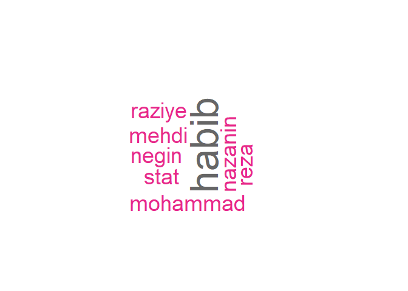

# Word Cloud in R


## define a data

``` r
dat <- "habib reza @ ? 
        negin raziye mohammad Stat mehdi nazanin habib"
library(tm)
```

    Loading required package: NLP

``` r
library(wordcloud)
```

    Loading required package: RColorBrewer

``` r
library(tidyverse)
```

    ── Attaching core tidyverse packages ──────────────────────── tidyverse 2.0.0 ──
    ✔ dplyr     1.1.4     ✔ readr     2.1.5
    ✔ forcats   1.0.0     ✔ stringr   1.5.1
    ✔ ggplot2   3.4.4     ✔ tibble    3.2.1
    ✔ lubridate 1.9.3     ✔ tidyr     1.3.0
    ✔ purrr     1.0.2     

    ── Conflicts ────────────────────────────────────────── tidyverse_conflicts() ──
    ✖ ggplot2::annotate() masks NLP::annotate()
    ✖ dplyr::filter()     masks stats::filter()
    ✖ dplyr::lag()        masks stats::lag()
    ℹ Use the conflicted package (<http://conflicted.r-lib.org/>) to force all conflicts to become errors

``` r
coo <- Corpus(VectorSource(dat))
coo <- tm_map(coo, content_transformer(tolower))
```

    Warning in tm_map.SimpleCorpus(coo, content_transformer(tolower)):
    transformation drops documents

``` r
coo <- coo |> 
        tm_map(removePunctuation)
```

    Warning in tm_map.SimpleCorpus(coo, removePunctuation): transformation drops
    documents

``` r
coo <- coo |> 
        tm_map(removeNumbers)
```

    Warning in tm_map.SimpleCorpus(coo, removeNumbers): transformation drops
    documents

``` r
coo <- coo |> 
        tm_map(removeWords, stopwords("english"))
```

    Warning in tm_map.SimpleCorpus(coo, removeWords, stopwords("english")):
    transformation drops documents

``` r
tdm <- TermDocumentMatrix(coo)
m <- as.matrix(tdm)
word_freqs <- sort(rowSums(m), decreasing = T)
df <- data.frame(word = names(word_freqs), freq = word_freqs)
wordcloud(words = df$word, freq = df$freq, min.freq = 1, 
            max.words = 200, random.order = F, 
            rot.per = 0.35, colors = brewer.pal(8, "Dark2"))  
```


