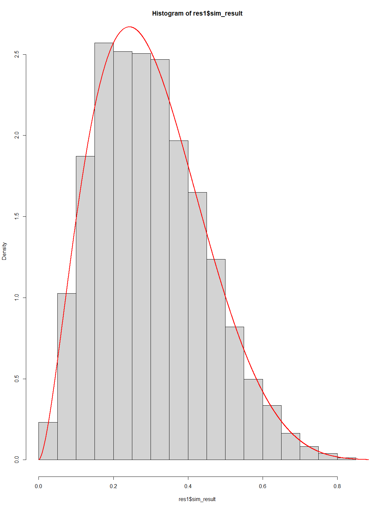
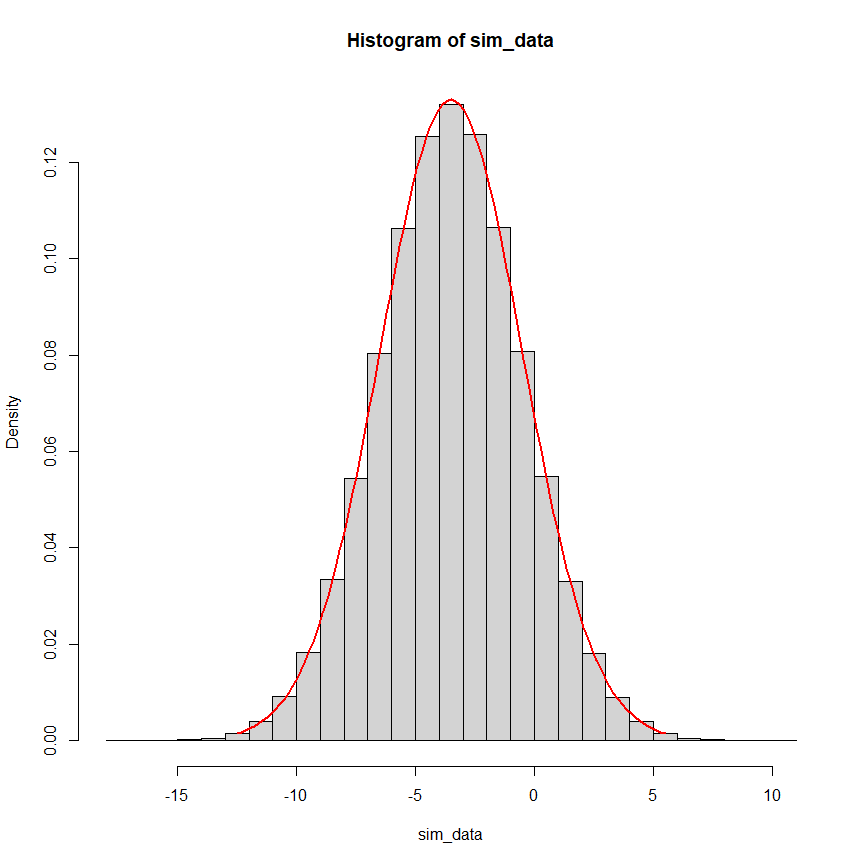

# acceptance-rejection method with R

## We want to generate data using R from the following distribution

$$
Y \sim \text{Beta}(shape_1: 2.7, shape_2: 6.3)
$$

``` r
a <- 2.7
b <- 6.3
f_max <- function(x) {
    temp <- dbeta(x, shape1 = a, shape2 = b)
    return(temp)
}
res <- optimize(f_max, interval = c(0, 1), maximum = TRUE)
C <- res$objective
sim_fun <- function(n) {
    i <- 0
    j <- 0
    simul <- c()
    while(i < n) {
        j <- j + 1
        uv <- runif(2)
        v <- uv[2]; u <- uv[1]
        ratio <- f_max(v) / C
        temp <- ifelse(u <= ratio, TRUE, FALSE)
        if (temp) {
            i <- i + 1
            simul[i] <- v
        }
    }

    result <- list(nc = j, sim_result = simul)
}

res1 <- sim_fun(n = 1e+4)


hist(res1$sim_result, freq = FALSE)
xx <- seq(0, 1, len = 1e+4)
yy <- f_max(xx)
lines(xx, yy, col = "red", lwd = 2)
```



``` r
M <- mean(res1$sim_result)
varr <- var(res1$sim_result)
cat("Mean simulation: ", M, "\n", 
    "Mean real: ", a / (a + b), "\n", 
    "Variance simulation: ", varr, "\n", 
    "variance Real: ", (a*b) / ((a + b)**2 * (a + b + 1)), 
    sep = "")
```

    Mean simulation: 0.2995478
    Mean real: 0.3
    Variance simulation: 0.02096389
    variance Real: 0.021

``` r
res1 <- sim_fun(n = 1e+5)


hist(res1$sim_result, freq = FALSE)
xx <- seq(0, 1, len = 1e+4)
yy <- f_max(xx)
lines(xx, yy, col = "red", lwd = 2)
```


``` r
M <- mean(res1$sim_result)
varr <- var(res1$sim_result)
cat("Mean simulation: ", M, "\n", 
    "Mean real: ", a / (a + b), "\n", 
    "Variance simulation: ", varr, "\n", 
    "variance Real: ", (a*b) / ((a + b)**2 * (a + b + 1)), 
    sep = "")
```

    Mean simulation: 0.3001431
    Mean real: 0.3
    Variance simulation: 0.02082865
    variance Real: 0.021

<br><br>

------------------------------------------------------------------------

------------------------------------------------------------------------

------------------------------------------------------------------------

<br><br>

## Generate Normal Standard Using Acceptance-Rejection Method

## Condidate Distribution is Exponential Distribution

$$
\begin{aligned}
& Dist:1.~~~ Y \sim \mathcal{N}(\mu = 0, \sigma^2 = 1), \\
& Dist:2. ~~ Y \sim \mathcal{N}(\mu = -3.5, \sigma^2 = 9), \\
& \text{Candidate Distribution:} ~~ U \sim \mathcal{E}\text{xp}(\lambda = 1). 
\end{aligned}
$$

<br><br>

``` r
ratio <- function(x) dnorm(x) / dexp(x)
Max <- optimize(ratio, interval = c(0, 10), maximum = TRUE)
Max
```

    $maximum
    [1] 0.9999956

    $objective
    [1] 0.6577446

``` r
curve(ratio, 0, 10, lwd = 2, col = "red")
abline(h = Max$objective, lwd = 2, col = "darkblue", lty = 3)
```


``` r
sim_norm_fun <- function(n, mu = 0, sigg = 1) {
    i <- 0
    norm_sim <- numeric(n)
    while(i < n) {
        u <- runif(3)
        temp <- dnorm(-log(u[1])) / (dexp(-log(u[1])) * Max$objective)
        if (u[2] < temp){
            i <- i + 1
            a <- ifelse(u[3] < 0.5, -1, 1)
            temp2 <- - a * log(u[1])
            norm_sim[i] <- temp2
        }
    }
    return(list(Norm_sim = sigg * norm_sim + mu))
}

sim_normal <- sim_norm_fun(n = 1e+5)

sim_data <- sim_normal$Norm_sim
mean(sim_data)
```

    [1] 0.001689799

``` r
sd(sim_data)
```

    [1] 1.0019

``` r
hist(sim_data, freq = FALSE)
curve(dnorm(x), -4, 4, lwd = 2, col = "red", add = TRUE)
```


``` r
### Generate Normal With Mu = -3.5, Variance = 9

sim_normal <- sim_norm_fun(n = 1e+6, mu = -3.5, sigg = sqrt(9))

sim_data <- sim_normal$Norm_sim
mean(sim_data)
```

    [1] -3.500053

``` r
sd(sim_data)
```

    [1] 2.999365

``` r
hist(sim_data, freq = FALSE)
curve(dnorm(x, mean = -3.5, sd = sqrt(9)), -3.5 - 3 * sqrt(9), 
                -3.5 + 3 * sqrt(9), lwd = 2, col = "red", add = TRUE)
```


