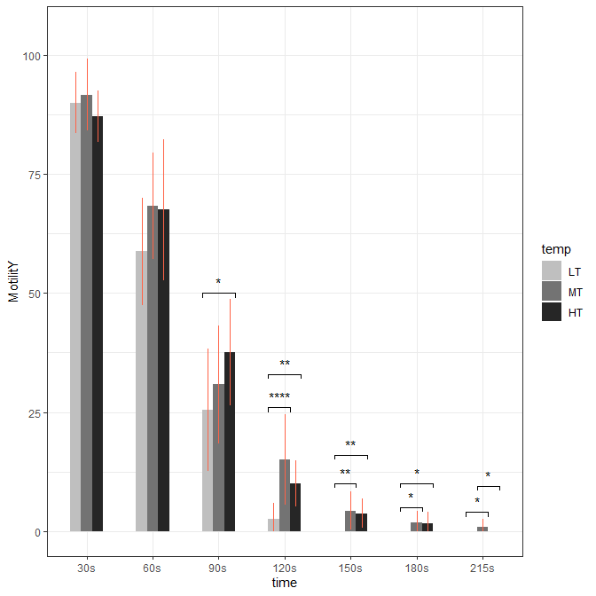

# Add Significance level to a barPlot

## Sometimes we need to be able to show the significance of pairwise comparisons in one graph when we perform analysis of variance on grouped data. These codes can be used as templates

#### read data

``` r
## load packages
library(tidyverse)
dat <- read.table("./data/dat_tab.txt", header = TRUE)
head(dat)
```

      time temp motility
    1    1    1       80
    2    1    1       80
    3    1    1       90
    4    1    1       80
    5    1    1       90
    6    1    1       80

``` r
tail(dat)
```

        time temp motility
    247    7    3        0
    248    7    3        0
    249    7    3        0
    250    7    3        0
    251    7    3        0
    252    7    3        0

``` r
dat$time %>% table
```

    .
     1  2  3  4  5  6  7 
    36 36 36 36 36 36 36 

``` r
dat$temp %>% table
```

    .
     1  2  3 
    84 84 84 

``` r
dat2 <- dat %>%
group_by(time) %>% nest
lapply(dat2$time, function(x){
    y = dat2[x, ]$data[[1]]
    print(anova(aov(motility ~ factor(temp), y)))
})
```

    Analysis of Variance Table

    Response: motility
                 Df  Sum Sq Mean Sq F value Pr(>F)
    factor(temp)  2  129.17  64.583  1.5337 0.2307
    Residuals    33 1389.58  42.109               
    Analysis of Variance Table

    Response: motility
                 Df Sum Sq Mean Sq F value Pr(>F)
    factor(temp)  2  676.4  338.19  2.1471 0.1329
    Residuals    33 5197.9  157.51               
    Analysis of Variance Table

    Response: motility
                 Df Sum Sq Mean Sq F value  Pr(>F)  
    factor(temp)  2  879.2  439.58  2.9668 0.06533 .
    Residuals    33 4889.6  148.17                  
    ---
    Signif. codes:  0 '***' 0.001 '**' 0.01 '*' 0.05 '.' 0.1 ' ' 1
    Analysis of Variance Table

    Response: motility
                 Df  Sum Sq Mean Sq F value    Pr(>F)    
    factor(temp)  2  936.72  468.36  11.274 0.0001855 ***
    Residuals    33 1370.92   41.54                      
    ---
    Signif. codes:  0 '***' 0.001 '**' 0.01 '*' 0.05 '.' 0.1 ' ' 1
    Analysis of Variance Table

    Response: motility
                 Df Sum Sq Mean Sq F value   Pr(>F)   
    factor(temp)  2  129.5  64.750  7.5637 0.001977 **
    Residuals    33  282.5   8.561                    
    ---
    Signif. codes:  0 '***' 0.001 '**' 0.01 '*' 0.05 '.' 0.1 ' ' 1
    Analysis of Variance Table

    Response: motility
                 Df  Sum Sq Mean Sq F value  Pr(>F)  
    factor(temp)  2  24.667 12.3333  3.1228 0.05727 .
    Residuals    33 130.333  3.9495                  
    ---
    Signif. codes:  0 '***' 0.001 '**' 0.01 '*' 0.05 '.' 0.1 ' ' 1
    Analysis of Variance Table

    Response: motility
                 Df  Sum Sq Mean Sq F value  Pr(>F)  
    factor(temp)  2  6.7222  3.3611  3.8357 0.03178 *
    Residuals    33 28.9167  0.8763                  
    ---
    Signif. codes:  0 '***' 0.001 '**' 0.01 '*' 0.05 '.' 0.1 ' ' 1

    [[1]]
    Analysis of Variance Table

    Response: motility
                 Df  Sum Sq Mean Sq F value Pr(>F)
    factor(temp)  2  129.17  64.583  1.5337 0.2307
    Residuals    33 1389.58  42.109               

    [[2]]
    Analysis of Variance Table

    Response: motility
                 Df Sum Sq Mean Sq F value Pr(>F)
    factor(temp)  2  676.4  338.19  2.1471 0.1329
    Residuals    33 5197.9  157.51               

    [[3]]
    Analysis of Variance Table

    Response: motility
                 Df Sum Sq Mean Sq F value  Pr(>F)  
    factor(temp)  2  879.2  439.58  2.9668 0.06533 .
    Residuals    33 4889.6  148.17                  
    ---
    Signif. codes:  0 '***' 0.001 '**' 0.01 '*' 0.05 '.' 0.1 ' ' 1

    [[4]]
    Analysis of Variance Table

    Response: motility
                 Df  Sum Sq Mean Sq F value    Pr(>F)    
    factor(temp)  2  936.72  468.36  11.274 0.0001855 ***
    Residuals    33 1370.92   41.54                      
    ---
    Signif. codes:  0 '***' 0.001 '**' 0.01 '*' 0.05 '.' 0.1 ' ' 1

    [[5]]
    Analysis of Variance Table

    Response: motility
                 Df Sum Sq Mean Sq F value   Pr(>F)   
    factor(temp)  2  129.5  64.750  7.5637 0.001977 **
    Residuals    33  282.5   8.561                    
    ---
    Signif. codes:  0 '***' 0.001 '**' 0.01 '*' 0.05 '.' 0.1 ' ' 1

    [[6]]
    Analysis of Variance Table

    Response: motility
                 Df  Sum Sq Mean Sq F value  Pr(>F)  
    factor(temp)  2  24.667 12.3333  3.1228 0.05727 .
    Residuals    33 130.333  3.9495                  
    ---
    Signif. codes:  0 '***' 0.001 '**' 0.01 '*' 0.05 '.' 0.1 ' ' 1

    [[7]]
    Analysis of Variance Table

    Response: motility
                 Df  Sum Sq Mean Sq F value  Pr(>F)  
    factor(temp)  2  6.7222  3.3611  3.8357 0.03178 *
    Residuals    33 28.9167  0.8763                  
    ---
    Signif. codes:  0 '***' 0.001 '**' 0.01 '*' 0.05 '.' 0.1 ' ' 1

``` r
lapply(dat2$time, function(x){
    y = dat2[x, ]$data[[1]]
    print(kruskal.test(motility ~ factor(temp), y))
})
```


        Kruskal-Wallis rank sum test

    data:  motility by factor(temp)
    Kruskal-Wallis chi-squared = 3.3381, df = 2, p-value = 0.1884


        Kruskal-Wallis rank sum test

    data:  motility by factor(temp)
    Kruskal-Wallis chi-squared = 4.2572, df = 2, p-value = 0.119


        Kruskal-Wallis rank sum test

    data:  motility by factor(temp)
    Kruskal-Wallis chi-squared = 5.019, df = 2, p-value = 0.08131


        Kruskal-Wallis rank sum test

    data:  motility by factor(temp)
    Kruskal-Wallis chi-squared = 15.954, df = 2, p-value = 0.0003434


        Kruskal-Wallis rank sum test

    data:  motility by factor(temp)
    Kruskal-Wallis chi-squared = 12.875, df = 2, p-value = 0.0016


        Kruskal-Wallis rank sum test

    data:  motility by factor(temp)
    Kruskal-Wallis chi-squared = 5.9153, df = 2, p-value = 0.05194


        Kruskal-Wallis rank sum test

    data:  motility by factor(temp)
    Kruskal-Wallis chi-squared = 8.7122, df = 2, p-value = 0.01283

    [[1]]

        Kruskal-Wallis rank sum test

    data:  motility by factor(temp)
    Kruskal-Wallis chi-squared = 3.3381, df = 2, p-value = 0.1884


    [[2]]

        Kruskal-Wallis rank sum test

    data:  motility by factor(temp)
    Kruskal-Wallis chi-squared = 4.2572, df = 2, p-value = 0.119


    [[3]]

        Kruskal-Wallis rank sum test

    data:  motility by factor(temp)
    Kruskal-Wallis chi-squared = 5.019, df = 2, p-value = 0.08131


    [[4]]

        Kruskal-Wallis rank sum test

    data:  motility by factor(temp)
    Kruskal-Wallis chi-squared = 15.954, df = 2, p-value = 0.0003434


    [[5]]

        Kruskal-Wallis rank sum test

    data:  motility by factor(temp)
    Kruskal-Wallis chi-squared = 12.875, df = 2, p-value = 0.0016


    [[6]]

        Kruskal-Wallis rank sum test

    data:  motility by factor(temp)
    Kruskal-Wallis chi-squared = 5.9153, df = 2, p-value = 0.05194


    [[7]]

        Kruskal-Wallis rank sum test

    data:  motility by factor(temp)
    Kruskal-Wallis chi-squared = 8.7122, df = 2, p-value = 0.01283

``` r
interaction.plot(x.factor = dat$temp, trace.factor = dat$time, 
            response = dat$motility, col = c("red", "blue", "gray", 
            "darkgreen", "darkblue", "brown", "tomato", "orange", "black"))
```


``` r
## final Model

Model <- aov(motility ~ factor(time) + factor(temp) + 
                factor(time):factor(temp), data = dat)
anova(Model)
```

    Analysis of Variance Table

    Response: motility
                               Df Sum Sq Mean Sq  F value    Pr(>F)    
    factor(time)                6 275146   45858 797.0889 < 2.2e-16 ***
    factor(temp)                2   1301     650  11.3032 2.073e-05 ***
    factor(time):factor(temp)  12   1482     123   2.1463   0.01511 *  
    Residuals                 231  13290      58                       
    ---
    Signif. codes:  0 '***' 0.001 '**' 0.01 '*' 0.05 '.' 0.1 ' ' 1

#### Second Plot

###### add significance to barplot

``` r
library(superb)
library(rstatix)


dat2 <- dat %>%
group_by(time) %>% nest

 


dat_new <- dat %>%
    mutate(time = case_match(
  time,
  1 ~ "30s",
  2 ~ "60s",
  3 ~ "90s",
  4 ~ "120s",
  5 ~ "150s", 
  6 ~ "180s", 
  7 ~ "215s"
  ), 
  temp = case_match(
  temp,
  1 ~ "HT",
  2 ~ "MT",
  3 ~ "LT"
)) %>%
mutate(time = factor(time, 
levels = c("30s", "60s", "90s", "120s", 
"150s", "180s", "215s"), ordered = TRUE), temp = factor(temp,
levels = c("LT", "MT", "HT"), 
ordered = TRUE))

dat_new2 <- dat_new %>%
group_by(time) %>% nest

lapply(dat_new2$time, function(x){
       y <- dat_new2 %>% dplyr :: filter(time == x) %>%
            .$data %>% .[[1]]
        result <- y %>% pairwise_t_test(motility ~ temp)
        result
})
```

    [[1]]
    # A tibble: 3 × 9
      .y.      group1 group2    n1    n2     p p.signif p.adj p.adj.signif
    * <chr>    <chr>  <chr>  <int> <int> <dbl> <chr>    <dbl> <chr>       
    1 motility LT     MT        12    12 0.534 ns       0.558 ns          
    2 motility LT     HT        12    12 0.279 ns       0.558 ns          
    3 motility MT     HT        12    12 0.093 ns       0.279 ns          

    [[2]]
    # A tibble: 3 × 9
      .y.      group1 group2    n1    n2      p p.signif p.adj p.adj.signif
    * <chr>    <chr>  <chr>  <int> <int>  <dbl> <chr>    <dbl> <chr>       
    1 motility LT     MT        12    12 0.0703 ns       0.211 ns          
    2 motility LT     HT        12    12 0.0971 ns       0.211 ns          
    3 motility MT     HT        12    12 0.872  ns       0.872 ns          

    [[3]]
    # A tibble: 3 × 9
      .y.      group1 group2    n1    n2      p p.signif  p.adj p.adj.signif
    * <chr>    <chr>  <chr>  <int> <int>  <dbl> <chr>     <dbl> <chr>       
    1 motility LT     MT        12    12 0.284  ns       0.378  ns          
    2 motility LT     HT        12    12 0.0206 *        0.0619 ns          
    3 motility MT     HT        12    12 0.189  ns       0.378  ns          

    [[4]]
    # A tibble: 3 × 9
      .y.      group1 group2    n1    n2         p p.signif    p.adj p.adj.signif
    * <chr>    <chr>  <chr>  <int> <int>     <dbl> <chr>       <dbl> <chr>       
    1 motility LT     MT        12    12 0.0000421 ****     0.000126 ***         
    2 motility LT     HT        12    12 0.00809   **       0.0162   *           
    3 motility MT     HT        12    12 0.0662    ns       0.0662   ns          

    [[5]]
    # A tibble: 3 × 9
      .y.      group1 group2    n1    n2       p p.signif   p.adj p.adj.signif
    * <chr>    <chr>  <chr>  <int> <int>   <dbl> <chr>      <dbl> <chr>       
    1 motility LT     MT        12    12 0.00116 **       0.00347 **          
    2 motility LT     HT        12    12 0.00356 **       0.00711 **          
    3 motility MT     HT        12    12 0.678   ns       0.678   ns          

    [[6]]
    # A tibble: 3 × 9
      .y.      group1 group2    n1    n2      p p.signif  p.adj p.adj.signif
    * <chr>    <chr>  <chr>  <int> <int>  <dbl> <chr>     <dbl> <chr>       
    1 motility LT     MT        12    12 0.0306 *        0.0917 ns          
    2 motility LT     HT        12    12 0.0479 *        0.0959 ns          
    3 motility MT     HT        12    12 0.839  ns       0.839  ns          

    [[7]]
    # A tibble: 3 × 9
      .y.      group1 group2    n1    n2      p p.signif  p.adj p.adj.signif
    * <chr>    <chr>  <chr>  <int> <int>  <dbl> <chr>     <dbl> <chr>       
    1 motility LT     MT        12    12 0.0223 *        0.0668 ns          
    2 motility LT     HT        12    12 1      ns       1      ns          
    3 motility MT     HT        12    12 0.0223 *        0.0668 ns          

``` r
xx <- c(0.83333, 1, 1.166667, 1.8333333, 2, 2.166667, 
2.8333333333, 3, 3.166667, 3.833333333, 4, 4.166667, 4.8333333, 5, 
5.166667, 5.83333333, 6, 6.166667, 6.833333333, 7, 7.166667)
length(xx)
```

    [1] 21

``` r
res1 <- dat_new %>%
        group_by(time, temp) %>%
        summarise(MotilitY = mean(motility), 
            SD = sd(motility))
res1 <- res1 %>%
        mutate(Lower = MotilitY - SD, Upper = MotilitY + SD) %>%
        mutate(Lower = Lower * (Lower >= 0)) 
res1 <- within(res1, xval <- xx)

res1
```

    # A tibble: 21 × 7
    # Groups:   time [7]
       time  temp  MotilitY    SD Lower Upper  xval
       <ord> <ord>    <dbl> <dbl> <dbl> <dbl> <dbl>
     1 30s   LT       90     6.40  83.6 96.4  0.833
     2 30s   MT       91.7   7.49  84.2 99.2  1    
     3 30s   HT       87.1   5.42  81.7 92.5  1.17 
     4 60s   LT       58.8  11.3   47.4 70.1  1.83 
     5 60s   MT       68.3  11.1   57.2 79.5  2    
     6 60s   HT       67.5  14.8   52.7 82.3  2.17 
     7 90s   LT       25.4  12.9   12.5 38.3  2.83 
     8 90s   MT       30.8  12.4   18.4 43.2  3    
     9 90s   HT       37.5  11.2   26.3 48.7  3.17 
    10 120s  LT        2.58  3.32   0    5.90 3.83 
    # ℹ 11 more rows

``` r
dim(res1); length(xx)
```

    [1] 21  7

    [1] 21

``` r
print(res1, n = 22)
```

    # A tibble: 21 × 7
    # Groups:   time [7]
       time  temp  MotilitY    SD  Lower Upper  xval
       <ord> <ord>    <dbl> <dbl>  <dbl> <dbl> <dbl>
     1 30s   LT      90      6.40 83.6   96.4  0.833
     2 30s   MT      91.7    7.49 84.2   99.2  1    
     3 30s   HT      87.1    5.42 81.7   92.5  1.17 
     4 60s   LT      58.8   11.3  47.4   70.1  1.83 
     5 60s   MT      68.3   11.1  57.2   79.5  2    
     6 60s   HT      67.5   14.8  52.7   82.3  2.17 
     7 90s   LT      25.4   12.9  12.5   38.3  2.83 
     8 90s   MT      30.8   12.4  18.4   43.2  3    
     9 90s   HT      37.5   11.2  26.3   48.7  3.17 
    10 120s  LT       2.58   3.32  0      5.90 3.83 
    11 120s  MT      15      9.53  5.47  24.5  4    
    12 120s  HT      10      4.77  5.23  14.8  4.17 
    13 150s  LT       0      0     0      0    4.83 
    14 150s  MT       4.25   4.00  0.247  8.25 5    
    15 150s  HT       3.75   3.11  0.642  6.86 5.17 
    16 180s  LT       0      0     0      0    5.83 
    17 180s  MT       1.83   2.41  0      4.24 6    
    18 180s  HT       1.67   2.46  0      4.13 6.17 
    19 215s  LT       0      0     0      0    6.83 
    20 215s  MT       0.917  1.62  0      2.54 7    
    21 215s  HT       0      0     0      0    7.17 

``` r
res1 
```

    # A tibble: 21 × 7
    # Groups:   time [7]
       time  temp  MotilitY    SD Lower Upper  xval
       <ord> <ord>    <dbl> <dbl> <dbl> <dbl> <dbl>
     1 30s   LT       90     6.40  83.6 96.4  0.833
     2 30s   MT       91.7   7.49  84.2 99.2  1    
     3 30s   HT       87.1   5.42  81.7 92.5  1.17 
     4 60s   LT       58.8  11.3   47.4 70.1  1.83 
     5 60s   MT       68.3  11.1   57.2 79.5  2    
     6 60s   HT       67.5  14.8   52.7 82.3  2.17 
     7 90s   LT       25.4  12.9   12.5 38.3  2.83 
     8 90s   MT       30.8  12.4   18.4 43.2  3    
     9 90s   HT       37.5  11.2   26.3 48.7  3.17 
    10 120s  LT        2.58  3.32   0    5.90 3.83 
    # ℹ 11 more rows

``` r
P1 <- res1 %>%
    ggplot(aes(time, MotilitY)) + 
        theme_bw() + scale_fill_manual(values = c("gray75", "gray45", "gray15")) + 
        geom_bar(aes(fill = temp), stat = "identity", 
        position = "dodge", width = 0.5) + 
        ylim(c(0, 105))
P2 <- P1 + 
geom_linerange(data = res1, aes(x = xval, ymin = Lower, ymax = Upper), color = "tomato", linewidth = 0.5) +
showSignificance( c(2.75, 3.25), 50, -1, "*") + 
showSignificance( c(3.75, 4.08333333), 26, -1, "****") + 
showSignificance( c(3.75, 4.25), 33, -1, "**") + 
showSignificance( c(4.75, 5.08333333), 10, -1, "**") + 
showSignificance( c(4.75, 5.25), 16, -1, "**") + 
showSignificance( c(5.75, 6.08333333), 5, -1, "*") + 
showSignificance( c(5.75, 6.25), 10, -1, "*") + 
showSignificance( c(6.75, 7.08333333), 4, -1, "*") + 
showSignificance( c(6.916666667, 7.25), 9.5, -1, "*")
P2
```


