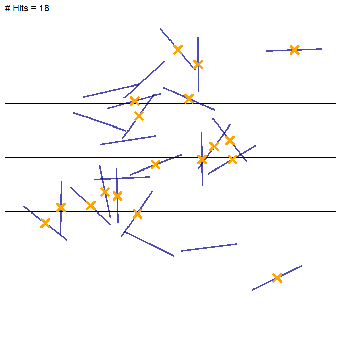
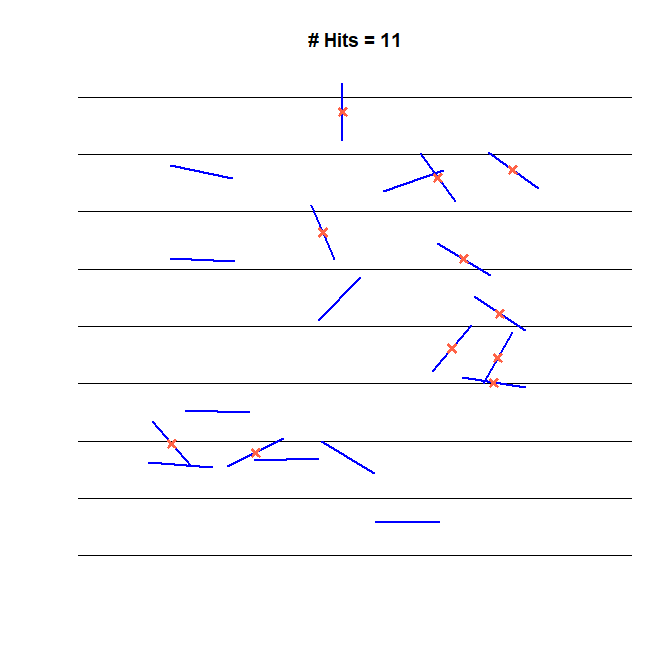

buffon Needle
================
habib ezatabadi (Stats9)

# Code1 with tidyverse package:

``` r
#####################################


library(tidyverse)


Buffon_needle <- function(n = 25, a = 1.5, L = 1.5, seed = 1234){
Yintercept <- seq(-4, 4, by = L)

P <- ggplot() +
  geom_hline(yintercept = Yintercept) + 
  labs(y = NULL) +
  coord_cartesian(xlim = c(0, 8), ylim = c(-4, 4), expand = TRUE)+
  theme(
    panel.border = element_blank(),
    axis.text = element_blank(),
    panel.grid = element_blank(),
    axis.ticks = element_blank(), 
    panel.background = element_rect(fill = "white")
  )
P
set.seed(seed)
x1 <- runif(n, 1, 7)
y1 <- runif(n, -3.5, 3.5)
theta1 <- runif(n, 0, pi)
x1_2 <- x1 + a * cos(theta1)
y1_2 <- y1 + a * sin(theta1)

X <- numeric(2*n)
Y <- numeric(2*n)
ind1 <- seq(1, 2*n, by = 2)
ind2 <- seq(2, 2*n, by = 2)
X[ind1] <- x1
X[ind2] <- x1_2
Y[ind1] <- y1
Y[ind2] <- y1_2

Meanx <- (x1 + x1_2)/2

Meany <- (y1 + y1_2)/2


yy <- Yintercept
nn <- length(Yintercept)
Res <- expand_grid(Meany, yy) 
ID <- rep(paste0("needle", 1:n), each = nn)
Res$ID = factor(ID, levels = unique(ID), ordered = TRUE)
Res %>%
  mutate(Distance = sqrt((Meany - yy)^2)) %>%
  group_by(ID) %>% 
  summarise(MIN = min(Distance)) -> DISTANCE


DISTANCE

needle_dist <- a * sin(theta1)/2
DISTANCE <- DISTANCE %>%
  mutate(HIT = 1 * (MIN < needle_dist))


IND_hit <- which(DISTANCE$HIT == 1)
n_hit <- length(IND_hit)

df2 <- tibble(x = Meanx[IND_hit], y = Meany[IND_hit])


Df <- tibble(x = X, y = Y, Time = rep(1:n, each = 2))
P + geom_line(data = Df, aes(x = x, y = y, group = Time), 
              linewidth = 1.2, color = "darkblue", alpha = .7) + 
  geom_point(data = df2, aes(x = x, y = y), shape = 4, 
             color = "orange", stroke = 3, size = 3) + 
  labs(title = paste0("# Hits = ", n_hit), x = NULL) -> P1
myresult <- list(number_hits = n_hit, Plot = P1)
return(myresult)
}

outPut <- Buffon_needle()
P1 <- outPut$Plot
P1
```

<!-- -->

``` r
## if you want show this plot as a giff then run these codes below

#if (! require(gganimate)) {
#  install.packages("gganimate")
#  library(gganimate)
#}

# P1 + transition_reveal(Time)
```

------------------------------------------------------------------------

# code2: with base functions in R

``` r
Buffon_updated <- function(n = 20, a = 1.5, L = 2, 
                           show = TRUE, seed = 12){
if(a > L) stop("a must be smaller than L")

Yintercept <- seq(-4, 4, by = L)

set.seed(seed)
x1 <- runif(n, 1, 7)
y1 <- runif(n, -3.5, 3.5)
theta1 <- runif(n, 0, pi)
x1_2 <- x1 + a * cos(theta1)
y1_2 <- y1 + a * sin(theta1)


Meanx <- (x1 + x1_2)/2

Meany <- (y1 + y1_2)/2


nn <- length(Yintercept)
Res <- expand.grid(Yintercept, Meany) 
names(Res) <- c("Meany", "y")
ID <- rep(paste0("needle", 1:n), each = nn)
Res$ID = factor(ID, levels = unique(ID), ordered = TRUE)
Distance = sqrt((Res$Meany - Res$y)^2)
Res$distance <- Distance
result <- aggregate(Distance ~ ID, data = Res, FUN = min)


needle_dist <- a * sin(theta1)/2

Hit <- 1 * (result$Distance < needle_dist)


IND_hit <- which(Hit == 1)
n_hit <- length(IND_hit)
df2 <- data.frame(x = Meanx[IND_hit], y = Meany[IND_hit])


if(show){
plot(x = c(0, 8), y = c(-4, 4), type = "n", frame = FALSE, 
xaxt = "n", yaxt = "n", xlab = "", ylab = "", 
main = paste0("# Hits = ", n_hit))

abline(h = Yintercept)
for(i in 1:n){
xx <- c(x1[i], x1_2[i])
yy <- c(y1[i], y1_2[i])
lines(x = xx, y = yy, col = "blue", lwd = 2)
}

points(x = df2$x, y = df2$y, pch = 4, 
       col = "tomato", lwd = 3)

}
return(n_hit)
}


Buffon_updated(L = 1, a = 1, seed = 2, n = 20)
```

<!-- -->

    ## [1] 11
