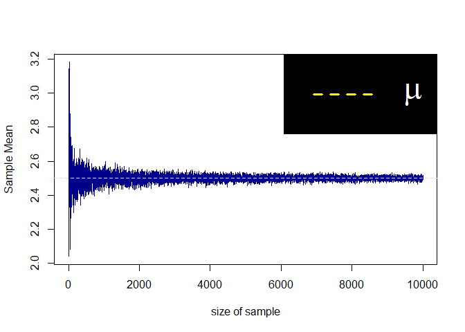

Untitled
================

## Ex I.

#### A function that takes a square matrix and sets it to zero above the main diagonal

``` r
fun_tri_mat <- function(A){
    D <- dim(A)
    if(D[1] != D[2]) stop("A must be square matrix")
    n <- D[1]
    for(i in 1:(n-1)){
        for(j in (i+1):n){
            A[i, j] <- 0
        }
    }
    return(A)
}
A <- matrix(1, 4, 4)
A
```

    ##      [,1] [,2] [,3] [,4]
    ## [1,]    1    1    1    1
    ## [2,]    1    1    1    1
    ## [3,]    1    1    1    1
    ## [4,]    1    1    1    1

``` r
A2 <- fun_tri_mat(A)
A2
```

    ##      [,1] [,2] [,3] [,4]
    ## [1,]    1    0    0    0
    ## [2,]    1    1    0    0
    ## [3,]    1    1    1    0
    ## [4,]    1    1    1    1

------------------------------------------------------------------------

## EX II.

#### A function that is a normal sample of the given limits, in such a way that the simulated

#### values must be larger than the specified value of A and smaller than the specified value of B.

#### In this function, the size of the production sample and the user’s desired mean and standard deviation,

#### as well as the user’s desired limits, are given in the function arguments.

``` r
create_normal_restrict <- function(size, 
Mu, Sig, a, b){
    i = 0
    Sample <- c()
    while(i <= size){
        temp1 <- rnorm(1, Mu, Sig)
        if(temp1 < b && temp1 > a){
            i = i + 1; Sample[i] <- temp1
        }
    }
    return(Sample)
}
s <- create_normal_restrict(size = 10, Mu = 0, Sig = 2, a = 2, b = 4)
s
```

    ##  [1] 2.734607 2.214737 2.249845 2.698595 3.663426 2.252840 2.696943 2.543040
    ##  [9] 2.944733 3.624368 2.880947

``` r
all(s > 2) && all(s < 4)
```

    ## [1] TRUE

------------------------------------------------------------------------

## EX III.

#### Edit code for EX II.

``` r
create_normal_restrict <- function(size, 
Mu, Sig, a, b){
    Sample <- c()
    for(i in 1:size){
        temp1 <- rnorm(1, Mu, Sig)
        while(temp1 < a || temp1 > b){
            temp1 <- rnorm(1, Mu, Sig)
        }
        Sample[i] <- temp1
    }
    return(Sample)
}
s <- create_normal_restrict(size = 20, Mu = 2, Sig = 3, a = 3, b = 5)
s
```

    ##  [1] 4.830773 3.248946 4.627819 3.918613 3.210168 3.542043 3.374803 4.706759
    ##  [9] 4.494469 4.017255 3.592708 4.695644 4.326191 3.935602 4.407869 3.518362
    ## [17] 3.660892 3.908671 3.417477 4.403351

``` r
all(s > 3) && all(s < 5)
```

    ## [1] TRUE

------------------------------------------------------------------------

## EX IV.

#### Simulation to prove the weak law of large numbers

``` r
Weak_law_large_num <- function(size, Mu, showPlot = TRUE){
    n <- size
    E <- list()
    for(i in 1:n){
        E[[i]] <- rnorm(i, )
    }
    E_mean <- unlist(lapply(E, mean))
    list_result <- list(Mean_result = E_mean, list_result = E)
    if(showPlot) plot(x = 1:n, y = E_mean, col = "darkblue", type = "l", xlab = "size of sample", ylab = "Sample Mean")
    return(list_result)
}

Result <- Weak_law_large_num(size = 1e+4, Mu = 2.5, showPlot = T) 
```

<!-- -->

``` r
E <- Result$list_result
E[[5]]
```

    ## [1] -0.2575731  0.7602509  0.0533534  0.6940593 -1.8740524

``` r
E[[10]]
```

    ##  [1]  0.4216395 -0.5402916  1.5002758  0.1086644 -0.4710241  0.6869069
    ##  [7] -0.8424494  0.6899092  1.9267413  0.2020539

``` r
E[[20]]
```

    ##  [1]  0.15348399  0.72576850  1.37776840  1.04152210 -0.76723937  0.04118612
    ##  [7] -1.04248805 -0.47658520 -0.26901279  0.95052511 -1.14949292  0.04687552
    ## [13] -0.55654810  0.06908984  1.92290984  2.77283346 -0.21874213  0.44831750
    ## [19]  0.07075452 -0.26227004

``` r
E[[50]]
```

    ##  [1] -0.267996677 -0.240011118  0.018703472 -0.602721232 -1.001322560
    ##  [6]  0.603649283 -0.537097305  0.724367628 -0.155074089  1.231117239
    ## [11]  0.420129844 -0.156611579 -1.488449452 -0.439913668 -2.239063848
    ## [16] -0.046834554 -0.143693570  1.234204966 -0.239772722  0.284953447
    ## [21] -1.361943545 -0.092125786  0.987353231 -0.203664881  0.341509474
    ## [26] -0.512153278  0.694291078  0.733042914 -0.254189750  0.728916494
    ## [31] -1.276480543 -1.859949883 -0.107585855 -0.300398697  1.436115702
    ## [36] -1.057518496 -0.006596767 -0.230105839  0.919771590  0.429434850
    ## [41] -0.848489876  0.511322995 -2.504628948  0.770212222  2.571633171
    ## [46] -0.968507414  2.725843843  1.000472440 -0.270007980  1.625006630
