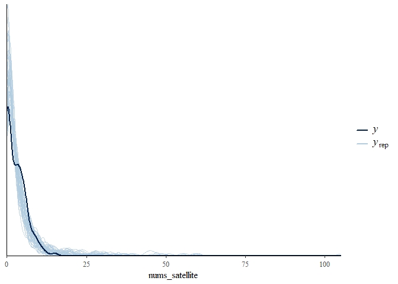

# Regressions Models for Count data (hcrabs)

habib ezatabadi (stats9)

## loading libraries

```r
library(bayesrules)
library(rstanarm)
```

    ## Loading required package: Rcpp

    ## This is rstanarm version 2.21.3

    ## - See https://mc-stan.org/rstanarm/articles/priors for changes to default priors!

    ## - Default priors may change, so it's safest to specify priors, even if equivalent to the defaults.

    ## - For execution on a local, multicore CPU with excess RAM we recommend calling

    ##   options(mc.cores = parallel::detectCores())

```r
library(bayesplot)
```

    ## This is bayesplot version 1.10.0

    ## - Online documentation and vignettes at mc-stan.org/bayesplot

    ## - bayesplot theme set to bayesplot::theme_default()

    ##    * Does _not_ affect other ggplot2 plots

    ##    * See ?bayesplot_theme_set for details on theme setting

```r
library(tidyverse)
```

    ## ── Attaching packages
    ## ───────────────────────────────────────
    ## tidyverse 1.3.2 ──

    ## ✔ ggplot2 3.4.0      ✔ purrr   0.3.5
    ## ✔ tibble  3.1.8      ✔ dplyr   1.0.10
    ## ✔ tidyr   1.2.1      ✔ stringr 1.4.1
    ## ✔ readr   2.1.3      ✔ forcats 0.5.2
    ## ── Conflicts ────────────────────────────────────────── tidyverse_conflicts() ──
    ## ✖ dplyr::filter() masks stats::filter()
    ## ✖ dplyr::lag()    masks stats::lag()

```r
library(tidybayes)
library(pscl)
```

    ## Classes and Methods for R developed in the
    ## Political Science Computational Laboratory
    ## Department of Political Science
    ## Stanford University
    ## Simon Jackman
    ## hurdle and zeroinfl functions by Achim Zeileis

```r
library(broom.mixed)
library(summarytools)
```

    ##
    ## Attaching package: 'summarytools'
    ##
    ## The following object is masked from 'package:tibble':
    ##
    ##     view

```r
library(rsq)
library(MASS)
```

    ##
    ## Attaching package: 'MASS'
    ##
    ## The following object is masked from 'package:dplyr':
    ##
    ##     select

```r
library(caret)
```

    ## Loading required package: lattice
    ##
    ## Attaching package: 'caret'
    ##
    ## The following object is masked from 'package:purrr':
    ##
    ##     lift
    ##
    ## The following objects are masked from 'package:rstanarm':
    ##
    ##     compare_models, R2

## loading data

```r
data(hcrabs)
## get summary of data ---------------------------------
dfSummary(hcrabs)
```

    ## Data Frame Summary
    ## hcrabs
    ## Dimensions: 173 x 5
    ## Duplicates: 0
    ##
    ## ----------------------------------------------------------------------------------------------------------
    ## No   Variable         Stats / Values           Freqs (% of Valid)   Graph             Valid      Missing
    ## ---- ---------------- ------------------------ -------------------- ----------------- ---------- ---------
    ## 1    color            1. 2                     12 ( 6.9%)           I                 173        0
    ##      [factor]         2. 3                     95 (54.9%)           IIIIIIIIII        (100.0%)   (0.0%)
    ##                       3. 4                     44 (25.4%)           IIIII
    ##                       4. 5                     22 (12.7%)           II
    ##
    ## 2    spine            1. 1                      37 (21.4%)          IIII              173        0
    ##      [factor]         2. 2                      15 ( 8.7%)          I                 (100.0%)   (0.0%)
    ##                       3. 3                     121 (69.9%)          IIIIIIIIIIIII
    ##
    ## 3    width            Mean (sd) : 26.3 (2.1)   66 distinct values         :           173        0
    ##      [numeric]        min < med < max:                                    : . :       (100.0%)   (0.0%)
    ##                       21 < 26.1 < 33.5                                  : : : :
    ##                       IQR (CV) : 2.8 (0.1)                            . : : : : .
    ##                                                                       : : : : : : :
    ##
    ## 4    num.satellites   Mean (sd) : 2.9 (3.1)    15 distinct values   :                 173        0
    ##      [integer]        min < med < max:                              :                 (100.0%)   (0.0%)
    ##                       0 < 2 < 15                                    :
    ##                       IQR (CV) : 5 (1.1)                            : : .
    ##                                                                     : : : . .
    ##
    ## 5    weight           Mean (sd) : 2.4 (0.6)    56 distinct values       :             173        0
    ##      [numeric]        min < med < max:                                : : :           (100.0%)   (0.0%)
    ##                       1.2 < 2.4 < 5.2                                 : : : .
    ##                       IQR (CV) : 0.9 (0.2)                            : : : :
    ##                                                                     . : : : : .
    ## ----------------------------------------------------------------------------------------------------------

## define train and test set for implement Model and evaluate

```r
## define seed
set.seed(2012)
## create train data and test data
ind_train <- createDataPartition(hcrabs$num.satellites, p = .75,
list = F)
train_dat <- hcrabs[ind_train, ]; test_dat <- hcrabs[-ind_train, ]
dfSummary(train_dat)
```

    ## Data Frame Summary
    ## train_dat
    ## Dimensions: 131 x 5
    ## Duplicates: 0
    ##
    ## --------------------------------------------------------------------------------------------------------------
    ## No   Variable         Stats / Values           Freqs (% of Valid)   Graph                 Valid      Missing
    ## ---- ---------------- ------------------------ -------------------- --------------------- ---------- ---------
    ## 1    color            1. 2                      6 ( 4.6%)                                 131        0
    ##      [factor]         2. 3                     73 (55.7%)           IIIIIIIIIII           (100.0%)   (0.0%)
    ##                       3. 4                     36 (27.5%)           IIIII
    ##                       4. 5                     16 (12.2%)           II
    ##
    ## 2    spine            1. 1                     27 (20.6%)           IIII                  131        0
    ##      [factor]         2. 2                     10 ( 7.6%)           I                     (100.0%)   (0.0%)
    ##                       3. 3                     94 (71.8%)           IIIIIIIIIIIIII
    ##
    ## 3    width            Mean (sd) : 26.3 (2.1)   60 distinct values         :               131        0
    ##      [numeric]        min < med < max:                                  : : : : .         (100.0%)   (0.0%)
    ##                       22 < 26.2 < 31.9                                . : : : : :
    ##                       IQR (CV) : 3 (0.1)                              : : : : : : .
    ##                                                                     : : : : : : : : : .
    ##
    ## 4    num.satellites   Mean (sd) : 2.9 (3.1)    14 distinct values   :                     131        0
    ##      [integer]        min < med < max:                              :                     (100.0%)   (0.0%)
    ##                       0 < 2 < 15                                    :
    ##                       IQR (CV) : 5 (1.1)                            : : .
    ##                                                                     : : : . .
    ##
    ## 5    weight           Mean (sd) : 2.4 (0.6)    50 distinct values       :                 131        0
    ##      [numeric]        min < med < max:                                : : :               (100.0%)   (0.0%)
    ##                       1.2 < 2.3 < 3.9                                 : : : .
    ##                       IQR (CV) : 0.9 (0.2)                            : : : :
    ##                                                                     . : : : : .
    ## --------------------------------------------------------------------------------------------------------------

```r
dfSummary(test_dat)
```

    ## Data Frame Summary
    ## test_dat
    ## Dimensions: 42 x 5
    ## Duplicates: 0
    ##
    ## ----------------------------------------------------------------------------------------------------------
    ## No   Variable         Stats / Values           Freqs (% of Valid)   Graph             Valid      Missing
    ## ---- ---------------- ------------------------ -------------------- ----------------- ---------- ---------
    ## 1    color            1. 2                      6 (14.3%)           II                42         0
    ##      [factor]         2. 3                     22 (52.4%)           IIIIIIIIII        (100.0%)   (0.0%)
    ##                       3. 4                      8 (19.0%)           III
    ##                       4. 5                      6 (14.3%)           II
    ##
    ## 2    spine            1. 1                     10 (23.8%)           IIII              42         0
    ##      [factor]         2. 2                      5 (11.9%)           II                (100.0%)   (0.0%)
    ##                       3. 3                     27 (64.3%)           IIIIIIIIIIII
    ##
    ## 3    width            Mean (sd) : 26.3 (2.3)   32 distinct values       : :           42         0
    ##      [numeric]        min < med < max:                                  : :           (100.0%)   (0.0%)
    ##                       21 < 26 < 33.5                                    : :
    ##                       IQR (CV) : 2.5 (0.1)                            : : : :
    ##                                                                     . : : : : . .
    ##
    ## 4    num.satellites   Mean (sd) : 2.9 (3.4)    11 distinct values   :                 42         0
    ##      [integer]        min < med < max:                              :                 (100.0%)   (0.0%)
    ##                       0 < 2.5 < 14                                  :
    ##                       IQR (CV) : 5 (1.1)                            : : .
    ##                                                                     : : : :
    ##
    ## 5    weight           Mean (sd) : 2.5 (0.6)    29 distinct values     : .             42         0
    ##      [numeric]        min < med < max:                              : : :             (100.0%)   (0.0%)
    ##                       1.6 < 2.4 < 5.2                               : : :
    ##                       IQR (CV) : 0.7 (0.3)                          : : : :
    ##                                                                     : : : :       .
    ## ----------------------------------------------------------------------------------------------------------

## barplot for freq of num.satellite (response variable)

```r
hcrabs$num.satellites %>% table %>%
data.frame %>%
setNames(c("num.satellites", "freq")) %>%
ggplot(aes(x = num.satellites, y = freq)) +
geom_col(fill = "gold") +
geom_line(colour = "red", aes(x = as.numeric(num.satellites, y = freq))) +
geom_text(aes(x = num.satellites, y = freq, label = freq, vjust = -1)) +
theme_bw()
```

<!-- -->

```r
####################################
```

# define model I, poisson model with fixed parameter as lambda ——————————————-

```r
Model1 <- glm(num.satellites ~ . , data = train_dat,
family = poisson(link = "log"))
summary(Model1)
```

    ##
    ## Call:
    ## glm(formula = num.satellites ~ ., family = poisson(link = "log"),
    ##     data = train_dat)
    ##
    ## Deviance Residuals:
    ##     Min       1Q   Median       3Q      Max
    ## -3.1331  -1.9071  -0.5563   1.0187   4.4184
    ##
    ## Coefficients:
    ##              Estimate Std. Error z value Pr(>|z|)
    ## (Intercept) -0.146849   1.110040  -0.132 0.894753
    ## color3      -0.554330   0.209210  -2.650 0.008058 **
    ## color4      -0.842485   0.236951  -3.556 0.000377 ***
    ## color5      -0.682488   0.272096  -2.508 0.012133 *
    ## spine2       0.222783   0.221993   1.004 0.315591
    ## spine3       0.240577   0.141923   1.695 0.090053 .
    ## width        0.002827   0.057499   0.049 0.960791
    ## weight       0.616087   0.216756   2.842 0.004479 **
    ## ---
    ## Signif. codes:  0 '***' 0.001 '**' 0.01 '*' 0.05 '.' 0.1 ' ' 1
    ##
    ## (Dispersion parameter for poisson family taken to be 1)
    ##
    ##     Null deviance: 459.68  on 130  degrees of freedom
    ## Residual deviance: 397.25  on 123  degrees of freedom
    ## AIC: 687.99
    ##
    ## Number of Fisher Scoring iterations: 6

```r
AIC_model1 <- AIC(Model1)
dispersion_index <- Model1$deviance / Model1$df.residual
dispersion_index
```

    ## [1] 3.229647

```r
ifelse(pchisq(Model1$deviance, df = Model1$df.residual, lower.tail = F) > .05,
"Goodness of fit model accepted", "Model not fit")
```

    ## [1] "Model not fit"

# define Model II, negative binomial model ———————————–

```r
Model2 <- glm.nb(num.satellites ~ .,
data = train_dat)
summary(Model2)
```

    ##
    ## Call:
    ## glm.nb(formula = num.satellites ~ ., data = train_dat, init.theta = 1.083413092,
    ##     link = log)
    ##
    ## Deviance Residuals:
    ##     Min       1Q   Median       3Q      Max
    ## -1.9461  -1.4244  -0.2861   0.4532   2.3592
    ##
    ## Coefficients:
    ##             Estimate Std. Error z value Pr(>|z|)
    ## (Intercept) -0.19015    2.13251  -0.089   0.9289
    ## color3      -0.63748    0.47913  -1.331   0.1834
    ## color4      -0.95081    0.52050  -1.827   0.0677 .
    ## color5      -0.81545    0.57674  -1.414   0.1574
    ## spine2       0.18940    0.43411   0.436   0.6626
    ## spine3       0.20328    0.27361   0.743   0.4575
    ## width        0.00194    0.10878   0.018   0.9858
    ## weight       0.68941    0.40338   1.709   0.0874 .
    ## ---
    ## Signif. codes:  0 '***' 0.001 '**' 0.01 '*' 0.05 '.' 0.1 ' ' 1
    ##
    ## (Dispersion parameter for Negative Binomial(1.0834) family taken to be 1)
    ##
    ##     Null deviance: 169.46  on 130  degrees of freedom
    ## Residual deviance: 150.54  on 123  degrees of freedom
    ## AIC: 582.88
    ##
    ## Number of Fisher Scoring iterations: 1
    ##
    ##
    ##               Theta:  1.083
    ##           Std. Err.:  0.231
    ##
    ##  2 x log-likelihood:  -564.880

```r
AIC_model2 <- AIC(Model2)
dispersion_index <- Model2$deviance / Model2$df.residual
dispersion_index
```

    ## [1] 1.223874

```r
ifelse(pchisq(Model2$deviance, df = Model2$df.residual, lower.tail = F) > .05,
"Goodness of fit model accepted", "Model not fit")
```

    ## [1] "Model not fit"

# define Model III, poisson zero inflated Model ——————————————-

```r
train_dat$num.satellites %>% freq
```

    ## Frequencies
    ## train_dat$num.satellites
    ## Type: Integer
    ##
    ##               Freq   % Valid   % Valid Cum.   % Total   % Total Cum.
    ## ----------- ------ --------- -------------- --------- --------------
    ##           0     44     33.59          33.59     33.59          33.59
    ##           1     14     10.69          44.27     10.69          44.27
    ##           2      8      6.11          50.38      6.11          50.38
    ##           3     16     12.21          62.60     12.21          62.60
    ##           4     13      9.92          72.52      9.92          72.52
    ##           5     11      8.40          80.92      8.40          80.92
    ##           6     11      8.40          89.31      8.40          89.31
    ##           7      2      1.53          90.84      1.53          90.84
    ##           8      4      3.05          93.89      3.05          93.89
    ##           9      3      2.29          96.18      2.29          96.18
    ##          10      2      1.53          97.71      1.53          97.71
    ##          11      1      0.76          98.47      0.76          98.47
    ##          12      1      0.76          99.24      0.76          99.24
    ##          15      1      0.76         100.00      0.76         100.00
    ##        <NA>      0                               0.00         100.00
    ##       Total    131    100.00         100.00    100.00         100.00

```r
Model3 <- zeroinfl(num.satellites ~ . | ., dist = "poisson", data = train_dat)
summary(Model3)
```

    ##
    ## Call:
    ## zeroinfl(formula = num.satellites ~ . | ., data = train_dat, dist = "poisson")
    ##
    ## Pearson residuals:
    ##     Min      1Q  Median      3Q     Max
    ## -1.8055 -0.8192 -0.3834  0.6384  4.3131
    ##
    ## Count model coefficients (poisson with log link):
    ##              Estimate Std. Error z value Pr(>|z|)
    ## (Intercept)  2.952062   1.230654   2.399   0.0165 *
    ## color3      -0.197468   0.211783  -0.932   0.3511
    ## color4      -0.373265   0.239539  -1.558   0.1192
    ## color5       0.280654   0.277341   1.012   0.3116
    ## spine2      -0.061328   0.229333  -0.267   0.7891
    ## spine3      -0.005455   0.147785  -0.037   0.9706
    ## width       -0.109145   0.065320  -1.671   0.0947 .
    ## weight       0.631686   0.246445   2.563   0.0104 *
    ##
    ## Zero-inflation model coefficients (binomial with logit link):
    ##              Estimate Std. Error z value Pr(>|z|)
    ## (Intercept)   -7.6085  2860.6441  -0.003    0.998
    ## color3        16.8088  2860.6404   0.006    0.995
    ## color4        17.4185  2860.6405   0.006    0.995
    ## color5        18.3334  2860.6405   0.006    0.995
    ## spine2        -0.6268     0.9478  -0.661    0.508
    ## spine3        -0.8062     0.5988  -1.346    0.178
    ## width         -0.3449     0.2402  -1.436    0.151
    ## weight        -0.2866     0.8846  -0.324    0.746
    ## ---
    ## Signif. codes:  0 '***' 0.001 '**' 0.01 '*' 0.05 '.' 0.1 ' ' 1
    ##
    ## Number of iterations in BFGS optimization: 20
    ## Log-likelihood: -269.7 on 16 Df

```r
AIC_model3 <- AIC(Model3)
```

# define Model IV, negative bonomial zero inflated Model —————————————–

```r
Model4 <- zeroinfl(num.satellites ~ . | ., dist = "negbin", data = train_dat)
summary(Model4)
```

    ##
    ## Call:
    ## zeroinfl(formula = num.satellites ~ . | ., data = train_dat, dist = "negbin")
    ##
    ## Pearson residuals:
    ##     Min      1Q  Median      3Q     Max
    ## -1.4469 -0.7269 -0.3207  0.5585  4.0357
    ##
    ## Count model coefficients (negbin with log link):
    ##             Estimate Std. Error z value Pr(>|z|)
    ## (Intercept)  2.84381    1.69771   1.675   0.0939 .
    ## color3      -0.22846    0.29441  -0.776   0.4378
    ## color4      -0.39938    0.32487  -1.229   0.2189
    ## color5       0.24885    0.39082   0.637   0.5243
    ## spine2      -0.05962    0.30628  -0.195   0.8457
    ## spine3      -0.02247    0.19946  -0.113   0.9103
    ## width       -0.10537    0.09132  -1.154   0.2486
    ## weight       0.63881    0.34745   1.839   0.0660 .
    ## Log(theta)   1.74256    0.43720   3.986 6.73e-05 ***
    ##
    ## Zero-inflation model coefficients (binomial with logit link):
    ##              Estimate Std. Error z value Pr(>|z|)
    ## (Intercept)   -7.3872  3047.5257  -0.002    0.998
    ## color3        16.8135  3047.5216   0.006    0.996
    ## color4        17.4865  3047.5217   0.006    0.995
    ## color5        18.4819  3047.5217   0.006    0.995
    ## spine2        -0.6583     1.0155  -0.648    0.517
    ## spine3        -0.8832     0.6632  -1.332    0.183
    ## width         -0.3567     0.2663  -1.340    0.180
    ## weight        -0.2979     1.0134  -0.294    0.769
    ## ---
    ## Signif. codes:  0 '***' 0.001 '**' 0.01 '*' 0.05 '.' 0.1 ' ' 1
    ##
    ## Theta = 5.712
    ## Number of iterations in BFGS optimization: 23
    ## Log-likelihood: -263.3 on 17 Df

```r
AIC_model4 <- AIC(Model4)
```

# define Model V, bayesian poisson regression model —————————————-

```r
hcrabs %>%
ggplot(aes(x = num.satellites, y = weight,
colour = color)) +
geom_point() +
theme_bw()
```

<!-- -->

```r
hcrabs %>%
ggplot(aes(x = num.satellites, y = weight,
colour = spine)) +
geom_point() +
theme_bw()
```

<!-- -->

```r
temp1 <- mean(hcrabs$num.satellites)
mean_intercept <- log(temp1)

Model5 <- stan_glm(num.satellites ~ .,
data = train_dat,
family = poisson(link = "log"),
prior_intercept = normal(mean_intercept, 1),
prior = normal(0, 4, autoscale = TRUE),
chains = 4,
iter = 1e+4,
seed = 2012)
```

    ##
    ## SAMPLING FOR MODEL 'count' NOW (CHAIN 1).
    ## Chain 1:
    ## Chain 1: Gradient evaluation took 0 seconds
    ## Chain 1: 1000 transitions using 10 leapfrog steps per transition would take 0 seconds.
    ## Chain 1: Adjust your expectations accordingly!
    ## Chain 1:
    ## Chain 1:
    ## Chain 1: Iteration:    1 / 10000 [  0%]  (Warmup)
    ## Chain 1: Iteration: 1000 / 10000 [ 10%]  (Warmup)
    ## Chain 1: Iteration: 2000 / 10000 [ 20%]  (Warmup)
    ## Chain 1: Iteration: 3000 / 10000 [ 30%]  (Warmup)
    ## Chain 1: Iteration: 4000 / 10000 [ 40%]  (Warmup)
    ## Chain 1: Iteration: 5000 / 10000 [ 50%]  (Warmup)
    ## Chain 1: Iteration: 5001 / 10000 [ 50%]  (Sampling)
    ## Chain 1: Iteration: 6000 / 10000 [ 60%]  (Sampling)
    ## Chain 1: Iteration: 7000 / 10000 [ 70%]  (Sampling)
    ## Chain 1: Iteration: 8000 / 10000 [ 80%]  (Sampling)
    ## Chain 1: Iteration: 9000 / 10000 [ 90%]  (Sampling)
    ## Chain 1: Iteration: 10000 / 10000 [100%]  (Sampling)
    ## Chain 1:
    ## Chain 1:  Elapsed Time: 0.993 seconds (Warm-up)
    ## Chain 1:                1.161 seconds (Sampling)
    ## Chain 1:                2.154 seconds (Total)
    ## Chain 1:
    ##
    ## SAMPLING FOR MODEL 'count' NOW (CHAIN 2).
    ## Chain 2:
    ## Chain 2: Gradient evaluation took 0 seconds
    ## Chain 2: 1000 transitions using 10 leapfrog steps per transition would take 0 seconds.
    ## Chain 2: Adjust your expectations accordingly!
    ## Chain 2:
    ## Chain 2:
    ## Chain 2: Iteration:    1 / 10000 [  0%]  (Warmup)
    ## Chain 2: Iteration: 1000 / 10000 [ 10%]  (Warmup)
    ## Chain 2: Iteration: 2000 / 10000 [ 20%]  (Warmup)
    ## Chain 2: Iteration: 3000 / 10000 [ 30%]  (Warmup)
    ## Chain 2: Iteration: 4000 / 10000 [ 40%]  (Warmup)
    ## Chain 2: Iteration: 5000 / 10000 [ 50%]  (Warmup)
    ## Chain 2: Iteration: 5001 / 10000 [ 50%]  (Sampling)
    ## Chain 2: Iteration: 6000 / 10000 [ 60%]  (Sampling)
    ## Chain 2: Iteration: 7000 / 10000 [ 70%]  (Sampling)
    ## Chain 2: Iteration: 8000 / 10000 [ 80%]  (Sampling)
    ## Chain 2: Iteration: 9000 / 10000 [ 90%]  (Sampling)
    ## Chain 2: Iteration: 10000 / 10000 [100%]  (Sampling)
    ## Chain 2:
    ## Chain 2:  Elapsed Time: 1.097 seconds (Warm-up)
    ## Chain 2:                1.121 seconds (Sampling)
    ## Chain 2:                2.218 seconds (Total)
    ## Chain 2:
    ##
    ## SAMPLING FOR MODEL 'count' NOW (CHAIN 3).
    ## Chain 3:
    ## Chain 3: Gradient evaluation took 0 seconds
    ## Chain 3: 1000 transitions using 10 leapfrog steps per transition would take 0 seconds.
    ## Chain 3: Adjust your expectations accordingly!
    ## Chain 3:
    ## Chain 3:
    ## Chain 3: Iteration:    1 / 10000 [  0%]  (Warmup)
    ## Chain 3: Iteration: 1000 / 10000 [ 10%]  (Warmup)
    ## Chain 3: Iteration: 2000 / 10000 [ 20%]  (Warmup)
    ## Chain 3: Iteration: 3000 / 10000 [ 30%]  (Warmup)
    ## Chain 3: Iteration: 4000 / 10000 [ 40%]  (Warmup)
    ## Chain 3: Iteration: 5000 / 10000 [ 50%]  (Warmup)
    ## Chain 3: Iteration: 5001 / 10000 [ 50%]  (Sampling)
    ## Chain 3: Iteration: 6000 / 10000 [ 60%]  (Sampling)
    ## Chain 3: Iteration: 7000 / 10000 [ 70%]  (Sampling)
    ## Chain 3: Iteration: 8000 / 10000 [ 80%]  (Sampling)
    ## Chain 3: Iteration: 9000 / 10000 [ 90%]  (Sampling)
    ## Chain 3: Iteration: 10000 / 10000 [100%]  (Sampling)
    ## Chain 3:
    ## Chain 3:  Elapsed Time: 1.042 seconds (Warm-up)
    ## Chain 3:                1.185 seconds (Sampling)
    ## Chain 3:                2.227 seconds (Total)
    ## Chain 3:
    ##
    ## SAMPLING FOR MODEL 'count' NOW (CHAIN 4).
    ## Chain 4:
    ## Chain 4: Gradient evaluation took 0 seconds
    ## Chain 4: 1000 transitions using 10 leapfrog steps per transition would take 0 seconds.
    ## Chain 4: Adjust your expectations accordingly!
    ## Chain 4:
    ## Chain 4:
    ## Chain 4: Iteration:    1 / 10000 [  0%]  (Warmup)
    ## Chain 4: Iteration: 1000 / 10000 [ 10%]  (Warmup)
    ## Chain 4: Iteration: 2000 / 10000 [ 20%]  (Warmup)
    ## Chain 4: Iteration: 3000 / 10000 [ 30%]  (Warmup)
    ## Chain 4: Iteration: 4000 / 10000 [ 40%]  (Warmup)
    ## Chain 4: Iteration: 5000 / 10000 [ 50%]  (Warmup)
    ## Chain 4: Iteration: 5001 / 10000 [ 50%]  (Sampling)
    ## Chain 4: Iteration: 6000 / 10000 [ 60%]  (Sampling)
    ## Chain 4: Iteration: 7000 / 10000 [ 70%]  (Sampling)
    ## Chain 4: Iteration: 8000 / 10000 [ 80%]  (Sampling)
    ## Chain 4: Iteration: 9000 / 10000 [ 90%]  (Sampling)
    ## Chain 4: Iteration: 10000 / 10000 [100%]  (Sampling)
    ## Chain 4:
    ## Chain 4:  Elapsed Time: 1.031 seconds (Warm-up)
    ## Chain 4:                1.225 seconds (Sampling)
    ## Chain 4:                2.256 seconds (Total)
    ## Chain 4:

```r
## check model
set.seed(2012)
pp_check(Model5,
plotfun = "hist",
nreps = 5) +
xlab("nums_satellite")
```

    ## `stat_bin()` using `bins = 30`. Pick better value with `binwidth`.

<!-- -->

```r
pp_check(Model5) +
xlab("nums_satellite")
```

<!-- -->

```r
train_dat %>%
add_epred_draws(newdata = ., object = Model5, ndraws = 10) %>%
ggplot(aes(x = weight, y = num.satellites, color = color)) +
geom_line(aes(y = .epred, group = paste(color, .draw)),
alpha = .1) +
geom_point(data = hcrabs, size = 1, alpha = .5) +
theme_bw()
```

<!-- -->

```r
train_dat %>%
add_epred_draws(newdata = ., object = Model5, ndraws = 10) %>%
ggplot(aes(x = width, y = num.satellites, color = spine)) +
geom_line(aes(y = .epred, group = paste(spine, .draw)),
alpha = .2) +
geom_point(data = hcrabs, size = 1, alpha = .5) +
theme_bw()
```

<!-- -->

```r
tidy(Model5, conf.int = TRUE,
conf.level = 0.95)
```

    ## # A tibble: 8 × 5
    ##   term        estimate std.error conf.low conf.high
    ##   <chr>          <dbl>     <dbl>    <dbl>     <dbl>
    ## 1 (Intercept) -0.148      1.10    -2.26       2.04
    ## 2 color3      -0.550      0.211   -0.954     -0.124
    ## 3 color4      -0.842      0.240   -1.30      -0.359
    ## 4 color5      -0.690      0.275   -1.23      -0.144
    ## 5 spine2       0.213      0.223   -0.234      0.633
    ## 6 spine3       0.248      0.142   -0.0244     0.527
    ## 7 width        0.00213    0.0568  -0.111      0.112
    ## 8 weight       0.617      0.215    0.209      1.05

```r
## Model evaluation

set.seed(2012)

poiss_pred <- posterior_predict(Model5, newdata = train_dat)

## plot the posterior predictive models for each color and spine


ppc_intervals_grouped(train_dat$num.satellites,
yrep = poiss_pred, x = train_dat$width, group = train_dat$color,
prob = .5, prob_outer = .95,
facet_args = list(scales = "fixed"))
```

<!-- -->

```r
ppc_intervals_grouped(train_dat$num.satellites,
yrep = poiss_pred, x = train_dat$width, group = train_dat$spine,
prob = .5, prob_outer = .95,
facet_args = list(scales = "fixed"))
```

<!-- -->

```r
ppc_intervals(y = train_dat$num.satellites,
yrep = poiss_pred,
x = train_dat$weight,
prob = .5, prob_outer = .95,
size = 1)
```

<!-- -->

```r
## for get accuracy of model
prediction_summary(model = Model5,
data = train_dat)
```

    ##      mae mae_scaled within_50 within_95
    ## 1 2.0257   1.307648 0.3587786 0.9083969

```r
## cross validation accuracy

pois_cv <- prediction_summary_cv(model = Model5,
data = train_dat, k = 5)
pois_cv$cv
```

    ##        mae mae_scaled within_50 within_95
    ## 1 2.179635   1.292333 0.3207977 0.8931624

# define Model VI, negative binomail bayesian Model ——————————————–

```r
Model6 <- stan_glm(num.satellites ~ .,
data = train_dat,
family = neg_binomial_2,
prior_intercept = normal(mean_intercept, 1),
prior = normal(0, 4, autoscale = TRUE),
prior_aux = exponential(1, autoscale = TRUE),
chains = 4,
iter = 1e+4,
seed = 2012)
```

    ##
    ## SAMPLING FOR MODEL 'count' NOW (CHAIN 1).
    ## Chain 1:
    ## Chain 1: Gradient evaluation took 0 seconds
    ## Chain 1: 1000 transitions using 10 leapfrog steps per transition would take 0 seconds.
    ## Chain 1: Adjust your expectations accordingly!
    ## Chain 1:
    ## Chain 1:
    ## Chain 1: Iteration:    1 / 10000 [  0%]  (Warmup)
    ## Chain 1: Iteration: 1000 / 10000 [ 10%]  (Warmup)
    ## Chain 1: Iteration: 2000 / 10000 [ 20%]  (Warmup)
    ## Chain 1: Iteration: 3000 / 10000 [ 30%]  (Warmup)
    ## Chain 1: Iteration: 4000 / 10000 [ 40%]  (Warmup)
    ## Chain 1: Iteration: 5000 / 10000 [ 50%]  (Warmup)
    ## Chain 1: Iteration: 5001 / 10000 [ 50%]  (Sampling)
    ## Chain 1: Iteration: 6000 / 10000 [ 60%]  (Sampling)
    ## Chain 1: Iteration: 7000 / 10000 [ 70%]  (Sampling)
    ## Chain 1: Iteration: 8000 / 10000 [ 80%]  (Sampling)
    ## Chain 1: Iteration: 9000 / 10000 [ 90%]  (Sampling)
    ## Chain 1: Iteration: 10000 / 10000 [100%]  (Sampling)
    ## Chain 1:
    ## Chain 1:  Elapsed Time: 2.869 seconds (Warm-up)
    ## Chain 1:                2.901 seconds (Sampling)
    ## Chain 1:                5.77 seconds (Total)
    ## Chain 1:
    ##
    ## SAMPLING FOR MODEL 'count' NOW (CHAIN 2).
    ## Chain 2:
    ## Chain 2: Gradient evaluation took 0 seconds
    ## Chain 2: 1000 transitions using 10 leapfrog steps per transition would take 0 seconds.
    ## Chain 2: Adjust your expectations accordingly!
    ## Chain 2:
    ## Chain 2:
    ## Chain 2: Iteration:    1 / 10000 [  0%]  (Warmup)
    ## Chain 2: Iteration: 1000 / 10000 [ 10%]  (Warmup)
    ## Chain 2: Iteration: 2000 / 10000 [ 20%]  (Warmup)
    ## Chain 2: Iteration: 3000 / 10000 [ 30%]  (Warmup)
    ## Chain 2: Iteration: 4000 / 10000 [ 40%]  (Warmup)
    ## Chain 2: Iteration: 5000 / 10000 [ 50%]  (Warmup)
    ## Chain 2: Iteration: 5001 / 10000 [ 50%]  (Sampling)
    ## Chain 2: Iteration: 6000 / 10000 [ 60%]  (Sampling)
    ## Chain 2: Iteration: 7000 / 10000 [ 70%]  (Sampling)
    ## Chain 2: Iteration: 8000 / 10000 [ 80%]  (Sampling)
    ## Chain 2: Iteration: 9000 / 10000 [ 90%]  (Sampling)
    ## Chain 2: Iteration: 10000 / 10000 [100%]  (Sampling)
    ## Chain 2:
    ## Chain 2:  Elapsed Time: 2.752 seconds (Warm-up)
    ## Chain 2:                3.152 seconds (Sampling)
    ## Chain 2:                5.904 seconds (Total)
    ## Chain 2:
    ##
    ## SAMPLING FOR MODEL 'count' NOW (CHAIN 3).
    ## Chain 3:
    ## Chain 3: Gradient evaluation took 0 seconds
    ## Chain 3: 1000 transitions using 10 leapfrog steps per transition would take 0 seconds.
    ## Chain 3: Adjust your expectations accordingly!
    ## Chain 3:
    ## Chain 3:
    ## Chain 3: Iteration:    1 / 10000 [  0%]  (Warmup)
    ## Chain 3: Iteration: 1000 / 10000 [ 10%]  (Warmup)
    ## Chain 3: Iteration: 2000 / 10000 [ 20%]  (Warmup)
    ## Chain 3: Iteration: 3000 / 10000 [ 30%]  (Warmup)
    ## Chain 3: Iteration: 4000 / 10000 [ 40%]  (Warmup)
    ## Chain 3: Iteration: 5000 / 10000 [ 50%]  (Warmup)
    ## Chain 3: Iteration: 5001 / 10000 [ 50%]  (Sampling)
    ## Chain 3: Iteration: 6000 / 10000 [ 60%]  (Sampling)
    ## Chain 3: Iteration: 7000 / 10000 [ 70%]  (Sampling)
    ## Chain 3: Iteration: 8000 / 10000 [ 80%]  (Sampling)
    ## Chain 3: Iteration: 9000 / 10000 [ 90%]  (Sampling)
    ## Chain 3: Iteration: 10000 / 10000 [100%]  (Sampling)
    ## Chain 3:
    ## Chain 3:  Elapsed Time: 2.778 seconds (Warm-up)
    ## Chain 3:                2.741 seconds (Sampling)
    ## Chain 3:                5.519 seconds (Total)
    ## Chain 3:
    ##
    ## SAMPLING FOR MODEL 'count' NOW (CHAIN 4).
    ## Chain 4:
    ## Chain 4: Gradient evaluation took 0 seconds
    ## Chain 4: 1000 transitions using 10 leapfrog steps per transition would take 0 seconds.
    ## Chain 4: Adjust your expectations accordingly!
    ## Chain 4:
    ## Chain 4:
    ## Chain 4: Iteration:    1 / 10000 [  0%]  (Warmup)
    ## Chain 4: Iteration: 1000 / 10000 [ 10%]  (Warmup)
    ## Chain 4: Iteration: 2000 / 10000 [ 20%]  (Warmup)
    ## Chain 4: Iteration: 3000 / 10000 [ 30%]  (Warmup)
    ## Chain 4: Iteration: 4000 / 10000 [ 40%]  (Warmup)
    ## Chain 4: Iteration: 5000 / 10000 [ 50%]  (Warmup)
    ## Chain 4: Iteration: 5001 / 10000 [ 50%]  (Sampling)
    ## Chain 4: Iteration: 6000 / 10000 [ 60%]  (Sampling)
    ## Chain 4: Iteration: 7000 / 10000 [ 70%]  (Sampling)
    ## Chain 4: Iteration: 8000 / 10000 [ 80%]  (Sampling)
    ## Chain 4: Iteration: 9000 / 10000 [ 90%]  (Sampling)
    ## Chain 4: Iteration: 10000 / 10000 [100%]  (Sampling)
    ## Chain 4:
    ## Chain 4:  Elapsed Time: 2.691 seconds (Warm-up)
    ## Chain 4:                3.04 seconds (Sampling)
    ## Chain 4:                5.731 seconds (Total)
    ## Chain 4:

```r
## check model
set.seed(2012)
pp_check(Model6,
plotfun = "hist",
nreps = 5) +
xlab("nums_satellite")
```

    ## `stat_bin()` using `bins = 30`. Pick better value with `binwidth`.

<!-- -->

```r
pp_check(Model6) +
xlab("nums_satellite")
```

<!-- -->

```r
train_dat %>%
add_epred_draws(newdata = ., object = Model6, ndraws = 10) %>%
ggplot(aes(x = weight, y = num.satellites, color = color)) +
geom_line(aes(y = .epred, group = paste(color, .draw)),
alpha = .1) +
geom_point(data = hcrabs, size = 1, alpha = .5) +
theme_bw()
```

<!-- -->

```r
train_dat %>%
add_epred_draws(newdata = ., object = Model6, ndraws = 10) %>%
ggplot(aes(x = width, y = num.satellites, color = spine)) +
geom_line(aes(y = .epred, group = paste(spine, .draw)),
alpha = .2) +
geom_point(data = hcrabs, size = 1, alpha = .5) +
theme_bw()
```

<!-- -->

```r
tidy(Model6, conf.int = TRUE,
conf.level = 0.95)
```

    ## # A tibble: 8 × 5
    ##   term        estimate std.error conf.low conf.high
    ##   <chr>          <dbl>     <dbl>    <dbl>     <dbl>
    ## 1 (Intercept) -0.167       2.43    -4.87     4.59
    ## 2 color3      -0.664       0.516   -1.80     0.291
    ## 3 color4      -0.980       0.550   -2.18     0.0702
    ## 4 color5      -0.835       0.619   -2.14     0.345
    ## 5 spine2       0.208       0.465   -0.676    1.15
    ## 6 spine3       0.193       0.294   -0.380    0.764
    ## 7 width        0.00259     0.126   -0.247    0.248
    ## 8 weight       0.702       0.463   -0.202    1.64

```r
## Model evaluation

set.seed(2012)

neg_pred <- posterior_predict(Model6, newdata = train_dat)

## plot the posterior predictive models for each color and spine


ppc_intervals_grouped(train_dat$num.satellites,
yrep = neg_pred, x = train_dat$width, group = train_dat$color,
prob = .5, prob_outer = .95,
facet_args = list(scales = "fixed"))
```

<!-- -->

```r
ppc_intervals_grouped(train_dat$num.satellites,
yrep = neg_pred, x = train_dat$width, group = train_dat$spine,
prob = .5, prob_outer = .95,
facet_args = list(scales = "fixed"))
```

<!-- -->

```r
ppc_intervals(y = train_dat$num.satellites,
yrep = neg_pred,
x = train_dat$weight,
prob = .5, prob_outer = .95,
size = 1)
```

<!-- -->

```r
## for get accuracy of model
prediction_summary(model = Model6,
data = train_dat)
```

    ##      mae mae_scaled within_50 within_95
    ## 1 2.1551  0.6398288 0.7251908 0.9923664

```r
## cross validation accuracy

neg_cv <- prediction_summary_cv(model = Model6,
data = train_dat, k = 5)
neg_cv$cv
```

    ##       mae mae_scaled within_50 within_95
    ## 1 2.32159  0.5783979 0.6703704 0.9769231

# Compare Models —————————————————

```r
x_test <- test_dat %>% mutate(num.satellites = NULL)
y_test <- test_dat$num.satellites
yhat_test_model1 <- predict(Model1, newdata = x_test, type = "response")
yhat_test_model2 <- predict(Model2, newdata = x_test, type = "response")
yhat_test_model3 <- predict(Model3, newdata = x_test, type = "response")
yhat_test_model4 <- predict(Model4, newdata = x_test, type = "response")

yhat_train_model1 <- predict(Model1, type = "response")
yhat_train_model2 <- predict(Model2, type = "response")
yhat_train_model3 <- predict(Model3, type = "response")
yhat_train_model4 <- predict(Model4, type = "response")

y_test <- test_dat$num.satellites

coef_model5 <- tidy(Model5, conf.int = TRUE,
conf.level = 0.95)$estimate
coef_model5
```

    ## [1] -0.14775117 -0.55009842 -0.84185303 -0.69023187  0.21324484  0.24828126
    ## [7]  0.00212511  0.61726784

```r
get_pred_bayes <- function(x, Coef, dat){
    xx <- dat[x, ]
    beta0 <- Coef[1]
    beta_col2 <- 0
    beta_col3 <- Coef[2]
    beta_col4 <- Coef[3]
    beta_col5 <- Coef[4]
    beta_spine1 <- 0
    beta_spine2 <- Coef[5]
    beta_spine3 <- Coef[6]
    beta_width <- Coef[7]
    beta_weight <- Coef[8]
    color1 <- xx[1]
    spine1 <- xx[2]
    temp2 <-as.character(color1)
    beta_hat_col <- switch(temp2,
    "2" = beta_col2,
    "3" = beta_col3,
    "4" = beta_col4,
    beta_col5)
    temp4 <- as.character(spine1)
    beta_hat_spine <- switch(temp4,
    "1" = beta_spine1,
    "2" = beta_spine2,
    beta_spine3)
    res <- exp(beta0 + beta_width * xx[3] + beta_weight * xx[4] +
    beta_hat_col + beta_hat_spine) %>% setNames(NULL)
    return(res)
    }


x_train <- train_dat %>% mutate(num.satellites = NULL)
yhat_test_model5 <- lapply(1:nrow(x_test), get_pred_bayes, Coef = coef_model5,
dat = x_test) %>%
unlist

yhat_train_model5 <- lapply(1:nrow(x_train), get_pred_bayes,
Coef = coef_model5, dat = x_train) %>%
unlist


coef_model6 <-tidy(Model6, conf.int = TRUE,
conf.level = 0.95)$estimate

yhat_test_model6 <- lapply(1:nrow(x_test), get_pred_bayes, Coef = coef_model6,
dat = x_test) %>%
unlist


yhat_train_model6 <- lapply(1:nrow(x_train), get_pred_bayes,
Coef = coef_model6, dat = x_train) %>%
unlist
x_train
```

    ##     color spine width weight
    ## 2       4     3  22.5  1.550
    ## 3       2     1  26.0  2.300
    ## 4       4     3  24.8  2.100
    ## 9       3     1  23.7  1.950
    ## 10      4     3  25.6  2.150
    ## 11      4     3  24.3  2.150
    ## 12      3     3  25.8  2.650
    ## 13      3     3  28.2  3.050
    ## 16      2     1  27.1  2.950
    ## 17      3     3  25.2  2.000
    ## 19      5     3  24.7  2.200
    ## 20      3     3  27.4  2.700
    ## 21      3     2  23.2  1.950
    ## 22      2     2  25.0  2.300
    ## 23      3     1  22.5  1.600
    ## 24      4     3  26.7  2.600
    ## 25      5     3  25.8  2.000
    ## 26      5     3  26.2  1.300
    ## 27      3     3  28.7  3.150
    ## 28      3     1  26.8  2.700
    ## 29      5     3  27.5  2.600
    ## 30      3     3  24.9  2.100
    ## 31      2     1  29.3  3.200
    ## 34      3     1  25.7  2.000
    ## 35      3     1  26.7  2.700
    ## 37      3     3  26.8  2.650
    ## 38      3     3  27.5  3.150
    ## 39      5     3  23.4  1.900
    ## 40      3     3  27.9  2.800
    ## 41      4     3  27.5  3.100
    ## 45      4     1  28.5  3.250
    ## 46      4     3  28.9  2.800
    ## 47      3     3  28.2  2.600
    ## 48      3     3  25.0  2.100
    ## 49      3     3  28.5  3.000
    ## 50      3     1  30.3  3.600
    ## 51      5     3  24.7  2.100
    ## 52      3     3  27.7  2.900
    ## 54      3     3  22.9  1.600
    ## 55      3     1  25.7  2.000
    ## 56      3     3  28.3  3.000
    ## 58      4     3  26.2  2.300
    ## 59      3     1  27.8  2.750
    ## 60      5     3  25.5  2.250
    ## 61      4     3  27.1  2.550
    ## 63      4     1  27.0  2.450
    ## 64      3     3  26.0  2.150
    ## 65      3     3  28.0  2.800
    ## 66      3     3  30.0  3.050
    ## 68      3     3  26.2  2.400
    ## 69      3     1  26.5  1.300
    ## 71      4     3  25.6  2.800
    ## 72      4     3  23.0  1.650
    ## 73      4     3  23.0  1.800
    ## 74      3     3  25.4  2.250
    ## 77      4     2  26.0  2.200
    ## 79      4     3  25.7  1.200
    ## 80      3     3  25.1  2.100
    ## 81      4     2  24.5  2.250
    ## 83      4     3  23.1  1.650
    ## 86      5     3  27.0  2.250
    ## 87      3     3  28.5  3.050
    ## 88      5     1  25.5  2.750
    ## 91      3     1  29.7  3.850
    ## 92      3     1  26.8  2.550
    ## 93      5     3  26.7  2.450
    ## 94      3     1  28.7  3.200
    ## 95      4     3  23.1  1.550
    ## 96      3     1  29.0  2.800
    ## 97      4     3  25.5  2.250
    ## 98      4     3  26.5  1.967
    ## 99      4     3  24.5  2.200
    ## 100     4     3  28.5  3.000
    ## 101     3     3  28.2  2.867
    ## 102     3     3  24.5  1.600
    ## 103     3     3  27.5  2.550
    ## 104     3     2  24.7  2.550
    ## 106     4     3  27.3  2.900
    ## 107     3     3  26.3  2.400
    ## 108     3     3  29.0  3.100
    ## 109     3     3  25.3  1.900
    ## 111     3     3  27.8  3.250
    ## 112     3     3  27.0  2.500
    ## 113     4     3  25.7  2.100
    ## 114     3     3  25.0  2.100
    ## 115     3     3  31.9  3.325
    ## 116     5     3  23.7  1.800
    ## 117     5     3  29.3  3.225
    ## 118     4     3  22.0  1.400
    ## 120     4     3  27.0  2.500
    ## 121     4     3  23.8  1.800
    ## 122     2     1  30.2  3.275
    ## 123     4     3  26.2  2.225
    ## 124     3     3  24.2  1.650
    ## 125     3     3  27.4  2.900
    ## 126     3     2  25.4  2.300
    ## 127     4     3  28.4  3.200
    ## 128     5     3  22.5  1.475
    ## 129     3     3  26.2  2.025
    ## 130     3     1  24.9  2.300
    ## 131     2     2  24.5  1.950
    ## 133     3     1  28.0  2.900
    ## 134     5     3  25.8  2.250
    ## 135     3     3  27.9  3.050
    ## 136     3     3  24.9  2.200
    ## 137     3     1  28.4  3.100
    ## 138     4     3  27.2  2.400
    ## 139     3     2  25.0  2.250
    ## 140     3     3  27.5  2.625
    ## 143     4     3  29.0  2.925
    ## 144     3     1  24.3  2.000
    ## 145     3     3  25.8  2.400
    ## 147     3     1  31.7  3.725
    ## 148     3     3  29.5  3.025
    ## 149     4     3  24.0  1.900
    ## 150     3     3  30.0  3.000
    ## 153     3     1  23.1  2.000
    ## 154     3     1  22.9  1.600
    ## 155     5     3  24.5  1.900
    ## 156     3     3  24.7  1.950
    ## 157     3     3  28.3  3.200
    ## 158     3     3  23.9  1.850
    ## 160     4     2  29.8  3.500
    ## 161     3     3  26.5  2.350
    ## 162     3     3  26.0  2.275
    ## 163     3     3  28.2  3.050
    ## 164     5     3  25.7  2.150
    ## 166     3     3  25.8  2.200
    ## 167     4     3  24.1  1.800
    ## 169     4     3  26.1  2.750
    ## 173     3     2  24.5  2.000

```r
AIC_model5 <- waic(Model5)$estimates[][3, 1]
```

    ## Warning:
    ## 10 (7.6%) p_waic estimates greater than 0.4. We recommend trying loo instead.

```r
AIC_model6 <- waic(Model6)$estimates[][3, 1]
```

    ## Warning:
    ## 3 (2.3%) p_waic estimates greater than 0.4. We recommend trying loo instead.

```r
result_aic <- data.frame(
    Model = c("poisson", "negative binomial",
    "poisson zero inflated", "negative binomial zero inflated",
    "Bayesian Poisson", "Bayesian Negative Binomial"),
    AIC = c(AIC_model1, AIC_model2, AIC_model3,
    AIC_model4, AIC_model5, AIC_model6)
)
knitr :: kable(result_aic,
caption = "Compare Models with AIC criteria", align = "l")
```

| Model                           | AIC      |
| :------------------------------ | :------- |
| poisson                         | 687.9858 |
| negative binomial               | 582.8796 |
| poisson zero inflated           | 571.3810 |
| negative binomial zero inflated | 560.5927 |
| Bayesian Poisson                | 704.3315 |
| Bayesian Negative Binomial      | 582.8870 |

Compare Models with AIC criteria

```r
RMSE_model1 <- sqrt(mean((y_test - yhat_test_model1)^2))
RMSE_model2 <- sqrt(mean((y_test - yhat_test_model2)^2))
RMSE_model3 <- sqrt(mean((y_test - yhat_test_model3)^2))
RMSE_model4 <- sqrt(mean((y_test - yhat_test_model4)^2))
RMSE_model5 <- sqrt(mean((y_test - yhat_test_model5)^2))
RMSE_model6 <- sqrt(mean((y_test - yhat_test_model6)^2))

y_train <- train_dat$num.satellites


RMSE_train_model1 <- sqrt(mean((y_train - yhat_train_model1)^2))
RMSE_train_model2 <- sqrt(mean((y_train - yhat_train_model2)^2))
RMSE_train_model3 <- sqrt(mean((y_train - yhat_train_model3)^2))
RMSE_train_model4 <- sqrt(mean((y_train - yhat_train_model4)^2))
RMSE_train_model5 <- sqrt(mean((y_train - yhat_train_model5)^2))
RMSE_train_model6 <- sqrt(mean((y_train - yhat_train_model6)^2))
result_rmse_test <- data.frame(
    Model = c("poisson", "negative binomial",
    "poisson zero inflated", "negative binomial zero inflated",
    "Bayesian Poisson", "Bayesian Negative Binomial"),
    RMSE = c(RMSE_model1, RMSE_model2, RMSE_model3,
    RMSE_model4, RMSE_model5, RMSE_model6)
)


result_rmse_train <- data.frame(
    Model = c("poisson", "negative binomial",
    "poisson zero inflated", "negative binomial zero inflated",
    "Bayesian Poisson", "Bayesian Negative Binomial"),
    RMSE = c(RMSE_train_model1, RMSE_train_model2, RMSE_train_model3,
    RMSE_train_model4, RMSE_train_model5, RMSE_train_model6)
)

knitr :: kable(result_rmse_train,
caption = "Compare Models with RMSE criteria in train data", align = "l")
```

| Model                           | RMSE     |
| :------------------------------ | :------- |
| poisson                         | 2.872740 |
| negative binomial               | 2.902739 |
| poisson zero inflated           | 2.814498 |
| negative binomial zero inflated | 2.816637 |
| Bayesian Poisson                | 3.475989 |
| Bayesian Negative Binomial      | 4.083344 |

Compare Models with RMSE criteria in train data

```r
knitr :: kable(result_rmse_test,
caption = "Compare Models with RMSE criteria in test data", align = "l")
```

| Model                           | RMSE     |
| :------------------------------ | :------- |
| poisson                         | 3.309308 |
| negative binomial               | 3.530783 |
| poisson zero inflated           | 3.234371 |
| negative binomial zero inflated | 3.241803 |
| Bayesian Poisson                | 4.149077 |
| Bayesian Negative Binomial      | 5.757621 |

Compare Models with RMSE criteria in test data

```r
result_aic %>%
ggplot(aes(y = Model, x = AIC, fill = Model)) +
geom_col() +
theme_bw() +
xlim(c(0, 850)) +
guides(fill = 'none') +
geom_text(aes(y = Model, x = AIC, label = AIC %>% round(2)),
hjust = -.1) +
labs(title = "Compare Models With AIC", y = "Models")
```

<!-- -->

```r
result_rmse_train %>%
ggplot(aes(y = Model, x = RMSE, fill = Model)) +
geom_col() +
theme_bw() +
xlim(c(0, 5)) +
guides(fill = 'none') +
geom_text(aes(y = Model, x = RMSE, label = RMSE %>% round(4)),
hjust = -.2) +
labs(x = "RMSE Train",
title = "Compare Models With RMSE Train", y = "Models")
```

<!-- -->

```r
result_rmse_test %>%
ggplot(aes(y = Model, x = RMSE, fill = Model)) +
geom_col() +
theme_bw() +
xlim(c(0, 8)) +
guides(fill = 'none') +
geom_text(aes(y = Model, x = RMSE, label = RMSE %>% round(4)),
hjust = -.2) +
labs(x = "RMSE Test",
title = "Compare Models With RMSE Test", y = "Models")
```

<!-- -->
